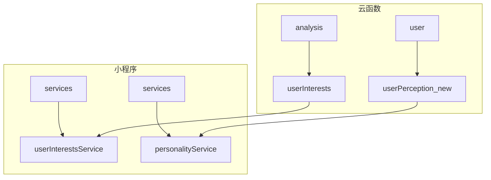
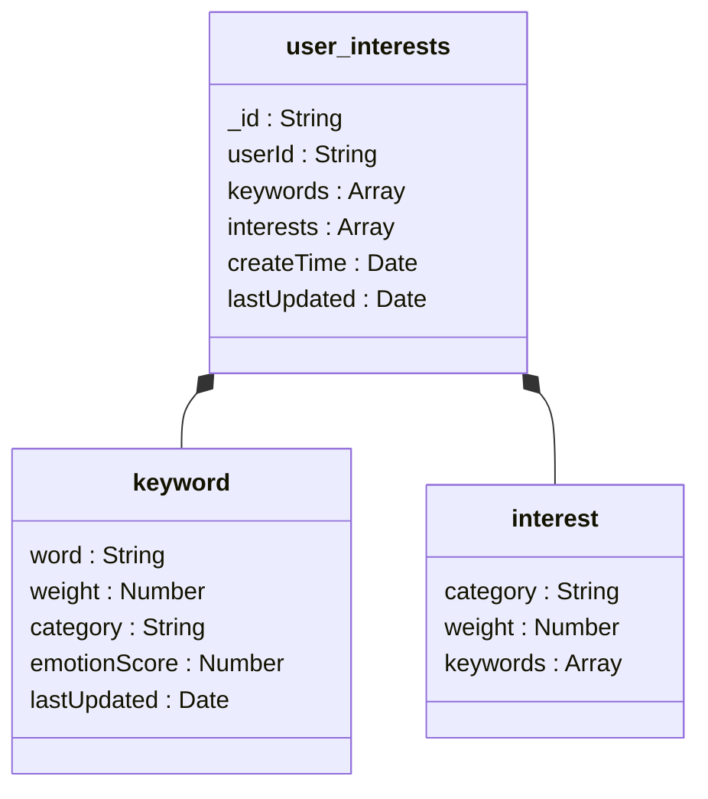
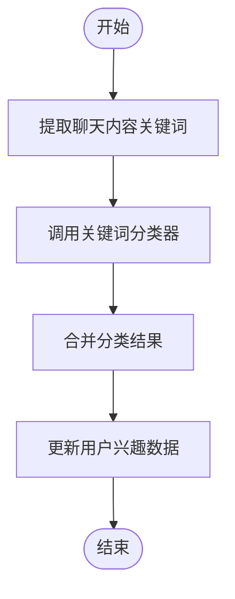
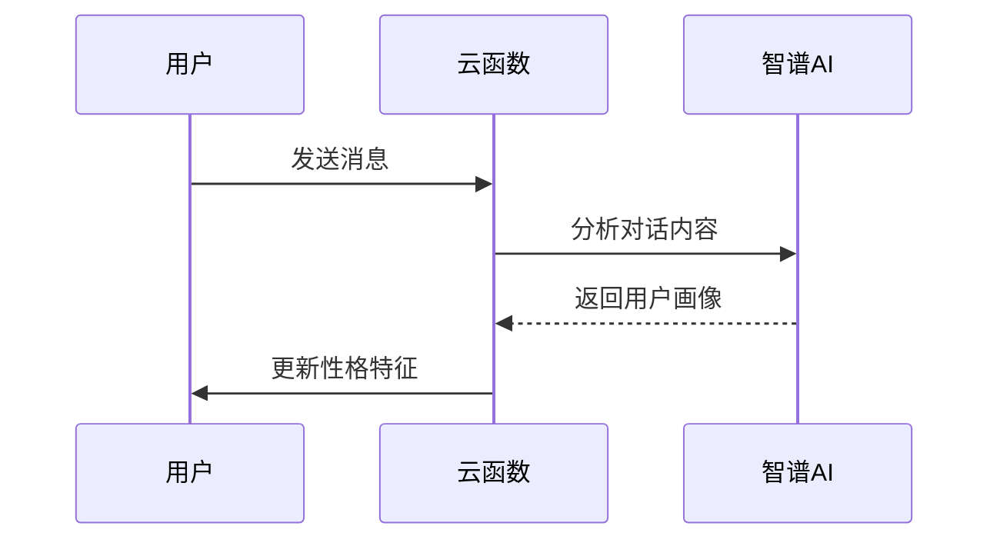
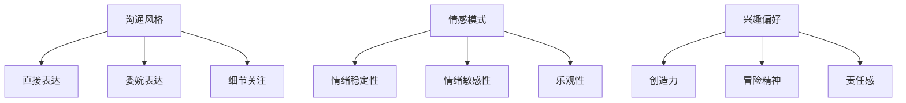
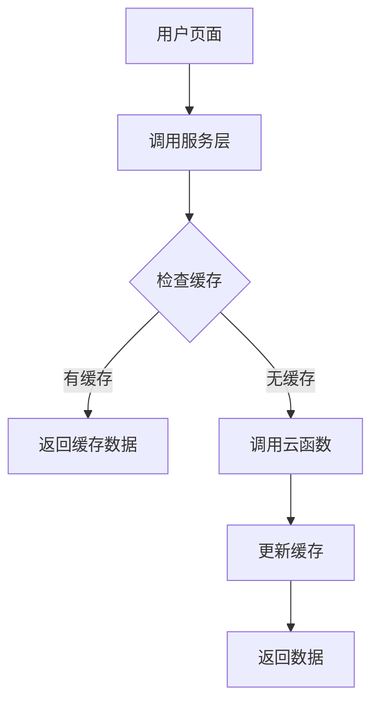

# 用户画像分析

<cite>
**本文档引用文件**  
- [userInterests.js](file://cloudfunctions/user/userInterests.js)
- [userPerception_new.js](file://cloudfunctions/user/userPerception_new.js)
- [userInterestsService.js](file://miniprogram/services/userInterestsService.js)
- [personalityService.js](file://miniprogram/services/personalityService.js)
- [userInterests.md](file://doc/开发文档/database/userInterests.md)
- [HeartChat数据库结构图.md](file://doc/设计文档/流程图/HeartChat数据库结构图.md)
</cite>

## 目录
1. [项目结构](#项目结构)
2. [核心组件](#核心组件)
3. [兴趣标签系统](#兴趣标签系统)
4. [性格画像系统](#性格画像系统)
5. [前端服务层](#前端服务层)
6. [调试与性能](#调试与性能)

## 项目结构

**图示来源**  
- [userInterests.js](file://cloudfunctions/user/userInterests.js)
- [userPerception_new.js](file://cloudfunctions/user/userPerception_new.js)
- [userInterestsService.js](file://miniprogram/services/userInterestsService.js)
- [personalityService.js](file://miniprogram/services/personalityService.js)

## 核心组件

**组件来源**  
- [userInterests.js](file://cloudfunctions/user/userInterests.js)
- [userPerception_new.js](file://cloudfunctions/user/userPerception_new.js)

## 兴趣标签系统

### 存储结构

用户兴趣数据存储在 `userInterests` 集合中，包含关键词列表和兴趣分类列表。每个用户仅有一个兴趣记录，通过 `userId` 字段进行关联。

**图示来源**  
- [userInterests.md](file://doc/开发文档/database/userInterests.md)
- [HeartChat数据库结构图.md](file://doc/设计文档/流程图/HeartChat数据库结构图.md)

### 关键词提取与分类

`userInterests.js` 模块负责从聊天内容中提取关键词并进行分类。系统通过调用 `analysis` 云函数的关键词分类器对关键词进行批量分类。

**图示来源**  
- [userInterests.js](file://cloudfunctions/user/userInterests.js)
- [userInterestsService.js](file://miniprogram/services/userInterestsService.js)

### 权重计算逻辑

兴趣标签的权重计算遵循以下规则：

1. **基础权重**：基于关键词出现频率
2. **情感加权**：`emotionScore` 影响权重
3. **时间衰减**：最近的关键词权重更高
4. **分类聚合**：同分类关键词权重叠加

系统定期重新计算权重值，确保兴趣标签的时效性和准确性。

**组件来源**  
- [userInterests.md](file://doc/开发文档/database/userInterests.md)
- [userInterests.js](file://cloudfunctions/user/userInterests.js)

### 更新频率

兴趣标签在以下情况下更新：
- 用户发送新消息时
- 系统定期分析历史对话时
- 用户手动添加或删除兴趣时

关键词数量建议控制在100个以内，避免数据冗余。

**组件来源**  
- [userInterests.md](file://doc/开发文档/database/userInterests.md)
- [userInterestsService.js](file://miniprogram/services/userInterestsService.js)

## 性格画像系统

### 对话行为分析

`userPerception_new.js` 模块基于用户对话行为分析性格特征。系统通过智谱AI分析用户消息，提取兴趣、偏好、沟通风格和情感模式。

**图示来源**  
- [userPerception_new.js](file://cloudfunctions/user/userPerception_new.js)

### 特征映射

系统使用特征映射表将关键词转换为个性特征：

**组件来源**  
- [userPerception_new.js](file://cloudfunctions/user/userPerception_new.js)

### 个性总结生成

系统根据得分最高的三个特征生成个性总结，例如："根据你的对话内容和情绪反应，我们分析出你是一个责任感强、具有同理心的人，同时也展现出较高的创造力。"

**组件来源**  
- [userPerception_new.js](file://cloudfunctions/user/userPerception_new.js)

## 前端服务层

### 数据获取流程

前端通过 `userInterestsService.js` 和 `personalityService.js` 获取画像数据：

**图示来源**  
- [userInterestsService.js](file://miniprogram/services/userInterestsService.js)
- [personalityService.js](file://miniprogram/services/personalityService.js)

### 数据展示

用户画像数据在个人资料页面展示，包括兴趣标签云、性格特征图表和个性总结文本。

**组件来源**  
- [personalityService.js](file://miniprogram/services/personalityService.js)
- [profile.html](file://doc/设计文档/原型设计图/profile.html)

## 调试与性能

### 调试建议

1. 检查云函数日志，确认关键词提取和分类是否正常
2. 验证缓存机制，确保数据及时更新
3. 测试不同对话场景下的性格分析准确性

### 性能监控指标

- 关键词提取准确率
- 性格分析响应时间
- 缓存命中率
- 用户兴趣数据更新频率

**组件来源**  
- [userInterests.js](file://cloudfunctions/user/userInterests.js)
- [userPerception_new.js](file://cloudfunctions/user/userPerception_new.js)
- [userInterestsService.js](file://miniprogram/services/userInterestsService.js)
- [personalityService.js](file://miniprogram/services/personalityService.js)