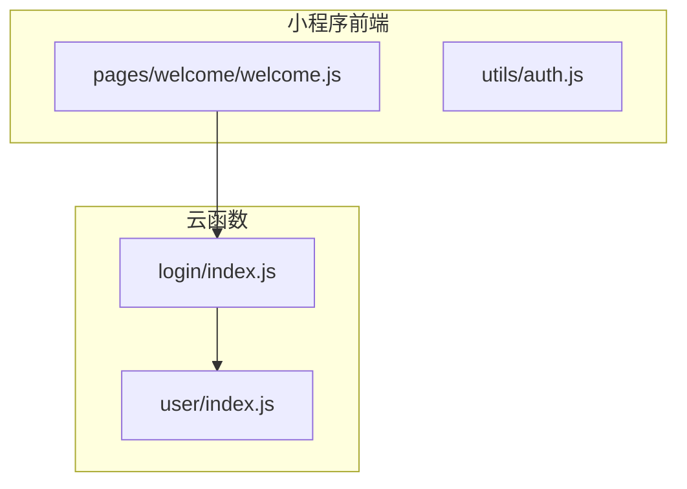
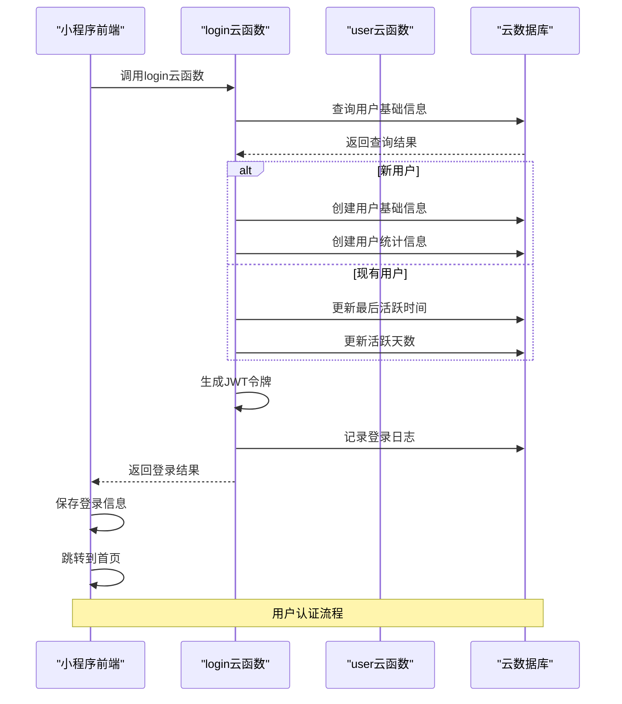
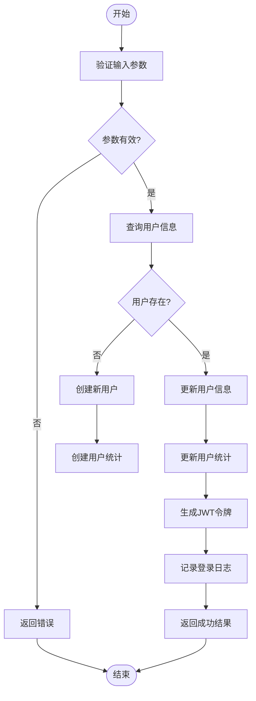
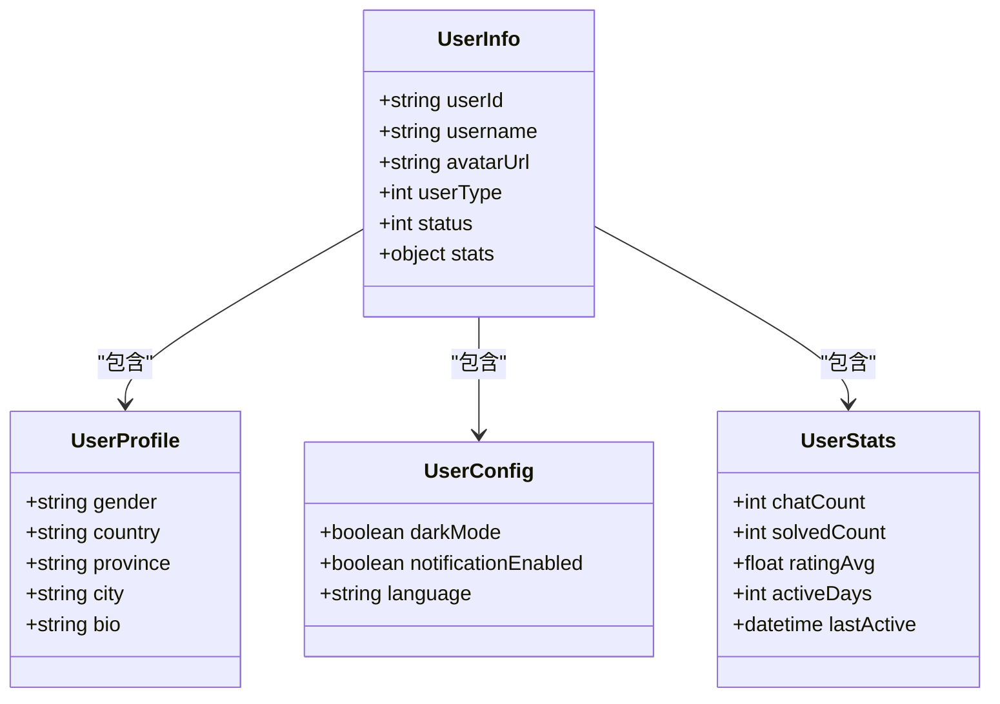
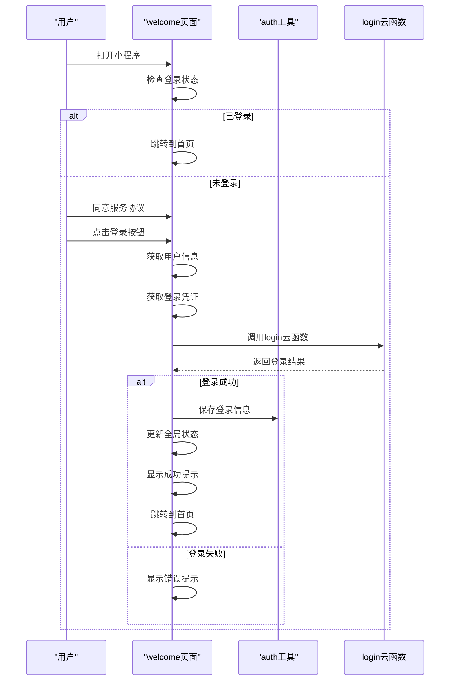
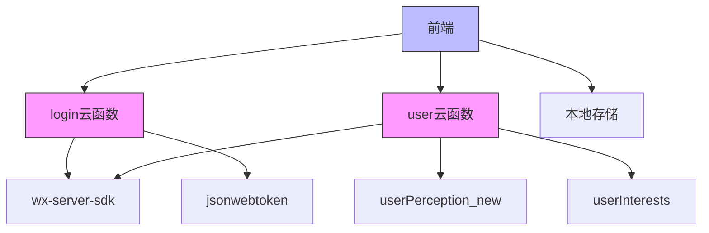

# 用户认证

<cite>
**本文档引用的文件**
- [login/index.js](file://cloudfunctions/login/index.js)
- [user/index.js](file://cloudfunctions/user/index.js)
- [welcome.js](file://miniprogram/pages/welcome/welcome.js)
- [auth.js](file://miniprogram/utils/auth.js)
- [login.md](file://doc/开发文档/cloudfunctions/login.md)
- [user.md](file://doc/开发文档/cloudfunctions/user.md)
</cite>

## 目录
1. [简介](#简介)
2. [项目结构](#项目结构)
3. [核心组件](#核心组件)
4. [架构概述](#架构概述)
5. [详细组件分析](#详细组件分析)
6. [依赖分析](#依赖分析)
7. [性能考虑](#性能考虑)
8. [故障排除指南](#故障排除指南)
9. [结论](#结论)

## 简介
本文档详细描述了HeartChat应用的用户认证机制，重点阐述了`login`云函数与`user`云函数在身份验证流程中的协作方式。文档涵盖了JWT令牌的生成与验证逻辑、用户首次登录时的初始化流程、会话管理策略、API接口定义、前端调用示例以及安全措施等内容。

## 项目结构
用户认证功能主要由云函数和小程序前端页面组成，相关文件分布在`cloudfunctions`和`miniprogram`目录下。

**图示来源**
- [login/index.js](file://cloudfunctions/login/index.js)
- [user/index.js](file://cloudfunctions/user/index.js)
- [welcome.js](file://miniprogram/pages/welcome/welcome.js)
- [auth.js](file://miniprogram/utils/auth.js)

**本节来源**
- [cloudfunctions](file://cloudfunctions)
- [miniprogram](file://miniprogram)

## 核心组件
用户认证系统的核心组件包括`login`云函数、`user`云函数、前端登录页面和本地存储工具。

**本节来源**
- [login/index.js](file://cloudfunctions/login/index.js#L1-L267)
- [user/index.js](file://cloudfunctions/user/index.js#L1-L799)
- [welcome.js](file://miniprogram/pages/welcome/welcome.js#L1-L152)
- [auth.js](file://miniprogram/utils/auth.js#L1-L68)

## 架构概述
用户认证流程涉及前端、云函数和数据库三个主要层次，各组件协同工作完成用户身份验证。

**图示来源**
- [login/index.js](file://cloudfunctions/login/index.js#L1-L267)
- [user/index.js](file://cloudfunctions/user/index.js#L1-L799)

## 详细组件分析
### login云函数分析
`login`云函数是用户认证的核心，负责处理用户登录请求、生成JWT令牌和管理用户信息。

#### 功能流程

**图示来源**
- [login/index.js](file://cloudfunctions/login/index.js#L1-L267)

**本节来源**
- [login/index.js](file://cloudfunctions/login/index.js#L1-L267)
- [login.md](file://doc/开发文档/cloudfunctions/login.md#L1-L222)

### user云函数分析
`user`云函数提供用户信息管理功能，支持获取和更新用户资料。

#### 主要功能

**图示来源**
- [user/index.js](file://cloudfunctions/user/index.js#L1-L799)

**本节来源**
- [user/index.js](file://cloudfunctions/user/index.js#L1-L799)
- [user.md](file://doc/开发文档/cloudfunctions/user.md#L1-L353)

### 前端登录流程分析
前端登录流程涉及用户界面交互、云函数调用和本地存储操作。

#### 登录流程

**图示来源**
- [welcome.js](file://miniprogram/pages/welcome/welcome.js#L1-L152)
- [auth.js](file://miniprogram/utils/auth.js#L1-L68)

**本节来源**
- [welcome.js](file://miniprogram/pages/welcome/welcome.js#L1-L152)
- [auth.js](file://miniprogram/utils/auth.js#L1-L68)

## 依赖分析
用户认证系统依赖于多个云开发组件和第三方库。

**图示来源**
- [login/index.js](file://cloudfunctions/login/index.js#L1-L267)
- [user/index.js](file://cloudfunctions/user/index.js#L1-L799)

**本节来源**
- [login/index.js](file://cloudfunctions/login/index.js#L1-L267)
- [user/index.js](file://cloudfunctions/user/index.js#L1-L799)

## 性能考虑
用户认证系统在设计时考虑了多项性能优化措施。

- **数据库查询优化**：使用索引提高查询效率
- **缓存机制**：避免重复查询相同数据
- **批量操作**：减少数据库交互次数
- **错误隔离**：确保部分功能失败不影响整体流程

**本节来源**
- [login.md](file://doc/开发文档/cloudfunctions/login.md#L1-L222)
- [user.md](file://doc/开发文档/cloudfunctions/user.md#L1-L353)

## 故障排除指南
### 常见问题及解决方案
- **登录失败**：检查网络连接，确认用户授权
- **用户信息不更新**：清除缓存，重新登录
- **JWT令牌失效**：重新登录获取新令牌
- **数据库连接失败**：检查云环境配置

**本节来源**
- [login/index.js](file://cloudfunctions/login/index.js#L1-L267)
- [user/index.js](file://cloudfunctions/user/index.js#L1-L799)

## 结论
HeartChat的用户认证系统通过`login`和`user`云函数的协同工作，实现了安全可靠的用户身份验证机制。系统采用JWT令牌进行会话管理，结合微信授权登录，为用户提供便捷的登录体验。前端通过清晰的流程设计和错误处理，确保了良好的用户体验。