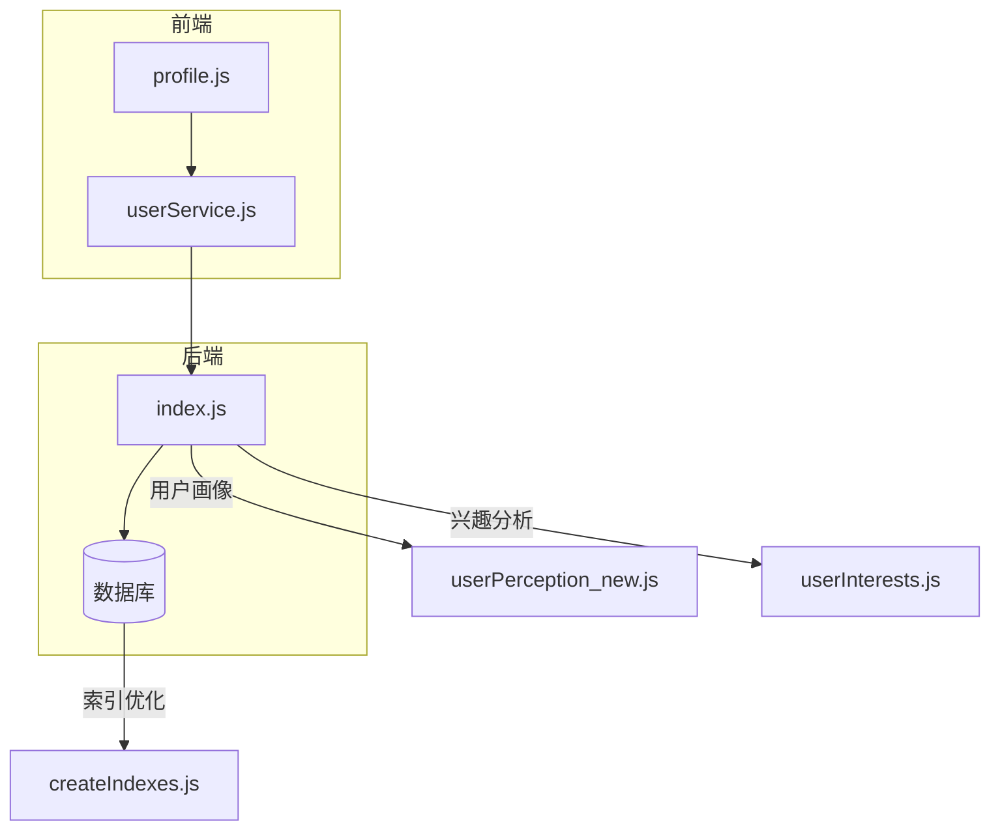
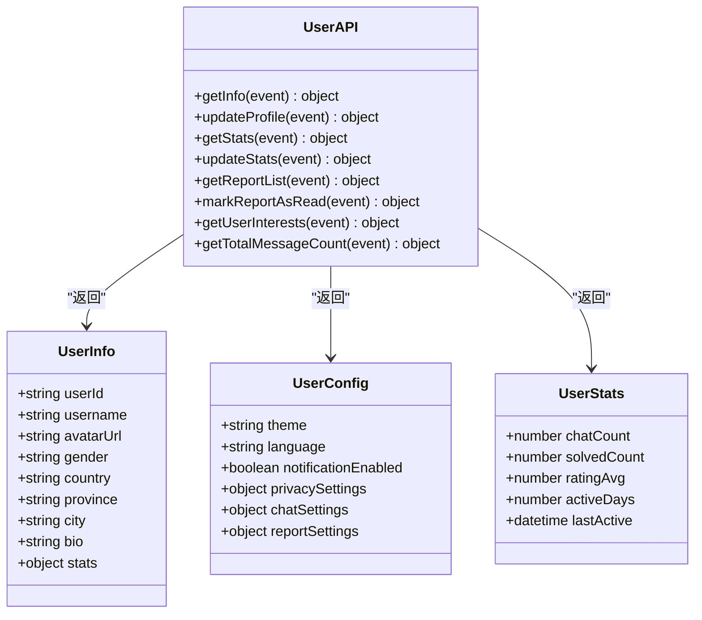
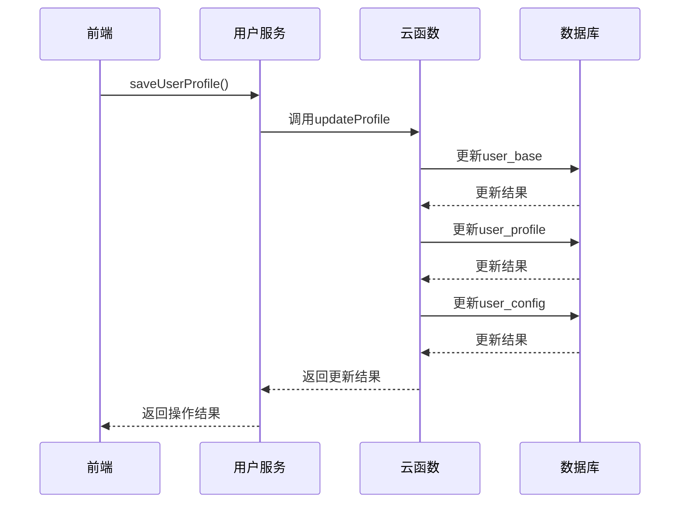
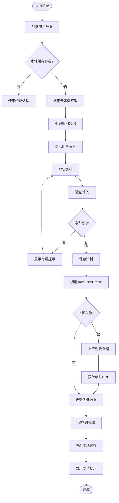
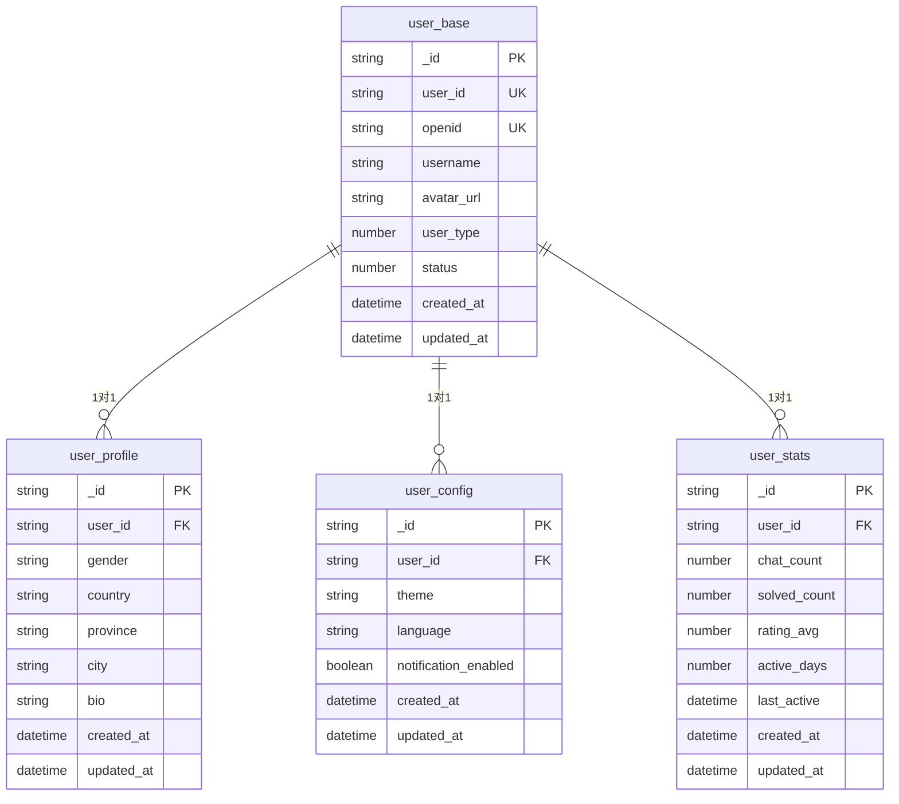
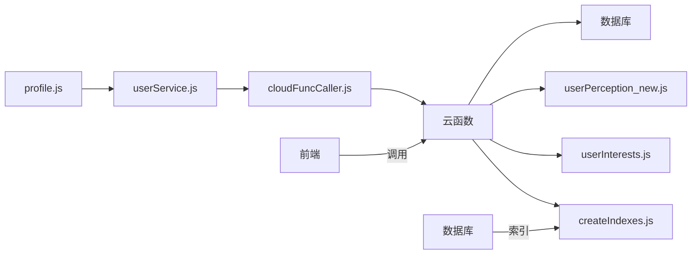

# 用户资料管理

<cite>
**本文档引用文件**  
- [index.js](file://cloudfunctions/user/index.js)
- [createIndexes.js](file://cloudfunctions/user/createIndexes.js)
- [profile.js](file://miniprogram/pages/user/profile/profile.js)
- [userService.js](file://miniprogram/services/userService.js)
- [user_base.md](file://doc/开发文档/database/user_base.md)
- [user_profile.md](file://doc/开发文档/database/user_profile.md)
- [user_config.md](file://doc/开发文档/database/user_config.md)
- [user.md](file://doc/开发文档/cloudfunctions/user.md)
</cite>

## 目录
1. [简介](#简介)
2. [项目结构](#项目结构)
3. [核心组件](#核心组件)
4. [架构概述](#架构概述)
5. [详细组件分析](#详细组件分析)
6. [依赖分析](#依赖分析)
7. [性能考虑](#性能考虑)
8. [故障排除指南](#故障排除指南)
9. [结论](#结论)

## 简介
本文档详细说明了通过user云函数实现的用户信息增删改查接口。文档解释了index.js中各API端点的设计（如获取用户信息、更新昵称/头像等），并结合createIndexes.js阐述数据库索引优化对查询性能的提升。描述了前端profile页面与userService服务层的交互流程，包括表单验证、本地缓存同步和错误反馈机制。提供了典型使用场景示例（如资料编辑、头像上传），并说明了数据一致性保障策略和异常处理方案。

## 项目结构
用户资料管理模块主要由云函数和小程序前端两部分组成，通过清晰的分层架构实现用户信息的完整生命周期管理。

```mermaid
graph TD
subgraph "云函数层"
A[index.js] --> B[userPerception_new.js]
A --> C[userInterests.js]
A --> D[createIndexes.js]
end
subgraph "前端层"
E[profile.js] --> F[userService.js]
F --> G[cloudFuncCaller.js]
end
A < --> |HTTP调用| G
H[(数据库)] --> |user_base| A
H --> |user_profile| A
H --> |user_config| A
H --> |user_stats| A
```

**图示来源**  
- [index.js](file://cloudfunctions/user/index.js#L1-L100)
- [profile.js](file://miniprogram/pages/user/profile/profile.js#L1-L50)
- [userService.js](file://miniprogram/services/userService.js#L1-L50)

**本节来源**  
- [index.js](file://cloudfunctions/user/index.js#L1-L50)
- [profile.js](file://miniprogram/pages/user/profile/profile.js#L1-L50)

## 核心组件
用户资料管理模块的核心组件包括云函数API接口、前端交互页面和数据服务层。云函数提供统一的RESTful接口，前端页面实现用户友好的交互界面，数据服务层负责业务逻辑处理和缓存管理。各组件通过清晰的职责划分，实现了高内聚低耦合的系统架构。

**本节来源**  
- [index.js](file://cloudfunctions/user/index.js#L1-L100)
- [profile.js](file://miniprogram/pages/user/profile/profile.js#L1-L100)
- [userService.js](file://miniprogram/services/userService.js#L1-L100)

## 架构概述
用户资料管理模块采用分层架构设计，包含表现层、服务层和数据层三个主要层级。表现层负责用户界面展示和交互，服务层处理业务逻辑和数据转换，数据层管理数据库操作和索引优化。



**图示来源**  
- [index.js](file://cloudfunctions/user/index.js#L1-L50)
- [profile.js](file://miniprogram/pages/user/profile/profile.js#L1-L50)
- [userService.js](file://miniprogram/services/userService.js#L1-L50)
- [createIndexes.js](file://cloudfunctions/user/createIndexes.js#L1-L50)

## 详细组件分析

### 云函数API设计
用户云函数提供了完整的用户信息管理接口，支持用户资料的获取、更新和统计功能。

#### API端点类图


**图示来源**  
- [index.js](file://cloudfunctions/user/index.js#L80-L200)
- [user.md](file://doc/开发文档/cloudfunctions/user.md#L100-L200)

#### 用户资料更新流程


**图示来源**  
- [index.js](file://cloudfunctions/user/index.js#L143-L200)
- [userService.js](file://miniprogram/services/userService.js#L93-L140)

### 前端交互流程
前端profile页面与userService服务层通过清晰的调用链实现用户资料管理功能。

#### 资料编辑流程图


**图示来源**  
- [profile.js](file://miniprogram/pages/user/profile/profile.js#L200-L400)
- [userService.js](file://miniprogram/services/userService.js#L93-L140)

**本节来源**  
- [profile.js](file://miniprogram/pages/user/profile/profile.js#L1-L600)
- [userService.js](file://miniprogram/services/userService.js#L1-L300)

### 数据库设计
用户资料管理模块涉及多个数据库集合，通过合理的数据结构设计支持完整的用户信息管理。

#### 数据库实体关系图


**图示来源**  
- [user_base.md](file://doc/开发文档/database/user_base.md#L1-L50)
- [user_profile.md](file://doc/开发文档/database/user_profile.md#L1-L50)
- [user_config.md](file://doc/开发文档/database/user_config.md#L1-L50)

**本节来源**  
- [user_base.md](file://doc/开发文档/database/user_base.md#L1-L80)
- [user_profile.md](file://doc/开发文档/database/user_profile.md#L1-L80)
- [user_config.md](file://doc/开发文档/database/user_config.md#L1-L160)

## 依赖分析
用户资料管理模块的组件间存在明确的依赖关系，通过合理的依赖管理确保系统的稳定性和可维护性。



**图示来源**  
- [index.js](file://cloudfunctions/user/index.js#L1-L50)
- [profile.js](file://miniprogram/pages/user/profile/profile.js#L1-L50)
- [userService.js](file://miniprogram/services/userService.js#L1-L50)

**本节来源**  
- [index.js](file://cloudfunctions/user/index.js#L1-L50)
- [profile.js](file://miniprogram/pages/user/profile/profile.js#L1-L50)
- [userService.js](file://miniprogram/services/userService.js#L1-L50)

## 性能考虑
用户资料管理模块通过多种方式优化系统性能，确保良好的用户体验。

### 数据库索引优化
createIndexes.js文件中定义了多个数据库索引，显著提升了查询性能：

- **userInterests集合**：创建了userId、keywords.category、keywords.word和lastUpdated等索引
- **roles集合**：创建了creator、category、isSystem等单字段索引和组合索引
- **emotionRecords集合**：创建了userId、roleId、chatId和primary_emotion等复合索引

这些索引优化了常见查询场景的性能，如按用户ID查询、按分类查询和按时间排序查询。

### 缓存策略
前端实现了多层缓存机制：

1. **本地缓存**：使用wx.setStorageSync保存用户资料，减少重复的云函数调用
2. **内存缓存**：在app.globalData中保存用户信息，提高访问速度
3. **缓存更新**：在用户资料更新后同步更新缓存，确保数据一致性

### 数据一致性保障
系统通过以下机制保障数据一致性：

1. **事务性操作**：云函数中对多个集合的更新操作保证原子性
2. **时间戳更新**：每个数据更新都记录updated_at时间戳
3. **缓存同步**：数据更新后立即更新所有相关缓存
4. **错误回滚**：操作失败时记录错误日志并保持原有数据状态

**本节来源**  
- [createIndexes.js](file://cloudfunctions/user/createIndexes.js#L1-L200)
- [userService.js](file://miniprogram/services/userService.js#L50-L100)
- [index.js](file://cloudfunctions/user/index.js#L1-L50)

## 故障排除指南
### 常见问题及解决方案

#### 用户资料无法保存
**可能原因**：
- 用户ID为空
- 网络连接异常
- 云函数执行超时

**解决方案**：
1. 检查用户登录状态
2. 验证网络连接
3. 查看云函数日志

#### 头像上传失败
**可能原因**：
- 图片文件过大
- 云存储配额不足
- 文件路径权限问题

**解决方案**：
1. 压缩图片后重试
2. 检查云存储使用情况
3. 验证云函数权限配置

#### 数据显示不一致
**可能原因**：
- 缓存未及时更新
- 多设备同步延迟
- 数据库查询错误

**解决方案**：
1. 清除本地缓存后重试
2. 强制刷新页面
3. 检查数据库连接状态

**本节来源**  
- [index.js](file://cloudfunctions/user/index.js#L500-L600)
- [profile.js](file://miniprogram/pages/user/profile/profile.js#L500-L600)
- [userService.js](file://miniprogram/services/userService.js#L200-L300)

## 结论
用户资料管理模块通过完善的云函数API、清晰的前端交互和优化的数据库设计，实现了高效稳定的用户信息管理功能。系统采用分层架构设计，各组件职责明确，依赖关系清晰。通过索引优化和缓存策略，系统性能得到显著提升。完善的错误处理和数据一致性保障机制确保了系统的可靠性。该模块为用户提供了一流的资料管理体验，同时为后续功能扩展提供了良好的基础。