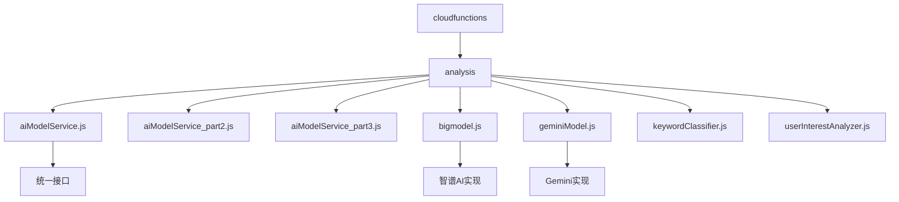
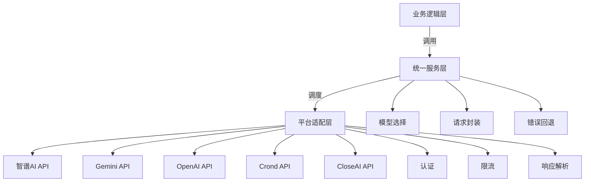
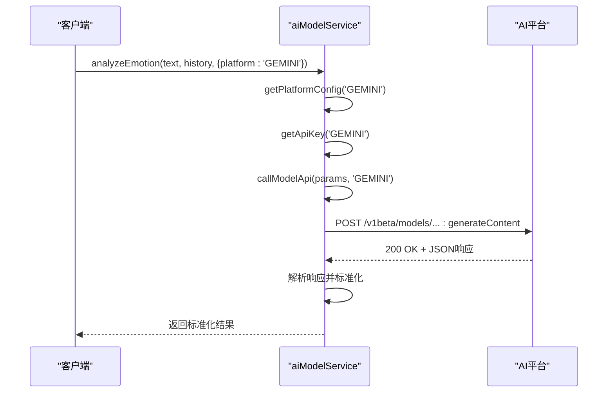
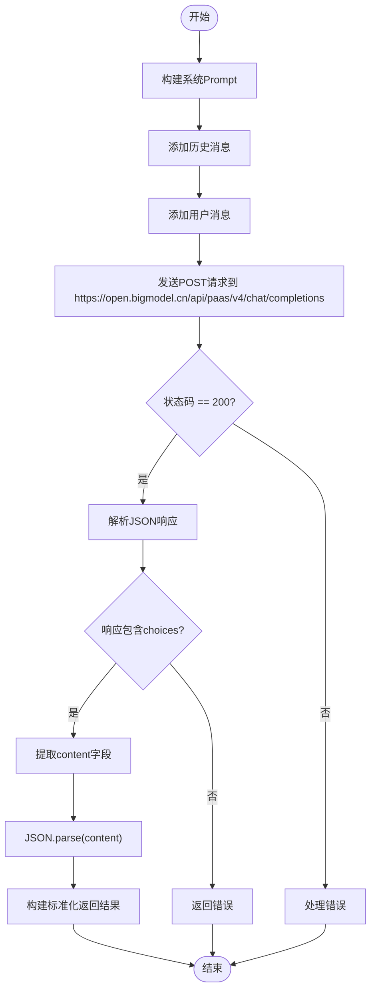
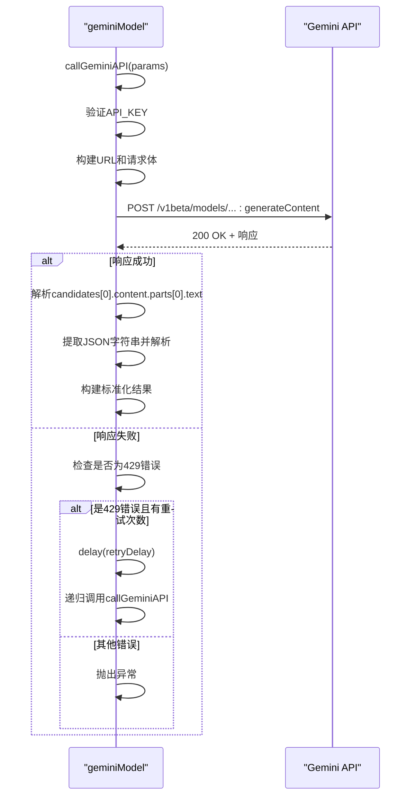
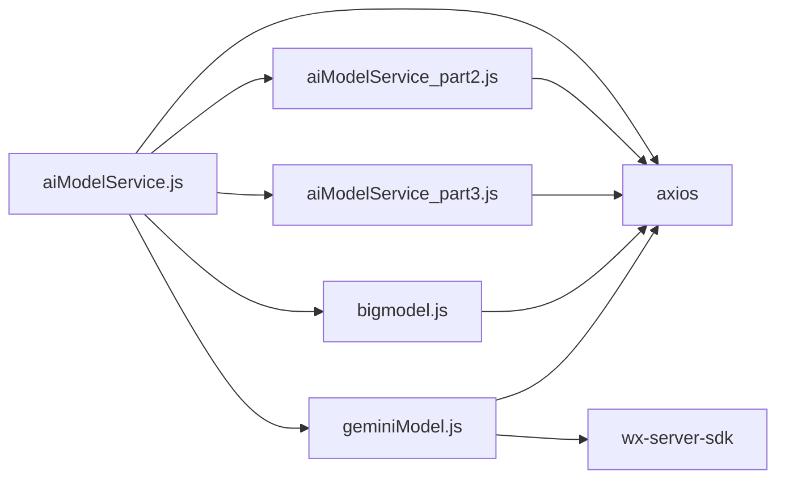

# AI模型集成

<cite>
**本文档引用文件**  
- [aiModelService.js](file://cloudfunctions/analysis/aiModelService.js)
- [bigmodel.js](file://cloudfunctions/analysis/bigmodel.js)
- [geminiModel.js](file://cloudfunctions/analysis/geminiModel.js)
- [analysis云函数统一AI模型服务设计文档.md](file://doc/开发文档/analysis云函数统一AI模型服务设计文档.md)
- [多模型集成文档.md](file://doc/使用文档/多模型集成文档.md)
</cite>

## 目录
1. [引言](#引言)
2. [项目结构](#项目结构)
3. [核心组件](#核心组件)
4. [架构概述](#架构概述)
5. [详细组件分析](#详细组件分析)
6. [依赖分析](#依赖分析)
7. [性能考量](#性能考量)
8. [故障排查指南](#故障排查指南)
9. [结论](#结论)

## 引言
本文档深入解析HeartChat项目中多AI模型的集成机制，重点说明`aiModelService.js`如何作为统一接口调度不同大模型（如`bigmodel.js`对接智谱AI，`geminiModel.js`对接Google Gemini）。文档涵盖模型选择逻辑、请求封装、流式响应处理和错误回退策略，并对比各模型在响应速度、语义理解能力和成本方面的差异，说明动态路由的实现方式。同时，文档详细说明各模型API调用的具体参数、认证方式、限流处理及响应格式解析，并结合实际代码展示如何扩展支持新的AI服务，确保系统具备良好的可扩展性。

## 项目结构
HeartChat项目采用模块化设计，将AI模型服务集中于`cloudfunctions/analysis`目录下。该目录包含统一的AI模型服务主模块`aiModelService.js`及其扩展模块，以及针对不同AI平台的专用模块，如`bigmodel.js`（智谱AI）和`geminiModel.js`（Google Gemini）。这种结构实现了功能的解耦与复用，便于维护和扩展。

**图表来源**  
- [aiModelService.js](file://cloudfunctions/analysis/aiModelService.js#L1-L663)
- [bigmodel.js](file://cloudfunctions/analysis/bigmodel.js#L1-L705)
- [geminiModel.js](file://cloudfunctions/analysis/geminiModel.js#L1-L656)

**本节来源**  
- [aiModelService.js](file://cloudfunctions/analysis/aiModelService.js#L1-L663)
- [bigmodel.js](file://cloudfunctions/analysis/bigmodel.js#L1-L705)
- [geminiModel.js](file://cloudfunctions/analysis/geminiModel.js#L1-L656)

## 核心组件
`aiModelService.js`是整个AI模型集成系统的核心，它提供了一个统一的接口，屏蔽了底层不同AI模型平台的差异。通过`MODEL_PLATFORMS`配置对象，系统定义了智谱AI、Google Gemini、OpenAI、Crond API、CloseAI等多个平台的连接信息和参数。`callModelApi`函数负责处理所有API调用的共性逻辑，包括请求构建、认证、错误处理和重试机制。`analyzeEmotion`等函数则作为高层接口，根据用户选择的平台和模型，调用底层服务并返回标准化的结果。

**本节来源**  
- [aiModelService.js](file://cloudfunctions/analysis/aiModelService.js#L1-L663)

## 架构概述
HeartChat的AI模型集成架构采用分层设计。最上层是业务逻辑层，如聊天、情感分析等云函数，它们通过`aiModelService`提供的统一接口调用AI能力。中间层是统一服务层，由`aiModelService.js`及其扩展模块构成，负责模型选择、请求封装和结果标准化。最底层是平台适配层，由`bigmodel.js`、`geminiModel.js`等独立模块实现，它们直接与各AI平台的API进行交互。

**图表来源**  
- [aiModelService.js](file://cloudfunctions/analysis/aiModelService.js#L1-L663)
- [bigmodel.js](file://cloudfunctions/analysis/bigmodel.js#L1-L705)
- [geminiModel.js](file://cloudfunctions/analysis/geminiModel.js#L1-L656)

## 详细组件分析

### aiModelService.js 分析
`aiModelService.js`作为统一接口，其核心是`MODEL_PLATFORMS`配置和`callModelApi`函数。`MODEL_PLATFORMS`是一个常量对象，为每个支持的AI平台定义了名称、基础URL、API密钥环境变量名、默认模型、支持的模型列表、认证类型和端点路径。`callModelApi`函数根据平台键名获取配置和API密钥，然后根据平台类型（如Gemini、OpenAI）构建不同的请求体和头信息，最后通过axios发送请求。它内置了针对429错误（请求过多）的指数退避重试机制，增强了系统的鲁棒性。

#### 统一接口调用流程

**图表来源**  
- [aiModelService.js](file://cloudfunctions/analysis/aiModelService.js#L1-L663)

**本节来源**  
- [aiModelService.js](file://cloudfunctions/analysis/aiModelService.js#L1-L663)

### bigmodel.js 分析
`bigmodel.js`是智谱AI平台的适配模块。它直接使用axios库与智谱AI的API进行通信。模块定义了`API_BASE_URL`和`API_KEY`（从环境变量读取），并通过`getAuthHeaders`函数生成包含Bearer Token的认证头。`analyzeEmotion`等函数构建符合智谱AI要求的JSON请求体，其中`response_format: { type: 'json_object' }`是关键，它要求模型返回结构化的JSON数据，便于前端解析。该模块还实现了本地模拟词向量的功能，当API密钥未配置或调用失败时，可作为降级方案。

#### 智谱AI请求与响应

**图表来源**  
- [bigmodel.js](file://cloudfunctions/analysis/bigmodel.js#L1-L705)

**本节来源**  
- [bigmodel.js](file://cloudfunctions/analysis/bigmodel.js#L1-L705)

### geminiModel.js 分析
`geminiModel.js`是Google Gemini平台的适配模块。它使用`wx-server-sdk`初始化云开发环境，并通过axios调用Gemini API。与智谱AI不同，Gemini的API端点是`/v1beta/models/{model}:generateContent?key={API_KEY}`，请求体结构也有所差异，使用`contents`和`generationConfig`字段。`callGeminiAPI`函数同样实现了429错误的重试机制。值得注意的是，Gemini不支持`system`角色，因此在`chatCompletion`函数中，系统提示词被转换为`user`角色。

#### Gemini API调用流程

**图表来源**  
- [geminiModel.js](file://cloudfunctions/analysis/geminiModel.js#L1-L656)

**本节来源**  
- [geminiModel.js](file://cloudfunctions/analysis/geminiModel.js#L1-L656)

## 依赖分析
系统依赖主要分为内部依赖和外部依赖。内部依赖体现在`aiModelService.js`通过`require`导入`aiModelService_part2.js`和`aiModelService_part3.js`，并注入`getPlatformConfig`和`callModelApi`函数，实现了功能的模块化拆分。外部依赖包括`axios`库用于HTTP请求，以及各AI平台的API服务。环境变量（如`ZHIPU_API_KEY`、`GEMINI_API_KEY`）是连接外部服务的关键，必须在云函数环境中正确配置。

**图表来源**  
- [aiModelService.js](file://cloudfunctions/analysis/aiModelService.js#L1-L663)
- [bigmodel.js](file://cloudfunctions/analysis/bigmodel.js#L1-L705)
- [geminiModel.js](file://cloudfunctions/analysis/geminiModel.js#L1-L656)

**本节来源**  
- [aiModelService.js](file://cloudfunctions/analysis/aiModelService.js#L1-L663)
- [bigmodel.js](file://cloudfunctions/analysis/bigmodel.js#L1-L705)
- [geminiModel.js](file://cloudfunctions/analysis/geminiModel.js#L1-L656)

## 性能考量
系统在性能方面采取了多项优化措施。首先，通过统一的`callModelApi`函数，避免了重复的请求和错误处理代码，提高了代码效率。其次，实现了针对429错误的指数退避重试机制，提高了在高并发场景下的请求成功率。此外，系统支持选择响应更快的模型（如`glm-4-flash`），以满足实时性要求高的场景。然而，由于依赖外部API，网络延迟和第三方服务的性能是主要瓶颈。未来可通过引入缓存机制来进一步优化性能。

## 故障排查指南
当AI模型服务出现问题时，可按以下步骤排查：
1.  **检查环境变量**：确认`ZHIPU_API_KEY`、`GEMINI_API_KEY`等环境变量已在云开发控制台正确配置。
2.  **查看云函数日志**：在微信云开发控制台查看`analysis`云函数的执行日志，寻找错误信息，如“未设置GEMINI_API_KEY环境变量”或“Gemini API调用失败”。
3.  **验证API密钥**：确保API密钥有效且具有调用相应API的权限。
4.  **检查网络连接**：确认云函数能够访问外部网络。
5.  **分析错误码**：根据日志中的HTTP状态码进行判断，如429表示请求过多，需等待或检查限流策略；401表示认证失败，需检查密钥。

**本节来源**  
- [aiModelService.js](file://cloudfunctions/analysis/aiModelService.js#L1-L663)
- [bigmodel.js](file://cloudfunctions/analysis/bigmodel.js#L1-L705)
- [geminiModel.js](file://cloudfunctions/analysis/geminiModel.js#L1-L656)

## 结论
HeartChat通过`aiModelService.js`实现了对多AI模型的优雅集成。该设计通过配置化和模块化，将统一接口与平台适配分离，极大地提升了系统的可维护性和可扩展性。开发者可以轻松地添加新的AI模型支持，只需实现相应的适配模块并更新`MODEL_PLATFORMS`配置即可。系统内置的错误处理和重试机制保障了服务的稳定性。未来，通过引入缓存和性能监控，可进一步提升用户体验。