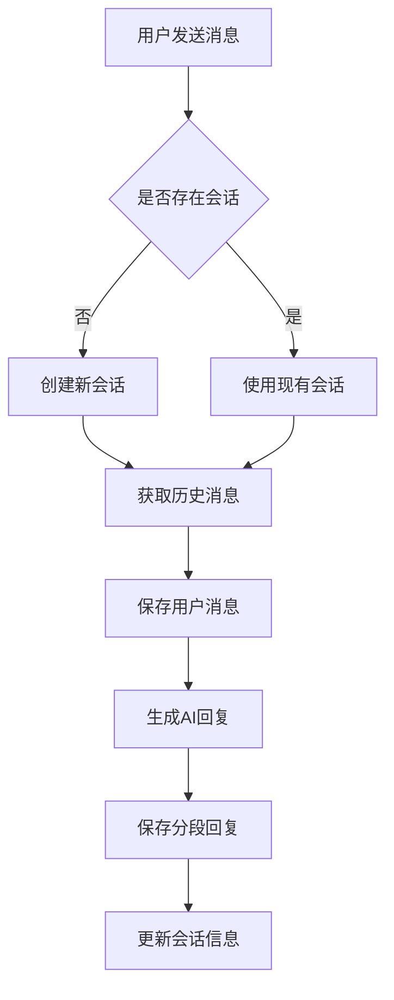
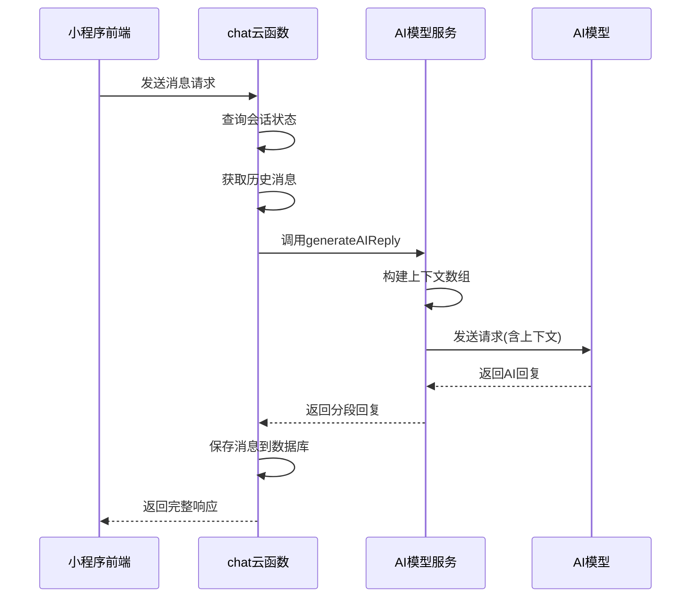
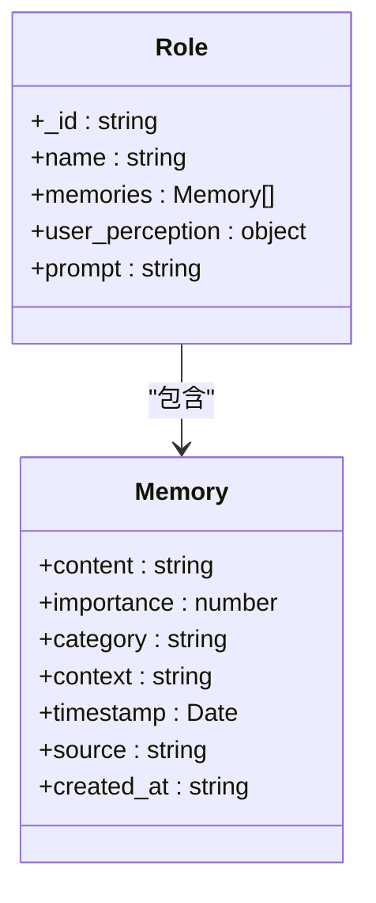
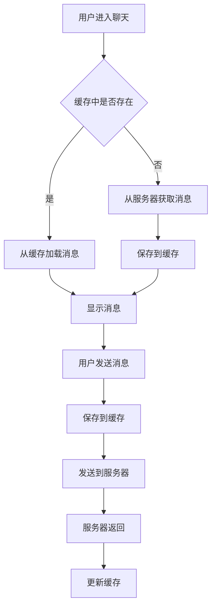

# 上下文管理

<cite>
**本文档引用的文件**
- [index.js](file://cloudfunctions/chat/index.js)
- [chatCacheService.js](file://miniprogram/services/chatCacheService.js)
- [memoryManager.js](file://cloudfunctions/roles/memoryManager.js)
- [chats.md](file://doc/开发文档/database/chats.md)
- [messages.md](file://doc/开发文档/database/messages.md)
- [chat.md](file://doc/开发文档/cloudfunctions/chat.md)
</cite>

## 目录
1. [引言](#引言)
2. [对话历史维护](#对话历史维护)
3. [会话状态管理](#会话状态管理)
4. [上下文传递机制](#上下文传递机制)
5. [上下文截断策略](#上下文截断策略)
6. [长期记忆存储](#长期记忆存储)
7. [角色记忆交互](#角色记忆交互)
8. [前端缓存机制](#前端缓存机制)
9. [上下文数据结构](#上下文数据结构)
10. [性能优化措施](#性能优化措施)
11. [结论](#结论)

## 引言

本项目中的上下文管理机制是确保AI对话连贯性和个性化体验的核心。系统通过云函数与前端服务的协同工作，实现了从对话历史维护、会话状态管理到长期记忆存储的完整上下文管理体系。该机制不仅保证了单次对话的上下文连贯性，还通过长期记忆实现了跨会话的个性化交互。

**Section sources**
- [index.js](file://cloudfunctions/chat/index.js#L0-L1413)

## 对话历史维护

聊天服务通过`index.js`中的`sendMessage`和`getChatHistory`函数维护对话历史。当用户发送消息时，系统首先查询或创建聊天会话，然后获取指定长度的历史消息作为上下文。

历史消息的获取通过数据库查询实现，限制返回的消息数量以控制token使用。`chatMemoryLength`参数（默认20条）决定了从数据库中获取的历史消息数量，确保上下文既包含足够的信息又不会超出模型限制。

**Diagram sources**
- [index.js](file://cloudfunctions/chat/index.js#L700-L800)

**Section sources**
- [index.js](file://cloudfunctions/chat/index.js#L700-L850)
- [messages.md](file://doc/开发文档/database/messages.md#L0-L89)

## 会话状态管理

会话状态通过`chats`集合进行管理，每个会话记录包含会话的基本信息和统计信息。关键状态字段包括：

- `messageCount`：实时更新的消息总数
- `lastMessage`：最后一条消息内容
- `last_message_time`：最后消息时间戳
- `updateTime`：会话最后更新时间

当用户发送新消息或AI生成回复时，系统会更新这些状态字段。会话的创建和更新通过`saveChatHistory`函数实现，该函数会检查是否存在相同会话，若存在则更新，否则创建新会话。

**Section sources**
- [index.js](file://cloudfunctions/chat/index.js#L150-L350)
- [chats.md](file://doc/开发文档/database/chats.md#L0-L67)

## 上下文传递机制

上下文通过`generateAIReply`函数传递给AI模型。该函数将历史消息转换为AI模型所需的格式，然后调用统一AI模型服务生成回复。

历史消息被转换为包含`role`和`content`字段的对象数组，其中`role`为`user`或`assistant`，`content`为消息内容。这个数组作为上下文传递给AI模型，确保模型能够理解对话的完整历史。

**Diagram sources**
- [index.js](file://cloudfunctions/chat/index.js#L500-L700)

**Section sources**
- [index.js](file://cloudfunctions/chat/index.js#L500-L700)
- [chat.md](file://doc/开发文档/cloudfunctions/chat.md#L0-L207)

## 上下文截断策略

系统采用多层截断策略来管理上下文长度，确保在token限制内提供最佳的对话体验。

首先，在数据库查询层面，通过`limit(chatMemoryLength)`限制获取的历史消息数量，默认为20条。其次，在消息分段层面，通过`splitMessage`函数将长回复智能分段，每段不超过150个字符。

分段策略优先保持语义完整性，按以下顺序处理：
1. 按自然段落分割（双换行符）
2. 按句子分割（句号、问号、感叹号）
3. 按次要标点分割（逗号、分号）
4. 合并过短的段落避免过度分段

**Section sources**
- [index.js](file://cloudfunctions/chat/index.js#L30-L150)
- [chat.md](file://doc/开发文档/cloudfunctions/chat.md#L0-L207)

## 长期记忆存储

长期记忆存储由`memoryManager.js`实现，通过AI分析对话内容提取重要信息作为角色记忆。记忆提取过程包括：

1. 获取最近15条对话消息作为分析上下文
2. 调用智谱AI提取4-6条重要信息
3. 记忆包含内容、重要性评分、分类和上下文
4. 重要性评分范围为0-1，基于信息价值确定

记忆存储在`roles`集合的`memories`数组中，每条记忆包含：
- `content`：记忆内容（简洁的一句话）
- `importance`：重要性评分
- `category`：记忆分类
- `timestamp`：时间戳
- `source`：来源

当记忆数量超过50条时，系统会保留最重要的30条，并对剩余记忆进行合并处理。

**Diagram sources**
- [memoryManager.js](file://cloudfunctions/roles/memoryManager.js#L0-L923)

**Section sources**
- [memoryManager.js](file://cloudfunctions/roles/memoryManager.js#L0-L923)
- [roles.md](file://doc/开发文档/cloudfunctions/roles.md#L0-L340)

## 角色记忆交互

`index.js`与`memoryManager.js`通过云函数调用进行交互。当需要获取相关记忆时，`index.js`会调用`roles`云函数的`getRelevantMemories`方法。

`getRelevantMemories`函数根据当前对话上下文，从角色记忆中检索最相关的记忆。检索过程考虑语义相关性、信息价值、时间相关性和情感一致性等多个因素，返回按相关性排序的记忆列表。

对于新对话，系统会从角色的长期记忆中提取相关信息，构建个性化的提示词，确保AI能够基于用户的历史信息提供连贯的回复。

**Section sources**
- [index.js](file://cloudfunctions/chat/index.js#L600-L700)
- [memoryManager.js](file://cloudfunctions/roles/memoryManager.js#L700-L923)

## 前端缓存机制

前端通过`chatCacheService.js`实现最近对话的本地缓存，提升用户体验。缓存服务提供以下功能：

- `saveMessagesToCache`：保存消息到本地缓存
- `loadMessagesFromCache`：从缓存加载消息
- `getChatBasicInfo`：获取聊天基本信息
- `updateMessageInCache`：更新单条消息
- `clearChatCache`：清除指定聊天缓存

缓存采用分页机制，每页20条消息，最新消息保存在`latest`数组中，历史页面保存在`pages`对象中。当缓存的聊天数超过10个时，系统会清理最旧的聊天记录。

**Diagram sources**
- [chatCacheService.js](file://miniprogram/services/chatCacheService.js#L0-L299)

**Section sources**
- [chatCacheService.js](file://miniprogram/services/chatCacheService.js#L0-L299)
- [@聊天消息分段输出计划.md](file://doc/使用文档/@聊天消息分段输出计划.md#L0-L360)

## 上下文数据结构

系统中的上下文数据结构分为数据库结构和运行时结构。

数据库中，`messages`集合的结构包含分段消息相关字段：
- `isSegment`：标识是否为分段消息
- `segmentIndex`：分段索引
- `totalSegments`：总分段数
- `originalMessageId`：原始消息ID

运行时，上下文以数组形式传递给AI模型，每个元素包含`role`和`content`字段。AI回复返回时包含`segments`数组，前端按顺序显示以模拟真实打字节奏。

**Section sources**
- [messages.md](file://doc/开发文档/database/messages.md#L0-L89)
- [index.js](file://cloudfunctions/chat/index.js#L50-L150)

## 性能优化措施

系统采用多种性能优化措施确保高并发场景下的响应效率：

1. **懒加载**：历史消息按需加载，首次只加载最新消息
2. **增量更新**：只更新变化的字段，减少数据库操作
3. **本地缓存**：前端缓存最近对话，减少服务器请求
4. **批量操作**：消息保存采用批量处理
5. **索引优化**：数据库关键字段建立索引

在高并发场景下，系统通过异步处理和数据库连接池管理确保稳定性能。消息分段和AI调用均采用异步方式，避免阻塞主线程。

**Section sources**
- [chat.md](file://doc/开发文档/cloudfunctions/chat.md#L0-L207)
- [chatCacheService.js](file://miniprogram/services/chatCacheService.js#L0-L299)

## 结论

本项目的上下文管理机制通过多层次的设计实现了高效、连贯的AI对话体验。从数据库层面的会话状态管理，到云函数层面的上下文传递和截断，再到前端的本地缓存，形成了完整的上下文管理体系。

长期记忆机制通过AI分析对话内容，提取重要信息作为角色记忆，实现了跨会话的个性化交互。与`memoryManager`的交互确保了角色能够"记住"用户的重要信息，提供更加人性化的对话体验。

前端缓存机制显著提升了用户体验，减少了网络延迟的影响。性能优化措施确保了系统在高并发场景下的稳定运行。整体设计平衡了功能完整性、用户体验和系统性能，为用户提供流畅自然的AI对话服务。