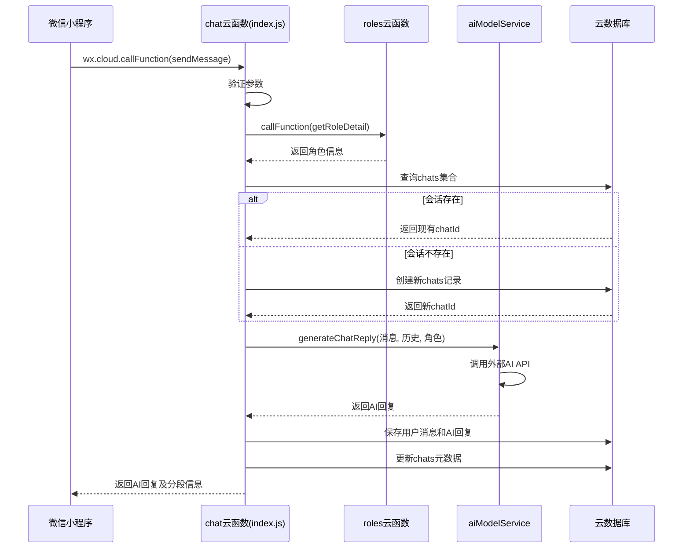
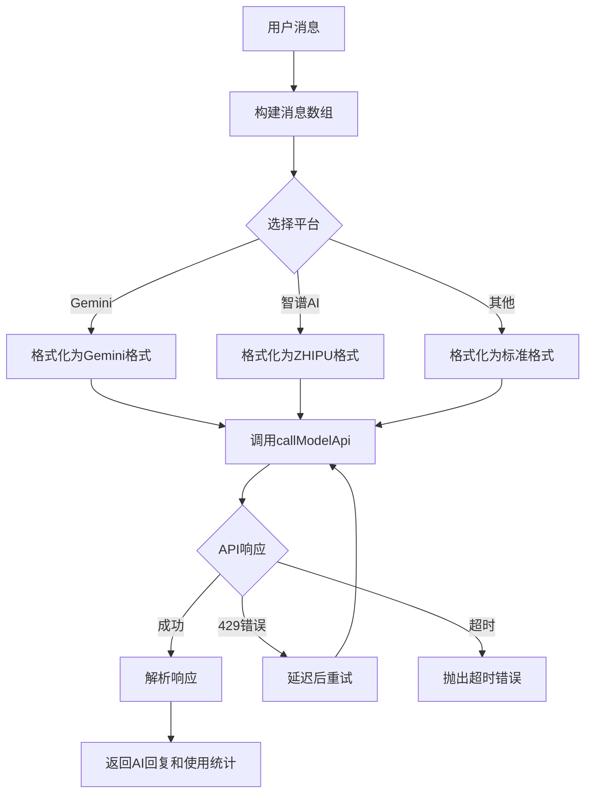
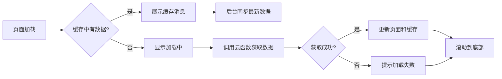

# 消息处理流程

<cite>
**本文档引用的文件**   
- [index.js](file://cloudfunctions/chat/index.js)
- [aiModelService.js](file://cloudfunctions/chat/aiModelService.js)
- [chat.js](file://miniprogram/packageChat/pages/chat/chat.js)
- [chatCacheService.js](file://miniprogram/services/chatCacheService.js)
- [cloudFuncCaller.js](file://miniprogram/services/cloudFuncCaller.js)
</cite>

## 目录
1. [简介](#简介)
2. [前端消息发送流程](#前端消息发送流程)
3. [云端消息处理流程](#云端消息处理流程)
4. [AI响应生成机制](#ai响应生成机制)
5. [本地缓存与消息同步](#本地缓存与消息同步)
6. [异常处理与重试策略](#异常处理与重试策略)
7. [典型请求/响应示例](#典型请求/响应示例)
8. [结论](#结论)

## 简介
本文件详细描述了微信小程序中聊天服务的完整消息处理流程。从用户在前端发起聊天请求开始，到云端AI模型生成响应，再到消息的持久化存储与前端展示，全面解析了整个系统的协同工作机制。重点阐述了微信云函数`chat`的处理逻辑、AI模型服务调用、前端本地缓存策略以及在异常情况下的容错机制。

## 前端消息发送流程

微信小程序前端通过`wx.cloud.callFunction`调用`chat`云函数，启动消息处理流程。该流程始于`miniprogram/packageChat/pages/chat/chat.js`中的页面逻辑。

当用户在聊天界面输入消息并点击发送时，`sendMessage`函数被触发。该函数首先对用户输入进行基本验证，确保消息内容不为空。随后，它通过`cloudFuncCaller.js`中的`callCloudFunc`工具函数，以统一的接口调用`chat`云函数的`sendMessage`子功能。

在调用过程中，前端会收集并传递关键参数，包括：
- `roleId`: 当前对话角色的唯一标识
- `content`: 用户输入的原始消息内容
- `modelType`: 指定使用的AI模型类型（如Gemini）
- `modelParams`: 模型生成参数（温度、最大token数等）
- `chatMemoryLength`: 对话记忆长度，控制历史消息的上下文范围

此过程包含了错误处理和加载状态提示，确保了良好的用户体验。

**Section sources**
- [chat.js](file://miniprogram/packageChat/pages/chat/chat.js#L0-L799)
- [cloudFuncCaller.js](file://miniprogram/services/cloudFuncCaller.js#L0-L179)

## 云端消息处理流程

`chat`云函数是消息处理的核心，其入口文件为`cloudfunctions/chat/index.js`。该函数根据前端传入的`action`参数，执行不同的子功能。

### 预处理阶段
当`action`为`sendMessage`时，云函数进入消息发送流程。首先，它通过`cloud.getWXContext()`获取当前用户的`OPENID`，用于身份验证和数据隔离。

接着，函数执行一系列预处理操作：
1.  **参数验证**: 检查`roleId`和`content`等必要参数是否有效。
2.  **角色信息获取**: 调用`roles`云函数的`getRoleDetail`接口，获取指定角色的详细信息，包括其专属的系统提示词（prompt）。
3.  **会话管理**: 查询数据库中是否存在与该用户和角色的现有聊天会话。如果不存在，则创建一个新的`chats`记录。

### 模型调度与响应生成
在完成预处理后，云函数进入核心的AI响应生成阶段。它将用户消息、历史对话记录、角色信息以及模型参数，一并传递给`aiModelService.js`中的`generateChatReply`函数。

### 数据库持久化
AI响应生成后，云函数会将本次交互的完整消息记录（包括用户消息和AI回复）持久化到`messages`集合中。同时，更新`chats`集合中对应会话的元数据，如最后消息时间、消息计数等。此过程通过数据库事务确保数据一致性。

### 返回客户端
最后，云函数将生成的AI回复、分段信息、使用统计等数据打包，通过HTTP响应返回给前端客户端。



**Diagram sources **
- [index.js](file://cloudfunctions/chat/index.js#L0-L799)

**Section sources**
- [index.js](file://cloudfunctions/chat/index.js#L0-L799)

## AI响应生成机制

AI响应的生成由`cloudfunctions/chat/aiModelService.js`模块统一管理，实现了对多种AI模型平台的集成。

### 统一模型服务
`aiModelService.js`定义了一个`MODEL_PLATFORMS`配置对象，支持包括Gemini、智谱AI（GLM）、OpenAI、Claude在内的多个平台。每个平台都配置了其API的基础URL、认证方式、默认模型和可用模型列表。

### 消息格式化
由于不同AI平台的API接口规范不同，`formatMessages`函数负责将标准化的消息数组转换为特定平台所需的格式。例如，Gemini平台要求将消息封装在`contents`数组中，并将用户和AI的角色分别标记为`user`和`model`。

### API调用与解析
`callModelApi`函数是与外部AI服务通信的核心。它构建HTTP请求，包含正确的认证头（Bearer Token）和请求体。该函数实现了重试机制，当遇到429（请求过多）等错误时，会自动延迟并重试，最多重试3次，且每次重试的延迟时间会加倍。

### 响应处理
`parseResponse`函数负责解析来自不同AI平台的响应，并将其统一为标准格式，提取出生成的文本内容和token使用量。最终，`generateChatReply`函数将这些信息整合，返回给调用者。



**Diagram sources **
- [aiModelService.js](file://cloudfunctions/chat/aiModelService.js#L0-L586)

**Section sources**
- [aiModelService.js](file://cloudfunctions/chat/aiModelService.js#L0-L586)

## 本地缓存与消息同步

为了提升用户体验，特别是在网络不稳定的情况下，系统实现了前端本地缓存机制，由`miniprogram/services/chatCacheService.js`提供支持。

### 缓存结构
缓存服务使用`wx.setStorageSync`将聊天数据存储在本地。每个聊天会话的缓存键为`chat_<chatId>`，其数据结构包含两部分：
- `basic`: 存储会话的基本信息，如角色ID、名称、最后更新时间。
- `messages`: 学习消息，分为`latest`（最新消息）和`pages`（分页的历史消息）。

### 消息去重
在保存消息到缓存时，`saveMessagesToCache`函数会检查消息的`_id`，避免将重复的消息存入缓存。这通过创建一个`existingIds`的`Set`来实现，确保了缓存数据的唯一性。

### 离线消息恢复
在`chat.js`的`onLoad`生命周期中，程序会优先尝试从本地缓存加载消息。如果缓存中存在数据，会先展示这些“离线消息”，给用户即时反馈，然后在后台静默调用云函数同步最新数据。这保证了即使在无网络状态下，用户也能看到之前的聊天记录。

### 加载历史记录
当用户上拉聊天记录时，`loadMoreHistory`函数被触发。该函数首先尝试从缓存中加载指定页码的数据。如果缓存未命中，则向云函数发起请求，获取服务器上的历史消息，并在成功后将其存入缓存，为下次加载做准备。



**Diagram sources **
- [chatCacheService.js](file://miniprogram/services/chatCacheService.js#L0-L298)
- [chat.js](file://miniprogram/packageChat/pages/chat/chat.js#L0-L799)

**Section sources**
- [chatCacheService.js](file://miniprogram/services/chatCacheService.js#L0-L298)
- [chat.js](file://miniprogram/packageChat/pages/chat/chat.js#L0-L799)

## 异常处理与重试策略

系统在多个层面都设计了完善的异常处理和重试策略，以应对网络中断、API超时等常见问题。

### 前端重试
`cloudFuncCaller.js`中的`callCloudFunc`函数是前端调用云函数的统一入口。它使用`try-catch`捕获所有异常，并在`catch`块中进行错误处理。对于网络错误或云函数执行失败，它会向用户显示友好的错误提示（`wx.showToast`），但不会中断主流程。

### 云端重试
在`aiModelService.js`中，`callModelApi`函数对429错误（请求过多）实现了指数退避重试策略。第一次失败后等待1秒，第二次等待2秒，第三次等待4秒，有效避免了因瞬时流量高峰导致的失败。

### 降级策略
当主要AI模型（如Gemini）不可用时，系统可以通过配置切换到备用模型（如智谱AI或Claude）。此外，在获取角色信息失败等非关键错误时，系统会使用默认提示词继续执行，保证了核心聊天功能的可用性。

### 容错恢复
在加载历史消息失败时，`loadChatHistory`函数会尝试从本地缓存恢复数据。如果缓存中存在旧数据，系统会优先展示这些数据，并提示用户“已从缓存恢复”，确保了服务的连续性。

**Section sources**
- [cloudFuncCaller.js](file://miniprogram/services/cloudFuncCaller.js#L0-L179)
- [aiModelService.js](file://cloudfunctions/chat/aiModelService.js#L0-L586)
- [chat.js](file://miniprogram/packageChat/pages/chat/chat.js#L0-L799)

## 典型请求/响应示例

以下是一个典型的`sendMessage`云函数调用示例。

### 请求
```json
{
  "action": "sendMessage",
  "roleId": "role_123",
  "content": "今天感觉有点焦虑，怎么办？",
  "modelType": "gemini",
  "modelParams": {
    "temperature": 0.8,
    "maxTokens": 1024
  },
  "chatMemoryLength": 10
}
```

### 响应
```json
{
  "success": true,
  "content": "我理解你的感受。焦虑是很常见的情绪。你可以尝试深呼吸，或者和我聊聊让你感到焦虑的具体原因吗？",
  "segments": [
    "我理解你的感受。焦虑是很常见的情绪。",
    "你可以尝试深呼吸，或者和我聊聊让你感到焦虑的具体原因吗？"
  ],
  "usage": {
    "prompt_tokens": 150,
    "completion_tokens": 45,
    "total_tokens": 195
  },
  "modelType": "gemini",
  "timestamp": 1717000000000
}
```

## 结论
本系统通过微信小程序前端、云函数后端和本地缓存的协同工作，构建了一个健壮、流畅的聊天消息处理流程。从前端的用户交互，到云端的AI模型调度与数据持久化，再到前端的缓存同步与异常恢复，每个环节都经过精心设计。该架构不仅保证了核心功能的高效执行，还通过多层次的容错机制，为用户提供了稳定可靠的聊天体验。