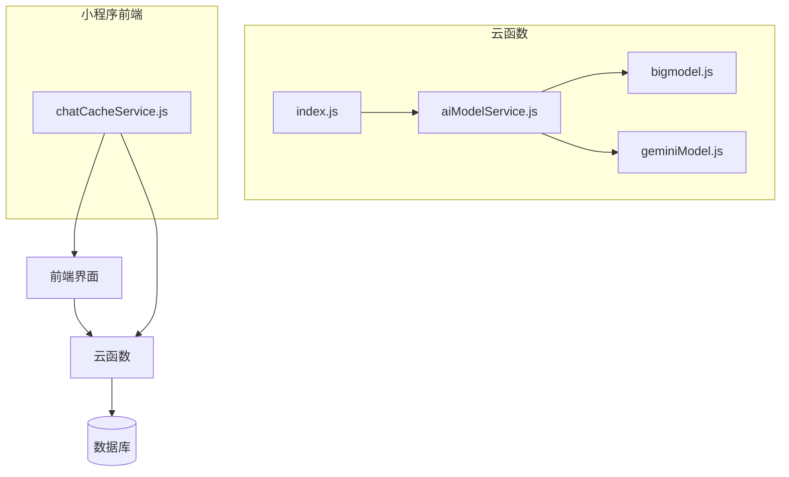
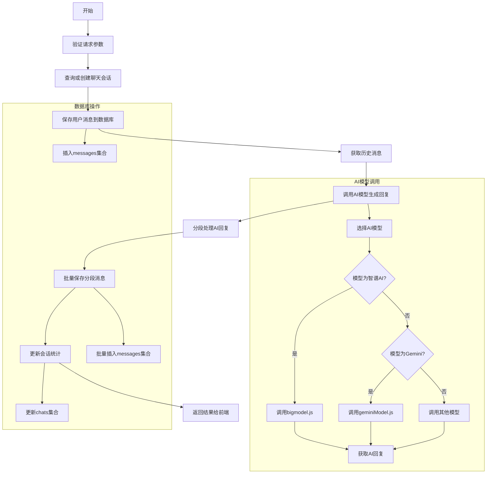
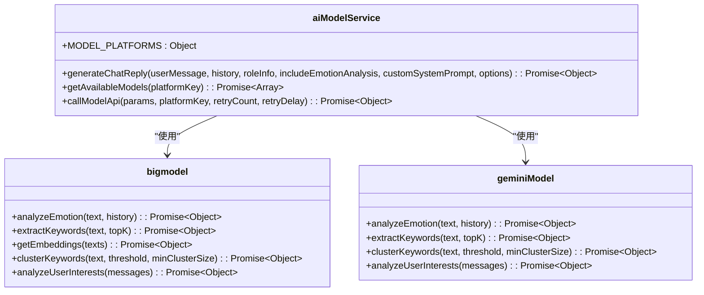
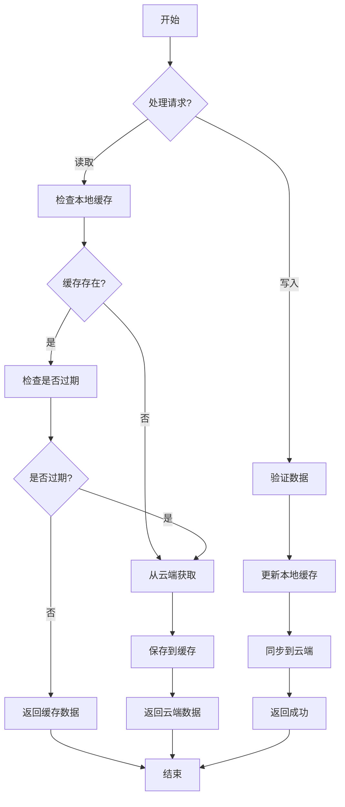
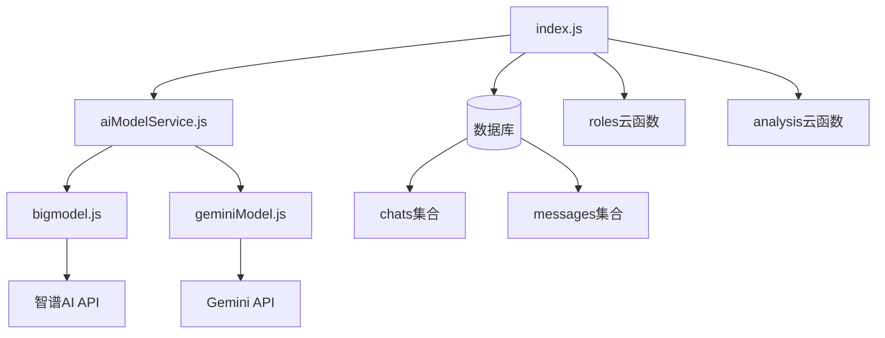

# 聊天服务

<cite>
**本文档引用文件**  
- [index.js](file://cloudfunctions/chat/index.js)
- [aiModelService.js](file://cloudfunctions/chat/aiModelService.js)
- [bigmodel.js](file://cloudfunctions/chat/bigmodel.js)
- [geminiModel.js](file://cloudfunctions/chat/geminiModel.js)
- [chatCacheService.js](file://miniprogram/services/chatCacheService.js)
- [analysis/index.js](file://cloudfunctions/analysis/index.js)
- [messages.md](file://doc/开发文档/database/messages.md)
- [chats.md](file://doc/开发文档/database/chats.md)
</cite>

## 目录
1. [简介](#简介)
2. [项目结构](#项目结构)
3. [核心组件](#核心组件)
4. [架构概述](#架构概述)
5. [详细组件分析](#详细组件分析)
6. [依赖分析](#依赖分析)
7. [性能考虑](#性能考虑)
8. [故障排除指南](#故障排除指南)
9. [结论](#结论)

## 简介
本技术文档详细描述了HeartChat项目中聊天服务的实现机制。该服务通过`chat`云函数接收前端消息请求，利用`aiModelService.js`统一调度`bigmodel.js`（智谱AI）或`geminiModel.js`（Google Gemini）等不同AI模型生成回复。服务与`analysis`云函数集成，实现自动情绪分析，并将聊天记录写入数据库以维护上下文状态。文档还结合前端`chatCacheService.js`，解释了本地缓存与云端同步的协同机制，涵盖典型调用示例、异常处理策略和安全过滤机制。

## 项目结构
聊天服务主要由云函数和小程序前端两部分构成。云函数位于`cloudfunctions/chat/`目录下，包含主入口`index.js`和AI模型服务模块。前端服务位于`miniprogram/services/`目录下，负责本地缓存管理。



**图表来源**
- [index.js](file://cloudfunctions/chat/index.js)
- [aiModelService.js](file://cloudfunctions/chat/aiModelService.js)
- [chatCacheService.js](file://miniprogram/services/chatCacheService.js)

**本节来源**
- [index.js](file://cloudfunctions/chat/index.js)
- [aiModelService.js](file://cloudfunctions/chat/aiModelService.js)
- [chatCacheService.js](file://miniprogram/services/chatCacheService.js)

## 核心组件
聊天服务的核心是`cloudfunctions/chat/index.js`中的`sendMessage`函数，它接收前端请求，处理用户消息，调用AI模型生成回复，并将结果保存到数据库。`aiModelService.js`作为统一接口，抽象了对不同AI模型（如智谱AI、Google Gemini）的调用细节，使系统具有良好的扩展性。`chatCacheService.js`在小程序端实现了消息的本地缓存，提升了用户体验。

**本节来源**
- [index.js](file://cloudfunctions/chat/index.js#L0-L1413)
- [aiModelService.js](file://cloudfunctions/chat/aiModelService.js#L0-L587)
- [chatCacheService.js](file://miniprogram/services/chatCacheService.js#L0-L299)

## 架构概述
聊天服务采用分层架构，从前端请求到AI响应的完整生命周期清晰。前端通过云函数调用触发服务，服务层处理业务逻辑并调用AI模型，数据层负责持久化存储，分析层提供情绪分析等增值服务。

```mermaid
flowchart TD
A[用户发送消息] --> B[前端显示用户消息]
B --> C[调用 chat 云函数]
C --> D[保存用户消息到数据库]
D --> E[调用AI模型服务]
E --> F[生成AI回复]
F --> G[分段处理长消息]
G --> H[保存AI回复到数据库]
H --> I[触发情绪分析]
I --> J[返回AI回复和分析结果]
J --> K[前端显示AI回复]
K --> L[更新情绪分析面板]
subgraph 云函数 chat
C1[接收消息和角色ID] --> C2[查询角色信息]
C2 --> C3[构建提示词]
C3 --> C4[调用AI模型]
C4 --> C5[处理AI回复]
C5 --> C6[保存消息到数据库]
C6 --> C7[返回结果]
end
subgraph 数据库
DB1[(roles 集合)]
DB2[(chats 集合)]
DB3[(messages 集合)]
C2 < --> DB1
C6 < --> DB2
C6 < --> DB3
end
subgraph 外部API
API1[智谱AI]
API2[Google Gemini]
C4 < --> API1
C4 < --> API2
end
subgraph 分析服务
I --> M[调用 analysis 云函数]
M --> N[情感分析]
N --> O[关键词提取]
O --> P[更新用户兴趣]
end
```

**图表来源**
- [index.js](file://cloudfunctions/chat/index.js#L0-L1413)
- [analysis/index.js](file://cloudfunctions/analysis/index.js#L0-L1117)

**本节来源**
- [index.js](file://cloudfunctions/chat/index.js#L0-L1413)
- [analysis/index.js](file://cloudfunctions/analysis/index.js#L0-L1117)

## 详细组件分析

### 消息处理流程分析
`sendMessage`函数是聊天服务的核心，它处理从接收用户输入到返回AI响应的完整生命周期。

#### 消息处理流程图


**图表来源**
- [index.js](file://cloudfunctions/chat/index.js#L0-L1413)

**本节来源**
- [index.js](file://cloudfunctions/chat/index.js#L0-L1413)

### AI模型服务分析
`aiModelService.js`模块提供了统一的AI模型调用接口，支持多种平台。

#### AI模型服务类图


**图表来源**
- [aiModelService.js](file://cloudfunctions/chat/aiModelService.js#L0-L587)
- [bigmodel.js](file://cloudfunctions/chat/bigmodel.js#L0-L705)
- [geminiModel.js](file://cloudfunctions/chat/geminiModel.js#L0-L656)

**本节来源**
- [aiModelService.js](file://cloudfunctions/chat/aiModelService.js#L0-L587)
- [bigmodel.js](file://cloudfunctions/chat/bigmodel.js#L0-L705)
- [geminiModel.js](file://cloudfunctions/chat/geminiModel.js#L0-L656)

### 本地缓存机制分析
`chatCacheService.js`模块在小程序端实现了聊天记录的本地缓存，支持离线访问和快速加载。

#### 本地缓存流程图


**图表来源**
- [chatCacheService.js](file://miniprogram/services/chatCacheService.js#L0-L299)

**本节来源**
- [chatCacheService.js](file://miniprogram/services/chatCacheService.js#L0-L299)

## 依赖分析
聊天服务依赖于多个内部和外部组件。内部依赖包括数据库集合和角色服务，外部依赖包括智谱AI、Google Gemini等API。



**图表来源**
- [index.js](file://cloudfunctions/chat/index.js#L0-L1413)
- [aiModelService.js](file://cloudfunctions/chat/aiModelService.js#L0-L587)

**本节来源**
- [index.js](file://cloudfunctions/chat/index.js#L0-L1413)
- [aiModelService.js](file://cloudfunctions/chat/aiModelService.js#L0-L587)

## 性能考虑
聊天服务在性能方面进行了多项优化。消息分段处理避免了长消息的延迟，本地缓存减少了网络请求，异步操作确保了主流程的流畅性。AI模型调用支持重试机制和超时控制，提高了服务的稳定性。

## 故障排除指南
常见问题包括AI模型调用失败、消息不同步和缓存失效。对于AI调用失败，应检查API密钥配置和网络连接。对于消息不同步，可尝试清除本地缓存并重新加载。对于缓存失效，检查缓存过期策略和存储空间。

**本节来源**
- [index.js](file://cloudfunctions/chat/index.js#L0-L1413)
- [chatCacheService.js](file://miniprogram/services/chatCacheService.js#L0-L299)

## 结论
HeartChat的聊天服务通过模块化设计和清晰的架构，实现了高效、稳定的对话功能。服务通过统一的AI模型接口支持多种大模型，并通过本地缓存和云端同步机制优化了用户体验。与情绪分析服务的集成，为用户提供更深层次的情感支持。整体设计具有良好的可扩展性和维护性。