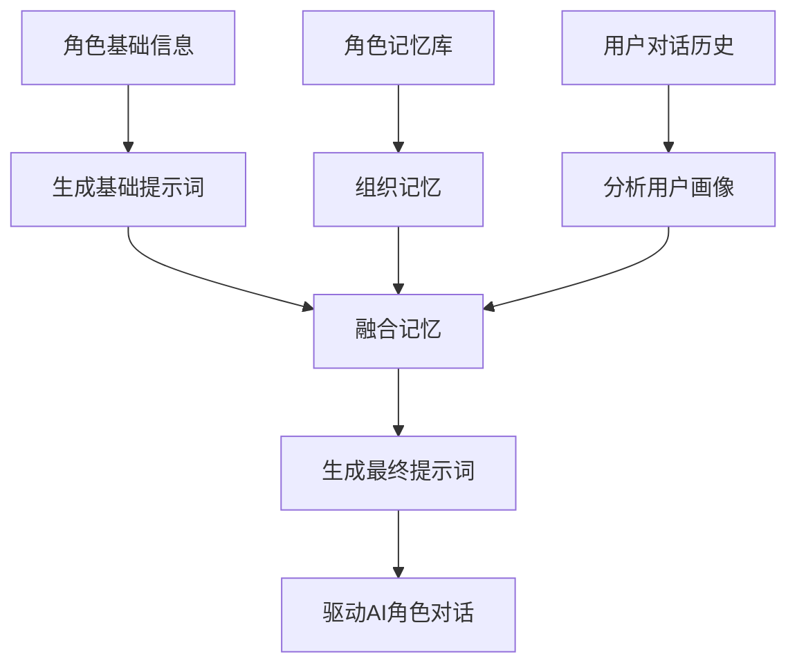
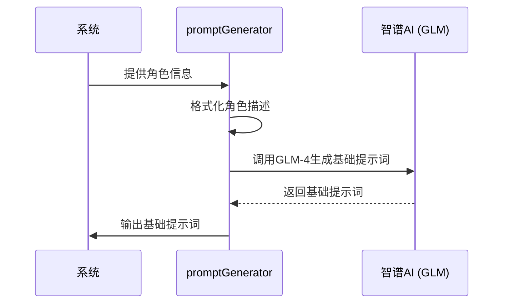
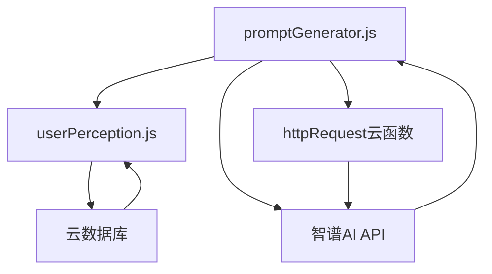

# 提示词引擎

<cite>
**本文档引用文件**  
- [promptGenerator.js](file://cloudfunctions/roles/promptGenerator.js)
- [userPerception.js](file://cloudfunctions/roles/userPerception.js)
- [02-角色提示词.md](file://doc/开发文档/prompt/02-角色提示词.md)
- [01-情感分析提示词.md](file://doc/开发文档/prompt/01-情感分析提示词.md)
- [03-关键词分类提示词.md](file://doc/开发文档/prompt/03-关键词分类提示词.md)
</cite>

## 目录
1. [简介](#简介)
2. [项目结构](#项目结构)
3. [核心组件](#核心组件)
4. [架构概述](#架构概述)
5. [详细组件分析](#详细组件分析)
6. [依赖分析](#依赖分析)
7. [性能考量](#性能考量)
8. [故障排查指南](#故障排查指南)
9. [结论](#结论)

## 简介
本技术文档详细阐述了HeartChat项目中提示词引擎的设计与实现，重点聚焦于`promptGenerator.js`模块如何动态生成个性化角色提示词。文档深入解析了该引擎如何结合角色基础设定、用户画像（来自`userPerception.js`）和实时对话上下文，构建出多层次、高度个性化的提示词结构。内容涵盖提示词模板的组织、变量注入机制、安全过滤策略、角色一致性与个性化表达的平衡，并包含提示词版本管理、A/B测试支持、多模型适配及调试日志等关键实现细节。

## 项目结构
提示词引擎的核心逻辑位于`cloudfunctions/roles/`目录下，主要由`promptGenerator.js`和`userPerception.js`两个云函数文件构成。`promptGenerator.js`负责提示词的生成与融合，而`userPerception.js`则负责从对话历史中分析并构建用户画像。预设的提示词模板和分类体系则存放在`doc/开发文档/prompt/`目录中，为动态生成提供基础素材和规则。

**Section sources**
- [promptGenerator.js](file://cloudfunctions/roles/promptGenerator.js#L1-L324)
- [userPerception.js](file://cloudfunctions/roles/userPerception.js#L1-L314)

## 核心组件
提示词引擎的核心组件包括提示词生成器（`promptGenerator.js`）、用户画像分析器（`userPerception.js`）以及预设的提示词模板库。`generateBasePrompt`函数根据角色的静态信息（如姓名、关系、性格等）生成基础提示词；`generatePromptWithMemories`和`generatePromptWithUserPerception`函数则分别负责将角色记忆和动态用户画像融入基础提示词，实现个性化定制。整个流程通过调用智谱AI（GLM）模型来完成复杂的文本生成与融合任务。

**Section sources**
- [promptGenerator.js](file://cloudfunctions/roles/promptGenerator.js#L1-L324)
- [userPerception.js](file://cloudfunctions/roles/userPerception.js#L1-L314)

## 架构概述
提示词引擎采用分层架构，从基础角色信息出发，逐层叠加个性化元素。首先，系统利用角色的静态数据生成一个基础提示词。随后，通过分析用户画像（兴趣、偏好、沟通风格）和角色记忆（重要对话事件），引擎调用大语言模型将这些动态信息无缝融合到基础提示词中。最终生成的提示词被用于指导AI角色的对话行为，确保其回应既符合角色设定，又能体现对用户的深刻理解和个性化关怀。

**Diagram sources**
- [promptGenerator.js](file://cloudfunctions/roles/promptGenerator.js#L1-L324)
- [userPerception.js](file://cloudfunctions/roles/userPerception.js#L1-L314)

## 详细组件分析
### 提示词生成器分析
`promptGenerator.js`模块是整个引擎的核心，它通过一系列异步函数实现了提示词的动态构建。

#### 生成基础提示词
该模块首先通过`generateBasePrompt`函数，将角色的JSON信息（如名称、关系、性格特点等）格式化为一段结构化的文本描述。随后，它调用智谱AI的GLM-4模型，以一个明确的系统指令（system prompt）引导AI生成一个高质量、符合特定格式要求的提示词。该系统指令详细规定了提示词应包含的七个方面，如角色自我认知、互动方式、说话风格等，并特别强调了对话风格要模仿真实手机聊天，保持消息简短。

**Diagram sources**
- [promptGenerator.js](file://cloudfunctions/roles/promptGenerator.js#L50-L100)

#### 融合记忆与用户画像
在生成基础提示词后，引擎通过`generatePromptWithMemories`和`generatePromptWithUserPerception`函数进行个性化增强。这两个函数采用相似的模式：它们将基础提示词与新的信息（记忆或用户画像）一起作为输入，再次调用智谱AI（使用更快的GLM-4-Flash模型），并提供一个详细的融合指令。该指令要求AI将新信息“自然地融入”到原有提示词中，避免生硬拼接，而是调整角色的行为指导，使其表现得更加连贯和个性化。

**Section sources**
- [promptGenerator.js](file://cloudfunctions/roles/promptGenerator.js#L101-L324)

### 安全过滤与多模型适配
#### 安全过滤策略
虽然`promptGenerator.js`本身不直接执行敏感词屏蔽，但其生成的提示词内容受到严格的系统指令约束。例如，在生成基础提示词时，指令明确要求“绝对不要使用Markdown语法”和“不要使用标题格式”，这本身就是一种格式安全过滤。更重要的是，整个系统通过Dify平台的“风险评估LLM”节点（`dify/主对话流/风险评估LLM.md`）在对话层面进行安全风控。该节点使用独立的提示词模板，专门用于评估用户文本的自伤或他伤风险，并根据`risk_level`（0-5级）进行分级，确保高风险对话能得到及时干预。

#### 多模型适配实现
提示词引擎具备良好的多模型适配能力。在`promptGenerator.js`中，`callZhipuAI`函数通过`params.model`参数指定调用的模型，如`glm-4`或`glm-4-flash`，实现了在智谱AI不同模型间的灵活切换。此外，项目文档`doc/开发文档/prompt/01-情感分析提示词.md`中明确为Gemini、OpenAI GPT、智谱AI GLM和CloseAI DeepSeek等不同模型提供了优化的提示词模板。这表明系统设计上支持根据不同模型的特性（如中文理解、推理能力）选择最合适的提示词，以达到最佳效果。

**Section sources**
- [promptGenerator.js](file://cloudfunctions/roles/promptGenerator.js#L1-L50)
- [01-情感分析提示词.md](file://doc/开发文档/prompt/01-情感分析提示词.md#L1-L480)

## 依赖分析
提示词引擎的正常运行依赖于多个内部和外部组件。在内部，`promptGenerator.js`直接依赖`userPerception.js`提供的用户画像数据，并通过`httpRequest`云函数来发起对外部API的调用。在外部，它严重依赖智谱AI（Zhipu AI）提供的大语言模型服务，通过`ZHIPU_API_KEY`环境变量进行身份验证。同时，用户画像的分析和记忆的存储依赖于云数据库（Cloud Database）的`roles`和`messages`集合。整个流程的触发和协调由微信小程序的前端逻辑和云函数调用机制完成。

**Diagram sources**
- [promptGenerator.js](file://cloudfunctions/roles/promptGenerator.js#L1-L324)
- [userPerception.js](file://cloudfunctions/roles/userPerception.js#L1-L314)

## 性能考量
提示词引擎的性能主要受大语言模型API调用延迟的影响。为了优化性能，系统采取了多项措施：首先，使用响应速度更快的`glm-4-flash`模型来处理提示词的融合任务，而将更强大的`glm-4`模型用于初始的基础提示词生成。其次，引擎设计了本地降级方案（`localMergeMemoriesWithPrompt`），当AI调用失败时，可以使用简单的字符串拼接方法作为后备，保证服务的可用性。最后，用户画像和角色记忆的分析并非实时进行，而是基于一定轮次的对话历史定期更新，避免了频繁的API调用，从而平衡了个性化程度与系统性能。

## 故障排查指南
当提示词生成出现问题时，应首先检查云函数日志。`promptGenerator.js`和`userPerception.js`中包含了详细的`console.error`日志，可用于诊断问题。常见问题包括：`ZHIPU_API_KEY`环境变量未配置导致的API密钥错误，网络问题导致的HTTP请求失败，或AI返回的JSON格式错误。对于用户画像分析失败的情况，可以检查输入的对话消息是否为空。此外，可以通过查看`doc/开发文档/prompt/`目录下的提示词模板，确认系统指令是否符合预期，以排除因提示词设计不当导致的生成质量低下问题。

**Section sources**
- [promptGenerator.js](file://cloudfunctions/roles/promptGenerator.js#L1-L324)
- [userPerception.js](file://cloudfunctions/roles/userPerception.js#L1-L314)

## 结论
HeartChat的提示词引擎通过巧妙地结合静态角色设定、动态用户画像和角色记忆，并利用大语言模型的强大生成能力，成功实现了高度个性化和情境化的AI角色对话。其分层生成和融合的架构设计，既保证了角色的核心一致性，又赋予了其丰富的个性化表达能力。通过预设的模板、安全的风控机制和多模型适配策略，该引擎为构建一个智能、安全且富有同理心的情感陪伴应用提供了坚实的技术基础。未来的优化方向可包括引入A/B测试框架来评估不同提示词版本的效果，以及进一步优化本地降级方案的智能化水平。