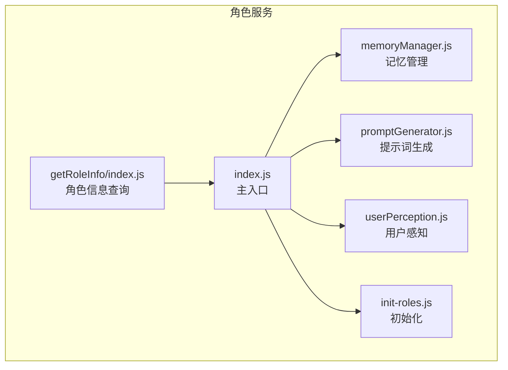
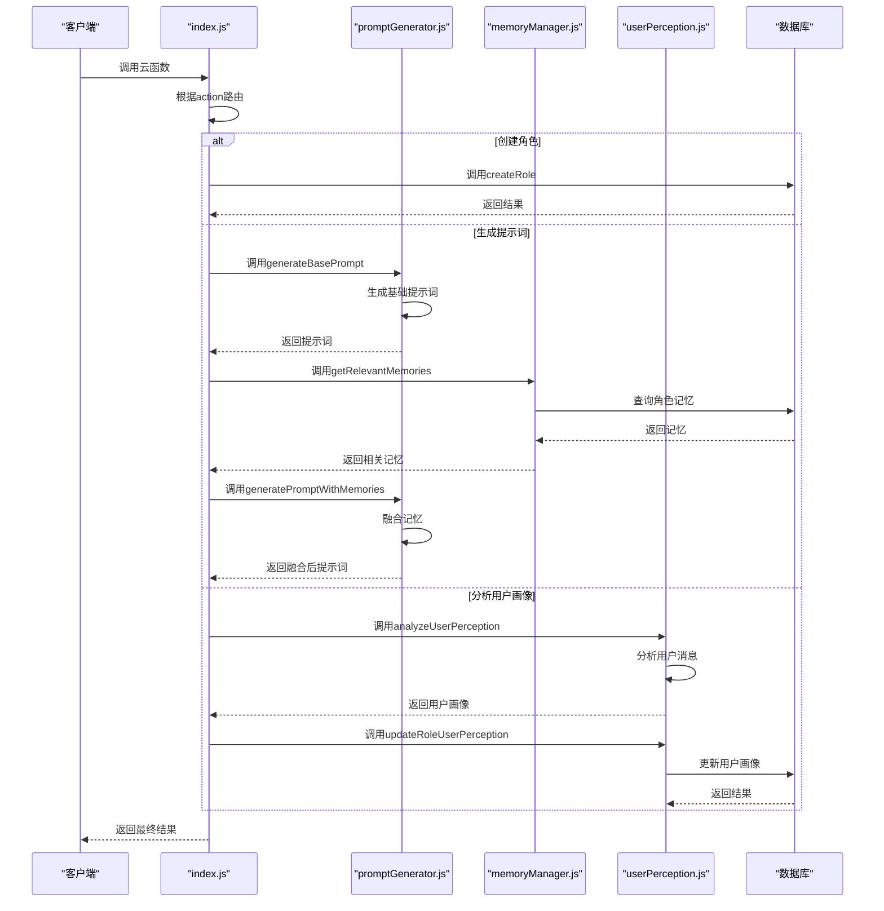
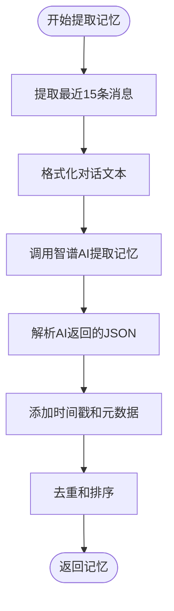
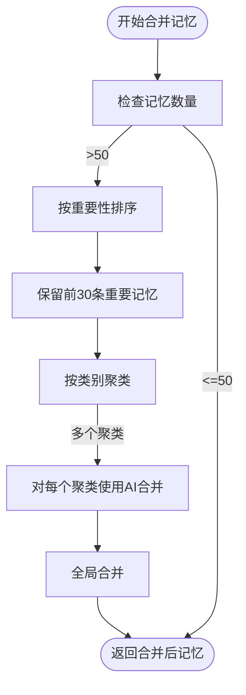
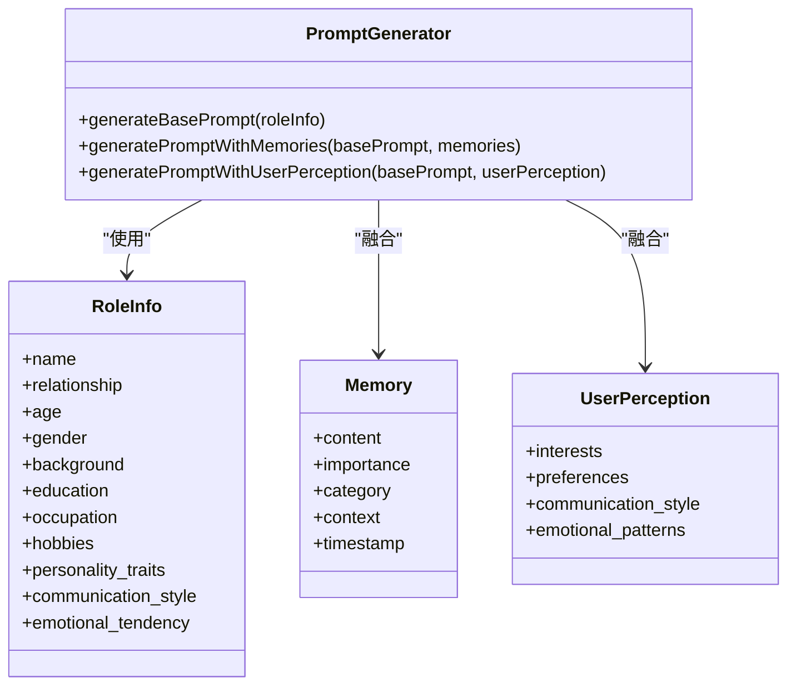
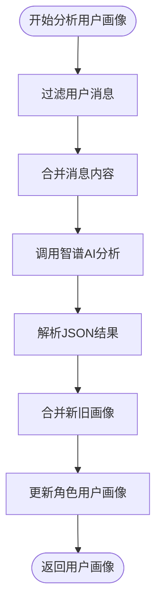
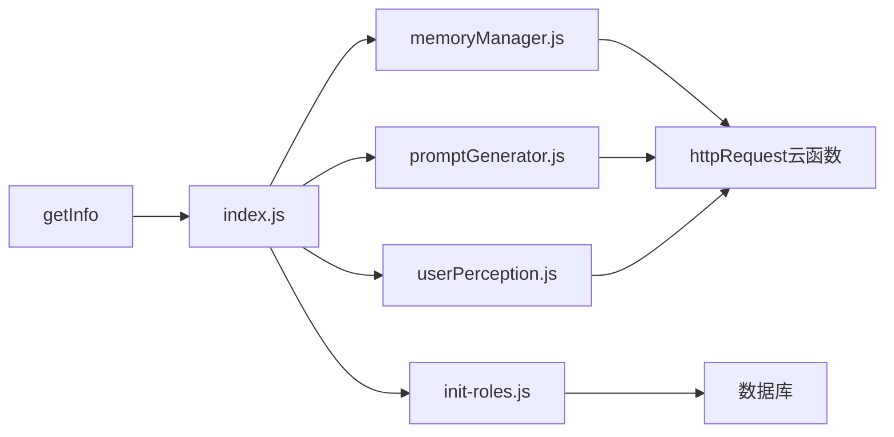

# 角色服务

<cite>
**本文档引用的文件**  
- [index.js](file://cloudfunctions/roles/index.js)
- [memoryManager.js](file://cloudfunctions/roles/memoryManager.js)
- [promptGenerator.js](file://cloudfunctions/roles/promptGenerator.js)
- [userPerception.js](file://cloudfunctions/roles/userPerception.js)
- [init-roles.js](file://cloudfunctions/roles/init-roles.js)
- [getRoleInfo/index.js](file://cloudfunctions/getRoleInfo/index.js)
</cite>

## 目录
1. [简介](#简介)
2. [项目结构](#项目结构)
3. [核心组件](#核心组件)
4. [架构概览](#架构概览)
5. [详细组件分析](#详细组件分析)
6. [依赖分析](#依赖分析)
7. [性能考量](#性能考量)
8. [故障排除指南](#故障排除指南)
9. [结论](#结论)

## 简介
角色服务是 HeartChat 应用的核心模块，负责 AI 角色的创建、管理与交互逻辑。该服务通过云函数实现，支持角色的全生命周期管理，包括创建、读取、更新和删除（CRUD）操作。系统利用 AI 技术实现长期记忆存储与检索、动态生成角色提示词以及分析用户与角色的互动模式。服务还包含系统初始化时预设角色的流程，以及提供角色元数据查询的能力。文档将详细阐述角色状态机设计、记忆持久化策略、提示词工程最佳实践，并提供角色切换和自定义的 API 调用示例。

## 项目结构
角色服务位于 `cloudfunctions/roles` 目录下，包含多个 JavaScript 文件，每个文件负责特定功能。主入口文件 `index.js` 统一处理所有角色管理请求，`memoryManager.js` 负责记忆的提取与管理，`promptGenerator.js` 生成角色提示词，`userPerception.js` 分析用户画像，`init-roles.js` 初始化系统预设角色，`getRoleInfo/index.js` 提供角色元数据查询。

**图源**  
- [index.js](file://cloudfunctions/roles/index.js)
- [memoryManager.js](file://cloudfunctions/roles/memoryManager.js)
- [promptGenerator.js](file://cloudfunctions/roles/promptGenerator.js)
- [userPerception.js](file://cloudfunctions/roles/userPerception.js)
- [init-roles.js](file://cloudfunctions/roles/init-roles.js)
- [getRoleInfo/index.js](file://cloudfunctions/getRoleInfo/index.js)

## 核心组件
角色服务的核心组件包括角色管理、记忆管理、提示词生成和用户感知。`index.js` 作为主入口，通过 `action` 参数路由到不同的子功能，如 `getRoles`、`createRole`、`generatePrompt` 等。`memoryManager.js` 从对话中提取记忆并存储在角色数据中，`promptGenerator.js` 根据角色信息生成提示词，`userPerception.js` 分析用户画像并更新角色的用户感知数据。

**节源**  
- [index.js](file://cloudfunctions/roles/index.js)
- [memoryManager.js](file://cloudfunctions/roles/memoryManager.js)
- [promptGenerator.js](file://cloudfunctions/roles/promptGenerator.js)
- [userPerception.js](file://cloudfunctions/roles/userPerception.js)

## 架构概览
角色服务采用模块化设计，主入口 `index.js` 调用各个功能模块。当用户请求创建角色时，`createRole` 函数被调用，验证参数后将角色数据存入数据库。当需要生成提示词时，`generateRolePrompt` 函数调用 `promptGenerator.js` 生成基础提示词，并融合记忆和用户画像。记忆管理通过 `extractChatMemories` 函数从对话中提取重要信息，并使用 `updateRoleMemories` 更新角色记忆。

**图源**  
- [index.js](file://cloudfunctions/roles/index.js)
- [promptGenerator.js](file://cloudfunctions/roles/promptGenerator.js)
- [memoryManager.js](file://cloudfunctions/roles/memoryManager.js)
- [userPerception.js](file://cloudfunctions/roles/userPerception.js)
- [init-roles.js](file://cloudfunctions/roles/init-roles.js)

## 详细组件分析
### 角色管理分析
角色管理功能通过 `index.js` 中的 `createRole`、`updateRole` 和 `deleteRole` 函数实现。创建角色时，系统检查角色名称是否已存在，避免重复。更新角色时，检查权限确保只有创建者或管理员可以更新。删除角色时，同样检查权限并删除相关数据。

**节源**  
- [index.js](file://cloudfunctions/roles/index.js)

### 记忆管理分析
记忆管理是角色服务的核心功能之一，通过 `memoryManager.js` 实现。系统从对话中提取记忆，使用 AI 分析重要信息，并存储在角色数据中。记忆的提取和检索考虑了语义相关性、主题匹配度、情感一致性和时间相关性。

#### 记忆提取流程

**图源**  
- [memoryManager.js](file://cloudfunctions/roles/memoryManager.js)

#### 记忆合并策略
当角色记忆超过50条时，系统会进行合并。首先按类别聚类，然后对每个聚类使用 AI 合并，最后全局合并以确保记忆数量在合理范围内。

**图源**  
- [memoryManager.js](file://cloudfunctions/roles/memoryManager.js)

### 提示词生成分析
提示词生成通过 `promptGenerator.js` 实现，根据角色信息生成基础提示词，并融合记忆和用户画像。

#### 提示词生成流程

**图源**  
- [promptGenerator.js](file://cloudfunctions/roles/promptGenerator.js)

### 用户感知分析
用户感知通过 `userPerception.js` 实现，分析用户消息以提取兴趣、偏好、沟通风格和情感模式。

#### 用户画像分析流程

**图源**  
- [userPerception.js](file://cloudfunctions/roles/userPerception.js)

## 依赖分析
角色服务依赖于云数据库和智谱AI服务。`index.js` 依赖 `memoryManager.js`、`promptGenerator.js` 和 `userPerception.js` 来实现高级功能。`memoryManager.js` 和 `promptGenerator.js` 都依赖 `callZhipuAI` 函数来调用智谱AI接口。

**图源**  
- [index.js](file://cloudfunctions/roles/index.js)
- [memoryManager.js](file://cloudfunctions/roles/memoryManager.js)
- [promptGenerator.js](file://cloudfunctions/roles/promptGenerator.js)
- [userPerception.js](file://cloudfunctions/roles/userPerception.js)
- [init-roles.js](file://cloudfunctions/roles/init-roles.js)
- [getRoleInfo/index.js](file://cloudfunctions/getRoleInfo/index.js)

## 性能考量
角色服务在性能方面进行了优化。记忆管理中，当记忆数量超过50条时，系统会进行合并，避免数据冗余。提示词生成和用户画像分析都使用了 AI 服务，但通过缓存和本地合并算法作为后备方案，确保在 AI 服务不可用时仍能正常运行。

## 故障排除指南
### 常见问题
- **角色创建失败**：检查角色名称是否已存在，确保参数完整。
- **提示词生成失败**：检查智谱AI API 密钥是否配置正确。
- **记忆提取失败**：检查对话内容是否为空，确保消息格式正确。

**节源**  
- [index.js](file://cloudfunctions/roles/index.js)
- [memoryManager.js](file://cloudfunctions/roles/memoryManager.js)
- [promptGenerator.js](file://cloudfunctions/roles/promptGenerator.js)

## 结论
角色服务通过模块化设计和 AI 技术，实现了 AI 角色的创建、管理与交互。系统能够动态生成提示词、提取和管理记忆、分析用户画像，为用户提供个性化的对话体验。通过合理的架构设计和性能优化，确保了服务的稳定性和高效性。