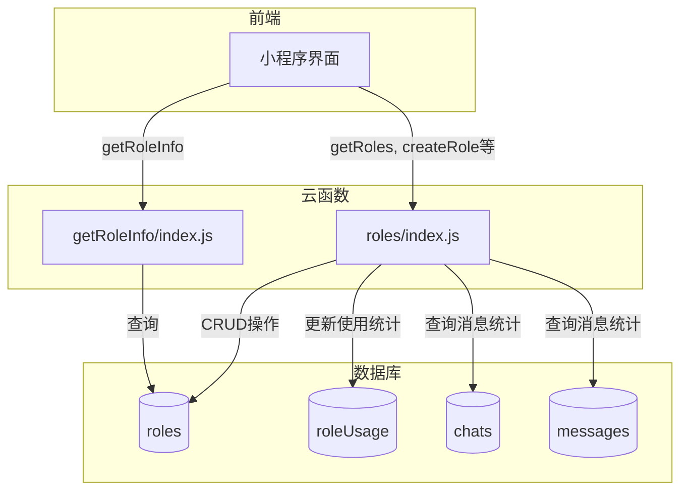
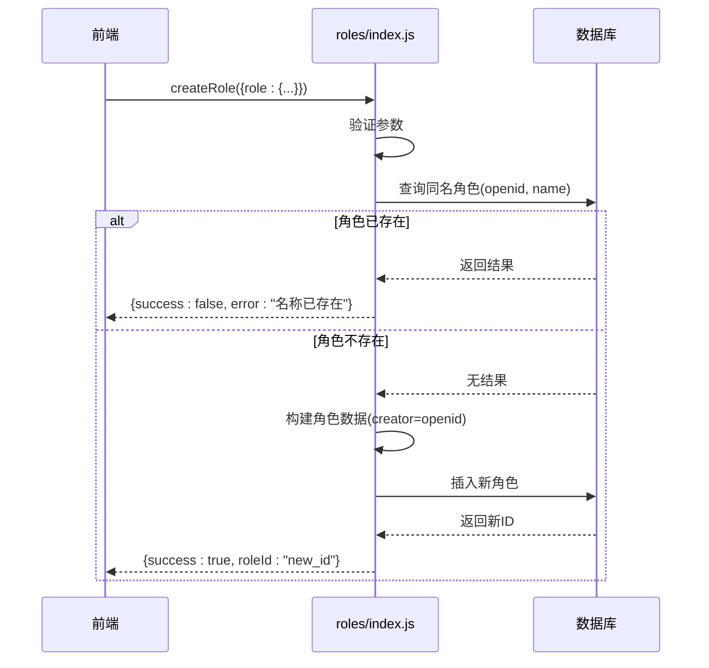
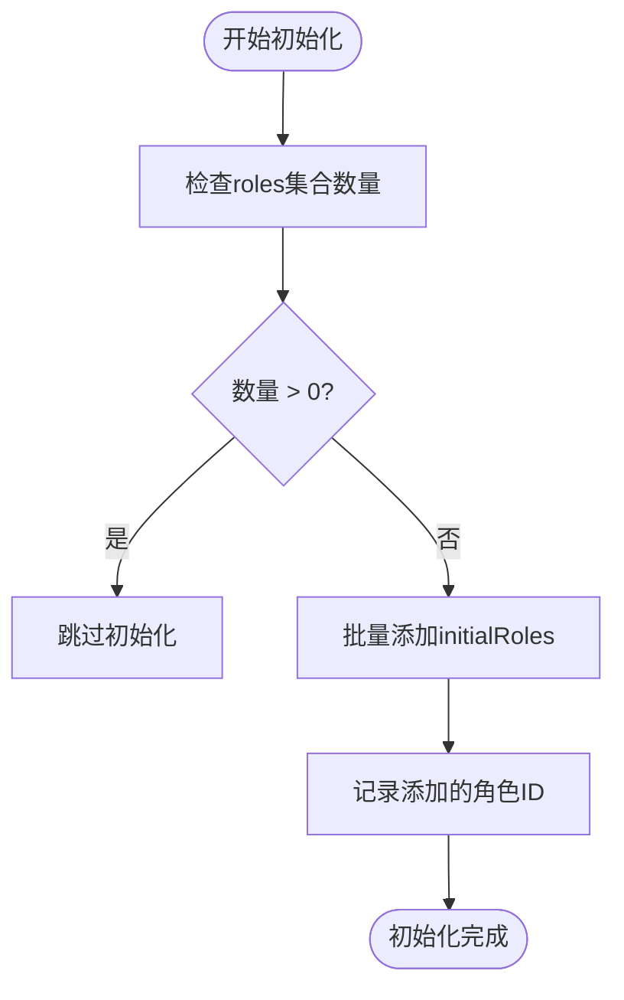
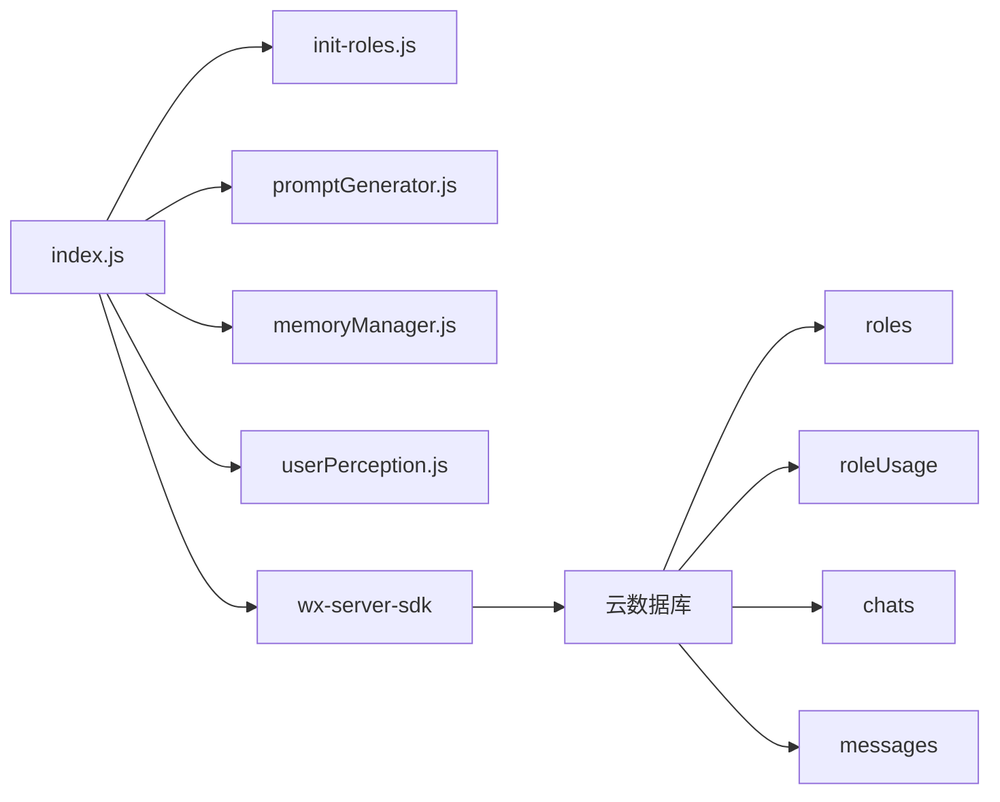

# 角色管理

<cite>
**本文档引用的文件**  
- [index.js](file://cloudfunctions/roles/index.js)
- [init-roles.js](file://cloudfunctions/roles/init-roles.js)
- [getRoleInfo/index.js](file://cloudfunctions/getRoleInfo/index.js)
- [roles.md](file://doc/开发文档/database/roles.md)
- [预设角色功能使用指南.md](file://doc/使用文档/预设角色功能使用指南.md)
</cite>

## 目录
1. [引言](#引言)
2. [项目结构](#项目结构)
3. [核心组件](#核心组件)
4. [架构概览](#架构概览)
5. [详细组件分析](#详细组件分析)
6. [依赖分析](#依赖分析)
7. [性能考量](#性能考量)
8. [故障排除指南](#故障排除指南)
9. [结论](#结论)

## 引言
本文档旨在全面阐述HeartChat系统中AI角色的生命周期管理机制，重点聚焦于角色的创建、更新、删除与查询等核心操作。文档详细说明了`index.js`中RESTful接口的设计与实现，`init-roles.js`在系统初始化时批量导入预设角色的逻辑，以及`getRoleInfo`云函数如何响应前端对角色元数据的请求。同时，文档深入解析了角色状态机、权限控制、配置校验规则，并提供了完整的API调用示例与错误码说明，结合代码实例解释角色数据结构设计及其与数据库的映射关系。

## 项目结构
角色管理功能主要位于`cloudfunctions/roles`目录下，其核心文件包括：
- `index.js`：角色管理的主云函数入口，提供CRUD操作的RESTful接口。
- `init-roles.js`：负责在系统初始化时批量导入预设角色。
- `promptGenerator.js`：生成角色提示词的工具模块。
- `memoryManager.js`：管理角色记忆的模块。
- `userPerception.js`：处理用户画像的模块。

此外，`cloudfunctions/getRoleInfo/index.js`提供了一个独立的云函数，用于获取单个角色的详细信息。数据库设计文档`doc/开发文档/database/roles.md`和使用指南`doc/使用文档/预设角色功能使用指南.md`为理解角色数据模型和使用场景提供了重要参考。

**Section sources**
- [index.js](file://cloudfunctions/roles/index.js#L1-L758)
- [init-roles.js](file://cloudfunctions/roles/init-roles.js#L1-L103)
- [getRoleInfo/index.js](file://cloudfunctions/getRoleInfo/index.js#L1-L50)

## 核心组件
本模块的核心组件围绕AI角色的全生命周期管理展开。`index.js`作为主入口，通过`action`参数路由到不同的子功能函数，实现了角色的增删改查（CRUD）、使用统计更新、提示词生成、记忆提取和用户画像分析等。`init-roles.js`封装了预设角色的初始化逻辑，确保系统启动时拥有基础的角色数据。`getRoleInfo`云函数则为前端提供了一个轻量级的接口，用于获取特定角色的元数据。

**Section sources**
- [index.js](file://cloudfunctions/roles/index.js#L1-L758)
- [init-roles.js](file://cloudfunctions/roles/init-roles.js#L1-L103)
- [getRoleInfo/index.js](file://cloudfunctions/getRoleInfo/index.js#L1-L50)

## 架构概览
角色管理模块采用微服务化的云函数架构，将不同的业务逻辑解耦。主云函数`roles/index.js`负责处理所有与角色相关的请求，通过内部函数调用实现具体功能。数据持久化依赖于云数据库，主要涉及`roles`、`roleUsage`、`chats`和`messages`等集合。模块间通过清晰的接口进行交互，如`promptGenerator`、`memoryManager`和`userPerception`模块被`index.js`按需引入和调用。



**Diagram sources**
- [index.js](file://cloudfunctions/roles/index.js#L1-L758)
- [getRoleInfo/index.js](file://cloudfunctions/getRoleInfo/index.js#L1-L50)
- [roles.md](file://doc/开发文档/database/roles.md#L1-L123)

## 详细组件分析

### RESTful接口设计分析
`index.js`中的`exports.main`函数是所有角色管理操作的统一入口。它根据`event.action`参数的值，将请求分发到相应的处理函数。

#### 角色创建、更新与删除
- **创建 (`createRole`)**：接收包含`role`对象的`event`参数。首先验证`role.name`的存在性，然后检查在当前用户的`openid`下是否已存在同名角色，防止名称冲突。创建时，`creator`字段被强制设置为用户的`openid`，`createTime`和`updateTime`使用数据库服务器时间，`status`默认为1（启用）。代码中还包含逻辑，确保`prompt`和`system_prompt`字段内容一致。
- **更新 (`updateRole`)**：接收`roleId`和`role`对象。首先验证角色是否存在，然后检查当前用户`openid`是否为角色的创建者或管理员，以实现权限控制。更新时会自动同步`prompt`和`system_prompt`，并移除`_id`、`creator`和`createTime`等不可更新的字段。
- **删除 (`deleteRole`)**：同样需要验证角色存在性和操作权限。成功删除后，相关的聊天记录可选择性地被清理。



**Diagram sources**
- [index.js](file://cloudfunctions/roles/index.js#L150-L250)

#### 角色查询
- **获取列表 (`getRoles`)**：支持按`userId`、`category`等条件筛选。查询逻辑使用`$or`操作符，返回所有`creator`为`system`（系统角色）或当前用户`openid`（用户自建角色）的记录。查询结果会与`roleUsage`集合中的使用统计进行合并，丰富返回数据。
- **获取详情 (`getRoleDetail`)**：根据`roleId`精确查询单个角色文档。

**Section sources**
- [index.js](file://cloudfunctions/roles/index.js#L20-L150)

### 系统初始化逻辑分析
`init-roles.js`模块定义了一个`initialRoles`数组，其中包含了“心理咨询师”、“生活伴侣”等预设角色的完整数据。`initRoles`函数在执行时，首先检查`roles`集合中是否已有数据，若无则批量插入这些预设角色。此过程确保了每次系统部署或初始化时，都能为所有用户提供一组高质量的默认角色。



**Diagram sources**
- [init-roles.js](file://cloudfunctions/roles/init-roles.js#L1-L103)

### getRoleInfo云函数分析
`getRoleInfo/index.js`是一个独立的云函数，其职责单一：根据传入的`roleId`从数据库中查询并返回对应的角色信息。该函数简化了前端获取角色元数据的流程，避免了调用更复杂的`roles`主函数。其返回结果包含`success`、`data`（角色数据）和`openid`等字段。

**Section sources**
- [getRoleInfo/index.js](file://cloudfunctions/getRoleInfo/index.js#L1-L50)

### 角色状态机与权限控制
#### 角色状态机
角色的状态由`status`字段表示，是一个简单的二元状态机：
- **激活 (1)**：角色处于启用状态，用户可以在角色选择页面看到并使用它。
- **禁用 (0)**：角色被禁用，对用户不可见，无法被选择进行对话。

该状态机设计简洁，通过数据库查询时过滤`status: 1`即可实现角色的软删除和恢复。

#### 角色权限控制
权限控制主要体现在角色的更新和删除操作中。`updateRole`和`deleteRole`函数在执行前，会检查当前用户的`openid`是否与目标角色的`creator`字段匹配，或者当前用户是否为`admin`。这确保了用户只能修改或删除自己创建的角色，而系统角色（`creator: 'system'`）则受到保护，普通用户无法修改。

**Section sources**
- [index.js](file://cloudfunctions/roles/index.js#L250-L450)
- [roles.md](file://doc/开发文档/database/roles.md#L1-L123)

### 角色配置校验规则
在创建和更新角色时，系统实施了多项校验规则：
1.  **必填项校验**：创建角色时，`role.name`是必需的。
2.  **唯一性校验**：通过查询数据库，确保同一用户（`openid`）下不能存在同名角色。
3.  **权限校验**：更新和删除操作必须由角色创建者或管理员执行。
4.  **字段同步校验**：代码逻辑强制`prompt`和`system_prompt`两个字段保持内容一致，防止数据不一致导致的AI行为偏差。

**Section sources**
- [index.js](file://cloudfunctions/roles/index.js#L150-L450)

### API调用示例与错误码
#### API调用示例
- **创建角色**:
  ```json
  {
    "action": "createRole",
    "role": {
      "name": "我的新角色",
      "avatar": "https://example.com/avatar.jpg",
      "category": "life",
      "prompt": "你是一个乐于助人的朋友..."
    }
  }
  ```
- **获取角色列表**:
  ```json
  {
    "action": "getRoles",
    "category": "psychology"
  }
  ```

#### 错误码说明
- `success: false, error: "角色信息不完整"`：创建角色时缺少必要信息。
- `success: false, error: "角色名称已存在，请使用其他名称", code: "DUPLICATE_NAME"`：角色名称冲突。
- `success: false, error: "没有权限更新此角色"`：用户尝试修改非自己创建的角色。
- `success: false, error: "角色不存在"`：操作的目标角色ID无效或已被删除。

**Section sources**
- [index.js](file://cloudfunctions/roles/index.js#L150-L450)

### 数据结构与数据库映射
角色的核心数据结构定义在`roles`集合中，其字段与`index.js`中的数据对象完全映射。关键字段包括：
- `_id`, `name`, `avatar`, `category`, `description`: 基础信息。
- `personality`: 字符串数组，存储角色的性格标签。
- `prompt` 和 `system_prompt`: 存储AI对话的提示词。
- `creator`: 标识角色创建者，`system`为系统角色，`openid`为用户角色。
- `status`: 数值型状态字段。
- `memories`: 嵌套数组，存储角色记忆。
- `user_perception`: 嵌套对象，存储用户画像。

数据库通过为`category`、`creator`、`status`等字段建立索引来优化查询性能。

**Section sources**
- [index.js](file://cloudfunctions/roles/index.js#L1-L758)
- [roles.md](file://doc/开发文档/database/roles.md#L1-L123)

## 依赖分析
角色管理模块依赖于微信云开发的`wx-server-sdk`进行环境初始化、数据库操作和上下文获取。它直接依赖于云数据库中的`roles`、`roleUsage`、`chats`和`messages`集合。在模块内部，`index.js`依赖于`init-roles.js`、`promptGenerator.js`、`memoryManager.js`和`userPerception.js`等子模块来实现特定功能。前端通过云函数调用接口与该模块交互。



**Diagram sources**
- [index.js](file://cloudfunctions/roles/index.js#L1-L758)
- [init-roles.js](file://cloudfunctions/roles/init-roles.js#L1-L103)

## 性能考量
- **数据库查询优化**：`getRoles`函数使用了`orderBy('createTime', 'desc')`和索引，确保列表查询的效率。`init-roles.js`在初始化前先进行`count`查询，避免了不必要的批量插入操作。
- **批量操作**：`init-roles.js`使用`Promise.all`并行执行多个`add`操作，提高了初始化速度。
- **数据合并**：`getRoles`函数在应用层合并了角色数据和使用统计，虽然增加了云函数的计算负担，但减少了数据库的复杂聚合查询，是一种合理的权衡。

## 故障排除指南
- **问题：创建角色时报“名称已存在”错误。**
  - **原因**：在同一用户下已存在同名角色。
  - **解决方案**：更换角色名称。

- **问题：无法更新或删除某个角色。**
  - **原因**：当前用户不是该角色的创建者，且非管理员。
  - **解决方案**：确认操作的角色是否为自己创建。

- **问题：获取角色列表时没有看到系统预设角色。**
  - **原因**：`init-roles.js`未成功执行，`roles`集合中缺少`creator: 'system'`的记录。
  - **解决方案**：手动调用`initialize` action执行角色初始化。

- **问题：角色提示词未更新。**
  - **原因**：`prompt`和`system_prompt`字段可能未同步。
  - **解决方案**：检查`generateRolePrompt`函数的执行逻辑，确保在生成后正确更新数据库。

**Section sources**
- [index.js](file://cloudfunctions/roles/index.js#L1-L758)
- [init-roles.js](file://cloudfunctions/roles/init-roles.js#L1-L103)

## 结论
HeartChat的角色管理模块设计清晰，功能完备。通过`index.js`的统一入口和`action`路由机制，实现了对AI角色全生命周期的高效管理。`init-roles.js`确保了系统拥有高质量的预设角色，而`getRoleInfo`提供了便捷的元数据查询。模块通过`creator`字段和`status`字段实现了有效的权限控制和状态管理，并通过详细的校验规则保证了数据的完整性。整体架构合理，代码可维护性强，为用户提供了一个灵活且安全的角色交互环境。