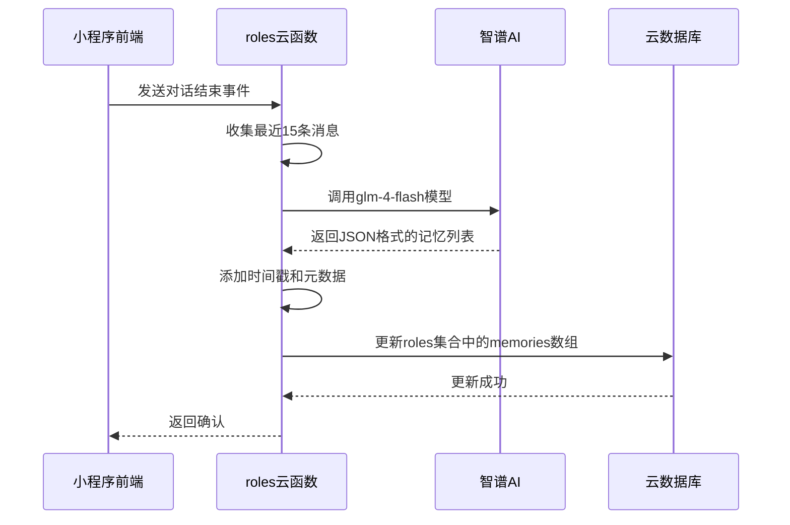
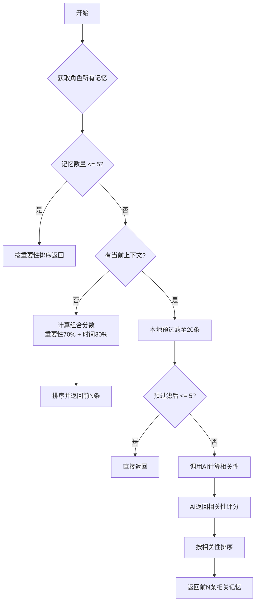
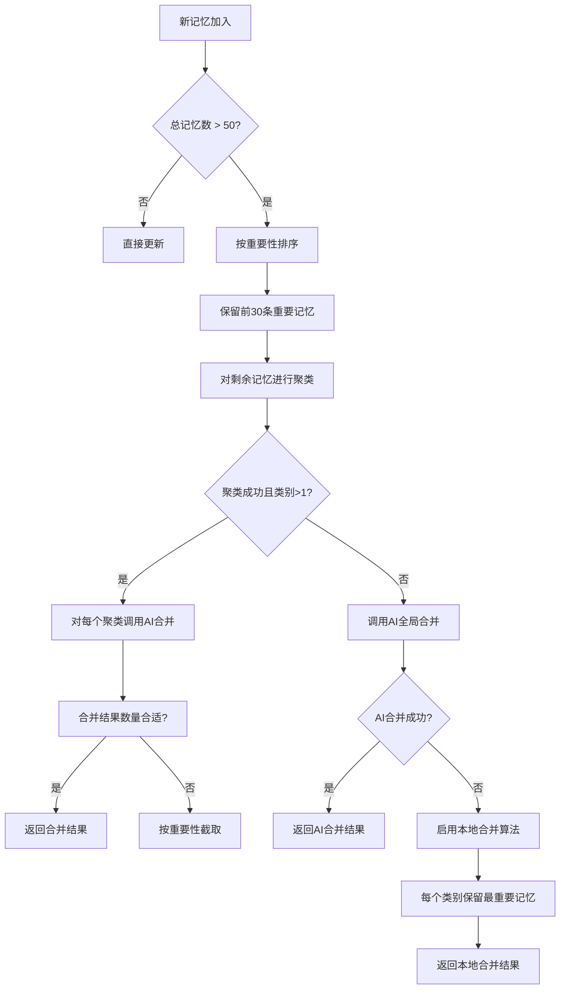

# 记忆系统

<cite>
**本文档引用文件**  
- [memoryManager.js](file://cloudfunctions/roles/memoryManager.js)
- [roles.md](file://doc/开发文档/database/roles.md)
- [数据库设计方案.md](file://doc/开发文档/数据库设计方案.md)
- [角色记忆机制优化.md](file://doc/使用文档/角色记忆机制优化.md)
- [promptGenerator.js](file://cloudfunctions/roles/promptGenerator.js)
- [HeartChat数据库结构图.html](file://doc/设计文档/流程图/html/HeartChat数据库结构图.html)
</cite>

## 目录
1. [引言](#引言)
2. [核心组件](#核心组件)
3. [记忆存储与索引机制](#记忆存储与索引机制)
4. [记忆提取与持久化流程](#记忆提取与持久化流程)
5. [记忆检索与上下文注入](#记忆检索与上下文注入)
6. [记忆容量与合并策略](#记忆容量与合并策略)
7. [记忆衰减与排序算法](#记忆衰减与排序算法)
8. [隐私保护与性能优化](#隐私保护与性能优化)
9. [系统集成与代码示例](#系统集成与代码示例)

## 引言

本技术文档详细阐述了HeartChat项目中AI角色长期记忆系统的实现机制。该系统旨在通过智能化的记忆管理，使AI角色能够持续学习和理解用户，从而提供更加个性化和连贯的对话体验。系统核心功能包括从对话中提取关键信息、将记忆持久化存储于云数据库、在新对话中智能检索并注入相关记忆，以及通过复杂的算法管理记忆的生命周期。本文档将深入解析`memoryManager.js`中的各项关键技术，为开发者提供全面的系统理解和优化指导。

## 核心组件

记忆系统的核心逻辑封装在`cloudfunctions/roles/memoryManager.js`云函数中，主要由以下几个关键组件构成：`extractMemoriesFromChat`用于从对话历史中提取重要信息；`updateRoleMemories`负责将新记忆与角色现有记忆库合并并持久化；`getRelevantMemories`实现基于当前上下文的相关记忆检索；`mergeMemories`和`clusterMemoriesByCategory`等函数则处理记忆的去重、聚类和合并。这些组件协同工作，构成了一个完整的记忆闭环。系统依赖于智谱AI（glm-4-flash）进行语义理解和信息提取，并与`roles`数据库集合紧密交互，以实现记忆的存储和读取。

**Section sources**
- [memoryManager.js](file://cloudfunctions/roles/memoryManager.js#L0-L100)

## 记忆存储与索引机制

记忆数据直接存储在`roles`集合的`memories`字段中，作为角色文档的一个嵌入式数组。这种设计简化了数据访问，避免了跨集合查询的复杂性。每条记忆条目是一个包含多个元数据的JSON对象，其核心结构定义在`doc/开发文档/database/roles.md`中。

```mermaid
erDiagram
roles ||--o{ memories : "包含"
class roles {
_id: String
name: String
memories: Array
}
class memories {
content: String
importance: Number
category: String
timestamp: Date
source: String
}
```

**Diagram sources**
- [roles.md](file://doc/开发文档/database/roles.md#L0-L45)

**Section sources**
- [roles.md](file://doc/开发文档/database/roles.md#L0-L45)
- [HeartChat数据库结构图.html](file://doc/设计文档/流程图/html/HeartChat数据库结构图.html#L0-L663)

## 记忆提取与持久化流程

记忆的提取是一个由AI驱动的自动化过程。当一次对话结束时，系统会调用`extractMemoriesFromChat`函数。该函数首先收集最近的对话消息（最多15条），并将其格式化为一个结构化的文本块。随后，它会调用智谱AI接口，通过一个精心设计的系统提示词（system prompt），引导AI从对话中识别并提取4-6条最重要的信息。



**Diagram sources**
- [memoryManager.js](file://cloudfunctions/roles/memoryManager.js#L106-L137)
- [memoryManager.js](file://cloudfunctions/roles/memoryManager.js#L288-L335)

**Section sources**
- [memoryManager.js](file://cloudfunctions/roles/memoryManager.js#L106-L137)
- [memoryManager.js](file://cloudfunctions/roles/memoryManager.js#L288-L335)

## 记忆检索与上下文注入

在新一轮对话开始时，为了使AI角色“记得”用户，系统会调用`getRelevantMemories`函数进行记忆检索。此过程分为两个阶段：首先进行本地预过滤，通过关键词匹配和简单的评分算法（结合重要性和时间因素）从所有记忆中筛选出最相关的20条。如果当前对话上下文（currentContext）存在，系统会将这20条预筛选的记忆发送给智谱AI，由AI进行更深层次的语义相关性分析，最终返回按相关性排序的前5条记忆。



**Diagram sources**
- [memoryManager.js](file://cloudfunctions/roles/memoryManager.js#L656-L724)
- [memoryManager.js](file://cloudfunctions/roles/memoryManager.js#L724-L752)

**Section sources**
- [memoryManager.js](file://cloudfunctions/roles/memoryManager.js#L656-L752)

## 记忆容量与合并策略

为防止记忆库无限膨胀，系统设定了严格的容量限制。根据`roles.md`文档，每个角色的`memories`数组最多保存50条记忆。当新记忆加入导致总数超过50条时，系统会触发`mergeMemories`合并策略。

该策略首先将所有记忆按重要性降序排列，保留前30条最重要的记忆。对于剩余的20条记忆，系统会尝试进行聚类和合并。聚类算法优先按`category`字段分组，若类别信息不足，则使用`extractKeywords`函数提取关键词进行相似度聚类。随后，系统会调用智谱AI对每个聚类内的记忆进行语义合并，生成更概括、更高质量的记忆摘要。如果AI合并失败，则会启用`localMergeMemories`后备方案，该方案会确保每个类别至少保留一条最重要的记忆。



**Diagram sources**
- [memoryManager.js](file://cloudfunctions/roles/memoryManager.js#L288-L335)
- [memoryManager.js](file://cloudfunctions/roles/memoryManager.js#L331-L368)
- [memoryManager.js](file://cloudfunctions/roles/memoryManager.js#L463-L509)

**Section sources**
- [memoryManager.js](file://cloudfunctions/roles/memoryManager.js#L288-L368)
- [memoryManager.js](file://cloudfunctions/roles/memoryManager.js#L463-L509)
- [roles.md](file://doc/开发文档/database/roles.md#L115-L124)

## 记忆衰减与排序算法

记忆的排序和检索不仅依赖于静态的`importance`评分，还引入了时间衰减因子，以体现“记忆会随时间淡忘”的特性。在`getRelevantMemories`函数中，当没有提供当前上下文时，系统会计算一个组合分数：`最终分数 = (重要性 * 0.7) + (时间分数 * 0.3)`。

时间分数的计算采用了指数衰减函数：`timeScore = Math.exp(-daysSinceCreation / 30)`。这意味着，一条记忆在创建30天后的“时间分数”会衰减到初始值的约37%（1/e），60天后衰减到约14%。这确保了较新的记忆在排序中会获得更高的权重，从而在无上下文的场景下优先被使用。在预过滤阶段，时间因素也以20%的权重参与评分，进一步优化了检索效率。

**Section sources**
- [memoryManager.js](file://cloudfunctions/roles/memoryManager.js#L689-L690)
- [memoryManager.js](file://cloudfunctions/roles/memoryManager.js#L858-L893)

## 隐私保护与性能优化

系统在设计上充分考虑了用户隐私和性能。所有记忆数据都存储在受保护的云数据库中，访问权限由云开发的安全规则严格控制。`roles.md`文档明确指出“记忆数据涉及用户隐私，需要加密存储”，这为未来的安全增强指明了方向。

在性能优化方面，系统采用了多层策略。首先，通过本地预过滤（prefilterMemories）大幅减少了需要调用AI进行相关性分析的记忆数量，降低了API成本和响应延迟。其次，`promptGenerator.js`中的`organizeMemoriesByCategory`函数可以将记忆按类别组织，这为前端展示或更复杂的提示词注入提供了结构化数据。此外，文档中提到的“缓存检索结果（可选，用于性能优化）”表明系统具备进一步优化的潜力。未来优化方向（见`角色记忆机制优化.md`）包括实现记忆过期机制和提供用户可管理的记忆界面。

**Section sources**
- [roles.md](file://doc/开发文档/database/roles.md#L120-L124)
- [角色记忆机制优化.md](file://doc/使用文档/角色记忆机制优化.md#L225-L232)
- [memoryManager.js](file://cloudfunctions/roles/memoryManager.js#L783-L786)
- [promptGenerator.js](file://cloudfunctions/roles/promptGenerator.js#L217-L261)

## 系统集成与代码示例

记忆系统与聊天服务的集成主要通过云函数调用完成。聊天服务在对话结束时，会调用`roles`云函数的`updateRoleMemories`接口来持久化新记忆。在生成AI回复前，会调用`getRelevantMemories`接口获取相关记忆，并通过`promptGenerator.js`将这些记忆以结构化的方式注入到发送给AI模型的提示词（prompt）中。

一个典型的集成流程如下：聊天服务获取到AI回复后，判断是否需要更新记忆（例如，对话包含重要信息）。如果需要，则调用`extractMemoriesFromChat`，然后调用`updateRoleMemories`。当下一次对话开始时，聊天服务在构造请求前，先调用`getRelevantMemories`，并将返回的记忆列表传递给`promptGenerator.js`，最终生成包含用户上下文的完整提示词。

**Section sources**
- [memoryManager.js](file://cloudfunctions/roles/memoryManager.js#L0-L923)
- [promptGenerator.js](file://cloudfunctions/roles/promptGenerator.js#L217-L261)