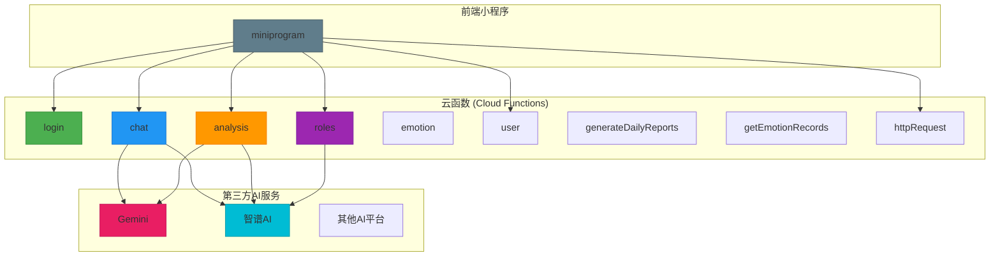
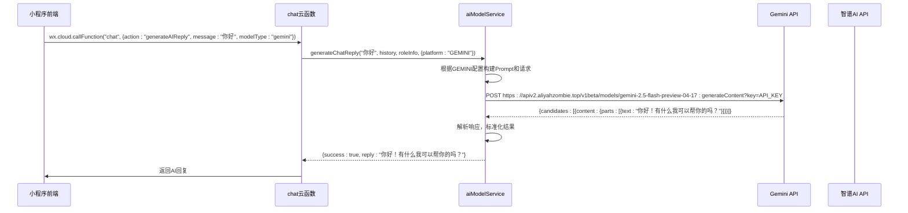
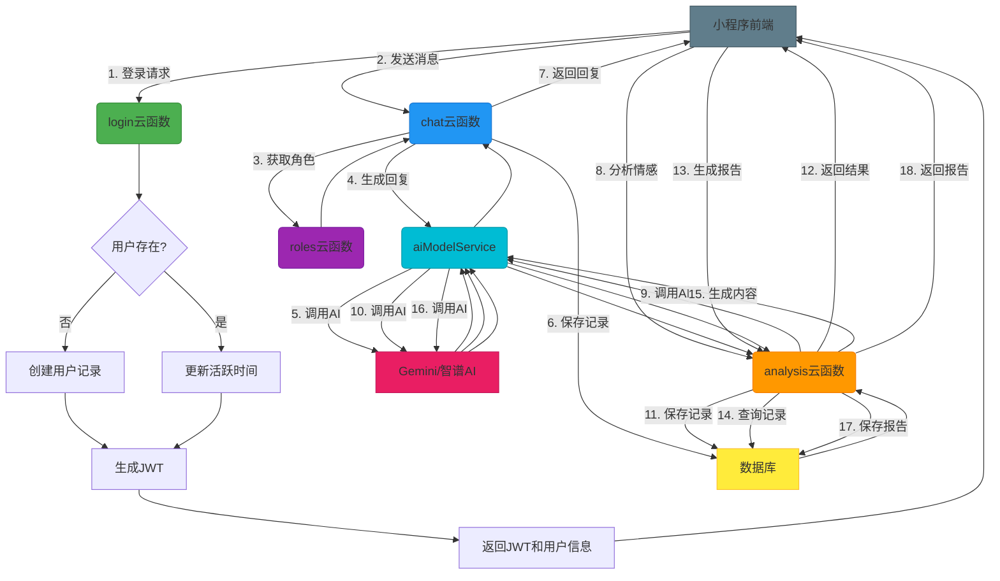

# 后端架构

<cite>
**本文档引用的文件**  
- [login/index.js](file://cloudfunctions/login/index.js)
- [chat/index.js](file://cloudfunctions/chat/index.js)
- [analysis/index.js](file://cloudfunctions/analysis/index.js)
- [roles/index.js](file://cloudfunctions/roles/index.js)
- [analysis/aiModelService.js](file://cloudfunctions/analysis/aiModelService.js)
- [analysis/aiModelService_part2.js](file://cloudfunctions/analysis/aiModelService_part2.js)
- [analysis/aiModelService_part3.js](file://cloudfunctions/analysis/aiModelService_part3.js)
- [chat/aiModelService.js](file://cloudfunctions/chat/aiModelService.js)
- [package.json](file://cloudfunctions/chat/package.json)
- [package.json](file://cloudfunctions/analysis/package.json)
</cite>

## 目录
1. [项目结构](#项目结构)
2. [核心云函数设计模式](#核心云函数设计模式)
3. [统一AI模型服务机制](#统一ai模型服务机制)
4. [云函数间调用与数据流转](#云函数间调用与数据流转)
5. [依赖管理与入口配置](#依赖管理与入口配置)
6. [调试与监控实践](#调试与监控实践)

## 项目结构

HeartChat后端采用云函数（Cloud Functions）架构，所有业务逻辑均以独立的云函数形式部署和运行。每个云函数对应一个特定的业务功能，如用户登录、聊天交互、情感分析、角色管理等。这种设计实现了功能的高内聚与低耦合，便于独立开发、测试和部署。

云函数位于 `cloudfunctions` 目录下，每个子目录（如 `login`, `chat`, `analysis`）代表一个独立的云函数。每个云函数目录包含其自身的 `index.js` 入口文件、`package.json` 依赖配置文件以及实现具体业务逻辑的辅助模块。



**图示来源**
- [cloudfunctions](file://cloudfunctions)

## 核心云函数设计模式

HeartChat的云函数遵循“单一职责”原则，每个函数专注于处理一个明确的业务场景。它们通过 `exports.main` 暴露一个统一的入口，接收前端通过 `wx.cloud.callFunction` 传递的 `event` 和 `context` 参数。在入口函数内部，通过 `event.action` 字段来分发不同的子功能。

### 登录云函数 (login)
`login` 云函数负责处理用户登录逻辑。它接收微信用户信息，检查用户是否为新用户，若为新用户则在数据库中创建基础信息和统计记录；若为老用户则更新其最后活跃时间。最后，它使用 `jsonwebtoken` 生成一个JWT令牌，连同用户信息一并返回给前端，用于后续的鉴权。

**核心流程**:
1.  **参数验证**: 检查 `userInfo` 是否存在。
2.  **用户查找/创建**: 根据 `openid` 查询 `user_base` 集合。
3.  **新用户处理**: 生成唯一 `userId`，创建用户基础信息和统计记录。
4.  **老用户处理**: 更新用户名（仅当为默认名时）和最后活跃时间。
5.  **生成令牌**: 使用 `JWT_SECRET` 签发包含用户信息的JWT。
6.  **记录日志**: 记录登录成功或失败的日志。
7.  **返回结果**: 将令牌和用户信息返回给前端。

**代码片段路径**
- [login/index.js](file://cloudfunctions/login/index.js#L1-L267)

### 聊天云函数 (chat)
`chat` 云函数是聊天功能的核心，提供消息发送、历史记录获取和AI回复生成三大功能。它通过 `event.action` 来区分不同的操作。

**子功能**:
- **`sendMessage`**: 处理用户发送的消息。它会调用 `roles` 云函数获取角色信息，然后调用 `aiModelService` 生成AI回复，并将整个对话记录保存到数据库。
- **`generateAIReply`**: 核心AI回复生成逻辑。它接收用户消息、对话历史和角色信息，调用统一AI模型服务生成回复，并对长回复进行智能分段，模拟真人聊天的节奏。
- **`saveChatHistory`**: 将聊天记录（包括会话元数据和具体消息）保存到 `chats` 和 `messages` 集合中。
- **`getChatHistory`**: 根据 `userId` 或 `chatId` 从数据库中查询并返回聊天历史。

**代码片段路径**
- [chat/index.js](file://cloudfunctions/chat/index.js#L1-L799)

### 情感分析云函数 (analysis)
`analysis` 云函数专注于对用户输入的文本进行深度分析，包括情感识别、关键词提取、用户兴趣分析和每日心情报告生成。它同样通过 `event.action` 分发请求。

**子功能**:
- **`analyzeEmotion`**: 分析文本情感。它调用 `aiModelService.analyzeEmotion` 获取情感类型、强度、关键词和建议，并可选择性地将结果保存到 `emotionRecords` 集合。
- **`extractTextKeywords`**: 从文本中提取关键词。
- **`clusterKeywords`**: 对关键词进行聚类分析。
- **`analyzeUserInterests`**: 分析用户长期兴趣。
- **`generateDailyReport`**: 生成用户每日心情报告。它会聚合当天的情感记录，调用AI生成总结、洞察和建议，并将报告存储在 `userReports` 集合中。

**代码片段路径**
- [analysis/index.js](file://cloudfunctions/analysis/index.js#L1-L799)

### 角色管理云函数 (roles)
`roles` 云函数负责管理聊天角色，包括角色的增删改查、使用统计和记忆管理。

**子功能**:
- **`getRoles` / `getRoleDetail`**: 查询角色列表和详情。
- **`createRole` / `updateRole` / `deleteRole`**: 管理角色的生命周期。
- **`generatePrompt`**: 动态生成角色的系统提示词（Prompt），可融合角色记忆和用户画像。
- **`extractMemories`**: 从对话历史中提取关键信息作为角色的长期记忆。
- **`updateUserPerception`**: 分析并更新用户画像，使角色能更个性化地与用户互动。

**代码片段路径**
- [roles/index.js](file://cloudfunctions/roles/index.js#L1-L758)

## 统一AI模型服务机制

为了支持多种AI模型（如Gemini、智谱AI、OpenAI等）并简化调用，项目设计了 `aiModelService` 模块。该模块位于 `analysis` 和 `chat` 云函数中，实现了统一的AI模型调用接口。

### 设计模式
`aiModelService` 采用**策略模式**和**工厂模式**的结合。它定义了一个统一的接口（如 `analyzeEmotion`, `extractKeywords`），内部根据配置选择不同的AI平台进行调用。

### 核心组件
1.  **`MODEL_PLATFORMS` 配置**: 一个全局对象，定义了所有支持的AI平台（如 `GEMINI`, `ZHIPU`, `OPENAI`）的配置，包括API基础URL、环境变量名、默认模型、认证方式和端点。
2.  **`callModelApi` 函数**: 封装了HTTP请求逻辑，处理不同平台的请求格式差异（如Gemini使用 `contents`，而OpenAI使用 `messages`）、认证头和错误重试（特别是429限流错误）。
3.  **模块化设计**: 为了管理复杂的逻辑，`aiModelService` 被拆分为三个文件：
    -   `aiModelService.js`: 主模块，定义核心配置和情感分析。
    -   `aiModelService_part2.js`: 负责关键词提取和词向量。
    -   `aiModelService_part3.js`: 负责聚类分析和用户兴趣分析。
    这些子模块通过 `init` 函数注入主模块的辅助函数，实现了功能的解耦。

### 调用流程
1.  云函数（如 `chat`）调用 `aiModelService.generateChatReply`。
2.  `aiModelService` 根据 `options.platform` 选择对应的平台配置。
3.  调用 `callModelApi`，根据平台类型构建符合其API规范的请求体。
4.  发送HTTP请求到第三方AI服务。
5.  解析返回的JSON响应，将其标准化为项目内部的统一数据结构。
6.  将结果返回给云函数。



**图示来源**
- [chat/aiModelService.js](file://cloudfunctions/chat/aiModelService.js)
- [analysis/aiModelService.js](file://cloudfunctions/analysis/aiModelService.js)
- [analysis/aiModelService_part2.js](file://cloudfunctions/analysis/aiModelService_part2.js)
- [analysis/aiModelService_part3.js](file://cloudfunctions/analysis/aiModelService_part3.js)

## 云函数间调用与数据流转

HeartChat的云函数并非完全孤立，它们通过 `cloud.callFunction` 进行相互调用，形成一个协同工作的网络。同时，所有云函数共享同一个云数据库，通过数据库集合（Collections）进行数据交换。

### 云函数间调用
- **`chat` 调用 `roles`**: 当用户开始与一个角色聊天时，`chat` 云函数会调用 `roles` 云函数的 `getRoleDetail` 动作来获取该角色的详细信息（如提示词），以确保AI回复符合角色设定。
- **`analysis` 调用 `roles`**: 在生成用户画像时，`analysis` 云函数可能需要获取角色信息。
- **`roles` 调用 `analysis`**: `roles` 云函数在 `updateUserPerceptionFromChat` 中，会利用 `analysis` 云函数的分析能力来理解用户。

### 数据流转路径
1.  **用户登录**: `login` -> 生成JWT -> 前端存储 -> 后续请求携带JWT。
2.  **聊天交互**:
    *   前端 -> `chat` (sendMessage): 发送消息。
    *   `chat` -> `roles` (getRoleDetail): 获取角色信息。
    *   `chat` -> `aiModelService` -> Gemini/智谱AI: 生成AI回复。
    *   `chat` -> 数据库 (`chats`, `messages`): 保存聊天记录。
    *   `chat` -> 前端: 返回AI回复。
3.  **情感分析**:
    *   前端 -> `analysis` (analyzeEmotion): 发送待分析文本。
    *   `analysis` -> `aiModelService` -> Gemini/智谱AI: 获取情感分析结果。
    *   `analysis` -> 数据库 (`emotionRecords`): 保存情感记录。
    *   `analysis` -> 前端: 返回分析结果。
4.  **生成报告**:
    *   前端 -> `analysis` (generateDailyReport): 请求生成报告。
    *   `analysis` -> 数据库 (`emotionRecords`): 查询当天情感记录。
    *   `analysis` -> `aiModelService` -> 智谱AI: 生成报告内容。
    *   `analysis` -> 数据库 (`userReports`): 保存生成的报告。
    *   `analysis` -> 前端: 返回报告。



**图示来源**
- [login/index.js](file://cloudfunctions/login/index.js)
- [chat/index.js](file://cloudfunctions/chat/index.js)
- [analysis/index.js](file://cloudfunctions/analysis/index.js)
- [roles/index.js](file://cloudfunctions/roles/index.js)

## 依赖管理与入口配置

### package.json
每个云函数都有自己的 `package.json` 文件，用于声明其依赖的Node.js包。例如：
-   `chat` 和 `analysis` 云函数都依赖 `axios` 用于HTTP请求。
-   `login` 云函数依赖 `jsonwebtoken` 用于生成JWT令牌。
-   `httpRequest` 云函数也依赖 `axios`。

**代码片段路径**
- [chat/package.json](file://cloudfunctions/chat/package.json)
- [analysis/package.json](file://cloudfunctions/analysis/package.json)

### 入口函数配置
云函数的入口由 `index.js` 文件中的 `exports.main` 定义。在文件顶部，需要初始化云开发环境和数据库连接。

```javascript
const cloud = require('wx-server-sdk');
// 初始化云开发环境
cloud.init({
  env: cloud.DYNAMIC_CURRENT_ENV // 使用云开发环境ID
});
// 初始化数据库
const db = cloud.database();
```

`exports.main` 函数接收 `event` 和 `context` 两个参数。`event` 包含从前端传递的所有数据，`context` 包含调用上下文信息（如 `OPENID`）。通过 `switch (event.action)` 语句，可以将不同的业务逻辑分发到相应的处理函数中。

**代码片段路径**
- [login/index.js](file://cloudfunctions/login/index.js#L6-L10)
- [chat/index.js](file://cloudfunctions/chat/index.js#L6-L9)

## 调试与监控实践

### 日志查看
云函数的 `console.log` 和 `console.error` 输出会被云开发平台捕获。开发者可以在微信开发者工具的“云开发”控制台中，选择对应的云函数，查看其详细的调用日志。这对于排查错误和理解执行流程至关重要。

**最佳实践**:
-   在关键逻辑分支和函数入口处添加 `console.log`。
-   使用 `try-catch` 捕获异常，并使用 `console.error` 记录详细的错误信息。
-   在开发阶段，可以设置 `const isDev = true;` 来开启详细的日志输出。

### 性能监控
-   **调用次数与成功率**: 云开发平台会统计每个云函数的调用次数、成功/失败率和平均执行时间。开发者应关注失败率高的函数。
-   **执行时间**: 云函数有执行时间限制（通常为5-10秒）。应避免在函数内执行耗时过长的同步操作。对于 `aiModelService`，已实现对429错误的重试机制，防止因API限流导致函数失败。
-   **数据库性能**: 频繁的数据库查询会影响性能。确保在 `chats`、`messages` 等集合上为常用查询字段（如 `userId`, `roleId`, `createTime`）创建了索引。

### 调试技巧
1.  **本地模拟**: 在微信开发者工具中，可以使用“云函数模拟器”在本地测试云函数，无需部署。
2.  **分步调试**: 在 `index.js` 的 `exports.main` 函数中设置断点，可以逐步执行代码，观察变量值。
3.  **环境变量**: 将API密钥等敏感信息配置在云开发的环境变量中（如 `ZHIPU_API_KEY`, `GEMINI_API_KEY`），避免硬编码在代码里。
4.  **单元测试**: 对于复杂的逻辑（如 `aiModelService` 的分段算法），可以编写单元测试来验证其正确性。

**代码片段路径**
- [chat/index.js](file://cloudfunctions/chat/index.js#L13-L14)
- [analysis/index.js](file://cloudfunctions/analysis/index.js#L13-L14)