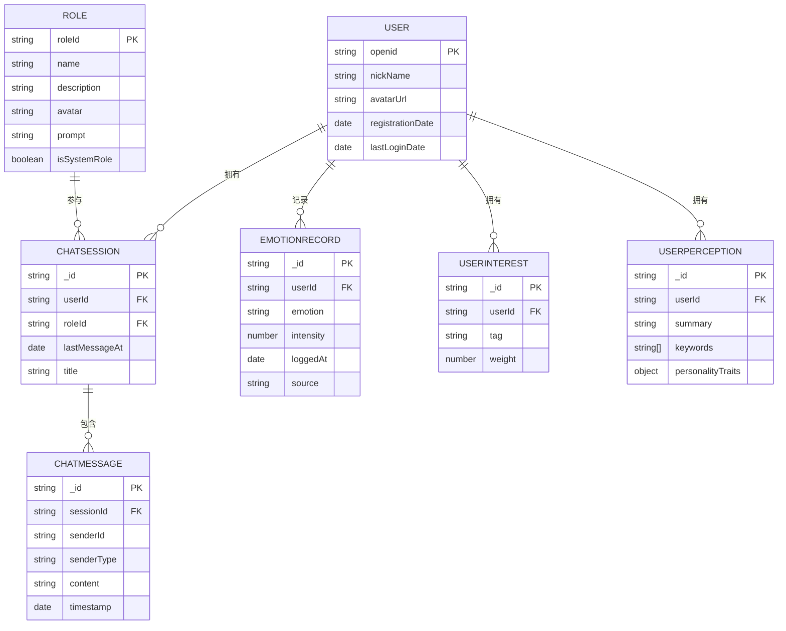
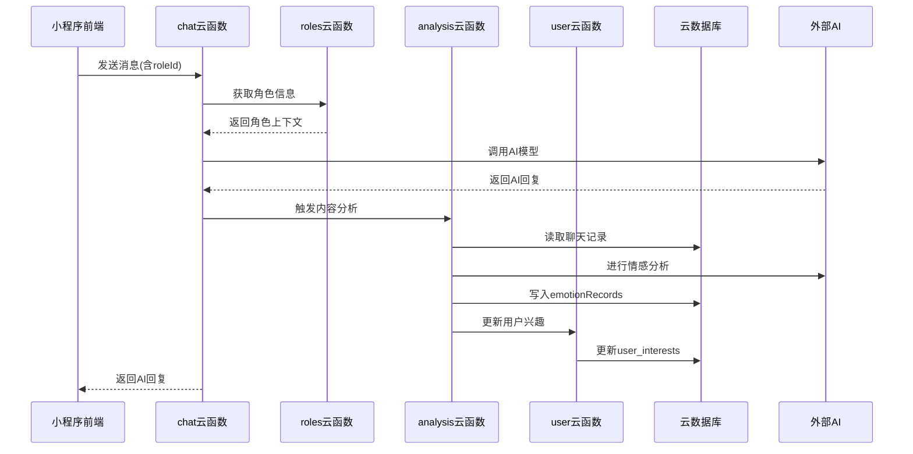
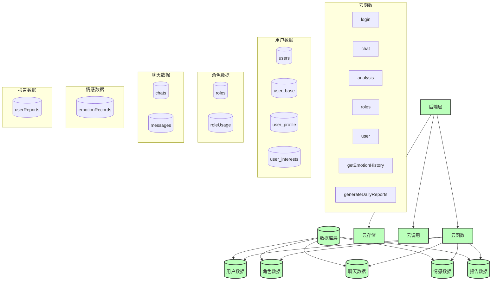

# 后端架构

<cite>
**本文档引用文件**  
- [index.js](file://cloudfunctions/analysis/index.js)
- [aiModelService.js](file://cloudfunctions/analysis/aiModelService.js)
- [keywordClassifier.js](file://cloudfunctions/analysis/keywordClassifier.js)
- [keywordEmotionLinker.js](file://cloudfunctions/analysis/keywordEmotionLinker.js)
- [userInterestAnalyzer.js](file://cloudfunctions/analysis/userInterestAnalyzer.js)
- [index.js](file://cloudfunctions/chat/index.js)
- [geminiModel.js](file://cloudfunctions/chat/geminiModel.js)
- [bigmodel.js](file://cloudfunctions/chat/bigmodel.js)
- [index.js](file://cloudfunctions/user/index.js)
- [createIndexes.js](file://cloudfunctions/user/createIndexes.js)
- [userInterests.js](file://cloudfunctions/user/userInterests.js)
- [userPerception_new.js](file://cloudfunctions/user/userPerception_new.js)
- [index.js](file://cloudfunctions/login/index.js)
- [index.js](file://cloudfunctions/roles/index.js)
- [memoryManager.js](file://cloudfunctions/roles/memoryManager.js)
- [promptGenerator.js](file://cloudfunctions/roles/promptGenerator.js)
- [index.js](file://cloudfunctions/emotion/index.js)
- [index.js](file://cloudfunctions/getEmotionRecords/index.js)
- [index.js](file://cloudfunctions/generateDailyReports/index.js)
- [database_design.md](file://doc/设计文档/后端/database_design.md)
- [HeartChat系统架构图.md](file://doc/设计文档/流程图/HeartChat系统架构图.md)
- [数据库设计方案.md](file://doc/开发文档/数据库设计方案.md)
- [model-config.md](file://doc/开发文档/database/model-config.md) - *新增AI模型配置数据库设计*
</cite>

## 更新摘要
**变更内容**  
- 新增“AI模型配置管理”章节，详细描述新增的模型配置数据库设计
- 在“云函数架构设计”和“核心云函数职责与接口”部分补充多模型动态管理相关内容
- 更新“数据库设计与CRUD操作”章节，增加新的数据库集合说明
- 增强源码追踪系统，添加新文件的引用

## 目录
1. [引言](#引言)
2. [云函数架构设计](#云函数架构设计)
3. [核心云函数职责与接口](#核心云函数职责与接口)
4. [数据库设计与CRUD操作](#数据库设计与crud操作)
5. [云函数间调用关系与数据流转](#云函数间调用关系与数据流转)
6. [安全性与权限控制](#安全性与权限控制)
7. [系统架构图](#系统架构图)
8. [AI模型配置管理](#ai模型配置管理)

## 引言
HeartChat 是一个基于微信云开发平台构建的心理健康智能助手小程序，其后端采用云函数（Cloud Functions）作为核心服务单元，结合云数据库实现数据持久化。本文档深入阐述 HeartChat 的后端架构设计，重点分析基于微信云开发的云函数体系，包括各核心云函数（如 analysis、chat、user）的职责边界、服务接口、数据库交互模式以及整体系统架构。

## 云函数架构设计
HeartChat 的后端逻辑完全由部署在微信云开发环境中的云函数构成。这些云函数是独立的、无状态的微服务，通过事件驱动的方式响应来自小程序前端的请求。每个云函数专注于处理特定的业务领域，实现了高内聚、低耦合的设计原则。

云函数主要分为以下几类：
- **用户与认证类**：`login` 负责用户登录与身份验证。
- **聊天交互类**：`chat` 处理所有与AI角色的实时对话逻辑。
- **数据分析类**：`analysis` 负责对聊天内容进行深度分析，提取情绪、关键词和用户兴趣。
- **用户管理类**：`user` 处理用户资料、兴趣标签和用户画像的管理。
- **角色管理类**：`roles` 管理AI角色的配置、记忆和提示词生成。
- **数据查询类**：`getEmotionRecords`、`getRoleInfo` 等提供特定数据的查询接口。
- **定时任务类**：`generateDailyReports` 用于生成用户的每日心情报告。

这种模块化的架构使得系统易于维护、扩展和独立部署。

**Section sources**
- [HeartChat系统架构图.md](file://doc/设计文档/流程图/HeartChat系统架构图.md#L20-L129)
- [数据库设计方案.md](file://doc/开发文档/数据库设计方案.md#L0-L4)

## 核心云函数职责与接口

### analysis 云函数
`analysis` 云函数是 HeartChat 的智能分析引擎，其核心职责是对用户的聊天内容进行多维度分析。

**职责边界**：
- 调用外部AI模型（如Gemini、GLM）进行文本情感分析。
- 使用 `keywordClassifier.js` 对聊天内容进行关键词分类。
- 通过 `keywordEmotionLinker.js` 建立关键词与情绪之间的关联。
- 利用 `userInterestAnalyzer.js` 分析并更新用户的兴趣标签。
- 生成详细的分析报告，并将结果写入数据库。

**服务接口**：
- 主要入口为 `index.js`，接收包含聊天内容的请求。
- 提供统一的AI模型服务接口（`aiModelService.js`），封装了与不同AI提供商的交互细节。
- 输出结构化的分析结果，包括情绪标签、关键词列表、兴趣倾向等。

**Section sources**
- [index.js](file://cloudfunctions/analysis/index.js)
- [aiModelService.js](file://cloudfunctions/analysis/aiModelService.js)
- [keywordClassifier.js](file://cloudfunctions/analysis/keywordClassifier.js)
- [keywordEmotionLinker.js](file://cloudfunctions/analysis/keywordEmotionLinker.js)
- [userInterestAnalyzer.js](file://cloudfunctions/analysis/userInterestAnalyzer.js)

### chat 云函数
`chat` 云函数负责处理用户与AI角色之间的实时对话。

**职责边界**：
- 接收用户发送的聊天消息。
- 根据 `roles` 云函数提供的角色信息和提示词，构造AI模型的输入。
- 调用 `geminiModel.js` 或 `bigmodel.js` 与外部AI服务进行交互。
- 将AI的回复进行处理后返回给前端。
- 触发 `analysis` 云函数对本次对话进行分析。

**服务接口**：
- 入口 `index.js` 接收 `roleId` 和 `message` 参数。
- 返回AI生成的回复文本。
- 与 `roles` 云函数协同工作，获取角色的上下文和记忆。

**Section sources**
- [index.js](file://cloudfunctions/chat/index.js)
- [geminiModel.js](file://cloudfunctions/chat/geminiModel.js)
- [bigmodel.js](file://cloudfunctions/chat/bigmodel.js)

### user 云函数
`user` 云函数是用户数据管理的核心，负责维护用户相关的所有信息。

**职责边界**：
- 管理 `user_profile`、`user_interests` 等集合的CRUD操作。
- 执行 `createIndexes.js` 脚本，为数据库集合创建必要的索引以优化查询性能。
- 分析和更新 `userPerception`（用户画像）。
- 提供用户数据的查询和更新接口。

**服务接口**：
- 支持创建、读取、更新和删除用户资料。
- 提供批量操作用户兴趣标签的接口。
- 包含初始化数据库索引的管理接口。

**Section sources**
- [index.js](file://cloudfunctions/user/index.js)
- [createIndexes.js](file://cloudfunctions/user/createIndexes.js)
- [userInterests.js](file://cloudfunctions/user/userInterests.js)
- [userPerception_new.js](file://cloudfunctions/user/userPerception_new.js)

### login 云函数
`login` 云函数是系统的安全入口，负责用户的身份验证。

**职责边界**：
- 处理用户的登录请求，通常与微信登录服务集成。
- 验证用户的 `openid` 和会话密钥。
- 生成并返回自定义登录态（token），用于后续API调用的身份验证。
- 在用户首次登录时，初始化其用户数据记录。

**服务接口**：
- 接收微信登录凭证（code）。
- 返回包含用户信息和登录态的响应。

**Section sources**
- [index.js](file://cloudfunctions/login/index.js)

## 数据库设计与CRUD操作

### 实体关系模型
HeartChat 采用云开发提供的NoSQL文档型数据库，其核心实体关系模型如下：
- **用户 (User)** 与 **角色 (Role)** 通过 **聊天会话 (ChatSession)** 关联。
- 一个 **聊天会话** 包含多条 **聊天消息 (ChatMessage)**。
- 用户的情绪记录 (**EmotionRecord**) 可以来源于聊天分析或手动输入。
- 系统通过分析用户的聊天内容，生成 **用户兴趣 (UserInterest)** 和 **用户画像 (UserPerception)**。

**Diagram sources**
- [数据库设计方案.md](file://doc/开发文档/数据库设计方案.md#L20-L233)

### 索引策略
为了保证查询性能，系统在关键字段上建立了索引：
- **单字段索引**：`Users.openid`、`ChatSessions.userId`、`ChatMessages.sessionId`、`EmotionRecords.userId` 等。
- **复合索引**：`{ userId: 1, lastMessageAt: -1 }` 用于高效获取用户的会话列表；`{ sessionId: 1, timestamp: -1 }` 用于按时间倒序获取聊天记录。

索引的创建由 `cloudfunctions/user/createIndexes.js` 脚本统一管理，确保数据库性能的基石。

**Section sources**
- [createIndexes.js](file://cloudfunctions/user/createIndexes.js)
- [数据库设计方案.md](file://doc/开发文档/数据库设计方案.md#L207-L220)

## 云函数间调用关系与数据流转
HeartChat 的云函数通过明确的调用关系协同工作，形成一个高效的数据处理流水线。

1.  **用户登录**：`login` 云函数验证身份后，返回登录态。
2.  **发起聊天**：`chat` 云函数接收用户消息，调用 `roles` 云函数获取角色上下文，然后调用外部AI服务生成回复。
3.  **分析内容**：`chat` 云函数在收到AI回复后，触发 `analysis` 云函数对本次对话内容进行分析。
4.  **更新用户数据**：`analysis` 云函数将分析结果（如情绪、关键词）写入 `emotionRecords` 集合，并调用 `user` 云函数更新 `user_interests` 和 `userPerception`。
5.  **查询数据**：前端通过 `getEmotionRecords` 云函数查询用户的情绪历史，该函数直接从 `emotionRecords` 集合读取数据。
6.  **生成报告**：定时触发的 `generateDailyReports` 云函数会聚合 `emotionRecords` 和 `user_interests` 等数据，生成每日报告并存入 `userReports` 集合。

**Diagram sources**
- [index.js](file://cloudfunctions/chat/index.js)
- [index.js](file://cloudfunctions/roles/index.js)
- [index.js](file://cloudfunctions/analysis/index.js)
- [index.js](file://cloudfunctions/user/index.js)

## 安全性与权限控制
HeartChat 的后端架构将安全性置于核心位置。

**登录验证**：
- `login` 云函数是所有API调用的前置关卡，强制要求用户先通过微信身份验证。
- 成功登录后颁发的自定义登录态（token）必须在后续所有云函数调用中携带，由云函数内部进行校验。

**权限控制**：
- 严格遵循云开发数据库的权限规则，确保用户只能访问和修改属于自己的数据。例如，任何对 `chats` 或 `emotionRecords` 集合的查询都必须包含 `userId` 作为过滤条件。
- 云函数代码中对所有来自客户端的输入数据进行严格的合法性校验，防止XSS和注入攻击。
- API接口实施频率限制和防刷机制，保护后端服务免受滥用。

**Section sources**
- [index.js](file://cloudfunctions/login/index.js)
- [数据库设计方案.md](file://doc/开发文档/数据库设计方案.md#L222-L233)

## 系统架构图
下图展示了 HeartChat 的整体系统架构，清晰地呈现了前端、后端云函数、数据库以及外部服务之间的交互关系。

**Diagram sources**
- [HeartChat系统架构图.md](file://doc/设计文档/流程图/HeartChat系统架构图.md#L70-L129)

## AI模型配置管理
为实现AI模型的动态管理和智能选择，系统新增了AI模型配置数据库设计，支持多模型平台的灵活切换和监控。

### 数据库集合设计
新增三个核心集合用于管理AI模型配置：

**1. modelPlatforms（模型平台表）**
- 存储AI模型提供商的基础信息，如API地址、认证方式等。
- 关键字段：`platformKey`（平台键名，如ZHIPU、GEMINI）、`baseUrl`（API基础地址）、`apiKeyEnv`（API密钥环境变量名）。

**2. modelConfigs（模型配置表）**
- 存储具体的AI模型配置，包括模型能力、定价、限制等。
- 关键字段：`capabilities`（支持能力：chat、reasoning、coding等）、`pricing`（定价信息）、`isDefault`（是否为默认模型）。

**3. modelUsageStats（模型使用统计表）**
- 记录模型的使用情况和性能统计数据。
- 关键字段：`usageCount`（使用次数）、`totalCost`（总成本）、`avgResponseTime`（平均响应时间）。

**Section sources**
- [model-config.md](file://doc/开发文档/database/model-config.md) - *新增AI模型配置数据库设计*

### 云函数接口
通过`modelConfig`云函数提供模型配置的CRUD操作和统计功能：
- `getPlatforms`: 获取可用的模型平台列表
- `getConfigs`: 获取模型配置列表
- `getRecommendedModels`: 根据用户需求获取推荐模型
- `updateUsage`: 更新模型使用统计

### 动态模型选择
系统支持根据多种因素进行智能模型选择：
- **成本考量**：根据输入/输出token单价选择经济高效的模型
- **能力匹配**：根据任务需求（如coding、analysis）选择具备相应能力的模型
- **性能指标**：优先选择响应时间短、错误率低的模型
- **用户偏好**：尊重用户的模型选择偏好

### 多模型集成实现
前端通过`modelService.js`模块实现模型管理：
- `getAvailableModelTypes()`: 获取所有可用模型类型
- `setSelectedModelType(modelType)`: 设置当前模型
- `testModelConnection(modelType)`: 测试模型连接状态
- `getModelList(modelType)`: 获取特定平台的模型列表

**Section sources**
- [modelService.js](file://miniprogram/services/modelService.js)
- [chat.md](file://doc/开发文档/cloudfunctions/chat.md)
- [统一AI模型服务设计文档.md](file://doc/开发文档/统一AI模型服务设计文档.md)