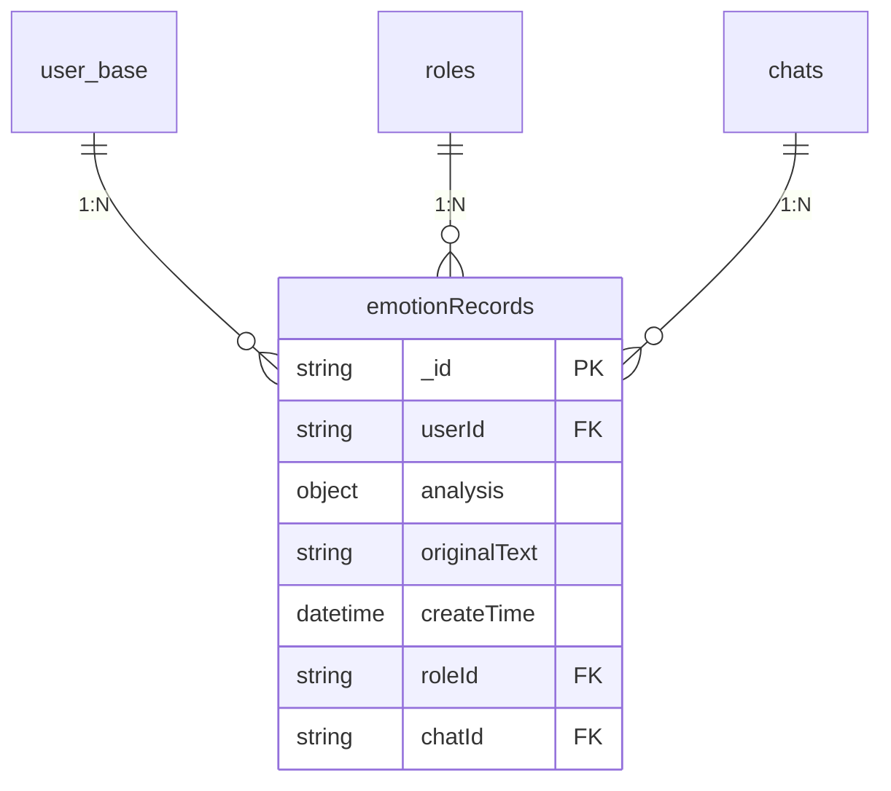
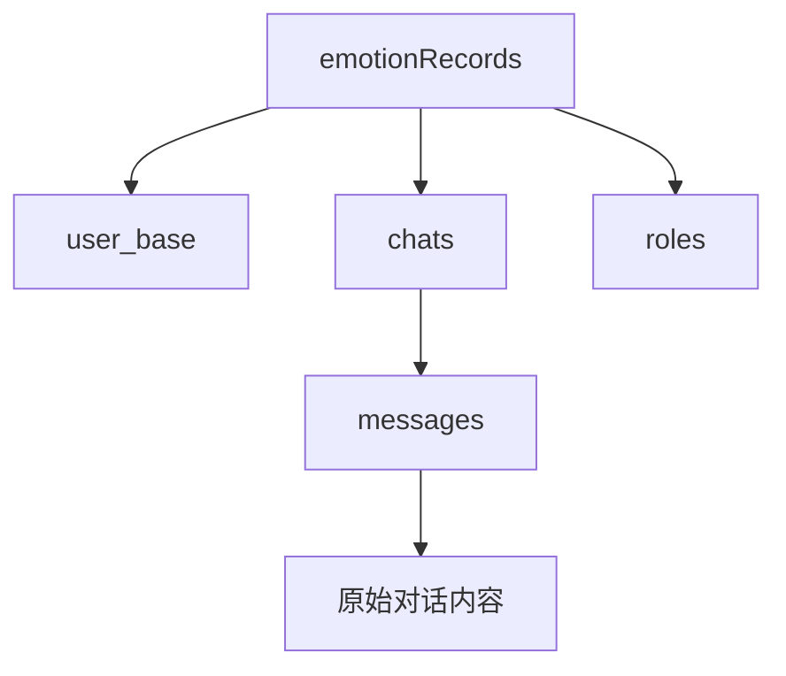
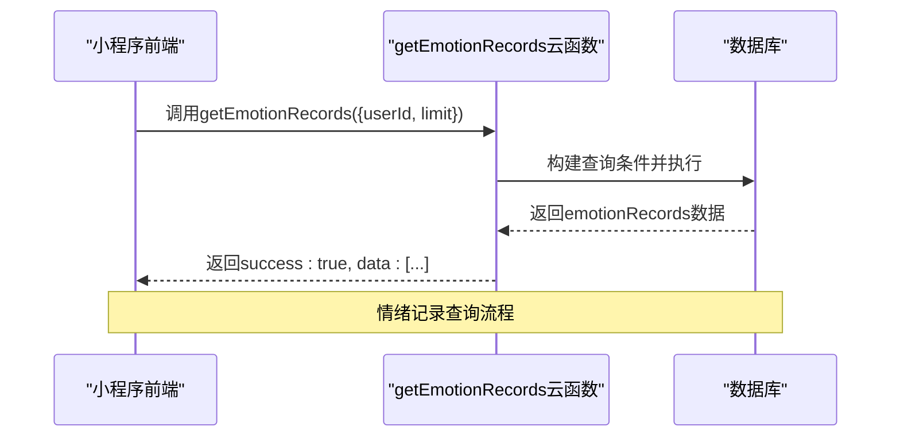

# emotionRecords集合

<cite>
**本文档引用的文件**  
- [emotionRecords.md](file://doc/开发文档/database/emotionRecords.md)
- [getEmotionRecords/index.js](file://cloudfunctions/getEmotionRecords/index.js)
- [emotion/index.js](file://cloudfunctions/emotion/index.js)
</cite>

## 目录
1. [简介](#简介)
2. [集合结构](#集合结构)
3. [核心功能与应用场景](#核心功能与应用场景)
4. [数据关联机制](#数据关联机制)
5. [典型查询模式](#典型查询模式)
6. [数据写入与存储增长分析](#数据写入与存储增长分析)
7. [索引优化与归档建议](#索引优化与归档建议)
8. [隐私保护与访问控制](#隐私保护与访问控制)
9. [结论](#结论)

## 简介

`emotionRecords`集合是HeartChat系统中用于持久化用户情绪分析结果的核心数据表。该集合记录了用户在聊天过程中的情绪状态，包括情绪类型、强度、维度分析、关键词提取等信息，作为情绪历史页面和每日心情报告的数据来源。通过该集合，系统能够追踪用户的情绪变化轨迹，支持心理健康监控与个性化心理干预。

**Section sources**  
- [emotionRecords.md](file://doc/开发文档/database/emotionRecords.md#L1-L10)

## 集合结构

`emotionRecords`集合采用嵌套文档结构设计，包含用户标识、情绪分析结果、原始文本、创建时间及关联信息等字段。其核心字段如下：

- `_id`：记录唯一标识符
- `userId`：用户ID，关联用户基础信息
- `analysis`：情绪分析结果对象，包含主情绪、次情绪、情感效价、唤醒度、雷达图维度等
- `originalText`：用于分析的原始文本内容
- `createTime`：记录创建时间戳
- `roleId`：关联角色ID（可选）
- `chatId`：关联聊天会话ID（可选）

该结构支持多维情绪建模，涵盖积极、中性与消极三大类共13种情绪类型，并通过雷达图维度（信任度、开放度、抵抗度、压力度、控制度）实现精细化情绪刻画。



**Diagram sources**  
- [emotionRecords.md](file://doc/开发文档/database/emotionRecords.md#L13-L111)

**Section sources**  
- [emotionRecords.md](file://doc/开发文档/database/emotionRecords.md#L13-L111)

## 核心功能与应用场景

`emotionRecords`集合在系统中承担三大核心功能：

1. **情绪历史追踪**：记录用户长期情绪变化趋势，支持按日、周、月维度展示情绪波动。
2. **个性化报告生成**：为`generateDailyReports`云函数提供数据源，生成每日心情报告。
3. **心理健康监控**：识别持续负面情绪模式，触发系统预警或建议干预。

典型应用场景包括：
- 情绪历史页面展示用户过去30天情绪变化曲线
- ECharts组件基于`emotionRecords`数据生成情绪分布饼图
- 每日心情报告自动汇总当日主要情绪与关键词
- 用户画像系统结合情绪数据优化角色交互策略

**Section sources**  
- [emotionRecords.md](file://doc/开发文档/database/emotionRecords.md#L90-L100)

## 数据关联机制

`emotionRecords`通过外键机制与多个核心集合建立关联，形成完整的情绪溯源链：

- **与`user_base`关联**：通过`userId`字段建立多对一关系，确保情绪记录归属明确。
- **与`chats`集合关联**：通过`chatId`字段追溯情绪产生的具体聊天会话，支持回溯上下文。
- **与`roles`集合关联**：通过`roleId`字段分析不同角色交互下的情绪差异。

此关联机制使得系统可实现“情绪→聊天记录→原始消息”的全链路追溯，增强数据分析的可解释性。



**Diagram sources**  
- [emotionRecords.md](file://doc/开发文档/database/emotionRecords.md#L70-L80)

**Section sources**  
- [emotionRecords.md](file://doc/开发文档/database/emotionRecords.md#L70-L80)

## 典型查询模式

系统通过云函数实现对`emotionRecords`的标准化查询，主要模式包括：

### 按用户ID拉取最近记录
用于情绪概览页面，获取用户最近7天情绪数据：
```js
db.collection('emotionRecords')
  .where({ userId: 'xxx', createTime: _.gte(oneWeekAgo) })
  .orderBy('createTime', 'desc')
  .get()
```

### 按时间范围拉取历史数据
用于ECharts可视化展示，获取指定天数内的情绪变化：
```js
db.collection('emotionRecords')
  .where({ userId: 'xxx', createTime: _.gte(startDate) })
  .orderBy('createTime', 'asc')
  .limit(100)
  .get()
```

### 多条件组合查询
支持按用户+角色组合筛选，分析特定角色交互下的情绪表现：
```js
db.collection('emotionRecords')
  .where({ userId: 'xxx', roleId: 'role_001' })
  .orderBy('createTime', 'desc')
  .limit(20)
  .get()
```

上述查询由`getEmotionRecords`和`emotion`两个云函数封装，确保查询逻辑统一且安全。



**Diagram sources**  
- [getEmotionRecords/index.js](file://cloudfunctions/getEmotionRecords/index.js#L1-L112)
- [emotion/index.js](file://cloudfunctions/emotion/index.js#L1-L265)

**Section sources**  
- [getEmotionRecords/index.js](file://cloudfunctions/getEmotionRecords/index.js#L1-L112)
- [emotion/index.js](file://cloudfunctions/emotion/index.js#L1-L265)

## 数据写入与存储增长分析

`emotionRecords`的数据写入由`analysis`云函数在每次聊天分析完成后触发，写入频率取决于用户活跃度：

- **写入频率**：平均每位活跃用户每日产生3-5条记录
- **单条记录大小**：约1.2KB（含文本与结构化数据）
- **年增长预估**：1万用户规模下，年新增数据约13.5GB

考虑到情绪数据的时效性，长期保留所有记录可能导致查询性能下降。建议实施分级存储策略，将超过1年的历史数据归档至低成本存储。

**Section sources**  
- [emotionRecords.md](file://doc/开发文档/database/emotionRecords.md#L105-L110)

## 索引优化与归档建议

为保障查询性能，建议建立以下索引：

- **复合索引**：`userId + createTime`（降序），支持按用户时间线快速检索
- **单字段索引**：`analysis.type`，加速情绪类型统计
- **复合索引**：`roleId + createTime`，支持角色维度分析
- **复合索引**：`chatId + createTime`，支持会话级情绪回溯

数据归档策略建议：
1. **自动归档**：每月定时将超过365天的记录迁移至归档表
2. **聚合存储**：对归档数据按月生成情绪统计摘要，保留分析价值
3. **索引维护**：定期重建索引以优化查询效率

**Section sources**  
- [emotionRecords.md](file://doc/开发文档/database/emotionRecords.md#L50-L60)

## 隐私保护与访问控制

`emotionRecords`包含敏感情绪数据，系统实施严格的安全策略：

- **访问控制**：仅允许用户本人及其授权角色访问其情绪记录
- **身份验证**：所有云函数调用均校验`openid`，防止越权访问
- **数据加密**：敏感字段在传输与存储过程中加密处理
- **审计日志**：记录所有情绪数据访问行为，支持安全审计

在`getEmotionRecords`云函数中，明确校验`userId`参数并绑定`openid`，确保数据隔离：
```js
if (!userId) {
  return { success: false, error: '缺少必要参数: userId' }
}
// 查询条件强制绑定用户身份
.where({ userId: userId })
```

**Section sources**  
- [getEmotionRecords/index.js](file://cloudfunctions/getEmotionRecords/index.js#L15-L30)
- [emotionRecords.md](file://doc/开发文档/database/emotionRecords.md#L110-L112)

## 结论

`emotionRecords`集合作为HeartChat系统的情绪数据中枢，实现了从单次聊天分析到长期情绪追踪的闭环。其结构化设计支持多维情绪建模，外键关联机制保障了数据可追溯性，标准化查询接口为前端可视化提供稳定支撑。未来可通过引入数据生命周期管理、增强加密机制、优化聚合查询等方式进一步提升系统性能与安全性。