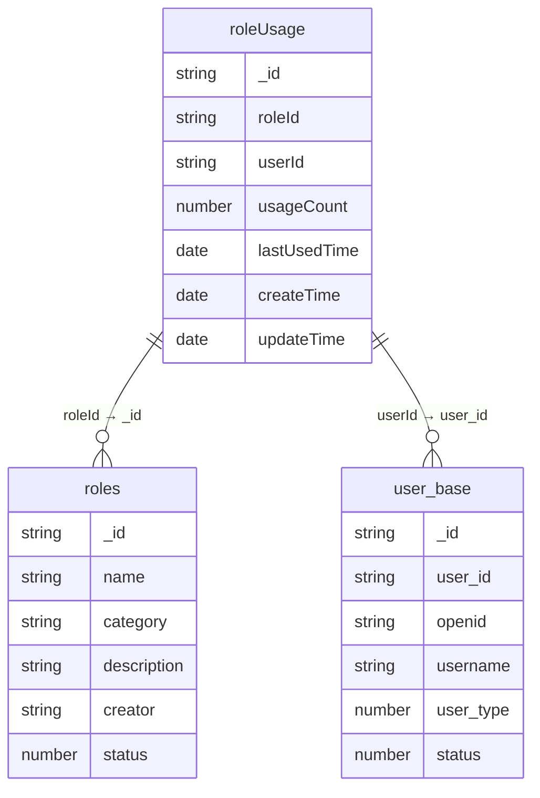

# roleUsage集合

<cite>
**本文档中引用的文件**  
- [roleUsage.md](file://doc/开发文档/database/roleUsage.md)
- [roles.md](file://doc/开发文档/database/roles.md)
- [user_base.md](file://doc/开发文档/database/user_base.md)
- [roles.js](file://cloudfunctions/roles/index.js)
- [roles.md](file://doc/开发文档/cloudfunctions/roles.md)
</cite>

## 目录
1. [引言](#引言)
2. [设计目的](#设计目的)
3. [实现方式](#实现方式)
4. [数据聚合与更新策略](#数据聚合与更新策略)
5. [关联关系](#关联关系)
6. [数据分析支持](#数据分析支持)
7. [角色热度排行榜查询示例](#角色热度排行榜查询示例)
8. [数据库性能影响与优化建议](#数据库性能影响与优化建议)
9. [结论](#结论)

## 引言
roleUsage集合是HeartChat系统中用于记录用户对AI角色使用行为的核心数据表。它通过统计每个用户对各个角色的使用频次、最后使用时间等关键指标，为角色推荐系统和产品迭代分析提供数据支持。该集合的设计充分考虑了高并发写入场景下的性能需求，并通过合理的索引策略和更新机制确保数据的准确性和实时性。

## 设计目的
roleUsage集合的主要设计目的是全面记录用户与AI角色的交互行为，为系统的智能化运营提供数据基础。具体目标包括：

1. **行为数据统计**：精确记录每个用户对每个AI角色的使用次数和最近使用时间，形成完整的用户行为画像。
2. **个性化推荐支持**：基于使用频次和时间戳数据，构建个性化角色推荐算法，提升用户体验。
3. **产品迭代分析**：通过分析不同角色的受欢迎程度和使用模式，指导产品功能优化和新角色开发。
4. **用户偏好洞察**：结合使用频率和时间分布，深入理解用户偏好和使用习惯，为精细化运营提供依据。

该集合的设计充分体现了数据驱动的产品理念，将用户行为转化为可量化的指标，为系统的持续优化提供坚实的数据支撑。

**Section sources**
- [roleUsage.md](file://doc/开发文档/database/roleUsage.md#L1-L10)

## 实现方式
roleUsage集合通过MongoDB文档结构实现，每个文档代表一个用户对特定角色的使用统计记录。集合的字段结构经过精心设计，确保既能满足当前业务需求，又具备良好的扩展性。

### 字段结构
```javascript
{
  _id: "统计记录ID",                // string, 主键，自动生成
  roleId: "角色ID",                  // string, 关联roles表
  userId: "用户ID",                  // string, 关联user_base表
  usageCount: 0,                    // number, 使用次数
  lastUsedTime: "最后使用时间",       // date, 最后使用时间
  createTime: "创建时间",            // date, 统计记录创建时间
  updateTime: "更新时间"             // date, 统计记录更新时间
}
```

### 索引策略
为优化查询性能，集合建立了多个索引：
- **复合唯一索引**：roleId + userId，确保每个用户-角色组合的唯一性
- **复合索引**：userId + usageCount（降序），支持按用户维度查询最常使用的角色
- **复合索引**：roleId + usageCount（降序），支持构建角色热度排行榜
- **复合索引**：lastUsedTime，支持按时间范围查询最近活跃的角色
- **复合索引**：userId + lastUsedTime，支持分析用户的使用时间模式

**Section sources**
- [roleUsage.md](file://doc/开发文档/database/roleUsage.md#L12-L53)

## 数据聚合与更新策略
roleUsage集合的数据聚合在每次用户与AI角色交互时触发，确保统计数据的实时性和准确性。更新策略采用原子性递增操作，保证在高并发场景下的数据一致性。

### 触发时机
数据聚合的触发时机主要在用户开始使用某个AI角色时，具体包括：
1. 用户选择角色进入聊天界面
2. 用户重新启动与某个角色的对话
3. 系统自动恢复之前的对话会话

### 更新流程
更新流程通过云函数`updateRoleUsage`实现，具体步骤如下：
1. **参数验证**：检查roleId和userId的有效性
2. **记录查询**：根据roleId和userId查询是否存在现有统计记录
3. **记录更新**：如果存在记录，则使用原子性递增操作将usageCount加1，并更新lastUsedTime和updateTime
4. **记录创建**：如果不存在记录，则创建新记录，初始化usageCount为1，并设置createTime、lastUsedTime和updateTime

```javascript
// 原子性递增操作示例
await db.collection('roleUsage').doc(usageId).update({
  data: {
    usageCount: _.inc(1),  // 使用次数+1
    lastUsedTime: db.serverDate(),
    updateTime: db.serverDate()
  }
});
```

这种更新策略确保了即使在高并发场景下，多个用户同时更新同一记录也不会导致数据丢失或错误。

**Section sources**
- [roleUsage.md](file://doc/开发文档/database/roleUsage.md#L55-L59)
- [roles.js](file://cloudfunctions/roles/index.js#L365-L471)

## 关联关系
roleUsage集合通过外键与roles和user_base集合建立关联关系，形成完整的数据关联网络，支持多维度的数据分析。

### 多对一关联
- **roleUsage.roleId → roles._id**：每个使用统计记录关联到一个具体的AI角色，通过roleId字段实现。这种关联使得可以获取角色的详细信息，如名称、分类、描述等，丰富统计分析的维度。
- **roleUsage.userId → user_base.user_id**：每个使用统计记录关联到一个具体的用户，通过userId字段实现。这种关联使得可以获取用户的基础信息，如用户名、用户类型等，支持用户分群分析。

### 数据关联示意图


**Diagram sources**
- [roleUsage.md](file://doc/开发文档/database/roleUsage.md#L40-L45)
- [roles.md](file://doc/开发文档/database/roles.md#L70-L75)
- [user_base.md](file://doc/开发文档/database/user_base.md#L50-L55)

## 数据分析支持
roleUsage集合的设计充分考虑了多维度数据分析的需求，支持按角色或用户维度进行深入的数据挖掘和分析。

### 按角色维度分析
通过roleId字段，可以对特定角色的使用情况进行全面分析：
- **使用频次分析**：统计特定角色的总使用次数，评估其受欢迎程度
- **用户覆盖分析**：统计使用特定角色的用户数量，评估其用户基础
- **活跃度分析**：基于lastUsedTime字段，分析角色的近期活跃情况
- **留存分析**：结合createTime和lastUsedTime，计算用户的留存率

### 按用户维度分析
通过userId字段，可以对特定用户的使用行为进行深入分析：
- **使用偏好分析**：统计用户使用各个角色的频次，识别其偏好角色
- **使用习惯分析**：基于lastUsedTime字段，分析用户的使用时间规律
- **忠诚度分析**：识别长期频繁使用特定角色的忠实用户
- **流失预警分析**：识别长时间未使用任何角色的潜在流失用户

### 联合分析
结合roles和user_base集合，可以进行更深入的联合分析：
- **角色分类分析**：按角色分类（psychology/life/career/emotion）统计使用情况，了解不同类别角色的表现
- **用户类型分析**：按用户类型（普通用户/VIP用户/管理员）分析角色使用偏好
- **创建者分析**：分析系统角色和用户自定义角色的使用差异

**Section sources**
- [roleUsage.md](file://doc/开发文档/database/roleUsage.md#L40-L45)
- [roles.md](file://doc/开发文档/database/roles.md#L70-L75)
- [user_base.md](file://doc/开发文档/database/user_base.md#L50-L55)

## 角色热度排行榜查询示例
基于roleUsage集合的索引设计和数据结构，可以高效地构建角色热度排行榜。以下是一个典型的查询示例：

### 热门角色排行榜（按使用次数）
```javascript
// 查询使用次数最多的前10个角色
db.collection('roleUsage')
  .aggregate([
    {
      $group: {
        _id: "$roleId",
        totalUsage: { $sum: "$usageCount" },
        userCount: { $sum: 1 }
      }
    },
    {
      $lookup: {
        from: "roles",
        localField: "_id",
        foreignField: "_id",
        as: "roleInfo"
      }
    },
    {
      $unwind: "$roleInfo"
    },
    {
      $sort: { totalUsage: -1 }
    },
    {
      $limit: 10
    },
    {
      $project: {
        _id: 0,
        roleId: "$_id",
        roleName: "$roleInfo.name",
        roleCategory: "$roleInfo.category",
        totalUsage: 1,
        userCount: 1,
        creator: "$roleInfo.creator"
      }
    }
  ])
```

### 近期热门角色排行榜（按最近使用时间）
```javascript
// 查询最近7天内最活跃的前10个角色
db.collection('roleUsage')
  .aggregate([
    {
      $match: {
        lastUsedTime: {
          $gte: new Date(Date.now() - 7 * 24 * 60 * 60 * 1000)
        }
      }
    },
    {
      $group: {
        _id: "$roleId",
        recentUsage: { $sum: "$usageCount" },
        activeUsers: { $sum: 1 },
        lastUsed: { $max: "$lastUsedTime" }
      }
    },
    {
      $lookup: {
        from: "roles",
        localField: "_id",
        foreignField: "_id",
        as: "roleInfo"
      }
    },
    {
      $unwind: "$roleInfo"
    },
    {
      $sort: { recentUsage: -1 }
    },
    {
      $limit: 10
    },
    {
      $project: {
        _id: 0,
        roleId: "$_id",
        roleName: "$roleInfo.name",
        roleCategory: "$roleInfo.category",
        recentUsage: 1,
        activeUsers: 1,
        lastUsed: 1
      }
    }
  ])
```

### 用户个性化推荐查询
```javascript
// 为特定用户推荐可能感兴趣的角色
const userId = "1234567";

db.collection('roleUsage')
  .aggregate([
    {
      $match: {
        userId: userId
      }
    },
    {
      $lookup: {
        from: "roles",
        localField: "roleId",
        foreignField: "_id",
        as: "roleInfo"
      }
    },
    {
      $unwind: "$roleInfo"
    },
    {
      $group: {
        _id: null,
        preferredCategories: {
          $addToSet: "$roleInfo.category"
        },
        frequentlyUsed: {
          $push: {
            roleId: "$roleId",
            usageCount: "$usageCount"
          }
        }
      }
    },
    {
      $lookup: {
        from: "roleUsage",
        localField: "preferredCategories",
        foreignField: "roleInfo.category",
        as: "candidateRoles"
      }
    }
  ]);
```

**Section sources**
- [roleUsage.md](file://doc/开发文档/database/roleUsage.md#L40-L45)
- [roles.md](file://doc/开发文档/database/roles.md#L70-L75)

## 数据库性能影响与优化建议
roleUsage集合作为写密集型数据表，在高并发场景下面临着显著的性能挑战。其主要特点和优化建议如下：

### 写密集型特点
1. **高频写入**：每次用户与AI角色交互都会触发写操作，写入频率远高于读取频率
2. **高并发**：大量用户可能同时与不同角色交互，导致并发写入压力
3. **原子性要求**：usageCount字段的递增操作必须保证原子性，避免数据竞争
4. **索引维护成本**：频繁的写操作需要同步更新多个索引，增加数据库负载

### 性能影响
1. **写入延迟**：在高并发场景下，写入操作可能出现延迟，影响用户体验
2. **锁竞争**：频繁的写操作可能导致文档级或集合级锁竞争
3. **索引膨胀**：大量写操作可能导致索引碎片化，影响查询性能
4. **存储成本**：随着数据量增长，存储成本和备份恢复时间不断增加

### 优化建议
#### 分库分表策略
1. **按用户ID哈希分表**：将roleUsage集合按userId的哈希值分散到多个物理表中，降低单表数据量和写入压力
2. **按时间分片**：将历史数据按月或按季度归档到不同的表中，保持主表数据量在可控范围内
3. **读写分离**：将统计查询操作路由到只读副本，减轻主库的查询压力

#### 冷热数据分离
1. **热数据存储**：将最近3-6个月的活跃数据存储在高性能SSD存储中，确保高频访问的性能
2. **冷数据归档**：将超过6个月的历史数据迁移到低成本的对象存储中，定期备份
3. **分层查询**：查询时优先访问热数据层，必要时再查询冷数据层进行补充

#### 其他优化措施
1. **批量更新**：在非实时性要求的场景下，采用批量更新策略，减少数据库交互次数
2. **缓存层**：引入Redis等缓存系统，缓存热门角色的统计信息，减少数据库查询
3. **异步处理**：将非关键的统计更新操作放入消息队列异步处理，降低实时写入压力
4. **索引优化**：定期分析查询模式，优化索引策略，删除不必要的索引

**Section sources**
- [roleUsage.md](file://doc/开发文档/database/roleUsage.md#L55-L59)
- [roles.js](file://cloudfunctions/roles/index.js#L365-L471)

## 结论
roleUsage集合作为HeartChat系统中用户行为数据的核心载体，其设计充分考虑了实际业务需求和系统性能要求。通过合理的字段设计、索引策略和更新机制，该集合能够高效地支持角色使用统计、个性化推荐和产品分析等多种应用场景。

集合的写密集型特点要求我们在系统架构设计时充分考虑性能优化，采用分库分表、冷热数据分离等策略应对高并发写入压力。同时，通过与roles和user_base集合的关联，roleUsage集合形成了完整的数据生态，支持多维度的深度分析。

未来，可以进一步丰富roleUsage集合的统计维度，如增加交互时长、满意度评分等指标，为系统提供更全面的用户行为洞察。同时，可以探索更智能的数据聚合策略，如基于机器学习的异常使用检测，进一步提升系统的智能化水平。