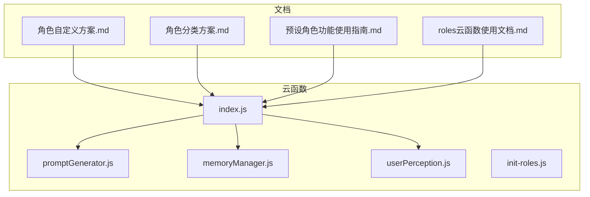
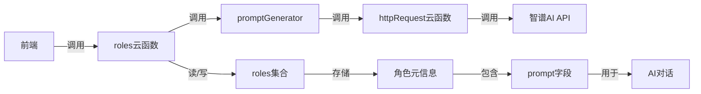
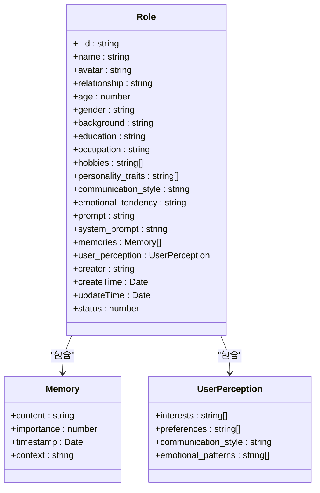
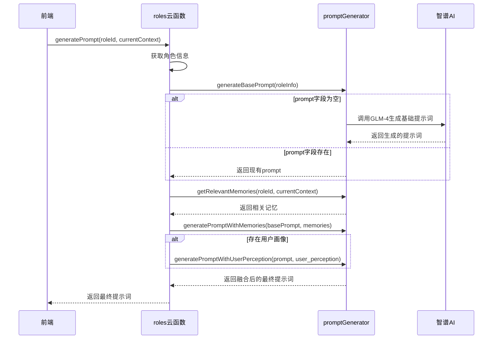
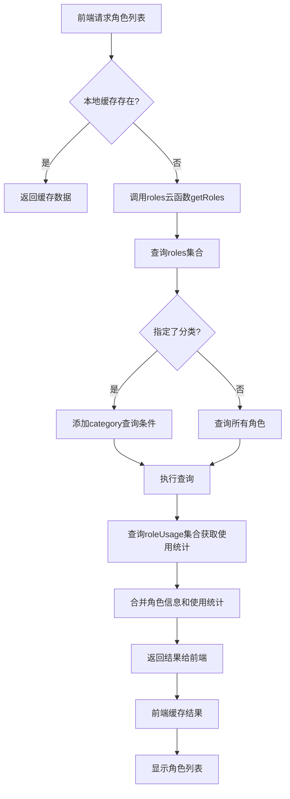
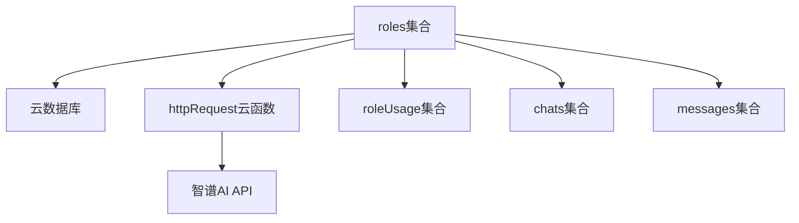

# roles集合

<cite>
**本文档引用文件**  
- [index.js](file://cloudfunctions/roles/index.js)
- [promptGenerator.js](file://cloudfunctions/roles/promptGenerator.js)
- [角色自定义方案.md](file://doc/使用文档/角色自定义方案.md)
- [角色分类方案.md](file://doc/使用文档/角色分类方案.md)
- [预设角色功能使用指南.md](file://doc/使用文档/预设角色功能使用指南.md)
- [roles云函数使用文档.md](file://doc/使用文档/roles云函数使用文档.md)
</cite>

## 目录
1. [引言](#引言)
2. [项目结构](#项目结构)
3. [核心组件](#核心组件)
4. [架构概述](#架构概述)
5. [详细组件分析](#详细组件分析)
6. [依赖分析](#依赖分析)
7. [性能考虑](#性能考虑)
8. [故障排除指南](#故障排除指南)
9. [结论](#结论)

## 引言
`roles`集合是HeartChat系统中角色管理功能的核心数据基石，负责存储所有预设AI角色的元信息。该集合支撑着角色选择、角色编辑与提示词管理等关键功能。本文档系统性地文档化`roles`集合的架构设计，重点说明其数据结构、读多写少特性、缓存机制、查询实践以及与云函数的集成方式。

## 项目结构
`roles`集合相关的代码和文档主要分布在云函数和文档目录中。云函数`roles`是操作该集合的主要入口，而文档则详细描述了其设计和使用方法。

**图示来源**
- [index.js](file://cloudfunctions/roles/index.js)
- [promptGenerator.js](file://cloudfunctions/roles/promptGenerator.js)
- [角色自定义方案.md](file://doc/使用文档/角色自定义方案.md)

## 核心组件
`roles`集合的核心组件包括角色元信息的存储结构、云函数操作接口以及提示词生成逻辑。集合中的每个文档代表一个角色，包含角色ID、名称、头像、性格描述、系统提示词（prompt）、所属分类、启用状态等字段。云函数`roles`提供了对这些数据的增删改查操作。

**组件来源**
- [index.js](file://cloudfunctions/roles/index.js#L1-L758)
- [角色自定义方案.md](file://doc/使用文档/角色自定义方案.md#L1-L223)

## 架构概述
`roles`集合的架构设计围绕“数据基石”的定位展开。前端通过云函数与集合交互，实现角色的动态加载和按分类筛选。后端通过`promptGenerator`模块与`promptGenerator`云函数集成，实现结构化提示词的生成。整个系统体现了读多写少的特性，大部分操作是获取角色列表和详情，而创建和更新操作相对较少。

**图示来源**
- [index.js](file://cloudfunctions/roles/index.js#L1-L758)
- [promptGenerator.js](file://cloudfunctions/roles/promptGenerator.js#L1-L324)

## 详细组件分析

### 角色数据结构分析
`roles`集合的数据结构经过精心设计，以支持高度自定义的角色。除了基本的ID、名称、头像外，还包括与用户的关系、年龄、性别、背景故事、教育背景、职业、爱好、性格特点、说话方式、情感倾向等详细字段。`prompt`和`system_prompt`字段用于存储AI的系统提示词，`memories`数组用于存储角色记忆，`user_perception`对象用于存储用户画像。

**图示来源**
- [角色自定义方案.md](file://doc/使用文档/角色自定义方案.md#L1-L223)
- [roles云函数使用文档.md](file://doc/使用文档/roles云函数使用文档.md#L1-L693)

### 提示词生成机制分析
`prompt`字段的结构化设计是`roles`集合的关键特性。`promptGenerator`模块负责生成和维护该字段。当角色创建或更新时，如果`prompt`或`system_prompt`为空，系统会调用智谱AI API，根据角色的详细信息生成一个高质量的提示词。在对话过程中，系统会将角色记忆和用户画像动态地融合到基础提示词中，生成最终的`system_prompt`，从而实现个性化的对话体验。

**图示来源**
- [promptGenerator.js](file://cloudfunctions/roles/promptGenerator.js#L1-L324)
- [index.js](file://cloudfunctions/roles/index.js#L1-L758)

### 查询与缓存机制分析
`roles`集合具有典型的读多写少特性。为了提升前端角色列表的加载性能，系统采用了多种优化策略。首先，云函数`getRoles`支持按分类筛选和分页，避免一次性加载所有角色。其次，前端可以利用本地缓存（如微信小程序的Storage）缓存角色列表，减少对云函数的调用频率。此外，系统通过`roleUsage`集合记录用户的使用统计，可以在后续查询中合并这些数据，提供更丰富的用户体验。

**图示来源**
- [index.js](file://cloudfunctions/roles/index.js#L1-L758)
- [roles云函数使用文档.md](file://doc/使用文档/roles云函数使用文档.md#L1-L693)

## 依赖分析
`roles`集合的正常运行依赖于多个外部组件。它直接依赖于云数据库服务进行数据存储。在功能层面，它依赖于`httpRequest`云函数来调用智谱AI API，实现提示词的生成和记忆的提取。此外，`roles`集合与`roleUsage`、`chats`、`messages`等集合存在数据关联，共同构成了完整的角色管理系统。

**图示来源**
- [index.js](file://cloudfunctions/roles/index.js#L1-L758)
- [promptGenerator.js](file://cloudfunctions/roles/promptGenerator.js#L1-L324)

## 性能考虑
考虑到`roles`集合的读多写少特性，性能优化的重点在于读取操作。除了前端缓存外，还可以在数据库层面为常用查询字段（如`category`、`creator`、`status`）建立索引，以加速查询速度。对于`prompt`等大文本字段，应避免在列表查询中返回，仅在获取角色详情时加载，以减少网络传输开销。

## 故障排除指南
当遇到角色列表加载缓慢的问题时，应首先检查前端缓存逻辑是否正常工作。如果问题依旧，可以检查云函数日志，确认`getRoles`查询是否耗时过长。此时，应检查数据库索引是否已正确建立。当提示词生成失败时，应检查`ZHIPU_API_KEY`环境变量是否配置正确，并确认`httpRequest`云函数是否能正常调用外部API。

**组件来源**
- [index.js](file://cloudfunctions/roles/index.js#L1-L758)
- [promptGenerator.js](file://cloudfunctions/roles/promptGenerator.js#L1-L324)

## 结论
`roles`集合作为HeartChat角色系统的核心，其设计充分考虑了功能需求和性能要求。通过结构化的数据模型、灵活的云函数接口和高效的缓存机制，它成功支撑了角色的动态管理和个性化对话。未来，可以进一步探索角色数据的分片存储和更智能的缓存预热策略，以应对更大规模的用户增长。