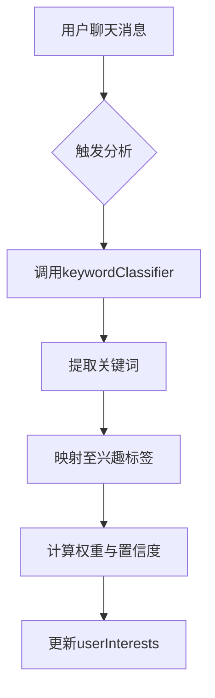
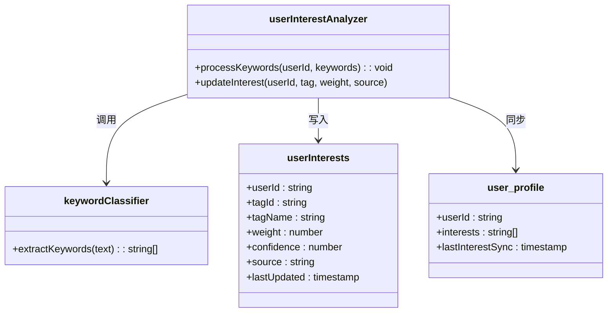
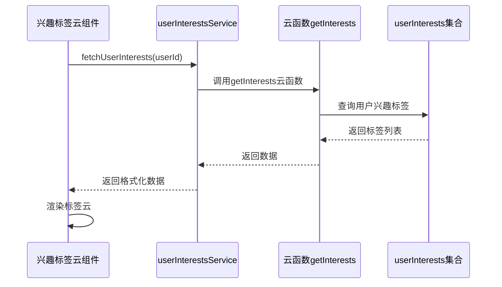

# userInterests集合

<cite>
**本文档引用文件**  
- [userInterests.md](file://doc/开发文档/database/userInterests.md)
- [userInterestAnalyzer.js](file://cloudfunctions/analysis/userInterestAnalyzer.js)
- [keywordClassifier.js](file://cloudfunctions/analysis/keywordClassifier.js)
- [userInterestsService.js](file://miniprogram/services/userInterestsService.js)
- [interest-tag-cloud.js](file://miniprogram/components/interest-tag-cloud/interest-tag-cloud.js)
- [user_profile.md](file://doc/开发文档/database/user_profile.md)
- [analysis.md](file://doc/开发文档/cloudfunctions/analysis.md)
</cite>

## 目录
1. [简介](#简介)
2. [数据模型结构](#数据模型结构)
3. [标签来源与生成机制](#标签来源与生成机制)
4. [更新机制与动态演化](#更新机制与动态演化)
5. [去重与合并策略](#去重与合并策略)
6. [与user_profile及云函数的联动](#与user_profile及云函数的联动)
7. [兴趣标签云可视化组件](#兴趣标签云可视化组件)
8. [查询接口与服务层实现](#查询接口与服务层实现)
9. [总结](#总结)

## 简介
`userInterests` 集合是HeartChat系统中用于记录用户兴趣偏好的核心数据结构，支持个性化推荐、用户画像构建与情感分析。该集合通过多源数据融合（用户主动选择与AI自动提取）构建动态演化的兴趣标签体系，并与`user_profile`、`analysis`云函数深度联动，实现智能化用户理解。

**Section sources**
- [userInterests.md](file://doc/开发文档/database/userInterests.md#L1-L20)

## 数据模型结构
`userInterests`集合的文档结构包含以下核心字段：

| 字段名 | 类型 | 说明 |
|--------|------|------|
| `userId` | string | 用户唯一标识 |
| `tagId` | string | 兴趣标签唯一ID |
| `tagName` | string | 标签名称（如“心理学”、“音乐”） |
| `weight` | number | 权重值，表示兴趣强度（0.0 ~ 1.0） |
| `confidence` | number | 置信度，AI提取时的可信度评分 |
| `source` | string | 来源类型：`manual`（用户选择）或`ai`（AI提取） |
| `lastUpdated` | timestamp | 最后更新时间 |
| `category` | string | 标签所属大类（如“学术”、“娱乐”） |

该结构支持灵活扩展，便于后续引入时间衰减、兴趣生命周期等高级特性。

**Section sources**
- [userInterests.md](file://doc/开发文档/database/userInterests.md#L25-L50)

## 标签来源与生成机制
兴趣标签来源于两个主要渠道：

1. **用户主动选择**：用户在个人资料页或兴趣设置中手动添加标签，`source`标记为`manual`，`confidence`默认为1.0。
2. **AI自动提取**：通过`analysis`云函数中的`keywordClassifier`从聊天内容中提取关键词，并由`userInterestAnalyzer`转化为兴趣标签，`source`标记为`ai`。

AI提取流程如下：
- 用户聊天消息经`keywordClassifier`进行关键词识别
- 关键词映射至预定义的兴趣标签体系
- 结合上下文情感与频率计算初始权重与置信度

**Diagram sources**
- [keywordClassifier.js](file://cloudfunctions/analysis/keywordClassifier.js#L10-L80)
- [userInterestAnalyzer.js](file://cloudfunctions/analysis/userInterestAnalyzer.js#L15-L90)

**Section sources**
- [analysis.md](file://doc/开发文档/cloudfunctions/analysis.md#L30-L60)
- [userInterestAnalyzer.js](file://cloudfunctions/analysis/userInterestAnalyzer.js#L1-L100)

## 更新机制与动态演化
`userInterests`集合采用**加权累积+时间衰减**的动态更新机制：

- 每次标签出现时，其`weight`在原有基础上累加，但受最大值限制（如0.95）
- 引入时间衰减因子，长期未出现的标签权重随时间自然下降
- `lastUpdated`字段用于计算衰减周期
- 权重更新公式：`newWeight = oldWeight * decayFactor + delta`

该机制确保兴趣标签能反映用户当前偏好，避免历史数据过度影响。

**Section sources**
- [userInterestAnalyzer.js](file://cloudfunctions/analysis/userInterestAnalyzer.js#L45-L120)

## 去重与合并策略
系统在更新兴趣标签时执行严格的去重与合并逻辑：

- **完全匹配去重**：相同`userId`与`tagId`的记录视为同一标签，不新增文档
- **权重合并**：当同一标签多次出现时，按来源与置信度加权合并
- **手动优先**：若存在`manual`来源标签，AI提取的同名标签仅更新`lastUpdated`，不修改权重
- **类别归并**：相似标签（如同义词）在映射阶段归并至统一`tagId`

此策略保障标签体系的简洁性与一致性。

**Section sources**
- [userInterestAnalyzer.js](file://cloudfunctions/analysis/userInterestAnalyzer.js#L70-L150)

## 与user_profile及云函数的联动
`userInterests`与`user_profile`形成双向联动：

- `user_profile`中的`interests`字段为静态快照，用于前端展示
- `userInterests`为动态源数据，定期同步至`user_profile`
- `analysis`云函数作为处理中枢，协调`keywordClassifier`与`userInterestAnalyzer`

**Diagram sources**
- [userInterests.md](file://doc/开发文档/database/userInterests.md#L1-L30)
- [user_profile.md](file://doc/开发文档/database/user_profile.md#L1-L20)
- [userInterestAnalyzer.js](file://cloudfunctions/analysis/userInterestAnalyzer.js#L1-L100)

**Section sources**
- [user_profile.md](file://doc/开发文档/database/user_profile.md#L25-L45)
- [analysis.md](file://doc/开发文档/cloudfunctions/analysis.md#L50-L80)

## 兴趣标签云可视化组件
前端通过`interest-tag-cloud`组件实现兴趣标签云可视化：

- 组件从`userInterestsService`获取用户兴趣数据
- 按`weight`大小决定标签字体与颜色
- 支持点击交互，展示标签详情（来源、更新时间）
- 使用ECharts实现动态渲染与动画效果

**Diagram sources**
- [interest-tag-cloud.js](file://miniprogram/components/interest-tag-cloud/interest-tag-cloud.js#L5-L40)
- [userInterestsService.js](file://miniprogram/services/userInterestsService.js#L10-L50)

**Section sources**
- [interest-tag-cloud.js](file://miniprogram/components/interest-tag-cloud/interest-tag-cloud.js#L1-L100)

## 查询接口与服务层实现
前端通过`userInterestsService.js`封装数据访问逻辑：

- 提供`getUserInterests(userId)`方法获取用户兴趣列表
- 支持按`category`、`minWeight`等条件过滤
- 数据返回前按`weight`降序排列
- 缓存机制减少重复请求

云函数层提供`getInterests`接口，执行数据库查询并应用权限校验。

**Section sources**
- [userInterestsService.js](file://miniprogram/services/userInterestsService.js#L1-L60)

## 总结
`userInterests`集合通过多源融合、动态更新与智能合并策略，构建了精准、实时的用户兴趣画像。其与AI分析模块和前端可视化组件的紧密协作，为个性化推荐与情感理解提供了坚实的数据基础。未来可引入兴趣聚类、跨用户相似度计算等高级分析能力。