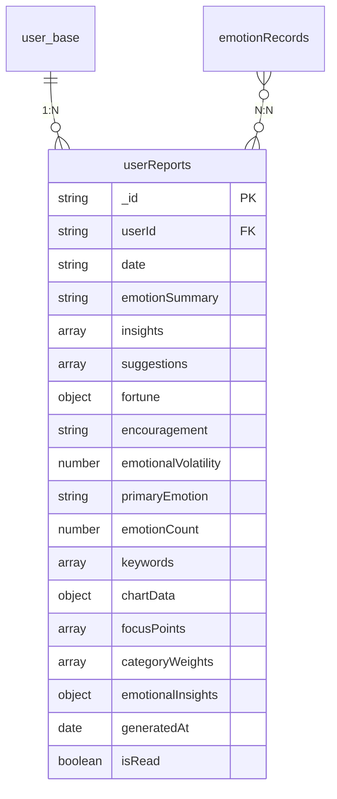
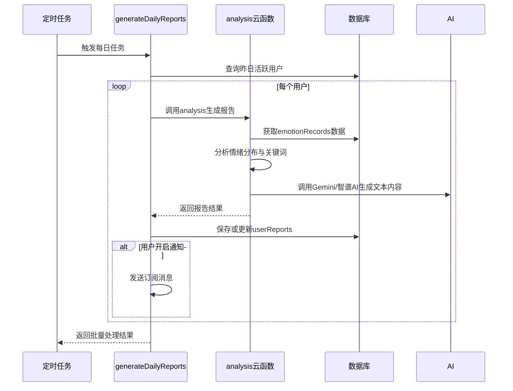
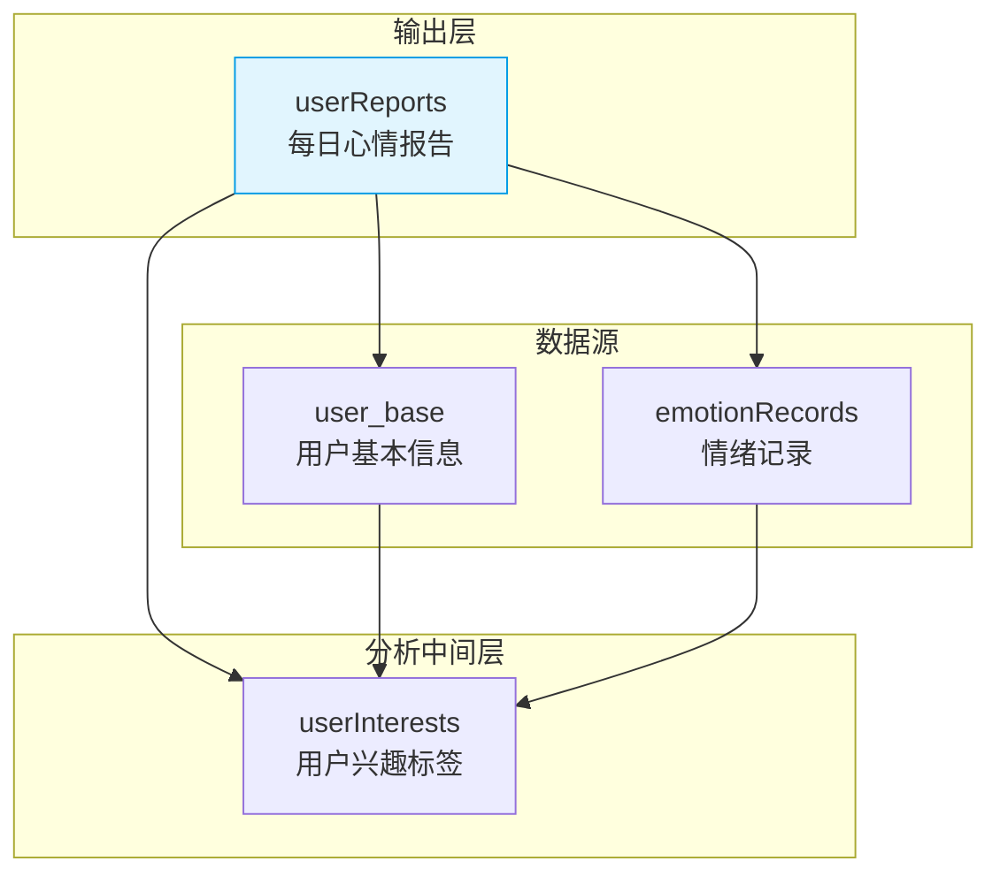

# userReports集合

<cite>
**本文档引用文件**  
- [userReports.md](file://doc/开发文档/database/userReports.md)
- [generateDailyReports/index.js](file://cloudfunctions/generateDailyReports/index.js)
- [analysis/index.js](file://cloudfunctions/analysis/index.js)
</cite>

## 目录
1. [简介](#简介)
2. [集合结构设计](#集合结构设计)
3. [核心字段说明](#核心字段说明)
4. [生成机制与云函数](#生成机制与云函数)
5. [不可变性与历史追溯](#不可变性与历史追溯)
6. [数据关联关系](#数据关联关系)
7. [按月聚合查询模式](#按月聚合查询模式)
8. [富文本存储与前端安全渲染](#富文本存储与前端安全渲染)
9. [索引与性能优化](#索引与性能优化)
10. [总结](#总结)

## 简介

`userReports`集合是HeartChat系统中“每日心情报告功能”的核心输出载体，用于存储由AI生成的用户每日情绪分析报告。该集合以结构化方式保存用户的综合情绪状态、关键词总结、AI建议、图表数据等丰富信息，支持用户进行长期情绪追踪与心理状态回顾。报告由`generateDailyReports`云函数每日定时生成，基于前一天的`emotionRecords`数据，确保内容的时效性与一致性。

**Section sources**
- [userReports.md](file://doc/开发文档/database/userReports.md#L1-L10)

## 集合结构设计

`userReports`集合采用JSON文档结构，每个文档代表一个用户的单日心情报告。其设计遵循高内聚、可扩展的原则，将文本摘要、数值指标、数组列表和嵌套对象有机结合，形成完整的报告数据模型。



**Diagram sources**
- [userReports.md](file://doc/开发文档/database/userReports.md#L12-L177)

## 核心字段说明

| 字段名 | 类型 | 说明 |
|--------|------|------|
| `_id` | string | 报告唯一标识，数据库自动生成 |
| `userId` | string | 用户ID，关联`user_base`集合 |
| `date` | string | 报告日期，格式为YYYY-MM-DD |
| `emotionSummary` | string | 综合情绪总结，AI生成的自然语言描述 |
| `insights` | array | 情绪洞察分析，3-5条关键发现 |
| `suggestions` | array | AI建议，3条改善情绪的行动指南 |
| `fortune` | object | 今日运势，包含“宜做”与“忌做”事项 |
| `encouragement` | string | 鼓励语，提升用户情绪的正向话语 |
| `emotionalVolatility` | number | 情绪波动指数（0-100） |
| `primaryEmotion` | string | 当日主要情绪类型（如“平静”、“焦虑”） |
| `emotionCount` | number | 当日情绪记录条数 |
| `keywords` | array | 权重关键词列表，含`word`和`weight`字段 |
| `chartData` | object | 可视化图表数据，含分布、趋势等 |
| `focusPoints` | array | 用户关注点分析结果 |
| `categoryWeights` | array | 分类权重统计 |
| `emotionalInsights` | object | 情感关联分析（积极/消极词汇） |
| `generatedAt` | date | 报告生成时间戳 |
| `isRead` | boolean | 是否已读标记 |

**Section sources**
- [userReports.md](file://doc/开发文档/database/userReports.md#L12-L177)

## 生成机制与云函数

每日心情报告由`generateDailyReports`云函数自动触发生成。该函数在每日凌晨执行，处理前一天有情绪记录的活跃用户。



**Diagram sources**
- [generateDailyReports/index.js](file://cloudfunctions/generateDailyReports/index.js#L1-L200)
- [analysis/index.js](file://cloudfunctions/analysis/index.js#L1-L1117)

## 不可变性与历史追溯

`userReports`集合遵循**不可变性原则**：一旦报告生成，其核心内容（如`emotionSummary`、`insights`、`suggestions`等）不再修改，确保历史数据的真实性和可追溯性。

- **唯一性约束**：通过`userId + date`复合唯一索引，确保每个用户每天仅有一份报告。
- **更新机制**：仅允许在强制重生成（`forceRegenerate=true`）时更新报告，通常用于算法优化后的数据回补。
- **历史追溯**：结合`generatedAt`时间戳，可追溯报告生成时的AI模型版本与上下文环境。

**Section sources**
- [userReports.md](file://doc/开发文档/database/userReports.md#L160-L177)
- [analysis/index.js](file://cloudfunctions/analysis/index.js#L500-L520)

## 数据关联关系

`userReports`集合与多个核心集合建立关联，确保数据一致性与上下文完整性。



- **与`user_base`关联**：通过`userId`字段建立多对一关系，确保报告归属正确。
- **与`emotionRecords`关联**：报告内容基于当日所有`emotionRecords`生成，形成数据溯源链。
- **与`userInterests`协同**：报告生成时更新用户兴趣权重，形成“记录→报告→兴趣→未来分析”的闭环。

**Diagram sources**
- [userReports.md](file://doc/开发文档/database/userReports.md#L150-L155)
- [analysis/index.js](file://cloudfunctions/analysis/index.js#L850-L900)

## 按月聚合查询模式

系统支持按月聚合`userReports`数据，生成情绪趋势摘要，用于长期心理状态分析。

```javascript
// 示例：按月聚合情绪波动指数与主要情绪
db.collection('userReports')
  .where({
    userId: 'user123',
    date: db.command.gte('2025-01-01').and(db.command.lt('2025-02-01'))
  })
  .orderBy('date', 'asc')
  .get()
  .then(res => {
    const monthlySummary = res.data.reduce((acc, report) => {
      acc.volatility.push(report.emotionalVolatility);
      acc.primaryEmotions[report.primaryEmotion] = 
        (acc.primaryEmotions[report.primaryEmotion] || 0) + 1;
      return acc;
    }, { volatility: [], primaryEmotions: {} });
  });
```

此查询模式可用于前端ECharts组件绘制月度情绪趋势图，帮助用户识别长期情绪模式。

**Section sources**
- [analysis/index.js](file://cloudfunctions/analysis/index.js#L600-L650)

## 富文本存储与前端安全渲染

报告中的`emotionSummary`、`insights`、`suggestions`等字段采用**富文本格式**存储，支持换行、强调等语义结构。

- **前端渲染策略**：
  - 使用`<rich-text>`组件进行安全渲染，避免XSS风险。
  - 对AI生成内容进行HTML标签白名单过滤。
  - 在`daily-report.js`中实现内容脱敏与格式化处理。

- **安全措施**：
  - 云函数输出前对敏感词汇进行过滤。
  - 前端展示时限制最大字符长度，防止内容爆炸。

**Section sources**
- [userReports.md](file://doc/开发文档/database/userReports.md#L12-L177)
- [miniprogram/packageEmotion/pages/daily-report/daily-report.js](file://miniprogram/packageEmotion/pages/daily-report/daily-report.js)

## 索引与性能优化

为保障查询效率，`userReports`集合已建立多项索引：

| 索引类型 | 字段组合 | 用途 |
|----------|----------|------|
| 复合唯一索引 | `userId + date` | 防止重复报告生成 |
| 复合索引 | `userId + generatedAt` (降序) | 按用户查询最新报告 |
| 单字段索引 | `date` | 按日期批量处理 |
| 单字段索引 | `isRead` | 未读报告筛选 |
| 复合索引 | `primaryEmotion + date` | 情绪趋势分析 |

**Section sources**
- [userReports.md](file://doc/开发文档/database/userReports.md#L130-L145)

## 总结

`userReports`集合作为HeartChat系统的情绪分析输出中枢，实现了从原始情绪记录到结构化AI报告的转化。其设计兼顾数据完整性、查询性能与用户体验，通过不可变性原则保障历史数据可信度，并与`emotionRecords`、`user_base`等集合形成紧密关联。定期生成机制与富文本渲染策略共同支撑了“每日心情报告功能”的稳定运行，为用户提供有价值的心理健康洞察。