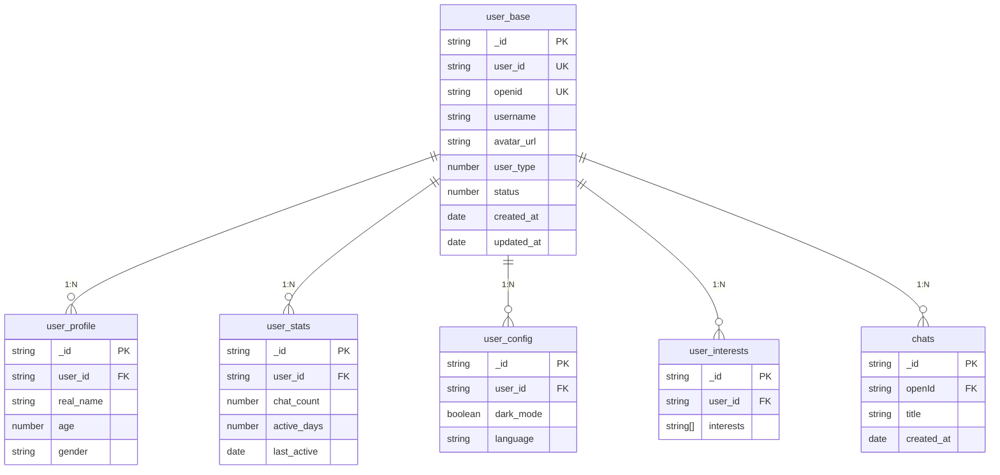
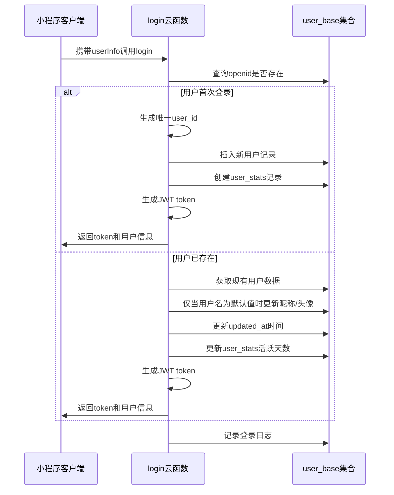
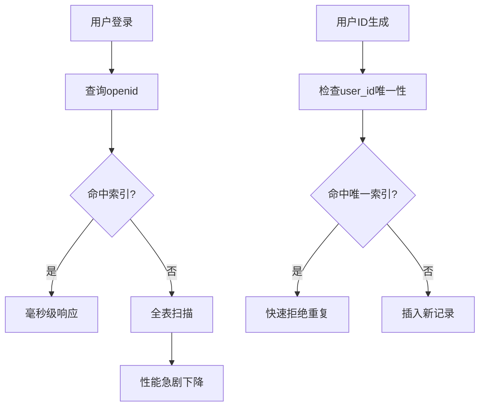

# user_base集合

<cite>
**本文档中引用的文件**
- [user_base.md](file://doc/开发文档/database/user_base.md)
- [index.js](file://cloudfunctions/login/index.js)
- [createIndexes.js](file://cloudfunctions/user/createIndexes.js)
</cite>

## 目录
1. [简介](#简介)
2. [数据模型定义](#数据模型定义)
3. [核心字段说明](#核心字段说明)
4. [主从关系结构](#主从关系结构)
5. [微信登录集成流程](#微信登录集成流程)
6. [OpenID唯一性校验实现](#openid唯一性校验实现)
7. [读写性能与索引策略](#读写性能与索引策略)
8. [总结](#总结)

## 简介
`user_base` 集合是HeartChat用户系统的核心身份数据模型，承担着用户身份认证、基础信息存储与全局数据关联的关键职责。作为整个用户体系的“主表”，它通过用户ID（`user_id`）与多个从属集合建立“一主多从”的数据关系结构，确保用户数据的一致性与完整性。

该集合在用户首次通过微信登录时被创建，并在整个用户生命周期中持续更新，是系统进行权限控制、状态管理、行为追踪的基础。

**Section sources**
- [user_base.md](file://doc/开发文档/database/user_base.md#L1-L75)

## 数据模型定义
`user_base` 集合定义了用户最核心的身份属性，其数据结构设计兼顾了唯一标识、基础信息展示与系统管理需求。

```javascript
{
  _id: "记录ID",                    // string, 主键，自动生成
  user_id: "用户ID",                // string, 7位数字用户ID，唯一标识
  openid: "微信openid",             // string, 微信用户唯一标识
  username: "用户名",                // string, 用户显示名称
  avatar_url: "头像URL",             // string, 用户头像图片地址
  user_type: 1,                     // number, 用户类型：1-普通用户，2-VIP用户，3-管理员
  status: 1,                        // number, 账户状态：1-启用，0-禁用
  created_at: "创建时间",            // date, 账户创建时间
  updated_at: "更新时间"             // date, 最后更新时间
}
```

**Section sources**
- [user_base.md](file://doc/开发文档/database/user_base.md#L8-L30)

## 核心字段说明
| 字段名 | 类型 | 说明 |
|--------|------|------|
| `_id` | string | 数据库主键，由系统自动生成 |
| `user_id` | string | 7位纯数字用户ID，系统内唯一，用于内部业务关联 |
| `openid` | string | 微信平台返回的用户唯一标识，用于身份认证 |
| `username` | string | 用户昵称，用于界面展示 |
| `avatar_url` | string | 用户头像的网络地址 |
| `user_type` | number | 用户类型，区分权限等级（1:普通, 2:VIP, 3:管理员） |
| `status` | number | 账户状态（1:启用, 0:禁用），控制用户访问权限 |
| `created_at` | date | 账户创建时间戳 |
| `updated_at` | date | 记录最后更新时间 |

**Section sources**
- [user_base.md](file://doc/开发文档/database/user_base.md#L8-L30)

## 主从关系结构
`user_base` 集合作为用户数据枢纽，与多个其他集合形成“一主多从”的关联关系，确保数据的集中管理与一致性。



**Diagram sources**
- [user_base.md](file://doc/开发文档/database/user_base.md#L32-L42)

## 微信登录集成流程
`user_base` 集合的创建与更新紧密集成于微信登录云函数（`login`）中，确保用户数据的准确同步。



**Diagram sources**
- [index.js](file://cloudfunctions/login/index.js#L1-L267)

## OpenID唯一性校验实现
系统通过 `openid` 字段确保用户身份的唯一性，其校验逻辑在登录流程中实现。

1.  **查询校验**：云函数首先根据微信返回的 `OPENID` 查询 `user_base` 集合。
2.  **存在判断**：若查询结果为空，则判定为新用户。
3.  **创建处理**：为新用户生成唯一的 `user_id` 并插入新记录。
4.  **不存在处理**：若查询到记录，则视为老用户，进行信息更新。

此机制保证了同一微信用户不会被重复创建，`openid` 作为外部唯一标识，与内部 `user_id` 共同构成双重保障。

**Section sources**
- [index.js](file://cloudfunctions/login/index.js#L1-L267)

## 读写性能与索引策略
`user_base` 集合具有高读写频率的特性，尤其是在用户登录、身份验证和信息查询等场景下。为保障性能，必须建立有效的索引策略。



**索引建议：**
- **唯一索引**：`user_id` 和 `openid`，确保字段值的全局唯一性，防止数据重复。
- **单字段索引**：`user_type` 和 `status`，加速基于用户类型和状态的查询（如管理员操作、禁用账户筛选）。
- **复合索引**：`user_type + status`，优化同时按类型和状态过滤的复杂查询。

这些索引是应对高并发读写、保证系统响应速度的关键基础设施。

**Section sources**
- [user_base.md](file://doc/开发文档/database/user_base.md#L34-L40)
- [createIndexes.js](file://cloudfunctions/user/createIndexes.js)

## 总结
`user_base` 集合是HeartChat用户体系的基石。它不仅定义了用户的核心身份数据模型，还通过严谨的“一主多从”关系结构，实现了用户数据的集中化管理。其与微信登录流程的深度集成，确保了用户数据创建与同步的准确性。通过对 `openid` 的唯一性校验，系统能够精确识别用户身份。面对高频率的读写访问，合理的主键和唯一索引设计是保障系统性能和数据一致性的关键所在。