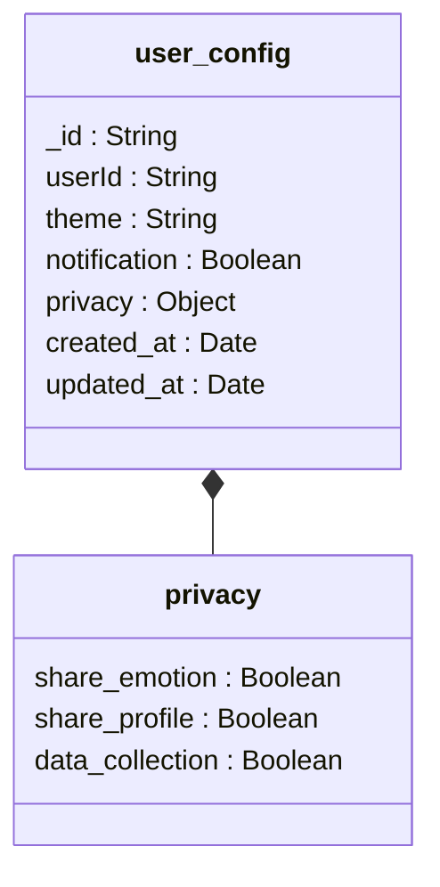
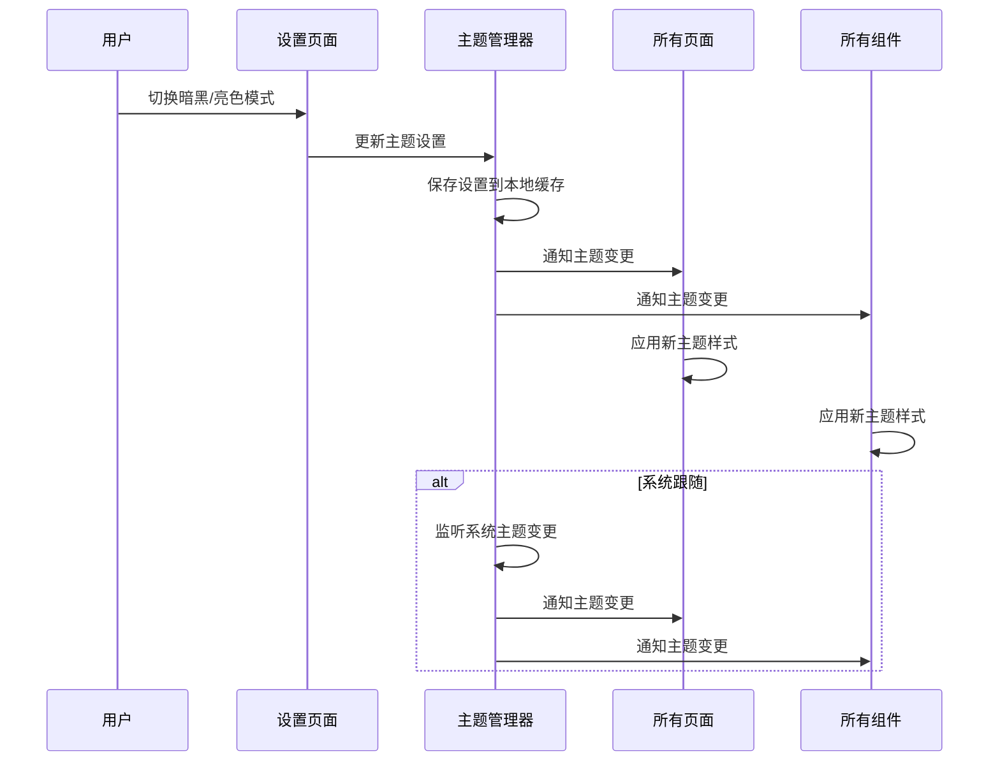
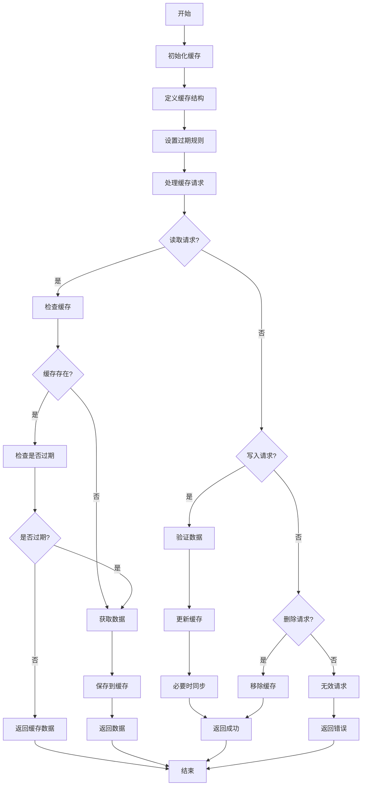

# user_config集合

<cite>
**本文档引用文件**  
- [user_config.md](file://doc/开发文档/database/user_config.md)
- [index.js](file://cloudfunctions/user/index.js)
- [HeartChat数据库结构图.html](file://doc/设计文档/流程图/html/HeartChat数据库结构图.html)
- [HeartChat用户界面流程图.html](file://doc/设计文档/流程图/html/HeartChat用户界面流程图.html)
- [HeartChat技术实现流程图.md](file://doc/设计文档/流程图/HeartChat技术实现流程图.md)
</cite>

## 目录
1. [简介](#简介)
2. [数据结构设计](#数据结构设计)
3. [配置项说明](#配置项说明)
4. [与前端的双向数据绑定](#与前端的双向数据绑定)
5. [配置变更的实时同步策略](#配置变更的实时同步策略)
6. [与user_base集合的关联方式](#与user_base集合的关联方式)
7. [默认值管理与向后兼容性](#默认值管理与向后兼容性)
8. [性能影响与本地缓存优化](#性能影响与本地缓存优化)
9. [结论](#结论)

## 简介
`user_config`集合用于存储用户的个性化偏好设置，涵盖界面主题、通知开关、默认角色选择、语音输入偏好等多维度配置。该集合支持用户在使用过程中自定义体验，并确保配置数据的持久化与归属清晰。系统通过高效的读写机制和缓存策略，保障配置信息的快速访问与实时生效。

**Section sources**
- [user_config.md](file://doc/开发文档/database/user_config.md#L0-L61)

## 数据结构设计
`user_config`集合采用结构化文档存储格式，每个文档代表一个用户的完整配置。其核心字段包括用户ID、主题设置、语言与时区、通知配置、隐私控制、聊天偏好、报告设置及高级选项。文档以`_id`为主键，`user_id`作为外键关联`user_base`集合，确保一对一关系。

文档结构设计遵循模块化原则，将配置划分为基础、通知、隐私、聊天、报告和高级六大类，便于维护与扩展。所有时间字段（如`created_at`和`updated_at`）均采用数据库服务器时间，保证时序一致性。

**Diagram sources**
- [HeartChat数据库结构图.html](file://doc/设计文档/流程图/html/HeartChat数据库结构图.html#L381-L427)

**Section sources**
- [user_config.md](file://doc/开发文档/database/user_config.md#L7-L77)

## 配置项说明
### 主题设置
- **light**：浅色模式
- **dark**：深色模式
- **auto**：跟随系统主题

### 语言与时区
- 支持多语言：`zh-CN`（简体中文）、`zh-TW`（繁体中文）、`en`（英语）、`ja`（日语）
- 时区默认为`Asia/Shanghai`

### 通知设置
- 总开关控制所有通知
- 可独立启用邮件通知与推送通知

### 隐私设置
- 资料可见性、活动可见性、在线状态显示、消息接收权限均可单独配置

### 聊天设置
- 默认AI模型可选：`gemini`、`zhipu`、`openai`
- 记忆长度、自动保存、提示音、输入指示器等功能可调
- 支持自动翻译及目标语言设定

### 报告设置
- 报告频率支持每日、每周、每月
- 可设置推送时间、是否包含图表与建议

### 高级设置
- 数据收集、个性化广告、分析数据共享、测试功能等可选开关

**Section sources**
- [user_config.md](file://doc/开发文档/database/user_config.md#L79-L150)

## 与前端的双向数据绑定
前端设置页面通过数据绑定机制与`user_config`集合保持同步。当用户在“设置”页面修改配置时，变更立即反映到本地状态，并通过事件总线通知相关组件更新UI。例如，切换暗黑模式时，主题管理器接收事件并广播至所有页面与组件，实现全局样式切换。

**Diagram sources**
- [HeartChat用户界面流程图.html](file://doc/设计文档/流程图/html/HeartChat用户界面流程图.html#L531-L564)

**Section sources**
- [HeartChat用户界面流程图.html](file://doc/设计文档/流程图/html/HeartChat用户界面流程图.html#L500-L533)

## 配置变更的实时同步策略
配置变更通过云函数实现实时同步。当用户提交设置更新时，前端调用`user`云函数的更新接口，服务端首先检查是否存在已有配置记录。若无则创建新文档，若有则执行更新操作，并自动更新`updated_at`字段。

同步过程确保原子性与一致性，所有写操作均使用`db.serverDate()`生成时间戳，避免客户端时间误差。敏感配置项（如隐私设置）在更新前需进行权限验证，防止未授权修改。

**Diagram sources**
- [HeartChat技术实现流程图.md](file://doc/设计文档/流程图/HeartChat技术实现流程图.md#L255-L306)

**Section sources**
- [index.js](file://cloudfunctions/user/index.js#L143-L192)

## 与user_base集合的关联方式
`user_config`集合通过`user_id`字段与`user_base`集合建立一对一关联。每个用户在注册时，系统会为其创建对应的`user_config`文档，初始值为默认配置。该关联确保配置数据的归属清晰，便于按用户维度进行查询与管理。

数据库层面为`user_id`字段建立唯一索引，防止重复配置记录。复合索引（如`theme + language`）用于优化多条件查询性能。

**Section sources**
- [user_config.md](file://doc/开发文档/database/user_config.md#L7-L77)

## 默认值管理与向后兼容性
系统采用严格的默认值管理策略：
1. 新用户注册时自动生成默认配置文档
2. 系统升级新增配置项时，自动填充默认值
3. 提供“恢复默认”功能，允许用户重置配置
4. 旧版本配置项保留兼容性，避免因字段缺失导致异常

默认值策略确保用户体验一致性，同时支持平滑升级。

**Section sources**
- [user_config.md](file://doc/开发文档/database/user_config.md#L79-L150)

## 性能影响与本地缓存优化
由于配置信息频繁读取（如页面加载、主题判断、通知检查），直接访问数据库可能造成性能瓶颈。为此，系统引入本地缓存机制：

- 首次加载时从数据库获取配置并存入本地存储
- 后续读取优先从缓存获取，降低数据库压力
- 写操作成功后同步更新缓存，保证一致性
- 设置合理的缓存过期策略，避免数据陈旧

缓存结构与`user_config`文档保持一致，支持快速序列化与反序列化。对于频繁访问的字段（如`theme`、`notification_enabled`），还可单独缓存以提升响应速度。

**Section sources**
- [HeartChat技术实现流程图.md](file://doc/设计文档/流程图/HeartChat技术实现流程图.md#L255-L306)

## 结论
`user_config`集合作为用户个性化配置的核心存储，设计合理、结构清晰，支持丰富的功能偏好与隐私控制。通过与前端的双向绑定、实时同步机制和本地缓存优化，系统实现了高效、稳定的配置管理。未来可进一步扩展配置导入导出功能，提升用户迁移与备份体验。