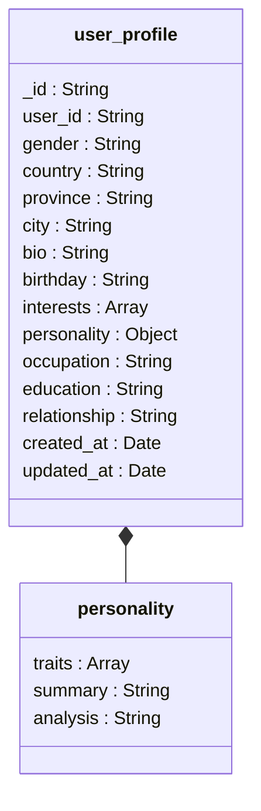

# user_profile集合

<cite>
**本文档引用文件**  
- [user_profile.md](file://doc/开发文档/database/user_profile.md)
- [userPerception.js](file://cloudfunctions/roles/userPerception.js)
- [userPerception_new.js](file://cloudfunctions/user/userPerception_new.js)
- [HeartChat数据库结构图.html](file://doc/设计文档/流程图/html/HeartChat数据库结构图.html)
- [HeartChat数据库结构图.md](file://doc/设计文档/流程图/HeartChat数据库结构图.md)
</cite>

## 目录
1. [引言](#引言)
2. [用户画像构建机制](#用户画像构建机制)
3. [user_profile集合结构](#user_profile集合结构)
4. [画像数据的版本控制与更新](#画像数据的版本控制与更新)
5. [应用场景](#应用场景)
6. [用户分群查询示例](#用户分群查询示例)
7. [动态性与可解释性挑战](#动态性与可解释性挑战)
8. [用户权利与数据隐私](#用户权利与数据隐私)
9. [结论](#结论)

## 引言
`user_profile`集合是HeartChat系统中用于存储用户深层特征与个性化信息的核心数据结构。该集合不仅包含用户的基本资料，更关键的是承载了由AI分析生成的用户画像数据，这些数据来源于用户长期的聊天内容与情绪分析结果，为个性化服务提供了重要支撑。

## 用户画像构建机制
用户画像的构建是一个持续聚合与分析的过程，主要依赖于`userPerception`模块对用户多维度数据的处理。该模块通过分析用户的聊天记录、情绪变化趋势和兴趣标签，利用智谱AI（glm-4-flash模型）进行深度语义分析，提取用户的深层特征。

画像数据的生成流程如下：
1. **数据采集**：从`messages`集合获取用户最近的聊天记录，从`emotionRecords`集合获取情绪分析数据，从`userInterests`集合获取兴趣标签。
2. **AI分析**：调用智谱AI接口，对用户文本进行分析，提取兴趣、偏好、沟通风格和情感模式。
3. **特征融合**：将AI分析结果与传统统计方法得出的情绪模式、兴趣向量进行融合，生成综合的用户画像。
4. **画像更新**：将生成的画像数据写入`user_profile`集合或角色的用户感知字段中。

此过程由`userPerception_new.js`中的`getUserPerception`函数驱动，确保了画像的实时性和准确性。

**Section sources**
- [userPerception_new.js](file://cloudfunctions/user/userPerception_new.js#L1-L100)

## user_profile集合结构
`user_profile`集合的结构经过优化，以支持复杂的用户画像存储。其核心字段不仅包括传统的基本信息，还扩展了用于AI分析的复合结构。



**Diagram sources**
- [HeartChat数据库结构图.html](file://doc/设计文档/流程图/html/HeartChat数据库结构图.html#L340-L385)
- [HeartChat数据库结构图.md](file://doc/设计文档/流程图/HeartChat数据库结构图.md#L80-L150)

### 核心字段说明
- **user_id**: 与`user_base`集合关联的唯一标识。
- **interests**: 字符串数组，存储用户的主要兴趣话题，如["心理学", "摄影", "旅行"]。
- **personality**: 嵌套对象，包含AI生成的深层性格特征。
  - **traits**: 性格特征数组，每个元素包含`trait`（特征名）和`score`（得分）。
  - **summary**: 由AI生成的自然语言描述，用于在对话中友好地提及用户特点。
  - **analysis**: 详细的分析过程记录，支持可解释性。

**Section sources**
- [user_profile.md](file://doc/开发文档/database/user_profile.md#L0-L41)

## 画像数据的版本控制与更新
用户画像数据具有高度的动态性，系统通过`userPerception`模块实现了画像的持续更新与版本控制。

### 更新机制
1. **触发条件**：当用户完成一次聊天会话或提交情绪记录后，系统会触发画像更新流程。
2. **增量分析**：`analyzeUserDialogues`函数分析最新的聊天内容，生成新的画像片段。
3. **合并策略**：`mergeUserPerception`函数负责将新旧画像进行智能合并。合并规则包括：
   - 保留所有不重复的兴趣和偏好。
   - 当新旧信息冲突时，优先保留新信息。
   - 对沟通风格和情感模式进行综合描述。
   - 每个类别最多保留5个最重要的项目。

### 版本控制
虽然`user_profile`集合本身不直接存储历史版本，但通过`updated_at`时间戳和外部日志系统，可以追踪画像的变更历史。此外，角色级别的用户感知（`roles`集合中的`user_perception`字段）会随着用户与不同角色的互动而独立演化，形成多视角的画像版本。

**Section sources**
- [userPerception.js](file://cloudfunctions/roles/userPerception.js#L200-L300)
- [userPerception_new.js](file://cloudfunctions/user/userPerception_new.js#L200-L400)

## 应用场景
基于`user_profile`集合中的AI生成画像，系统实现了多种智能化功能。

### 智能欢迎语生成
系统利用`personality.summary`字段中的自然语言描述，生成个性化的欢迎语。例如，对于一个被识别为“好奇心强、热爱学习”的用户，系统可能会说：“欢迎回来！最近有没有发现什么有趣的新知识？”

### 角色推荐
根据用户的`interests`和`personality.traits`，系统可以推荐最匹配的聊天角色。例如，对“社交性”得分高的用户，优先推荐活泼外向的角色。

### 个性化内容推送
系统分析用户的主导情绪（`emotionPatterns.dominantEmotions`）和兴趣，推送相关的内容。例如，当检测到用户近期情绪偏向“焦虑”时，系统会推送冥想引导或放松音乐。

**Section sources**
- [userPerception_new.js](file://cloudfunctions/user/userPerception_new.js#L500-L600)

## 用户分群查询示例
系统支持基于画像数据进行灵活的用户分群，以支持运营分析和精准营销。

### 查询：高社交需求用户
```javascript
db.collection('user_profile')
  .where({
    'personality.traits': db.command.elemMatch({
      trait: '社交性',
      score: db.command.gte(0.8)
    })
  })
  .get()
```

### 查询：情绪波动较大的用户
```javascript
db.collection('user_profile')
  .where({
    'personality.analysis': db.command.regex({
      regexp: '情绪波动|变化大',
      options: 'i'
    })
  })
  .get()
```

### 查询：特定兴趣群体
```javascript
db.collection('user_profile')
  .where({
    interests: '心理学'
  })
  .get()
```

这些查询利用了数据库的复合查询能力和文本索引，能够高效地从海量用户中筛选出目标群体。

**Section sources**
- [user_profile.md](file://doc/开发文档/database/user_profile.md#L42-L60)

## 动态性与可解释性挑战
AI生成的用户画像具有显著的动态性和一定的可解释性挑战。

### 动态性
画像数据不是静态的，而是随着用户行为的积累不断演化的。例如，一个用户可能从最初的“内向”逐渐转变为“开朗”，系统需要能够捕捉这种变化并及时更新画像。`userPerception`模块通过定期重新分析历史数据和增量更新机制，确保了画像的时效性。

### 可解释性挑战
由于画像由AI模型生成，其内部决策过程存在“黑箱”问题。为缓解此问题，系统采取了以下措施：
- **特征映射**：在`convertToPersonalityTraits`函数中，建立了关键词到性格特征的明确映射表。
- **备选方案**：当AI分析失败时，系统会回退到基于规则的分析方法，确保服务的稳定性。
- **分析日志**：`personality.analysis`字段记录了AI分析的关键依据，为人工审核提供支持。

**Section sources**
- [userPerception_new.js](file://cloudfunctions/user/userPerception_new.js#L400-L500)

## 用户权利与数据隐私
系统高度重视用户对自身画像数据的知情权和控制权。

### 知情权
用户可以在个人资料页面查看系统生成的`personality.summary`，了解AI是如何描述自己的。系统承诺不使用“根据我的分析”等暴露分析过程的语言，确保描述自然友好。

### 修改权
用户拥有对画像数据的修改权。虽然AI生成的深层特征（如`personality.traits`）不能直接由用户编辑，但用户可以通过修改`interests`和`bio`等基础字段来间接影响画像。系统会将用户的主动输入视为最高优先级的信号，在后续的画像更新中予以体现。

### 数据隐私
所有画像数据均被视为敏感个人信息，受到严格保护。系统通过`user_config`集合中的隐私设置，允许用户控制画像数据的共享范围。

**Section sources**
- [user_profile.md](file://doc/开发文档/database/user_profile.md#L70-L80)

## 结论
`user_profile`集合是HeartChat实现个性化服务的核心枢纽。它不仅存储了用户的基本资料，更通过与`userPerception`模块的深度集成，实现了动态、智能的用户画像构建。这些画像数据在智能欢迎语、角色推荐和内容推送等场景中发挥着关键作用。未来，系统将进一步增强画像的可解释性，并探索更精细化的用户分群和预测模型。