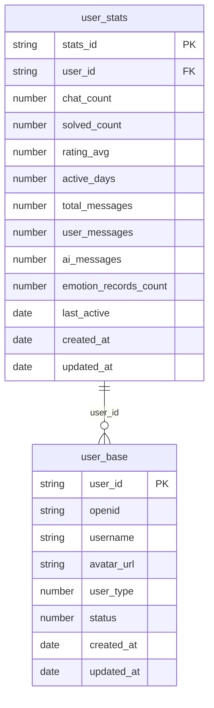
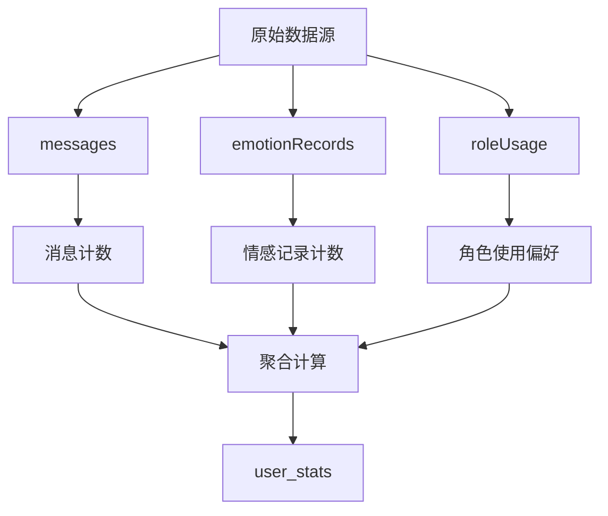
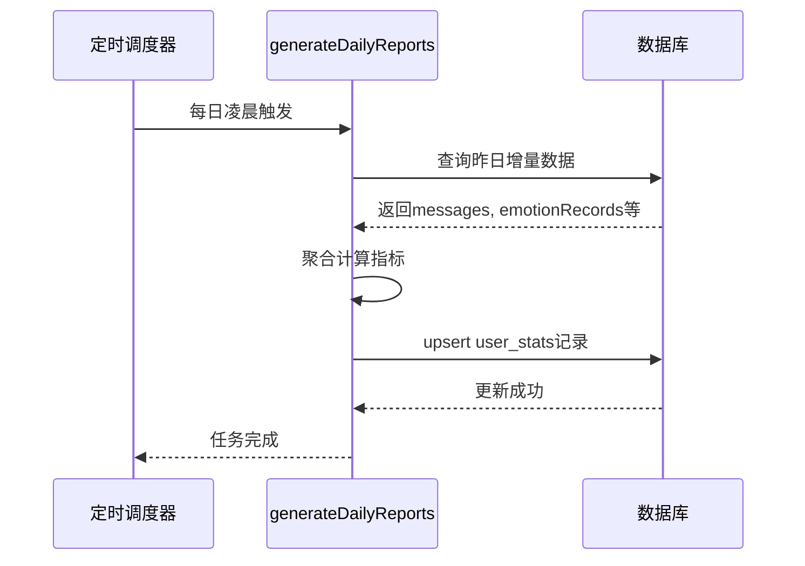

# user_stats集合

<cite>
**本文档引用的文件**
- [user_stats.md](file://doc/开发文档/database/user_stats.md)
- [user_base.md](file://doc/开发文档/database/user_base.md)
- [messages.md](file://doc/开发文档/database/messages.md)
- [emotionRecords.md](file://doc/开发文档/database/emotionRecords.md)
- [roleUsage.md](file://doc/开发文档/database/roleUsage.md)
- [generateDailyReports.md](file://doc/开发文档/cloudfunctions/generateDailyReports.md)
</cite>

## 目录
1. [简介](#简介)
2. [数据结构与字段说明](#数据结构与字段说明)
3. [统计来源与聚合策略](#统计来源与聚合策略)
4. [预聚合机制与性能优化](#预聚合机制与性能优化)
5. [与user_base集合的关联关系](#与user_base集合的关联关系)
6. [支持游戏化功能的数据支撑](#支持游戏化功能的数据支撑)
7. [统计任务执行时机与幂等性保障](#统计任务执行时机与幂等性保障)
8. [总结](#总结)

## 简介
`user_stats`集合是HeartChat系统中用于存储用户行为统计数据的核心表，通过定期从`messages`、`emotionRecords`、`roleUsage`等原始数据集合中汇总计算生成。该集合避免了实时聚合带来的性能开销，为用户中心的数据看板提供高效、稳定的数据支持。其设计目标是实现对用户活跃度、聊天行为、情绪趋势和角色使用偏好的全面量化分析。

**Section sources**
- [user_stats.md](file://doc/开发文档/database/user_stats.md#L1-L10)

## 数据结构与字段说明
`user_stats`集合包含用户的关键行为指标，主要分为基础指标、消息指标和偏好指标三大类。

### 基础指标
- **chat_count**：用户发起的聊天会话总数
- **solved_count**：成功解决的问题数量
- **rating_avg**：用户对服务的平均评分（0-5分）
- **active_days**：用户活跃的天数（去重计算，每日仅计一次）

### 消息指标
- **total_messages**：用户发送和接收的消息总数
- **user_messages**：用户发送的消息数量
- **ai_messages**：AI回复的消息数量
- **emotion_records_count**：情感分析记录数量

### 偏好指标
- **favorite_roles**：用户常用角色列表，包含角色ID、使用次数和最后使用时间
- **usage_count**：每个角色的使用频次
- **last_used**：角色最近一次使用时间

该集合通过`user_id`字段与`user_base`表建立关联，确保统计数据归属准确。

**Diagram sources**
- [user_stats.md](file://doc/开发文档/database/user_stats.md#L12-L117)
- [user_base.md](file://doc/开发文档/database/user_base.md#L12-L75)

**Section sources**
- [user_stats.md](file://doc/开发文档/database/user_stats.md#L12-L117)

## 统计来源与聚合策略
`user_stats`集合的数据来源于多个原始行为集合的定期汇总：

- **来自messages集合**：通过统计`sender_type`为"user"和"ai"的消息数量，计算`total_messages`、`user_messages`和`ai_messages`。
- **来自emotionRecords集合**：统计`userId`对应的情感记录条数，更新`emotion_records_count`字段。
- **来自roleUsage集合**：分析角色使用日志，构建`favorite_roles`数组，记录各角色的使用频次和最近使用时间。

聚合过程采用批处理方式，每日对增量数据进行归并，确保统计结果的完整性和一致性。

**Diagram sources**
- [messages.md](file://doc/开发文档/database/messages.md#L1-L89)
- [emotionRecords.md](file://doc/开发文档/database/emotionRecords.md#L1-L111)
- [roleUsage.md](file://doc/开发文档/database/roleUsage.md#L1-L60)
- [user_stats.md](file://doc/开发文档/database/user_stats.md#L12-L117)

**Section sources**
- [messages.md](file://doc/开发文档/database/messages.md#L1-L89)
- [emotionRecords.md](file://doc/开发文档/database/emotionRecords.md#L1-L111)
- [roleUsage.md](file://doc/开发文档/database/roleUsage.md#L1-L60)

## 预聚合机制与性能优化
为避免实时计算带来的性能瓶颈，系统采用**预聚合策略**。所有统计指标在后台定时任务中预先计算并写入`user_stats`集合，用户端查询时直接读取已计算好的结果，极大提升了数据看板的响应速度。

该策略显著降低了前端请求的数据库负载，尤其在高并发场景下，避免了对`messages`、`emotionRecords`等大表的频繁聚合查询，保障了系统的稳定性和可扩展性。

**Section sources**
- [user_stats.md](file://doc/开发文档/database/user_stats.md#L1-L117)
- [generateDailyReports.md](file://doc/开发文档/cloudfunctions/generateDailyReports.md#L1-L45)

## 与user_base集合的关联关系
`user_stats`集合通过`user_id`字段与`user_base`表建立**多对一**的关联关系。`user_base`作为用户主数据表，存储用户的基础信息（如用户名、头像、账户状态），而`user_stats`则专注于行为数据的统计。

这种设计确保了统计信息与用户身份的准确绑定，同时支持跨表联合查询，例如在用户中心页面同时展示个人信息和活跃数据。此外，通过`openid`字段的冗余存储，也支持基于微信标识的快速检索。

**Section sources**
- [user_stats.md](file://doc/开发文档/database/user_stats.md#L1-L117)
- [user_base.md](file://doc/开发文档/database/user_base.md#L1-L75)

## 支持游戏化功能的数据支撑
`user_stats`集合为多种游戏化功能提供了关键数据支持：

- **连续登录奖励**：基于`active_days`字段判断用户是否连续活跃，结合`last_active`时间戳验证每日登录状态，触发奖励发放逻辑。
- **活跃度等级**：综合`chat_count`、`total_messages`和`active_days`等指标，计算用户活跃度得分，实现等级晋升机制。
- **成就系统**：当`solved_count`达到特定阈值或`rating_avg`超过设定标准时，解锁相应成就。

这些功能通过预聚合数据实现低延迟响应，提升用户体验。

**Section sources**
- [user_stats.md](file://doc/开发文档/database/user_stats.md#L1-L117)

## 统计任务执行时机与幂等性保障
统计任务由云函数`generateDailyReports`在**每日凌晨**自动触发执行，确保前一天的数据被完整汇总。该任务设计具备**幂等性**，即多次执行不会产生重复或错误的统计结果。

幂等性通过以下机制保障：
1. 任务执行前检查当日统计是否已生成；
2. 使用时间范围精确筛选增量数据；
3. 更新操作采用`upsert`模式，避免重复插入；
4. 所有计数字段基于原始日志重新计算，而非累加。

此机制确保了即使任务因异常重试，统计数据依然准确无误。

**Diagram sources**
- [generateDailyReports.md](file://doc/开发文档/cloudfunctions/generateDailyReports.md#L1-L45)
- [user_stats.md](file://doc/开发文档/database/user_stats.md#L1-L117)

**Section sources**
- [generateDailyReports.md](file://doc/开发文档/cloudfunctions/generateDailyReports.md#L1-L45)

## 总结
`user_stats`集合通过预聚合策略，高效整合来自`messages`、`emotionRecords`和`roleUsage`等多源数据，为用户行为分析和数据看板提供高性能支持。其与`user_base`的关联确保了数据准确性，并为连续登录奖励、活跃度等级等游戏化功能提供了坚实的数据基础。定时任务的幂等设计保障了统计结果的可靠性，是系统数据分析层的核心组件。