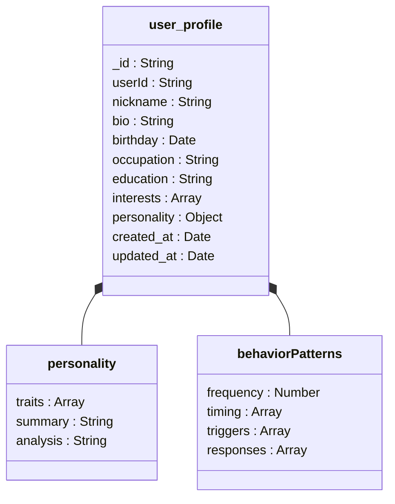
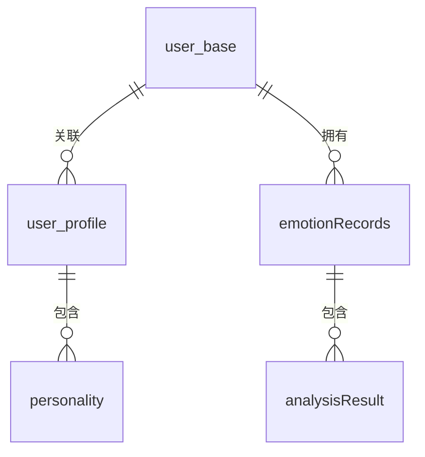

# 字段说明

<cite>
**本文档引用文件**  
- [user_base.md](file://doc/开发文档/database/user_base.md)
- [user_profile.md](file://doc/开发文档/database/user_profile.md)
- [emotionRecords.md](file://doc/开发文档/database/emotionRecords.md)
- [HeartChat数据库结构图.html](file://doc/设计文档/流程图/html/HeartChat数据库结构图.html)
- [database_design.md](file://doc/设计文档/后端/database_design.md)
- [user.md](file://doc/开发文档/cloudfunctions/user.md)
</cite>

## 目录
1. [user_base集合字段说明](#user_base集合字段说明)
2. [user_profile集合字段说明](#user_profile集合字段说明)
3. [emotionRecords集合字段说明](#emotionrecords集合字段说明)
4. [嵌套文档结构设计](#嵌套文档结构设计)
5. [典型文档实例](#典型文档实例)
6. [敏感字段处理策略](#敏感字段处理策略)
7. [查询与更新操作指导](#查询与更新操作指导)

## user_base集合字段说明

**Section sources**
- [user_base.md](file://doc/开发文档/database/user_base.md#L0-L75)
- [user.md](file://doc/开发文档/cloudfunctions/user.md#L52-L110)

### _openid 字段
- **数据类型**：字符串 (String)
- **取值范围**：微信用户唯一标识符，长度固定
- **默认值**：无
- **业务含义**：作为用户在微信生态中的唯一身份标识，用于用户认证和会话管理。该字段与 `user_id` 共同构成用户身份的双重验证机制。

### nickname 字段
- **数据类型**：字符串 (String)
- **取值范围**：用户自定义昵称，长度限制为50个字符
- **默认值**：无
- **业务含义**：用户在系统中的显示名称，用于界面展示和社交互动。该字段可通过用户资料更新接口进行修改。

### avatarUrl 字段
- **数据类型**：字符串 (String)
- **取值范围**：有效的图片URL地址
- **默认值**：无
- **业务含义**：指向用户头像图片的网络地址，用于个人形象展示。系统支持通过CDN加速访问，确保加载性能。

## user_profile集合字段说明

**Section sources**
- [user_profile.md](file://doc/开发文档/database/user_profile.md#L0-L81)
- [HeartChat数据库结构图.html](file://doc/设计文档/流程图/html/HeartChat数据库结构图.html#L340-L385)

### personality 字段
- **数据类型**：对象 (Object)
- **取值范围**：包含性格特征数组、总结和分析的复合结构
- **默认值**：空对象
- **业务含义**：存储用户性格特征的结构化数据，用于个性化服务和用户画像构建。该字段由AI模型基于用户行为数据自动分析生成。

### interests 字段
- **数据类型**：数组 (Array)
- **取值范围**：字符串数组，每个元素为用户兴趣标签
- **默认值**：空数组
- **业务含义**：记录用户的兴趣爱好，支持个性化推荐和内容匹配。系统通过用户交互行为持续更新此字段。

### emotionTrend 字段
- **数据类型**：字符串 (String)
- **取值范围**："上升"、"下降"、"稳定"
- **默认值**：无
- **业务含义**：描述用户情绪变化趋势，用于心理健康监控和情感分析报告。该字段由情感分析引擎定期计算更新。

## emotionRecords集合字段说明

**Section sources**
- [emotionRecords.md](file://doc/开发文档/database/emotionRecords.md#L0-L111)
- [HeartChat数据库结构图.html](file://doc/设计文档/流程图/html/HeartChat数据库结构图.html#L507-L554)

### emotionScore 字段
- **数据类型**：数值 (Number)
- **取值范围**：0.0 - 1.0
- **默认值**：无
- **业务含义**：量化用户情绪强度的指标，值越接近1表示情绪越强烈。该分数由AI模型基于文本内容分析得出。

### keywords 字段
- **数据类型**：数组 (Array)
- **取值范围**：包含关键词及其权重的对象数组
- **默认值**：空数组
- **业务含义**：提取自用户输入文本的关键语义词汇，用于主题识别和情感触发分析。每个关键词包含权重和情感关联信息。

### analysisResult 字段
- **数据类型**：对象 (Object)
- **取值范围**：包含情感类型、强度、效价、唤醒度等多维度分析结果
- **默认值**：空对象
- **业务含义**：存储完整的情感分析结果，包括基础情感信息、详细分析、雷达图维度和建议等。该字段是生成情绪报告的核心数据源。

## 嵌套文档结构设计



**Diagram sources**
- [HeartChat数据库结构图.html](file://doc/设计文档/流程图/html/HeartChat数据库结构图.html#L340-L385)

### 设计考量
1. **数据聚合性**：将相关联的用户特征数据组织在同一文档中，减少跨集合查询
2. **查询效率**：通过嵌套结构实现单次查询获取完整用户画像
3. **更新原子性**：确保相关字段的更新操作具有事务一致性
4. **扩展性**：预留字段支持未来新增分析维度

## 典型文档实例



**Diagram sources**
- [HeartChat数据库结构图.html](file://doc/设计文档/流程图/html/HeartChat数据库结构图.html#L297-L345)

### user_base文档示例
```json
{
  "_id": "user_base_001",
  "user_id": "1234567",
  "openid": "oxxxxxxxxxxxxxxxx",
  "username": "张三",
  "avatar_url": "https://example.com/avatar.jpg",
  "user_type": 1,
  "status": 1,
  "created_at": "2025-01-01T10:00:00Z",
  "updated_at": "2025-01-01T12:00:00Z"
}
```

### user_profile文档示例
```json
{
  "_id": "profile_001",
  "user_id": "1234567",
  "gender": "女",
  "country": "中国",
  "province": "广东省",
  "city": "深圳市",
  "bio": "热爱生活，喜欢旅行和阅读，正在探索心理学领域",
  "birthday": "1995-06-15",
  "interests": ["旅行", "阅读", "心理学", "摄影"],
  "personality": {
    "traits": ["开朗", "细心", "好奇心强"],
    "summary": "积极乐观，善于沟通，具有较强的学习能力",
    "analysis": "用户表现出明显的外向特质，对新事物保持开放态度"
  },
  "occupation": "产品经理",
  "education": "本科",
  "relationship": "单身",
  "created_at": "2025-01-01T10:00:00Z",
  "updated_at": "2025-01-01T12:00:00Z"
}
```

### emotionRecords文档示例
```json
{
  "_id": "emotion_001",
  "userId": "1234567",
  "analysis": {
    "type": "喜悦",
    "intensity": 0.8,
    "valence": 0.9,
    "arousal": 0.7,
    "trend": "上升",
    "primary_emotion": "喜悦",
    "secondary_emotions": ["兴奋", "满足"],
    "attention_level": "高",
    "radar_dimensions": {
      "trust": 0.8,
      "openness": 0.7,
      "resistance": 0.2,
      "stress": 0.3,
      "control": 0.9
    },
    "topic_keywords": ["成功", "庆祝", "快乐"],
    "emotion_triggers": ["好消息", "成就"],
    "suggestions": ["继续保持积极心态", "分享喜悦给朋友"],
    "summary": "用户当前情绪非常积极，表现出明显的喜悦和兴奋"
  },
  "originalText": "今天我收到了工作上的好消息，感觉特别开心！",
  "createTime": "2025-01-01T12:00:00Z",
  "roleId": "role_001",
  "chatId": "chat_001"
}
```

## 敏感字段处理策略

**Section sources**
- [database_design.md](file://doc/设计文档/后端/database_design.md#L0-L51)
- [user_base.md](file://doc/开发文档/database/user_base.md#L71-L75)

### 隐私保护措施
1. **数据加密**：对敏感字段进行加密存储，包括用户身份信息和情感数据
2. **访问控制**：实施严格的权限验证，确保只有授权用户和系统组件可访问敏感数据
3. **脱敏处理**：在日志记录和调试信息中对敏感字段进行脱敏处理
4. **传输安全**：通过HTTPS协议传输所有包含敏感信息的数据

### 安全规则
- **读取权限**：仅限认证用户访问自己的数据
- **写入权限**：用户只能修改自己的资料信息
- **删除权限**：禁止直接删除用户数据，采用逻辑删除标记
- **审计日志**：记录所有敏感数据的访问和修改操作

## 查询与更新操作指导

**Section sources**
- [user.md](file://doc/开发文档/cloudfunctions/user.md#L52-L110)
- [user_profile.md](file://doc/开发文档/database/user_profile.md#L0-L41)

### 查询操作
1. **用户基础信息查询**：
   ```javascript
   db.collection('user_base').where({
     user_id: '1234567'
   }).get()
   ```

2. **用户资料查询**：
   ```javascript
   db.collection('user_profile').where({
     user_id: '1234567'
   }).get()
   ```

3. **情感记录查询**：
   ```javascript
   db.collection('emotionRecords').where({
     userId: '1234567',
     createTime: _.gte(startDate)
   }).orderBy('createTime', 'asc').get()
   ```

### 更新操作
1. **用户资料更新**：
   ```javascript
   db.collection('user_profile').where({
     user_id: userId
   }).update({
     data: profileData
   })
   ```

2. **用户设置更新**：
   ```javascript
   db.collection('user_config').where({
     user_id: userId
   }).update({
     data: configData
   })
   ```

3. **批量更新注意事项**：
   - 确保更新操作的原子性
   - 验证数据完整性
   - 记录操作日志
   - 处理并发更新冲突