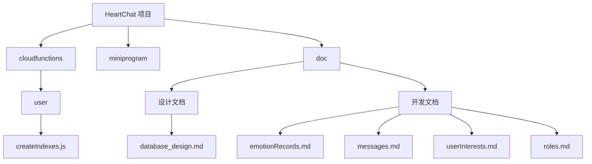
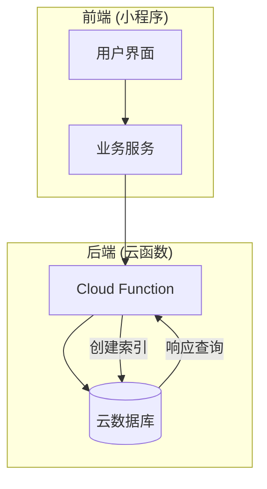
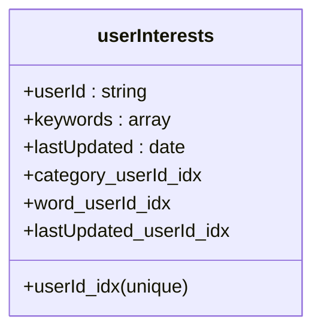
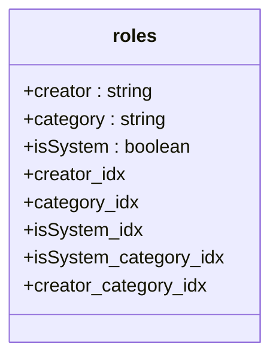
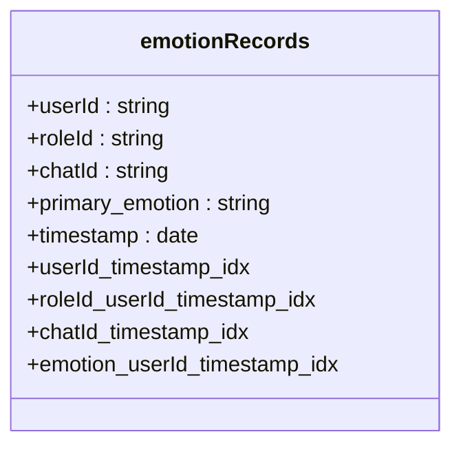
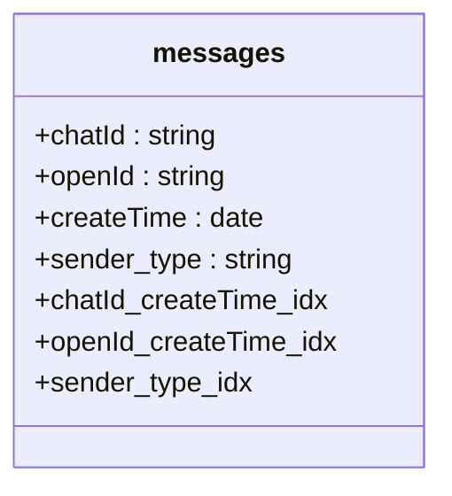

# 数据库索引策略

<cite>
**本文档引用的文件**  
- [createIndexes.js](file://cloudfunctions/user/createIndexes.js)
- [database_design.md](file://doc/设计文档/后端/database_design.md)
- [emotionRecords.md](file://doc/开发文档/database/emotionRecords.md)
- [messages.md](file://doc/开发文档/database/messages.md)
- [userInterests.md](file://doc/开发文档/database/userInterests.md)
- [roles.md](file://doc/开发文档/database/roles.md)
</cite>

## 目录
1. [引言](#引言)
2. [项目结构](#项目结构)
3. [核心组件](#核心组件)
4. [架构概述](#架构概述)
5. [详细组件分析](#详细组件分析)
6. [依赖分析](#依赖分析)
7. [性能考量](#性能考量)
8. [故障排查指南](#故障排查指南)
9. [结论](#结论)

## 引言
本文档深度分析 HeartChat 项目中定义的数据库索引策略，结合 ER 图设计，说明为每个集合创建的索引字段及其对应的查询场景。重点解析索引对写入性能的影响、高并发下的重要性，并提供索引优化与维护的最佳实践。

## 项目结构
HeartChat 项目采用模块化设计，主要分为云函数（cloudfunctions）、小程序前端（miniprogram）和文档（doc）三大模块。数据库索引逻辑集中于 `cloudfunctions/user/createIndexes.js` 文件中，而数据库设计规范则定义在 `doc/设计文档/后端/database_design.md` 及各集合的详细说明文档中。



**Diagram sources**
- [createIndexes.js](file://cloudfunctions/user/createIndexes.js#L1-L20)
- [database_design.md](file://doc/设计文档/后端/database_design.md#L1-L10)

**Section sources**
- [createIndexes.js](file://cloudfunctions/user/createIndexes.js#L1-L50)
- [database_design.md](file://doc/设计文档/后端/database_design.md#L1-L20)

## 核心组件
本项目的核心数据库组件包括 `userInterests`、`roles` 和 `emotionRecords` 集合，其索引策略由 `createIndexes.js` 文件统一管理。索引设计紧密围绕高频查询场景，如用户兴趣检索、角色分类筛选和情感记录的时间序列分析。

**Section sources**
- [createIndexes.js](file://cloudfunctions/user/createIndexes.js#L20-L220)
- [userInterests.md](file://doc/开发文档/database/userInterests.md#L1-L10)
- [roles.md](file://doc/开发文档/database/roles.md#L1-L10)
- [emotionRecords.md](file://doc/开发文档/database/emotionRecords.md#L1-L10)

## 架构概述
系统采用微信云开发架构，数据库为云数据库（CloudBase DB），通过 Node.js 云函数执行索引创建与管理。索引策略遵循“查询驱动设计”原则，优先保障读取性能，同时兼顾写入开销。



**Diagram sources**
- [createIndexes.js](file://cloudfunctions/user/createIndexes.js#L1-L10)
- [database_design.md](file://doc/设计文档/后端/database_design.md#L1-L5)

## 详细组件分析

### 用户兴趣集合 (userInterests) 分析
`userInterests` 集合存储用户的兴趣关键词与分类信息。为支持高效的个性化推荐和兴趣分析，创建了多个复合索引。

#### 索引设计与查询场景


**Diagram sources**
- [createIndexes.js](file://cloudfunctions/user/createIndexes.js#L25-L55)
- [userInterests.md](file://doc/开发文档/database/userInterests.md#L1-L20)

- **userId 唯一索引**：确保每个用户仅有一条兴趣记录，用于快速定位用户兴趣数据。
- **keywords.category + userId 复合索引**：加速按兴趣分类（如“技术”、“娱乐”）查询特定用户的关键词。
- **keywords.word + userId 复合索引**：支持基于关键词的精确查找，常用于内容匹配。
- **lastUpdated + userId 复合索引**：按更新时间排序检索用户的最新兴趣，用于动态权重计算。

**Section sources**
- [createIndexes.js](file://cloudfunctions/user/createIndexes.js#L20-L60)
- [userInterests.md](file://doc/开发文档/database/userInterests.md#L1-L30)

### 角色集合 (roles) 分析
`roles` 集合存储 AI 角色信息，支持多种分类和创建者筛选。

#### 索引设计与查询场景


**Diagram sources**
- [createIndexes.js](file://cloudfunctions/user/createIndexes.js#L70-L110)
- [roles.md](file://doc/开发文档/database/roles.md#L1-L20)

- **creator 索引**：快速查询特定用户（或系统）创建的所有角色。
- **category 索引**：按角色分类（如“心理咨询师”、“生活助手”）进行筛选。
- **isSystem 索引**：区分系统预设角色与用户自定义角色。
- **isSystem + category 复合索引**：高效查询系统级的特定分类角色，优化角色选择页面加载。
- **creator + category 复合索引**：查询特定用户在某分类下创建的角色。

**Section sources**
- [createIndexes.js](file://cloudfunctions/user/createIndexes.js#L65-L115)
- [roles.md](file://doc/开发文档/database/roles.md#L1-L30)

### 情感记录集合 (emotionRecords) 分析
`emotionRecords` 集合是时间序列数据的核心，其索引设计对查询性能至关重要。

#### 索引设计与查询场景


**Diagram sources**
- [createIndexes.js](file://cloudfunctions/user/createIndexes.js#L120-L160)
- [emotionRecords.md](file://doc/开发文档/database/emotionRecords.md#L1-L20)

- **userId + timestamp (降序) 复合索引**：这是最核心的索引，用于加速用户情感历史的时间范围查询（如“过去7天”），完美匹配 `emotionRecords.md` 中建议的索引。
- **roleId + userId + timestamp (降序) 复合索引**：查询用户与特定角色互动时的情感变化趋势。
- **chatId + timestamp (降序) 复合索引**：优化单个聊天会话内的情感记录加载，支持会话级情感分析。
- **primary_emotion + userId + timestamp (降序) 复合索引**：按主要情感类型（如“喜悦”、“焦虑”）筛选用户的历史记录，用于情感统计和报告生成。

**Section sources**
- [createIndexes.js](file://cloudfunctions/user/createIndexes.js#L115-L165)
- [emotionRecords.md](file://doc/开发文档/database/emotionRecords.md#L1-L30)

### 消息集合 (messages) 分析
尽管 `createIndexes.js` 未直接为 `messages` 集合创建索引，但根据 `messages.md` 文档的建议，合理的索引策略对聊天功能至关重要。

#### 推荐索引与查询场景


**Diagram sources**
- [messages.md](file://doc/开发文档/database/messages.md#L1-L20)

- **chatId + createTime (升序) 复合索引**：这是优化会话内消息加载的关键，确保能快速按时间顺序拉取聊天记录。
- **openId + createTime (降序) 复合索引**：查询特定用户的所有消息，用于用户行为分析。
- **sender_type 索引**：快速筛选用户消息或 AI 回复，用于消息状态跟踪和统计。

**Section sources**
- [messages.md](file://doc/开发文档/database/messages.md#L1-L30)

## 依赖分析
索引创建逻辑依赖于微信云开发 SDK (`wx-server-sdk`)，通过 `cloud.database()` 获取数据库实例。`createAllIndexes` 函数并行调用各集合的索引创建函数，体现了模块化和高内聚的设计。

```mermaid
graph TD
A[createAllIndexes] --> B[createUserInterestsIndexes]
A --> C[createRolesIndexes]
A --> D[createEmotionRecordsIndexes]
B --> E[db.collection('userInterests').createIndex]
C --> F[db.collection('roles').createIndex]
D --> G[db.collection('emotionRecords').createIndex]
```

**Diagram sources**
- [createIndexes.js](file://cloudfunctions/user/createIndexes.js#L170-L200)

**Section sources**
- [createIndexes.js](file://cloudfunctions/user/createIndexes.js#L165-L220)

## 性能考量
索引在显著提升查询性能的同时，也会对写入性能产生影响。

### 读写性能权衡
- **正面影响**：对于 `emotionRecords` 的时间范围查询，复合索引可将查询时间从 O(n) 降低到 O(log n)，在高并发场景下至关重要。
- **负面影响**：每创建一个索引，每次 `INSERT`、`UPDATE` 或 `DELETE` 操作都需要额外维护该索引的 B-Tree 结构。例如，为 `emotionRecords` 创建 4 个索引，意味着每次插入一条记录，数据库需要执行 4 次额外的索引更新操作。
- **权衡考量**：应遵循“80/20 法则”，优先为最频繁的 20% 查询创建索引。避免为低频查询或选择性差的字段（如布尔值）创建索引，以免增加不必要的写入开销。

### 高并发场景下的重要性
在高并发环境下，未优化的查询可能导致数据库连接池耗尽和响应延迟。良好的索引策略是保障系统稳定性的基石。例如，当多个用户同时请求情感历史时，`userId_timestamp_idx` 能确保查询快速完成，释放数据库连接，避免雪崩效应。

### 索引维护最佳实践
1. **定期审查**：使用数据库性能分析工具（如 CloudBase 控制台的慢查询日志）诊断性能瓶颈。
2. **案例**：若发现 `messages` 集合的 `chatId` 查询变慢，应检查是否缺失 `chatId_createTime_idx` 索引，并立即创建。
3. **避免冗余**：`userId_timestamp_idx` 已包含 `userId`，因此单独的 `userId` 索引是冗余的，应删除。
4. **监控索引大小**：大型索引占用更多内存和磁盘空间，需监控其增长。
5. **批量操作**：在数据迁移或初始化时，可考虑先删除索引，批量导入数据后再重建索引，以提高效率。

## 故障排查指南
当遇到慢查询时，应遵循以下步骤进行诊断和优化：

1. **启用慢查询日志**：在云开发控制台开启数据库慢查询监控。
2. **定位问题 SQL**：从日志中找出执行时间过长的查询语句。
3. **分析执行计划**：使用 `EXPLAIN` 命令（或等效工具）查看查询是否使用了预期的索引。
4. **创建缺失索引**：根据查询的 `WHERE` 和 `ORDER BY` 子句，创建合适的复合索引。
5. **验证效果**：重新执行查询，确认性能是否提升。

**Section sources**
- [createIndexes.js](file://cloudfunctions/user/createIndexes.js#L1-L220)
- [emotionRecords.md](file://doc/开发文档/database/emotionRecords.md#L1-L20)
- [messages.md](file://doc/开发文档/database/messages.md#L1-L20)

## 结论
HeartChat 项目的数据库索引策略设计合理，紧密贴合业务查询场景。通过为 `userInterests`、`roles` 和 `emotionRecords` 集合创建精心设计的复合索引，有效保障了核心功能的查询性能。在高并发场景下，这些索引是系统稳定运行的关键。未来应持续监控数据库性能，根据实际查询负载动态调整索引策略，在读取效率和写入开销之间保持最佳平衡，并考虑为 `messages` 集合补充必要的索引以优化聊天体验。