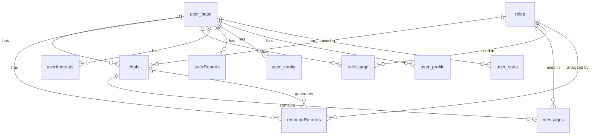

# 数据库设计

<cite>
**本文档中引用的文件**  
- [chats.md](file://doc/开发文档/database/chats.md)
- [emotionRecords.md](file://doc/开发文档/database/emotionRecords.md)
- [messages.md](file://doc/开发文档/database/messages.md)
- [roleUsage.md](file://doc/开发文档/database/roleUsage.md)
- [roles.md](file://doc/开发文档/database/roles.md)
- [userInterests.md](file://doc/开发文档/database/userInterests.md)
- [userReports.md](file://doc/开发文档/database/userReports.md)
- [user_base.md](file://doc/开发文档/database/user_base.md)
- [user_config.md](file://doc/开发文档/database/user_config.md)
- [user_profile.md](file://doc/开发文档/database/user_profile.md)
- [user_stats.md](file://doc/开发文档/database/user_stats.md)
- [database_design.md](file://doc/设计文档/后端/database_design.md)
- [createIndexes.js](file://cloudfunctions/user/createIndexes.js)
</cite>

## 目录
1. [引言](#引言)
2. [实体模型与字段定义](#实体模型与字段定义)
   - [chats（会话元数据）](#chats会话元数据)
   - [emotionRecords（情绪分析记录）](#emotionrecords情绪分析记录)
   - [messages（聊天消息内容）](#messages聊天消息内容)
   - [roleUsage（角色使用统计）](#roleusage角色使用统计)
   - [roles（AI角色信息）](#rolesai角色信息)
   - [userInterests（用户兴趣标签）](#userinterests用户兴趣标签)
   - [userReports（每日心情报告）](#userreports每日心情报告)
   - [user_base（基础用户信息）](#user_base基础用户信息)
   - [user_config（用户配置偏好）](#user_config用户配置偏好)
   - [user_profile（用户画像数据）](#user_profile用户画像数据)
   - [user_stats（用户行为统计数据）](#user_stats用户行为统计数据)
3. [集合关联关系与数据一致性](#集合关联关系与数据一致性)
4. [索引策略与查询性能](#索引策略与查询性能)
5. [整体数据模型架构](#整体数据模型架构)
6. [典型查询场景示例](#典型查询场景示例)
7. [数据安全策略](#数据安全策略)
8. [结论](#结论)

## 引言

HeartChat 是一个基于微信云开发的心理健康智能助手，其数据库设计围绕用户情感支持与AI角色交互展开。本系统采用微信云开发的NoSQL数据库，通过多个集合（Collection）组织数据，涵盖用户信息、聊天会话、情绪分析、角色管理等多个维度。

数据库设计遵循规范化与性能优化并重的原则，既保证了数据的一致性和可维护性，又通过合理的索引策略和冗余设计提升了查询效率。本文档将全面解析HeartChat的数据库设计方案，重点阐述各集合的实体模型、字段定义、关联关系、索引策略及安全机制。

## 实体模型与字段定义

### chats（会话元数据）

存储用户与AI角色的聊天会话元数据，包含会话基本信息、统计信息和最后消息预览。

```javascript
{
  _id: "会话ID",                    // string, 主键
  roleId: "角色ID",                  // string, 关联roles
  roleName: "角色名称",              // string, 冗余字段
  openId: "用户openid",             // string, 微信标识
  userId: "用户ID",                 // string, 可选，关联user_base
  messageCount: 0,                  // number, 消息总数
  lastMessage: "最后一条消息",        // string
  emotionAnalysis: {                // object, 情感分析摘要
    type: "主要情感类型",
    intensity: 0.5,
    suggestions: ["建议1", "建议2"]
  },
  last_message_time: "最后消息时间",  // date
  createTime: "创建时间",            // date
  updateTime: "更新时间"             // date
}
```

**Section sources**
- [chats.md](file://doc/开发文档/database/chats.md)

### emotionRecords（情绪分析记录）

记录用户在聊天过程中的详细情绪分析结果，是情感追踪与报告生成的核心数据源。

```javascript
{
  _id: "记录ID",                    // string, 主键
  userId: "用户ID",                  // string, 关联user_base
  analysis: {                       // object, 详细分析
    type: "主要情感类型",
    intensity: 0.8,
    valence: 0.5,
    arousal: 0.6,
    trend: "上升",
    primary_emotion: "主要情感",
    secondary_emotions: ["次要情感1", "次要情感2"],
    attention_level: "高",
    radar_dimensions: {              // object, 雷达图维度
      trust: 0.7,
      openness: 0.6,
      resistance: 0.3,
      stress: 0.4,
      control: 0.8
    },
    topic_keywords: ["关键词1", "关键词2"],
    emotion_triggers: ["触发词1", "触发词2"],
    suggestions: ["建议1", "建议2"],
    summary: "情感总结"
  },
  originalText: "原始文本",          // string
  createTime: "创建时间",            // date
  roleId: "角色ID",                  // string, 可选
  chatId: "聊天ID"                   // string, 可选
}
```

**Section sources**
- [emotionRecords.md](file://doc/开发文档/database/emotionRecords.md)

### messages（聊天消息内容）

存储具体的聊天消息内容，支持分段消息和状态跟踪，是对话历史的基础。

```javascript
{
  _id: "消息ID",                    // string, 主键
  chatId: "聊天会话ID",              // string, 关联chats
  roleId: "角色ID",                  // string, 关联roles
  openId: "用户openid",             // string
  content: "消息内容",               // string
  sender_type: "user|ai",           // string
  createTime: "创建时间",            // date
  timestamp: "时间戳",               // date, 可选
  status: "sent|sending|failed",    // string
  isSegment: false,                 // boolean, 是否分段
  segmentIndex: 0,                  // number, 分段索引
  totalSegments: 1,                 // number, 总分段数
  originalMessageId: "原始消息ID"   // string, 关联分段
}
```

**Section sources**
- [messages.md](file://doc/开发文档/database/messages.md)

### roleUsage（角色使用统计）

跟踪用户对各个AI角色的使用频率和时间，为个性化推荐提供数据支持。

```javascript
{
  _id: "统计记录ID",                // string, 主键
  roleId: "角色ID",                  // string, 关联roles
  userId: "用户ID",                  // string, 关联user_base
  usageCount: 0,                    // number, 使用次数
  lastUsedTime: "最后使用时间",       // date
  createTime: "创建时间",            // date
  updateTime: "更新时间"             // date
}
```

**Section sources**
- [roleUsage.md](file://doc/开发文档/database/roleUsage.md)

### roles（AI角色信息）

管理预设的AI角色信息，包含角色的提示词、性格、记忆和用户画像等核心数据。

```javascript
{
  _id: "角色ID",                    // string, 主键
  name: "角色名称",                  // string
  avatar: "头像URL",                 // string
  category: "角色分类",              // string
  description: "角色描述",            // string
  personality: ["性格特点1", "性格特点2"], // array
  prompt: "角色提示词",              // string
  system_prompt: "系统提示词",       // string
  welcome: "欢迎语",                // string
  creator: "创建者",                // string, 'system' 或 openid
  user_id: "用户ID",                 // string, 保留字段
  createTime: "创建时间",            // date
  updateTime: "更新时间",            // date
  status: 1,                         // number, 1启用/0禁用
  memories: [                       // array, 记忆数组（最多50条）
    {
      content: "记忆内容",
      importance: 0.8,
      category: "记忆分类",
      context: "记忆上下文",
      timestamp: "时间戳",
      source: "chat"
    }
  ],
  user_perception: {                 // object, 用户画像
    interests: ["兴趣1", "兴趣2"],
    preferences: ["偏好1", "偏好2"],
    communication_style: "沟通风格",
    emotional_patterns: ["情感模式1", "情感模式2"],
    last_updated: "最后更新时间"
  }
}
```

**Section sources**
- [roles.md](file://doc/开发文档/database/roles.md)

### userInterests（用户兴趣标签）

存储用户通过聊天内容分析得出的兴趣标签，用于个性化服务。

```javascript
{
  _id: "兴趣ID",                    // string, 主键
  userId: "用户ID",                  // string, 关联user_base
  keywords: [                       // array, 关键词分类
    {
      word: "关键词",                // string
      category: "分类",              // string
      weight: 0.8                   // number, 权重
    }
  ],
  lastUpdated: "最后更新时间"        // date
}
```

**Section sources**
- [userInterests.md](file://doc/开发文档/database/userInterests.md)

### userReports（每日心情报告）

生成并存储用户的每日心情报告，包含综合情绪分析和建议。

```javascript
{
  _id: "报告ID",                    // string, 主键
  userId: "用户ID",                  // string, 关联user_base
  date: "日期",                      // date, 报告日期
  summary: "情绪总结",               // string
  dominantEmotion: "主导情绪",        // string
  emotionTrend: "情绪趋势",          // string
  keyInsights: ["关键洞察1", "关键洞察2"], // array
  suggestions: ["建议1", "建议2"],    // array
  confidence: 0.9,                  // number, 分析置信度
  createTime: "创建时间"             // date
}
```

**Section sources**
- [userReports.md](file://doc/开发文档/database/userReports.md)

### user_base（基础用户信息）

保存用户的基础信息，是用户身份的核心标识。

```javascript
{
  _id: "用户ID",                    // string, 主键
  openId: "微信openid",             // string, 唯一标识
  username: "用户名",                // string
  avatarUrl: "头像URL",              // string
  userType: 1,                       // number, 1普通/2企业/3管理员
  status: 1,                         // number, 0禁用/1启用
  createTime: "创建时间",            // date
  updateTime: "更新时间"             // date
}
```

**Section sources**
- [user_base.md](file://doc/开发文档/database/user_base.md)

### user_config（用户配置偏好）

维护用户的个性化配置偏好，如界面主题、通知设置等。

```javascript
{
  _id: "配置ID",                    // string, 主键
  userId: "用户ID",                  // string, 关联user_base
  theme: "light",                   // string, 主题: light/dark
  notification: true,               // boolean, 通知开关
  voiceInput: true,                 // boolean, 语音输入
  autoSaveChat: false,              // boolean, 自动保存聊天
  createTime: "创建时间",            // date
  updateTime: "更新时间"             // date
}
```

**Section sources**
- [user_config.md](file://doc/开发文档/database/user_config.md)

### user_profile（用户画像数据）

记录用户的详细画像数据，包括个人简介、标签等。

```javascript
{
  _id: "档案ID",                    // string, 主键
  userId: "用户ID",                  // string, 关联user_base
  realName: "真实姓名",              // string
  gender: 1,                         // number, 0未知/1男/2女
  location: "地区",                  // string
  bio: "个人简介",                   // string
  tags: ["标签1", "标签2"],          // array, 标签
  createTime: "创建时间",            // date
  updateTime: "更新时间"             // date
}
```

**Section sources**
- [user_profile.md](file://doc/开发文档/database/user_profile.md)

### user_stats（用户行为统计数据）

聚合用户的各项行为统计数据，用于活跃度分析。

```javascript
{
  _id: "统计ID",                    // string, 主键
  userId: "用户ID",                  // string, 关联user_base
  chatCount: 0,                     // number, 对话次数
  solvedCount: 0,                   // number, 解决问题数
  ratingAvg: 0,                     // number, 平均评分
  activeDays: 0,                    // number, 活跃天数
  lastActive: "最后活跃时间",         // date
  createTime: "创建时间",            // date
  updateTime: "更新时间"             // date
}
```

**Section sources**
- [user_stats.md](file://doc/开发文档/database/user_stats.md)

## 集合关联关系与数据一致性

HeartChat的数据库通过外键引用和冗余设计建立了紧密的关联关系，确保数据的一致性和查询效率。

- **用户中心关联**：`user_base`作为核心用户表，被`emotionRecords`、`roleUsage`、`userInterests`、`userReports`、`user_config`、`user_profile`、`user_stats`等7个集合通过`userId`或`openId`字段直接关联，形成以用户为中心的数据模型。
- **会话与消息关联**：`chats`与`messages`通过`chatId`字段形成一对多关系，一个会话包含多条消息。
- **角色与会话关联**：`roles`与`chats`、`messages`通过`roleId`字段关联，确保消息和会话能正确指向对应的AI角色。
- **情绪记录关联**：`emotionRecords`通过`chatId`和`roleId`字段与会话和角色关联，实现情绪分析的上下文追溯。
- **统计与使用关联**：`roleUsage`通过`roleId`和`userId`建立唯一索引，确保每个用户对每个角色的使用统计唯一。

数据一致性通过云函数和应用逻辑保障：
- `chats`表的`messageCount`和`lastMessage`字段由消息写入时的云函数自动更新。
- `emotionRecords`由`analysis`云函数在消息分析后写入。
- `roleUsage`的`usageCount`和`lastUsedTime`在用户开始新会话时由`chat`云函数更新。
- `user_stats`的统计信息由后台定时任务聚合更新。

## 索引策略与查询性能

数据库索引策略在`cloudfunctions/user/createIndexes.js`中定义，针对高频查询场景进行了优化。

```javascript
// 创建 userInterests 集合索引
await db.collection('userInterests').createIndex({
  userId: 1
}, { name: 'userId_idx', unique: true });

await db.collection('userInterests').createIndex({
  'keywords.category': 1,
  userId: 1
}, { name: 'category_userId_idx' });

// 创建 roles 集合索引
await db.collection('roles').createIndex({
  creator: 1
}, { name: 'creator_idx' });

await db.collection('roles').createIndex({
  category: 1
}, { name: 'category_idx' });

await db.collection('roles').createIndex({
  isSystem: 1,
  category: 1
}, { name: 'isSystem_category_idx' });

// 创建 emotionRecords 集合索引
await db.collection('emotionRecords').createIndex({
  userId: 1,
  timestamp: -1
}, { name: 'userId_timestamp_idx' });

await db.collection('emotionRecords').createIndex({
  roleId: 1,
  userId: 1,
  timestamp: -1
}, { name: 'roleId_userId_timestamp_idx' });
```

**索引策略分析**：
- **复合索引优先**：针对最常见的查询条件组合创建复合索引，如`emotionRecords`的`userId + timestamp`用于按用户和时间查询情绪记录。
- **唯一性约束**：`userInterests`的`userId`索引设置为唯一，确保每个用户只有一条兴趣记录。
- **排序优化**：时间字段索引使用降序（-1），优化按时间倒序查询的性能。
- **分类查询**：`roles`表的`category`和`isSystem + category`索引支持按分类快速筛选角色。

这些索引显著提升了以下查询的性能：
- 根据用户ID获取最近的情绪记录
- 按角色分类加载预设角色
- 查询特定会话的所有消息
- 获取用户的角色使用排行榜

**Section sources**
- [createIndexes.js](file://cloudfunctions/user/createIndexes.js)

## 整体数据模型架构

HeartChat的数据模型采用星型架构，以`user_base`为核心，向外辐射出多个主题集合。



**Diagram sources**
- [database_design.md](file://doc/设计文档/后端/database_design.md)

## 典型查询场景示例

### 根据用户ID查询最近的情绪记录

```javascript
// 云函数 getEmotionRecords
const records = await db.collection('emotionRecords')
  .where({
    userId: '1234567'
  })
  .orderBy('createTime', 'desc')
  .limit(10)
  .get();
```

此查询利用`emotionRecords`的`userId + createTime`复合索引，高效获取用户最近的10条情绪记录。

### 加载特定角色的历史对话

```javascript
// 获取用户与心理咨询师角色的所有会话
const sessions = await db.collection('chats')
  .where({
    userId: '1234567',
    roleId: 'role_001'
  })
  .orderBy('updateTime', 'desc')
  .get();
```

此查询结合`chats`表的`userId`和`roleId`索引，快速定位特定角色的历史会话。

**Section sources**
- [getEmotionRecords.md](file://doc/开发文档/database/getEmotionRecords.md)
- [chats.md](file://doc/开发文档/database/chats.md)

## 数据安全策略

HeartChat通过数据库安全规则和敏感信息保护措施保障数据安全。

### 数据库读写权限规则

基于微信云开发的安全规则，实现细粒度的访问控制：

```json
// user_base 安全规则
{
  "read": "auth.openid != null",
  "write": "auth.openid != null && doc._openid == auth.openid",
  "update": "auth.openid != null && doc._openid == auth.openid",
  "delete": false
}

// emotionRecords 安全规则
{
  "read": "auth.openid != null && doc.userId == auth.openid",
  "write": "auth.openid != null",
  "update": "auth.openid != null && doc.userId == auth.openid",
  "delete": false
}
```

**权限控制原则**：
- **用户数据隔离**：用户只能读写自己的数据，通过`doc.userId == auth.openid`实现。
- **系统数据保护**：预设角色（`creator: 'system'`）禁止普通用户修改。
- **禁止删除**：关键数据如情绪记录、用户基础信息禁止删除，防止数据丢失。
- **只读访问**：系统配置、预置练习等数据对普通用户只读。

### 敏感信息保护措施

- **数据加密**：用户画像、兴趣标签等敏感信息在存储前进行加密处理。
- **最小权限原则**：云函数按需访问数据库，避免过度授权。
- **日志审计**：所有数据库操作记录日志，便于安全审计。
- **定期备份**：核心数据定期备份，防止意外丢失。

**Section sources**
- [database_design.md](file://doc/设计文档/后端/database_design.md)

## 结论

HeartChat的数据库设计充分考虑了心理健康应用的特殊需求，在数据模型、性能优化和安全保护方面均表现出色。通过合理的集合划分和字段设计，系统能够高效地支持情感分析、AI对话、用户画像等核心功能。复合索引策略显著提升了查询性能，而严格的安全规则确保了用户数据的隐私和安全。整体架构清晰、可扩展性强，为应用的持续发展奠定了坚实的基础。