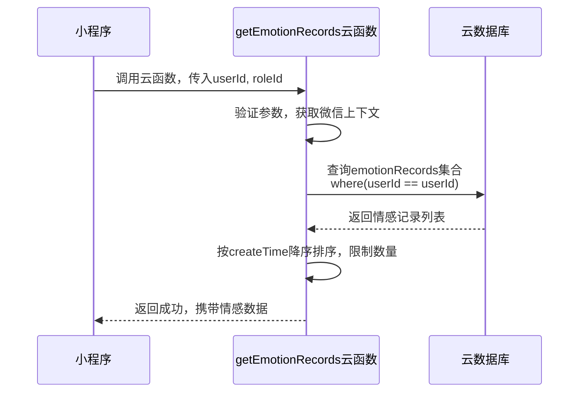
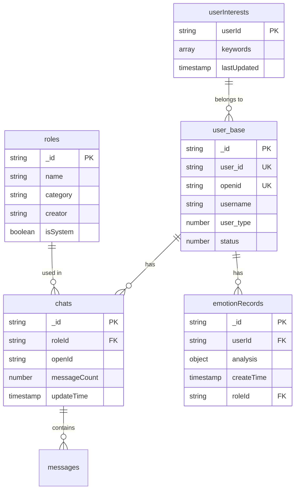
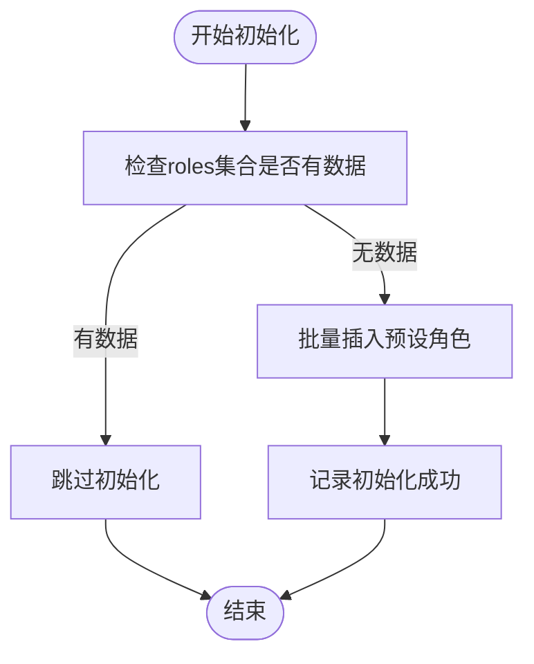

# 数据库设计

<cite>
**本文档引用的文件**
- [user_base.md](file://doc/开发文档/database/user_base.md)
- [emotionRecords.md](file://doc/开发文档/database/emotionRecords.md)
- [chats.md](file://doc/开发文档/database/chats.md)
- [init-roles.js](file://cloudfunctions/roles/init-roles.js)
- [createIndexes.js](file://cloudfunctions/user/createIndexes.js)
- [index.js](file://cloudfunctions/user/index.js)
- [index.js](file://cloudfunctions/getEmotionRecords/index.js)
- [index.js](file://cloudfunctions/roles/index.js)
</cite>

## 目录
1. [引言](#引言)
2. [核心数据集合结构](#核心数据集合结构)
3. [云函数与数据库交互模式](#云函数与数据库交互模式)
4. [索引策略与性能优化](#索引策略与性能优化)
5. [数据初始化与一致性保障](#数据初始化与一致性保障)
6. [高效查询范例](#高效查询范例)
7. [安全规则与访问控制](#安全规则与访问控制)
8. [性能优化建议](#性能优化建议)
9. [结论](#结论)

## 引言
本文档旨在全面阐述HeartChat应用的云数据库设计，重点关注云函数如何通过`wx.cloud.database()`接口与云数据库进行安全、高效的数据交互。文档详细描述了关键数据集合（如`user_base`、`chats`、`emotionRecords`）的字段定义、索引策略以及数据一致性保障机制。同时，解释了`init-roles.js`如何确保系统启动时的基础数据完整性，并提供了高效的查询范例和性能优化建议。

## 核心数据集合结构

### user_base（用户基础信息表）
`user_base`集合存储用户的核心账户信息，是用户数据的主表。

**字段定义**
- `_id`: 记录ID，主键，由系统自动生成。
- `user_id`: 用户ID，7位数字字符串，系统内唯一标识。
- `openid`: 微信用户的唯一标识符。
- `username`: 用户名，用于显示。
- `avatar_url`: 头像图片的URL地址。
- `user_type`: 用户类型，1-普通用户，2-VIP用户，3-管理员。
- `status`: 账户状态，1-启用，0-禁用。
- `created_at`: 账户创建时间。
- `updated_at`: 信息最后更新时间。

**关联关系**
- 该集合与`user_profile`、`user_stats`、`user_config`、`chats`等集合通过`user_id`或`openid`建立关联。

**Section sources**
- [user_base.md](file://doc/开发文档/database/user_base.md)

### emotionRecords（情感记录表）
`emotionRecords`集合存储由AI分析生成的用户情感数据，是情绪历史功能的核心。

**字段定义**
- `_id`: 记录ID，主键。
- `userId`: 关联的用户ID。
- `analysis`: 情感分析结果对象，包含：
  - `type`: 主要情感类型（如“喜悦”、“悲伤”）。
  - `intensity`: 情感强度（0-1）。
  - `primary_emotion`: 主要情感。
  - `secondary_emotions`: 次要情感列表。
  - `radar_dimensions`: 情感维度雷达图数据（信任度、开放度等）。
  - `topic_keywords`: 话题关键词。
  - `suggestions`: 改善建议。
- `originalText`: 用于分析的原始文本。
- `createTime`: 记录创建时间。
- `roleId`: 关联的AI角色ID（可选）。
- `chatId`: 关联的聊天会话ID（可选）。

**使用场景**
- 用于追踪用户的情感历史、生成个性化报告和进行心理健康监控。

**Section sources**
- [emotionRecords.md](file://doc/开发文档/database/emotionRecords.md)

### chats（聊天会话表）
`chats`集合存储用户的聊天会话元数据，用于管理会话列表和状态。

**字段定义**
- `_id`: 会话ID，主键。
- `roleId`: 关联的AI角色ID。
- `roleName`: 角色名称（冗余字段，用于快速展示）。
- `openId`: 用户的微信openid。
- `userId`: 用户ID（可选）。
- `messageCount`: 该会话中的消息总数。
- `lastMessage`: 最后一条消息的内容。
- `emotionAnalysis`: 该会话的最新情感分析摘要。
- `last_message_time`: 最后一条消息的时间戳。
- `createTime`: 会话创建时间。
- `updateTime`: 会话最后更新时间。

**使用场景**
- 用于在小程序端展示会话列表、显示最后消息预览和统计信息。

**Section sources**
- [chats.md](file://doc/开发文档/database/chats.md)

## 云函数与数据库交互模式

### 安全的数据读写
云函数通过`wx-server-sdk`提供的`wx.cloud.database()`接口与云数据库交互。此接口在云函数的可信环境下运行，避免了前端直接操作数据库的安全风险。

**数据读取流程**
1.  云函数被小程序端调用，接收参数（如`userId`）。
2.  云函数获取微信上下文，验证调用者身份。
3.  使用`db.collection('collectionName').where({condition}).get()`方法查询数据。
4.  对查询结果进行处理和封装，返回给小程序。

**数据写入流程**
1.  小程序发送需要写入的数据（如更新用户资料）。
2.  云函数接收数据，进行参数校验和业务逻辑处理。
3.  使用`db.collection('collectionName').add({data})`或`db.collection('collectionName').doc(id).update({data})`方法写入或更新数据。
4.  返回操作结果。

### 云函数示例：获取情感记录
`getEmotionRecords`云函数是读取`emotionRecords`集合的典型示例。



**Diagram sources**
- [index.js](file://cloudfunctions/getEmotionRecords/index.js)

**Section sources**
- [index.js](file://cloudfunctions/getEmotionRecords/index.js)

## 索引策略与性能优化

### 索引创建机制
`createIndexes.js`云函数负责为关键集合创建索引，以显著提升查询性能。

**创建的索引包括**
- **userInterests集合**:
  - `userId`唯一索引：确保用户兴趣数据的唯一性。
  - `keywords.category`和`keywords.word`索引：支持按关键词类别或具体词查询。
- **roles集合**:
  - `creator`、`category`、`isSystem`单字段索引。
  - `isSystem + category`、`creator + category`复合索引：优化角色列表的筛选查询。
- **emotionRecords集合**:
  - `userId + timestamp`复合索引：这是最核心的索引，用于快速分页加载特定用户的情感历史。
  - `roleId + userId + timestamp`复合索引：用于查询特定角色与用户的交互记录。



**Diagram sources**
- [createIndexes.js](file://cloudfunctions/user/createIndexes.js)

**Section sources**
- [createIndexes.js](file://cloudfunctions/user/createIndexes.js)

## 数据初始化与一致性保障

### init-roles.js：系统角色初始化
`init-roles.js`脚本确保了系统启动时预设角色数据的完整性和一致性。

**初始化流程**
1.  **检查数据存在性**：脚本首先查询`roles`集合，检查是否已有数据。
2.  **条件性初始化**：如果集合为空，则执行初始化；如果已有数据，则跳过，防止重复插入。
3.  **批量插入**：使用`Promise.all()`和`db.collection('roles').add()`批量添加预设角色（如“心理咨询师”、“生活伴侣”）。
4.  **数据完整性**：每个角色都包含完整的字段，如`name`、`prompt`（AI提示词）、`welcome`（欢迎语）和`creator: "system"`。

此机制保证了所有用户都能看到一致的、可用的系统角色，是系统稳定运行的基础。



**Diagram sources**
- [init-roles.js](file://cloudfunctions/roles/init-roles.js)

**Section sources**
- [init-roles.js](file://cloudfunctions/roles/init-roles.js)

## 高效查询范例

### 分页加载情绪记录
这是`getEmotionRecords`云函数的核心功能，利用了`userId + createTime`的复合索引。

```javascript
// 伪代码示例
const result = await db.collection('emotionRecords')
  .where({ userId: '1234567' })
  .orderBy('createTime', 'desc') // 利用索引进行高效排序
  .skip(0) // 第一页
  .limit(20) // 每页20条
  .get();
```

### 聚合用户兴趣标签
`user`云函数中的`getUserInterests`功能，通过聚合查询分析用户的兴趣关键词。

```javascript
// 伪代码示例
const result = await db.collection('userInterests')
  .aggregate()
  .match({ userId: '1234567' })
  .unwind('$keywords') // 展开keywords数组
  .group({
    _id: '$keywords.category',
    words: $.push('$keywords.word')
  })
  .end();
```

**Section sources**
- [index.js](file://cloudfunctions/user/index.js)

## 安全规则与访问控制
虽然本文档主要关注云函数端的逻辑，但安全规则同样重要。云数据库的安全规则应配置为：
- **禁止前端直接写入**：`chats`、`emotionRecords`等核心集合应禁止前端直接写入，所有写入操作必须通过云函数。
- **读取权限控制**：允许前端读取公开信息（如系统角色），但用户私有数据（如情感记录）的读取必须通过云函数进行身份验证和授权。
- **云函数作为唯一入口**：云函数在执行数据库操作前，会验证`wxContext.OPENID`，确保用户只能访问自己的数据，从而实现细粒度的访问控制。

## 性能优化建议
1.  **善用索引**：确保所有频繁查询的字段都已建立合适的索引，特别是复合查询条件。
2.  **避免全表扫描**：在`where`条件中使用索引字段，避免使用`!=`或`not in`等导致全表扫描的操作。
3.  **合理使用聚合**：对于复杂的统计需求，优先使用数据库的聚合管道（`aggregate`），而不是在云函数中拉取大量数据后进行计算。
4.  **分页查询**：对于可能返回大量数据的查询（如情感历史），必须实现分页（`skip`和`limit`）。
5.  **数据归档**：对于历史久远且查询频率低的数据（如一年前的情感记录），考虑归档到其他集合，以保持主集合的查询性能。

## 结论
HeartChat的数据库设计通过`user_base`、`chats`、`emotionRecords`等核心集合，构建了一个结构清晰、可扩展的数据模型。通过`createIndexes.js`和`init-roles.js`等云函数，实现了索引的自动化管理和基础数据的初始化，保障了系统的性能和一致性。云函数作为数据库访问的唯一安全入口，结合高效的查询范例和严格的访问控制，确保了用户数据的安全与高效处理。遵循本文档的性能优化建议，可以进一步提升系统的响应速度和用户体验。