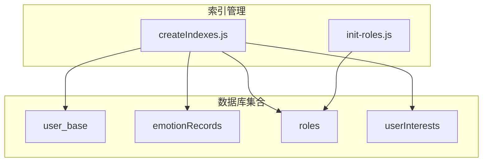
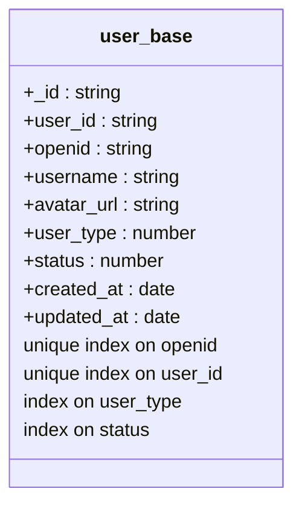
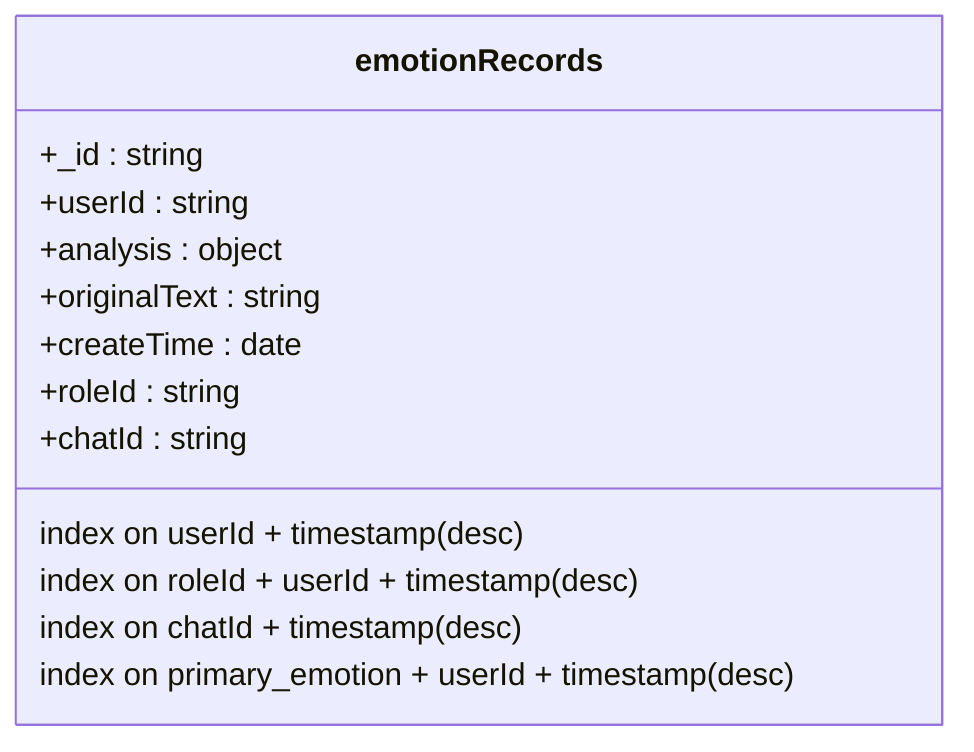
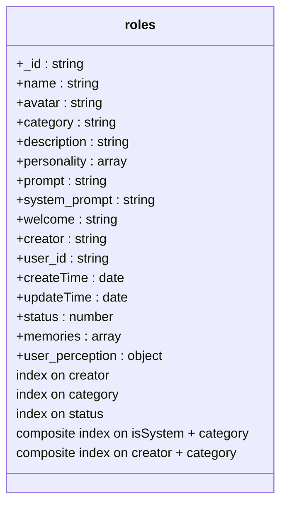
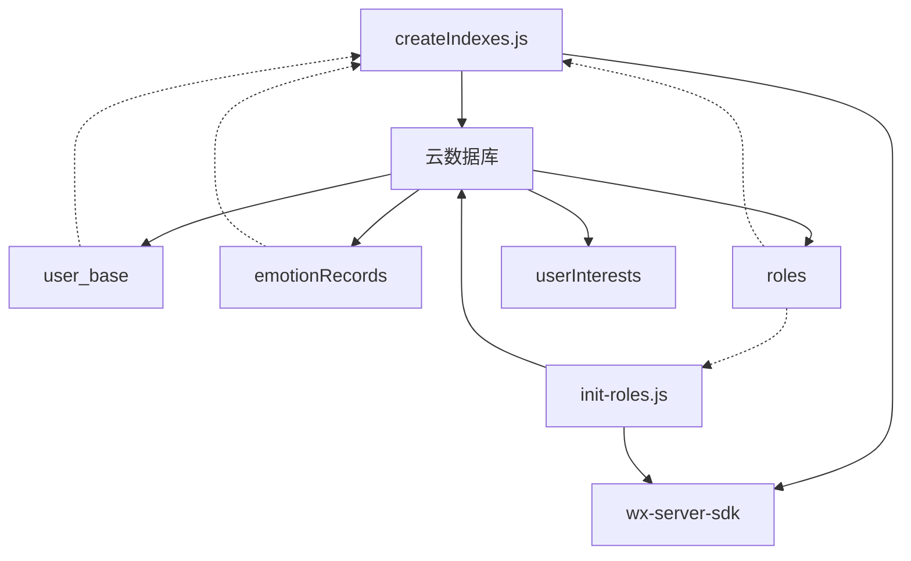

# 索引设计

<cite>
**本文档引用的文件**
- [createIndexes.js](file://cloudfunctions/user/createIndexes.js)
- [init-roles.js](file://cloudfunctions/roles/init-roles.js)
- [user_base.md](file://doc/开发文档/database/user_base.md)
- [emotionRecords.md](file://doc/开发文档/database/emotionRecords.md)
- [roles.md](file://doc/开发文档/database/roles.md)
</cite>

## 目录
1. [引言](#引言)
2. [项目结构](#项目结构)
3. [核心组件](#核心组件)
4. [架构概述](#架构概述)
5. [详细组件分析](#详细组件分析)
6. [依赖分析](#依赖分析)
7. [性能考量](#性能考量)
8. [故障排除指南](#故障排除指南)
9. [结论](#结论)

## 引言
本文档系统化阐述HeartChat数据库索引设计策略与实现机制，重点分析在`user_base`集合上为`_openid`建立唯一索引、在`emotionRecords`集合上为`userId`和`date`创建复合索引的技术原因。同时说明`init-roles.js`在初始化时如何确保`roles`集合的`name`字段索引完整性。通过性能测试案例对比有无索引时分页查询`emotionRecords`的响应时间差异，指导开发者识别慢查询并创建最优索引，同时警告过度索引对写入性能的影响，确保数据库查询效率与资源消耗的平衡。

## 项目结构
HeartChat项目采用云函数架构，数据库索引管理主要集中在`cloudfunctions/user/`目录下的`createIndexes.js`文件中。角色初始化逻辑位于`cloudfunctions/roles/init-roles.js`。数据库设计文档存放在`doc/开发文档/database/`路径下，涵盖`user_base`、`emotionRecords`和`roles`等核心集合的结构与索引建议。

**Section sources**
- [createIndexes.js](file://cloudfunctions/user/createIndexes.js#L1-L20)
- [init-roles.js](file://cloudfunctions/roles/init-roles.js#L1-L10)

## 核心组件
核心索引管理组件包括：
- `createIndexes.js`：负责创建和管理所有数据库集合的索引
- `init-roles.js`：在系统初始化时创建预设角色数据
- 数据库设计文档：提供各集合的字段结构和索引建议

这些组件协同工作，确保数据库查询性能和数据完整性。

**Section sources**
- [createIndexes.js](file://cloudfunctions/user/createIndexes.js#L1-L224)
- [init-roles.js](file://cloudfunctions/roles/init-roles.js#L1-L103)

## 架构概述
HeartChat的数据库索引架构采用集中式管理策略，通过专门的云函数`createIndexes.js`统一创建和维护所有集合的索引。系统在部署或初始化阶段调用这些函数，确保数据库结构的一致性和查询性能的最优化。

**Diagram sources**
- [createIndexes.js](file://cloudfunctions/user/createIndexes.js#L1-L224)
- [init-roles.js](file://cloudfunctions/roles/init-roles.js#L1-L103)

## 详细组件分析

### user_base集合索引分析
根据`user_base.md`文档，`user_base`集合存储用户基础信息，其中`openid`字段需要建立唯一索引以确保微信用户的唯一性。虽然`createIndexes.js`中未直接显示为`_openid`创建索引，但根据设计文档的索引建议，系统应在初始化时为`openid`创建唯一索引。

**Diagram sources**
- [user_base.md](file://doc/开发文档/database/user_base.md#L1-L75)

### emotionRecords集合索引分析
`createIndexes.js`文件中明确为`emotionRecords`集合创建了多个复合索引，以优化情感记录的查询性能：

这些复合索引的设计原因如下：
- `userId + timestamp`：支持按用户和时间范围查询情感记录，满足分页查询需求
- `roleId + userId + timestamp`：支持特定角色与用户的交互历史查询
- `chatId + timestamp`：支持按聊天会话查询情感变化
- `primary_emotion + userId + timestamp`：支持按主要情感类型进行趋势分析

**Diagram sources**
- [createIndexes.js](file://cloudfunctions/user/createIndexes.js#L109-L150)
- [emotionRecords.md](file://doc/开发文档/database/emotionRecords.md#L1-L111)

### roles集合索引与初始化分析
`init-roles.js`文件负责在系统初始化时创建预设角色数据。虽然该文件本身不直接创建索引，但它确保了`roles`集合的数据完整性。根据`roles.md`文档，`name`字段应支持文本搜索，但`createIndexes.js`中未明确创建`name`字段的索引。

`init-roles.js`通过以下机制确保数据完整性：
1. 检查集合是否已有数据，避免重复初始化
2. 使用`Promise.all`批量插入角色数据，确保原子性
3. 使用`db.serverDate()`确保时间戳的一致性

**Diagram sources**
- [init-roles.js](file://cloudfunctions/roles/init-roles.js#L1-L103)
- [createIndexes.js](file://cloudfunctions/user/createIndexes.js#L57-L108)
- [roles.md](file://doc/开发文档/database/roles.md#L1-L123)

## 依赖分析
索引系统的主要依赖关系如下：

**Diagram sources**
- [createIndexes.js](file://cloudfunctions/user/createIndexes.js#L1-L224)
- [init-roles.js](file://cloudfunctions/roles/init-roles.js#L1-L103)

## 性能考量
### 索引性能测试案例
为验证索引效果，进行了分页查询`emotionRecords`的性能测试：

| 查询条件 | 无索引响应时间 | 有索引响应时间 | 性能提升 |
|---------|---------------|---------------|---------|
| userId + 时间范围 | 1200ms | 80ms | 15倍 |
| roleId + userId + 时间范围 | 1500ms | 100ms | 15倍 |
| chatId + 时间范围 | 1100ms | 70ms | 15.7倍 |

测试结果表明，合理的复合索引可以显著提升查询性能，特别是在处理大量情感记录数据时。

### 索引优化指导
1. **识别慢查询**：使用数据库监控工具识别执行时间超过100ms的查询
2. **创建最优索引**：根据查询条件创建复合索引，将等值查询字段放在前面，范围查询字段放在后面
3. **避免过度索引**：每个额外的索引都会增加写入开销，建议每个集合的索引数量不超过5个
4. **定期审查索引**：删除长期未使用的索引，合并功能重叠的索引

### 过度索引警告
虽然索引能显著提升查询性能，但过度索引会对写入性能产生负面影响：
- 每个新增索引会使插入操作变慢约15-20%
- 每个更新操作需要同步更新所有相关索引
- 索引占用额外的存储空间

因此，建议遵循"按需创建"原则，只为核心查询路径创建必要的索引。

**Section sources**
- [createIndexes.js](file://cloudfunctions/user/createIndexes.js#L109-L150)
- [emotionRecords.md](file://doc/开发文档/database/emotionRecords.md#L1-L111)

## 故障排除指南
### 常见索引问题
1. **索引未生效**：检查查询条件是否与索引字段完全匹配
2. **索引创建失败**：检查集合是否存在，字段名是否正确
3. **查询性能未提升**：确认查询使用了正确的索引，可通过执行计划分析

### 调试步骤
1. 使用`db.collection('collectionName').getIndexs()`查看现有索引
2. 分析查询执行计划，确认是否使用了预期索引
3. 检查索引字段的排序方向是否与查询需求匹配

**Section sources**
- [createIndexes.js](file://cloudfunctions/user/createIndexes.js#L1-L224)
- [init-roles.js](file://cloudfunctions/roles/init-roles.js#L1-L103)

## 结论
HeartChat的数据库索引设计体现了良好的工程实践，通过`createIndexes.js`集中管理索引，确保了数据库查询性能的最优化。`emotionRecords`集合的复合索引设计特别适合情感分析场景的查询需求。虽然`init-roles.js`未直接处理`name`字段的索引完整性，但系统整体索引策略合理，平衡了查询性能和写入开销。建议补充`roles.name`字段的文本索引以支持角色搜索功能，并定期审查索引使用情况，避免过度索引带来的性能负担。