# 集合结构

<cite>
**本文档引用文件**   
- [user_base.md](file://doc/开发文档/database/user_base.md)
- [user_profile.md](file://doc/开发文档/database/user_profile.md)
- [user_config.md](file://doc/开发文档/database/user_config.md)
- [chats.md](file://doc/开发文档/database/chats.md)
- [messages.md](file://doc/开发文档/database/messages.md)
- [emotionRecords.md](file://doc/开发文档/database/emotionRecords.md)
- [roles.md](file://doc/开发文档/database/roles.md)
- [userInterests.md](file://doc/开发文档/database/userInterests.md)
- [userReports.md](file://doc/开发文档/database/userReports.md)
- [HeartChat数据库结构图.html](file://doc/设计文档/流程图/html/HeartChat数据库结构图.html)
- [HeartChat数据库ER图.html](file://doc/设计文档/流程图/html/HeartChat数据库ER图.html)
- [数据库设计方案.md](file://doc/开发文档/数据库设计方案.md)
</cite>

## 目录
1. [引言](#引言)
2. [核心集合关系](#核心集合关系)
3. [用户相关集合](#用户相关集合)
4. [角色相关集合](#角色相关集合)
5. [聊天相关集合](#聊天相关集合)
6. [情感与报告集合](#情感与报告集合)
7. [数据访问路径示例](#数据访问路径示例)
8. [数据分片与命名规范](#数据分片与命名规范)
9. [索引策略](#索引策略)
10. [结论](#结论)

## 引言
HeartChat项目采用云开发NoSQL文档型数据库，其数据模型围绕用户、AI角色、聊天交互和情感分析四大核心构建。本文档旨在全面阐述`user_base`、`user_profile`、`user_config`、`chats`、`messages`、`emotionRecords`、`roles`、`userInterests`、`userReports`等核心集合的设计理念、实体关系及数据拓扑结构。通过详细说明集合间的关联方式、典型数据访问路径以及索引策略，为开发者提供清晰的数据架构蓝图，确保系统的高效、稳定与可维护性。

## 核心集合关系
HeartChat的数据库采用引用式关联，通过`userId`、`openId`或`roleId`等字段在不同集合间建立联系，形成一个以用户为中心的网状数据结构。

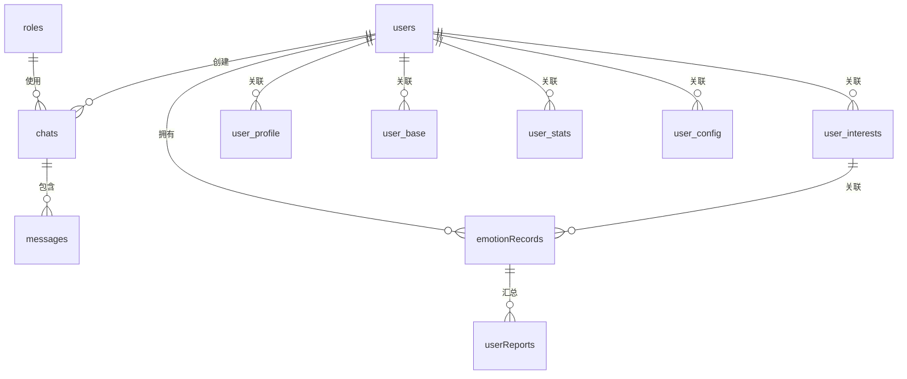

**Diagram sources**
- [HeartChat数据库结构图.html](file://doc/设计文档/流程图/html/HeartChat数据库结构图.html#L1-L100)

## 用户相关集合

### user_base 集合
`user_base`集合存储用户的核心账户信息，是用户数据体系的基石。

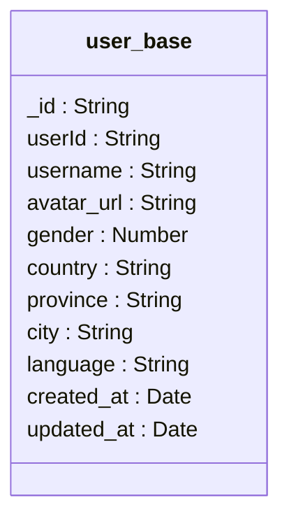

**Diagram sources**
- [user_base.md](file://doc/开发文档/database/user_base.md#L1-L75)

### user_profile 集合
`user_profile`集合存储用户的详细个人资料，用于构建用户画像和提供个性化服务。

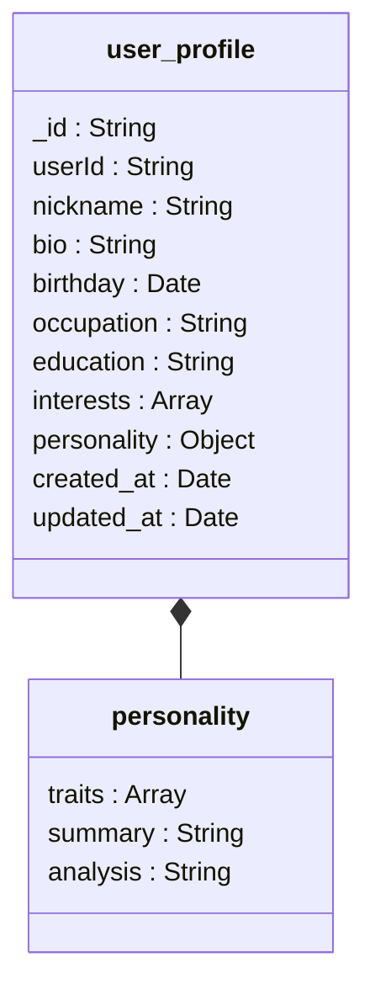

**Diagram sources**
- [user_profile.md](file://doc/开发文档/database/user_profile.md#L1-L81)

### user_config 集合
`user_config`集合存储用户的个性化配置，涵盖界面、通知、隐私等多维度设置。

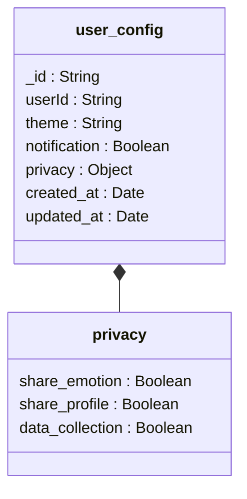

**Diagram sources**
- [user_config.md](file://doc/开发文档/database/user_config.md#L1-L156)

**Section sources**
- [user_base.md](file://doc/开发文档/database/user_base.md)
- [user_profile.md](file://doc/开发文档/database/user_profile.md)
- [user_config.md](file://doc/开发文档/database/user_config.md)

## 角色相关集合

### roles 集合
`roles`集合存储所有AI角色的完整信息，包括提示词、性格和记忆。

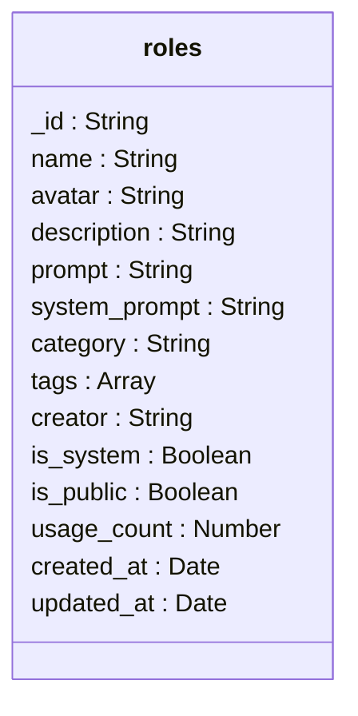

**Diagram sources**
- [roles.md](file://doc/开发文档/database/roles.md#L1-L123)

**Section sources**
- [roles.md](file://doc/开发文档/database/roles.md)

## 聊天相关集合

### chats 集合
`chats`集合存储用户与AI角色的会话元数据，是聊天功能的核心。

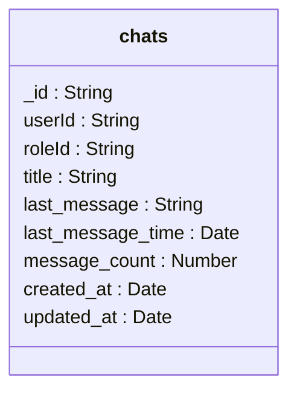

**Diagram sources**
- [chats.md](file://doc/开发文档/database/chats.md#L1-L67)

### messages 集合
`messages`集合存储会话中的所有消息记录，支持分段和状态跟踪。

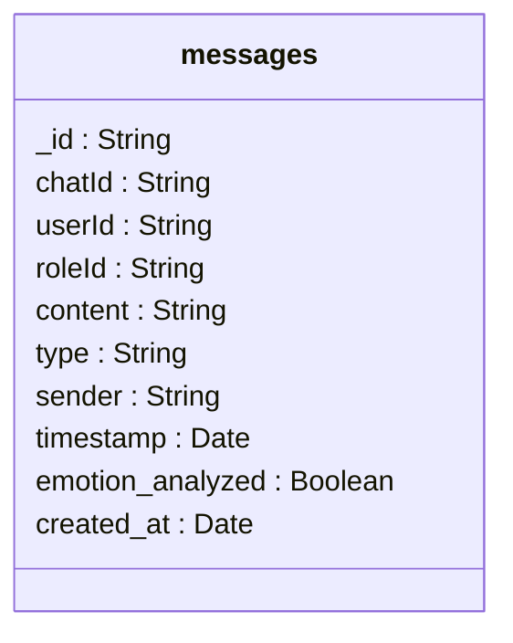

**Diagram sources**
- [messages.md](file://doc/开发文档/database/messages.md#L1-L89)

**Section sources**
- [chats.md](file://doc/开发文档/database/chats.md)
- [messages.md](file://doc/开发文档/database/messages.md)

## 情感与报告集合

### emotionRecords 集合
`emotionRecords`集合存储由AI分析生成的用户情感记录，包含详细的情感维度和关键词。

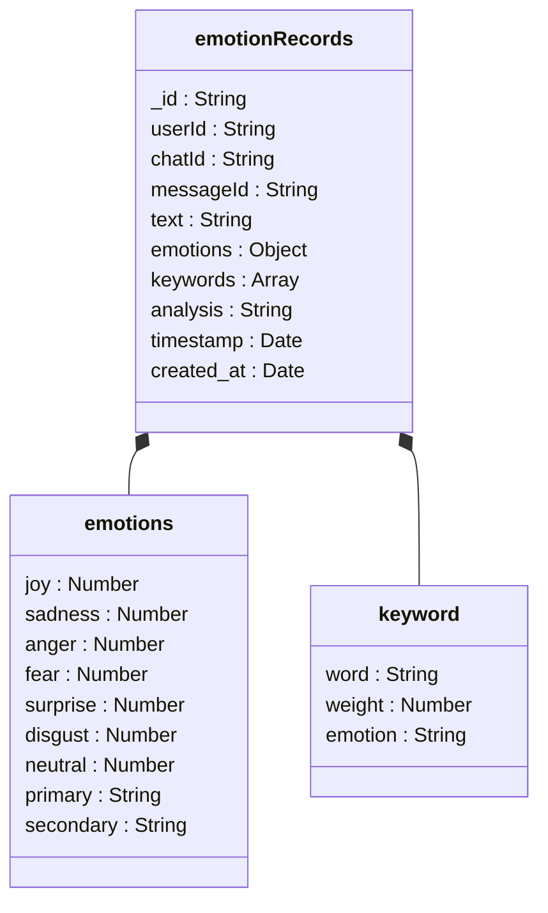

**Diagram sources**
- [emotionRecords.md](file://doc/开发文档/database/emotionRecords.md#L1-L111)

### userInterests 集合
`userInterests`集合存储用户动态生成的兴趣标签和分类，用于个性化推荐。

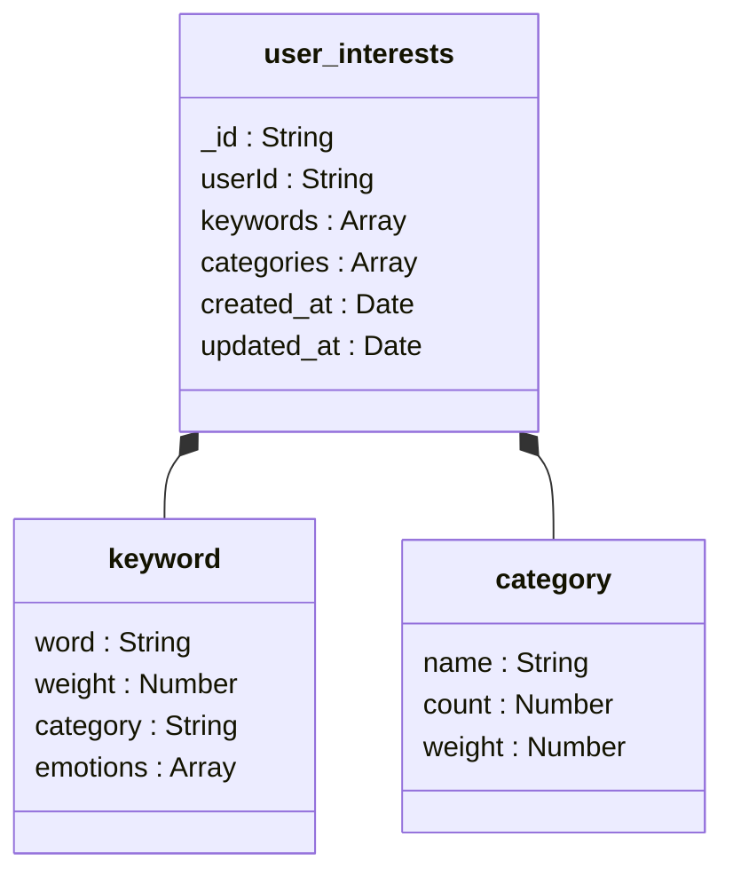

**Diagram sources**
- [userInterests.md](file://doc/开发文档/database/userInterests.md#L1-L121)

### userReports 集合
`userReports`集合存储每日生成的用户心情报告，汇总了情感、洞察和建议。

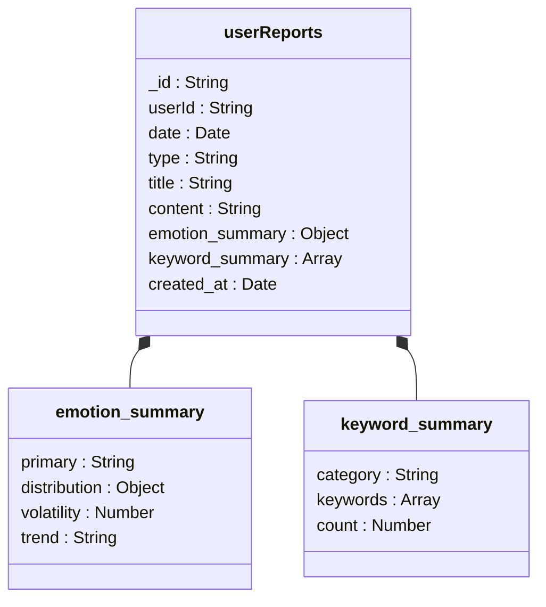

**Diagram sources**
- [userReports.md](file://doc/开发文档/database/userReports.md#L1-L177)

**Section sources**
- [emotionRecords.md](file://doc/开发文档/database/emotionRecords.md)
- [userInterests.md](file://doc/开发文档/database/userInterests.md)
- [userReports.md](file://doc/开发文档/database/userReports.md)

## 数据访问路径示例
典型的业务数据访问遵循链式查询模式，通过关联字段逐层获取数据。

### 用户→聊天会话→消息记录
这是最核心的访问路径，用于加载聊天界面。

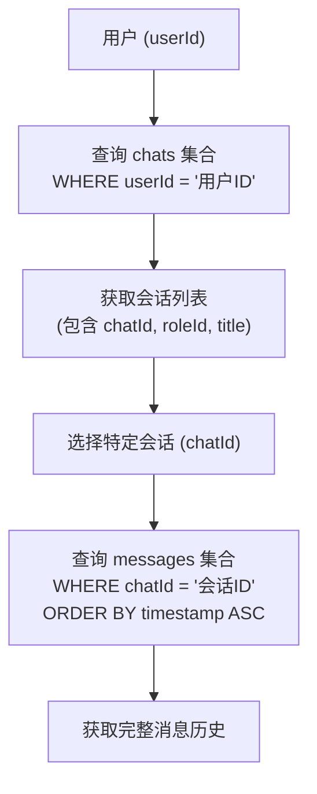

**Diagram sources**
- [chats.md](file://doc/开发文档/database/chats.md#L1-L67)
- [messages.md](file://doc/开发文档/database/messages.md#L1-L89)

### 用户→情绪记录→每日报告
此路径用于展示用户的情绪历史和分析报告。

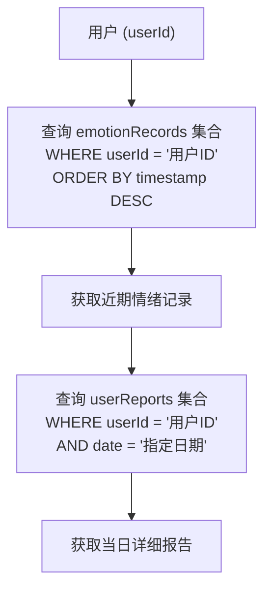

**Diagram sources**
- [emotionRecords.md](file://doc/开发文档/database/emotionRecords.md#L1-L111)
- [userReports.md](file://doc/开发文档/database/userReports.md#L1-L177)

## 数据分片与命名规范
### 数据分片策略
由于采用云开发数据库，数据分片主要由云平台自动管理。开发者应通过以下方式优化：
1.  **时间分片**：对于`messages`和`emotionRecords`等高增长集合，利用`timestamp`或`date`字段进行范围查询，云平台可高效地将数据分布在不同分片上。
2.  **用户分片**：所有集合均以`userId`或`openId`作为主要查询条件，这天然地将数据按用户隔离，非常适合分布式存储。

### 集合命名规范
集合名称采用小写蛇形命名法（snake_case），清晰表达其业务含义：
-   `user_base`：用户基础信息
-   `user_profile`：用户详细资料
-   `user_config`：用户配置
-   `chats`：聊天会话
-   `messages`：消息记录
-   `emotionRecords`：情绪记录
-   `roles`：AI角色
-   `userInterests`：用户兴趣
-   `userReports`：用户报告

**Section sources**
- [数据库设计方案.md](file://doc/开发文档/数据库设计方案.md#L1-L233)

## 索引策略
合理的索引是保证查询性能的关键。核心索引如下：

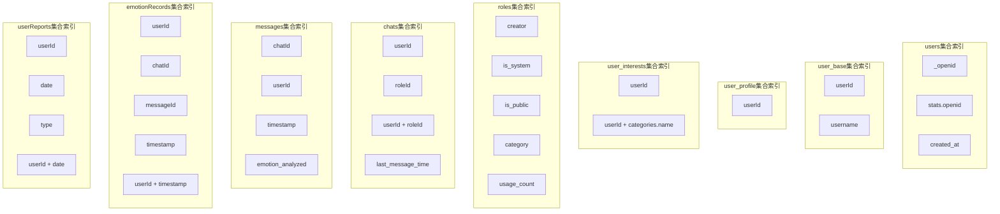

**Diagram sources**
- [HeartChat数据库结构图.html](file://doc/设计文档/流程图/html/HeartChat数据库结构图.html#L593-L637)
- [HeartChat数据库ER图.html](file://doc/设计文档/流程图/html/HeartChat数据库ER图.html#L442-L503)

## 结论
HeartChat的数据库结构设计清晰、高效，通过`userId`、`openId`和`roleId`等关键字段将各个集合紧密关联。该设计支持了从用户认证、聊天交互到情感分析和报告生成的完整业务流程。通过遵循文档中阐述的命名规范、索引策略和数据访问模式，开发者可以高效地进行开发和维护，确保系统在高并发场景下的稳定性和响应速度。