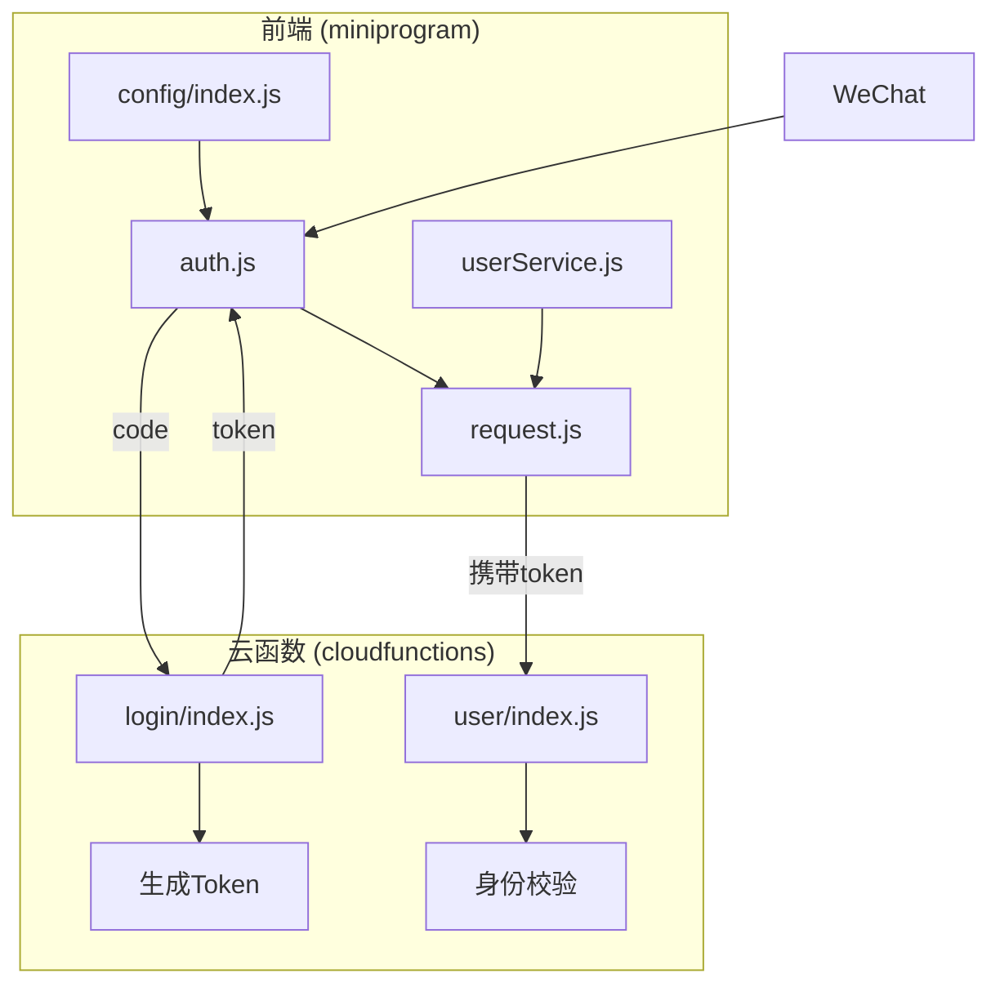
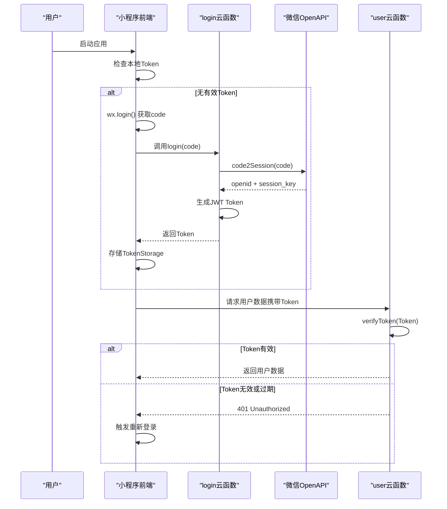
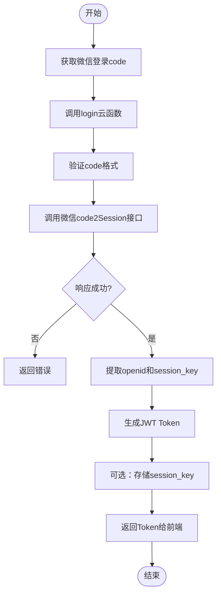
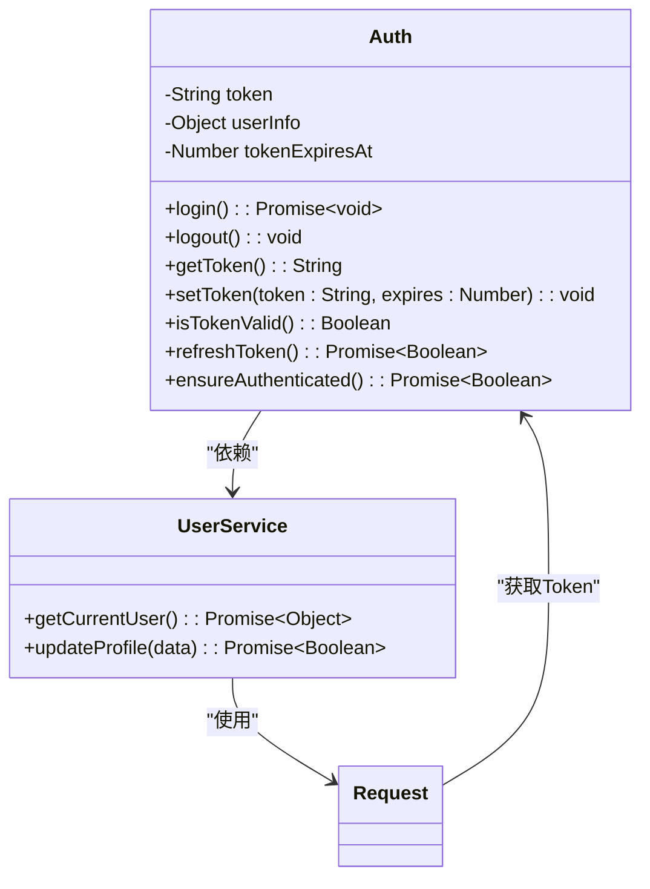

# 认证授权流程

<cite>
**本文档引用文件**  
- [login/index.js](file://cloudfunctions/login/index.js)
- [utils/auth.js](file://miniprogram/utils/auth.js)
- [services/userService.js](file://miniprogram/services/userService.js)
- [config/index.js](file://miniprogram/config/index.js)
- [utils/request.js](file://miniprogram/utils/request.js)
- [cloudfunctions/user/index.js](file://cloudfunctions/user/index.js)
- [doc/开发文档/cloudfunctions/login.md](file://doc/开发文档/cloudfunctions/login.md)
</cite>

## 目录

1. [简介](#简介)
2. [项目结构](#项目结构)
3. [核心组件](#核心组件)
4. [架构概览](#架构概览)
5. [详细组件分析](#详细组件分析)
6. [依赖分析](#依赖分析)
7. [性能考虑](#性能考虑)
8. [故障排查指南](#故障排查指南)
9. [结论](#结论)

## 简介

HeartChat 是一款专注于情绪管理与心理健康支持的小程序应用，其用户认证与授权机制基于微信生态体系构建，采用云函数实现后端逻辑，通过自定义 token 实现会话管理。本系统确保用户身份安全、数据隔离及操作合法性，涵盖从登录到敏感操作验证的完整链路。

## 项目结构

HeartChat 的认证相关代码分布在前端小程序与云函数两个主要模块中：

- **云函数层**：`cloudfunctions/login` 负责处理微信登录凭证并生成自定义 token；`cloudfunctions/user` 提供用户信息查询接口。
- **前端层**：`miniprogram/utils/auth.js` 封装认证逻辑；`miniprogram/services/userService.js` 处理用户服务调用；`miniprogram/utils/request.js` 实现请求拦截器以自动附加 token。



**图示来源**  
- [login/index.js](file://cloudfunctions/login/index.js#L1-L50)
- [utils/auth.js](file://miniprogram/utils/auth.js#L1-L40)
- [utils/request.js](file://miniprogram/utils/request.js#L10-L30)

**本节来源**  
- [cloudfunctions/login/index.js](file://cloudfunctions/login/index.js#L1-L20)
- [miniprogram/utils/auth.js](file://miniprogram/utils/auth.js#L1-L15)

## 核心组件

HeartChat 的认证授权机制由三大核心组件构成：

1. **登录云函数（login）**：接收微信登录凭证 `code`，调用微信接口换取 `openid` 和 `session_key`，生成并返回自定义登录态 `token`。
2. **前端认证工具类（auth.js）**：封装登录流程、token 存储与刷新逻辑，提供统一的认证接口。
3. **请求拦截器（request.js）**：在每次请求前自动附加当前用户的 `token`，实现无感认证。

这些组件协同工作，形成闭环的身份验证链路，保障用户数据安全与访问合法性。

**本节来源**  
- [login/index.js](file://cloudfunctions/login/index.js#L25-L100)
- [utils/auth.js](file://miniprogram/utils/auth.js#L15-L80)
- [utils/request.js](file://miniprogram/utils/request.js#L20-L60)

## 架构概览

整个认证授权流程遵循标准的 OAuth 风格设计，结合微信开放能力与自定义 token 机制，实现安全高效的用户身份管理。



**图示来源**  
- [login/index.js](file://cloudfunctions/login/index.js#L10-L50)
- [user/index.js](file://cloudfunctions/user/index.js#L20-L40)
- [utils/auth.js](file://miniprogram/utils/auth.js#L30-L70)

## 详细组件分析

### 登录云函数分析

`login/index.js` 是认证流程的入口点，负责将微信 `code` 转换为平台内部使用的 `token`。

#### 登录流程实现


**图示来源**  
- [login/index.js](file://cloudfunctions/login/index.js#L15-L60)

**本节来源**  
- [login/index.js](file://cloudfunctions/login/index.js#L1-L100)
- [doc/开发文档/cloudfunctions/login.md](file://doc/开发文档/cloudfunctions/login.md#L1-L50)

### 前端认证工具类分析

`utils/auth.js` 提供了统一的认证接口，封装了登录、登出、token 管理等核心功能。

#### Auth工具类结构


**图示来源**  
- [utils/auth.js](file://miniprogram/utils/auth.js#L10-L50)
- [services/userService.js](file://miniprogram/services/userService.js#L5-L20)

#### 请求拦截器工作流程
```mermaid
flowchart TD
A[发起请求] --> B{是否需要认证?}
B --> |否| C[直接发送]
B --> |是| D[调用auth.getToken()]
D --> E{Token是否存在且有效?}
E --> |否| F[触发重新登录]
E --> |是| G[在Header中添加Authorization: Bearer <token>]
G --> H[发送请求]
H --> I{响应状态码为401?}
I --> |是| J[清除Token并跳转登录]
I --> |否| K[正常处理响应]
```

**图示来源**  
- [utils/request.js](file://miniprogram/utils/request.js#L25-L80)
- [utils/auth.js](file://miniprogram/utils/auth.js#L60-L90)

**本节来源**  
- [utils/auth.js](file://miniprogram/utils/auth.js#L1-L100)
- [utils/request.js](file://miniprogram/utils/request.js#L1-L100)

## 依赖分析

认证系统涉及多个模块之间的协作，其依赖关系如下：

```mermaid
graph LR
auth.js --> storage.js : "存储Token"
auth.js --> request.js : "触发登录后刷新请求"
request.js --> auth.js : "获取当前Token"
userService.js --> request.js : "发起带认证的请求"
login云函数 --> 微信API : "code2Session"
user云函数 --> auth中间件 : "验证Token"
config/index.js --> auth.js : "提供Token有效期配置"
```

**图示来源**  
- [utils/auth.js](file://miniprogram/utils/auth.js#L5-L15)
- [utils/request.js](file://miniprogram/utils/request.js#L10-L20)
- [config/index.js](file://miniprogram/config/index.js#L1-L10)

**本节来源**  
- [utils/auth.js](file://miniprogram/utils/auth.js#L1-L120)
- [utils/request.js](file://miniprogram/utils/request.js#L1-L90)
- [config/index.js](file://miniprogram/config/index.js#L1-L20)

## 性能考虑

- **Token生成效率**：使用轻量级 JWT 算法，避免数据库查询，提升登录响应速度。
- **缓存策略**：前端缓存 `token` 和 `userInfo`，减少重复请求。
- **异步初始化**：应用启动时异步检查登录状态，不影响主界面渲染。
- **防抖机制**：对频繁触发的认证操作进行节流控制，防止重复登录请求。

## 故障排查指南

### 常见问题及解决方法

| 问题现象 | 可能原因 | 排查步骤 |
|--------|--------|--------|
| 登录失败 | 网络异常、code无效、云函数错误 | 检查网络连接；确认 `wx.login()` 成功执行；查看云函数日志 |
| 会话过期 | Token超时、手动登出、缓存清除 | 检查 `tokenExpiresAt` 时间戳；确认是否调用 `logout()`；检查 Storage 是否被清理 |
| 请求被拒（401） | Token未携带、格式错误、已失效 | 检查请求头是否包含 `Authorization`；验证 Token 格式；尝试重新登录 |
| 用户数据加载失败 | 接口权限不足、数据库查询错误 | 确认云函数返回 401 或 500；检查用户集合读写权限规则 |

**本节来源**  
- [login/index.js](file://cloudfunctions/login/index.js#L70-L90)
- [user/index.js](file://cloudfunctions/user/index.js#L40-L60)
- [utils/auth.js](file://miniprogram/utils/auth.js#L80-L100)

## 结论

HeartChat 的认证授权机制设计合理、流程清晰，结合微信生态与自定义 token 实现了安全可靠的身份管理。通过 `login` 云函数完成身份交换，`auth.js` 统一管理认证状态，`request.js` 自动附加凭证，形成了完整的认证闭环。建议持续关注 token 安全性、会话劫持防护，并定期审计权限策略以应对潜在风险。