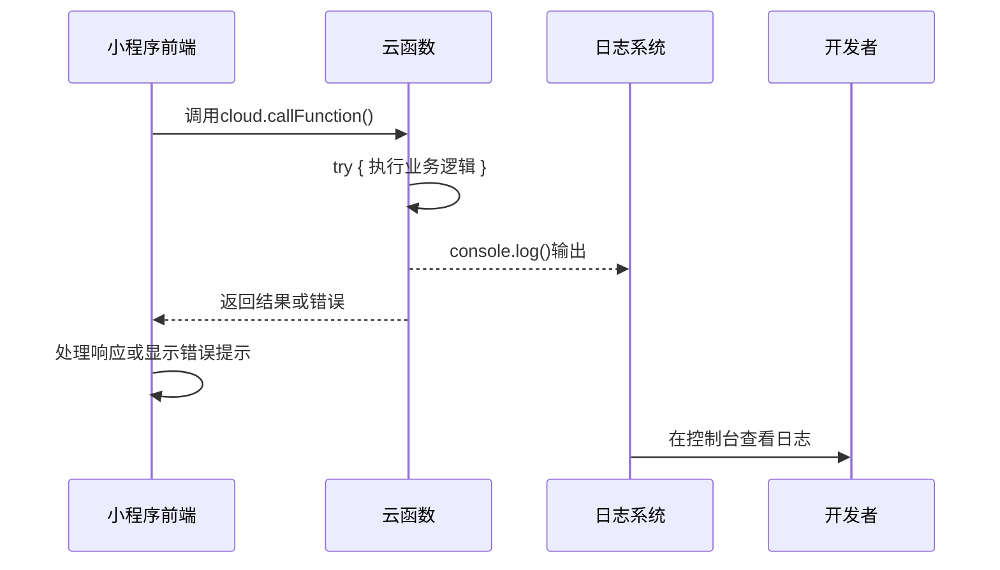

# 开发指南

<cite>
**本文档引用文件**  
- [package.json](file://package.json)
- [cloudfunctions/analysis/index.js](file://cloudfunctions/analysis/index.js)
- [cloudfunctions/chat/index.js](file://cloudfunctions/chat/index.js)
- [miniprogram/app.js](file://miniprogram/app.js)
- [miniprogram/utils/request.js](file://miniprogram/utils/request.js)
- [miniprogram/services/cloudFuncCaller.js](file://miniprogram/services/cloudFuncCaller.js)
- [miniprogram/__tests__/app.test.ts](file://miniprogram/__tests__/app.test.ts)
- [cloudfunctions/httpRequest/test.js](file://cloudfunctions/httpRequest/test.js)
- [doc/开发文档/cloudfunctions/analysis.md](file://doc/开发文档/cloudfunctions/analysis.md)
- [doc/使用文档/Gemini_API配置指南.md](file://doc/使用文档/Gemini_API配置指南.md)
- [doc/参考文档/讯飞语音api文档.md](file://doc/参考文档/讯飞语音api文档.md)
- [doc/设计文档/流程图/HeartChat系统架构图.md](file://doc/设计文档/流程图/HeartChat系统架构图.md)
</cite>

## 目录
1. [简介](#简介)
2. [项目结构](#项目结构)
3. [环境搭建](#环境搭建)
4. [代码规范](#代码规范)
5. [调试技巧](#调试技巧)
6. [测试策略](#测试策略)
7. [结论](#结论)

## 简介
本指南旨在为开发者提供一份全面的开发实践手册，涵盖HeartChat项目的本地环境配置、代码风格统一、调试方法以及测试策略。通过遵循本指南，开发者可以快速上手项目开发，确保代码质量与团队协作效率。

## 项目结构
HeartChat项目采用微信小程序+云开发架构，主要分为前端小程序（miniprogram）和后端云函数（cloudfunctions）两大模块，辅以完善的文档体系（doc）支持开发与维护。

```mermaid
graph TB
subgraph "前端"
MP[miniprogram]
MP --> Components[组件]
MP --> Pages[页面]
MP --> Services[服务层]
MP --> Utils[工具函数]
end
subgraph "后端"
CF[cloudfunctions]
CF --> Analysis[分析类云函数]
CF --> Chat[聊天类云函数]
CF --> User[用户类云函数]
CF --> Roles[角色类云函数]
end
subgraph "文档"
DOC[doc]
DOC --> 使用文档
DOC --> 开发文档
DOC --> 设计文档
end
MP < --> CF
DOC -.-> MP & CF
```

**图示来源**  
- [miniprogram](file://miniprogram)
- [cloudfunctions](file://cloudfunctions)
- [doc](file://doc)

**本节来源**  
- [miniprogram](file://miniprogram)
- [cloudfunctions](file://cloudfunctions)

## 环境搭建
### 依赖安装
项目依赖通过npm管理，需先安装Node.js环境（建议v16+），然后执行：
```bash
npm install
```
该命令将安装`package.json`中定义的所有依赖项，包括前端构建工具与云函数运行时依赖。

### 云开发环境配置
1. 安装微信开发者工具（最新版）
2. 导入项目并绑定微信小程序AppID
3. 在开发者工具中启用“云开发”功能
4. 初始化云环境（需提前在微信公众平台创建云开发环境）

### 第三方API密钥配置
- **Gemini API**：参照[doc/使用文档/Gemini_API配置指南.md](file://doc/使用文档/Gemini_API配置指南.md)设置API密钥
- **讯飞语音API**：参照[doc/参考文档/讯飞语音api文档.md](file://doc/参考文档/讯飞语音api文档.md)完成SDK集成与密钥配置
- **Dify平台**：配置`dify`目录下的对话流与情感分析YAML文件

**本节来源**  
- [package.json](file://package.json)
- [doc/使用文档/Gemini_API配置指南.md](file://doc/使用文档/Gemini_API配置指南.md)
- [doc/参考文档/讯飞语音api文档.md](file://doc/参考文档/讯飞语音api文档.md)
- [dify](file://dify)

## 代码规范
### ESLint规则
项目采用ESLint进行JavaScript代码质量检查，核心规则包括：
- 强制使用`const`/`let`，禁止`var`
- 函数参数与变量命名采用camelCase
- 禁止未使用的变量（no-unused-vars）
- 强制使用分号结尾
- 缩进使用2个空格

### Prettier格式化
Prettier用于统一代码格式，关键配置：
- 单行最大长度80字符
- 使用单引号
- 对象属性间换行优化
- JSX元素自动换行

### 配置文件位置
- `.eslintrc.js`：ESLint配置
- `.prettierrc`：Prettier配置
- `.editorconfig`：编辑器通用配置

建议在IDE中安装相应插件以实现保存时自动格式化。

**本节来源**  
- [package.json](file://package.json)
- [.eslintrc.js](file://.eslintrc.js)
- [.prettierrc](file://.prettierrc)
- [.editorconfig](file://.editorconfig)

## 调试技巧
### 云函数调试
1. **本地日志输出**：在云函数中使用`console.log()`输出调试信息，在开发者工具“云开发控制台”中查看
2. **断点调试**：微信开发者工具支持云函数断点调试，可在`index.js`入口文件设置断点
3. **模拟调用**：通过`test.js`测试文件模拟云函数调用，如`cloudfunctions/httpRequest/test.js`

### 前端页面调试
1. **小程序调试器**：使用微信开发者工具的WXML面板、Sources面板进行DOM与JS调试
2. **网络请求监控**：在“Network”标签页查看云函数调用与API请求详情
3. **事件监听**：利用`eventBus.js`服务进行跨组件事件调试

### 异常处理
- 所有云函数调用应使用`cloudFuncCaller.js`封装，统一处理错误
- 前端异常捕获通过`app.js`中的`onError`全局监听
- 关键操作添加try-catch并记录上下文日志



**图示来源**  
- [miniprogram/services/cloudFuncCaller.js](file://miniprogram/services/cloudFuncCaller.js)
- [cloudfunctions/analysis/index.js](file://cloudfunctions/analysis/index.js)
- [miniprogram/app.js](file://miniprogram/app.js)

**本节来源**  
- [miniprogram/services/cloudFuncCaller.js](file://miniprogram/services/cloudFuncCaller.js)
- [cloudfunctions/*/index.js](file://cloudfunctions)
- [miniprogram/app.js](file://miniprogram/app.js)

## 测试策略
### 单元测试
位于`miniprogram/__tests__`目录，使用Jest框架：
- 测试文件命名以`.test.ts`结尾
- 覆盖核心服务逻辑，如`userService`、`emotionService`
- 模拟云函数调用与API请求

示例测试路径：[miniprogram/__tests__/app.test.ts](file://miniprogram/__tests__/app.test.ts)

### 集成测试
位于各云函数目录下的`test.js`文件：
- 验证云函数接口输入输出
- 测试与其他云函数或外部API的集成
- 包含异常路径测试（如网络超时、鉴权失败）

示例测试路径：[cloudfunctions/httpRequest/test.js](file://cloudfunctions/httpRequest/test.js)

### 测试执行
```bash
# 运行前端单元测试
npm run test

# 部署并测试云函数
npm run deploy:cloud && npm run test:cloud
```

### 测试覆盖率
建议关键模块测试覆盖率不低于80%，可通过`--coverage`参数生成报告。

**本节来源**  
- [miniprogram/__tests__](file://miniprogram/__tests__)
- [cloudfunctions/*/test.js](file://cloudfunctions)
- [package.json](file://package.json)

## 结论
本开发指南系统性地介绍了HeartChat项目的开发全流程，从环境搭建到代码规范，再到调试与测试策略。开发者应严格遵守代码规范，善用调试工具，并坚持测试驱动开发原则，以保障项目稳定性和可维护性。随着项目演进，相关文档将持续更新，请定期查阅最新版本。