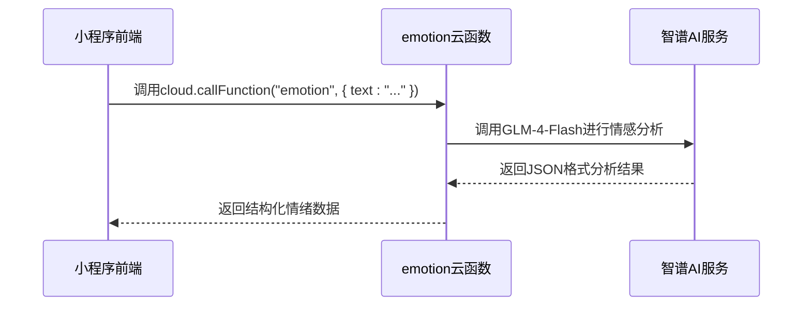

# 快速入门

<cite>
**本文档中引用的文件**  
- [README.md](file://README.md)
- [cloudfunctions/emotion/index.js](file://cloudfunctions/emotion/index.js)
- [cloudfunctions/emotion/package.json](file://cloudfunctions/emotion/package.json)
- [miniprogram/services/cloudFuncCaller.js](file://miniprogram/services/cloudFuncCaller.js)
- [miniprogram/pages/welcome/welcome.js](file://miniprogram/pages/welcome/welcome.js)
- [miniprogram/config/index.js](file://miniprogram/config/index.js)
- [project.config.json](file://project.config.json)
</cite>

## 目录

1. [项目简介](#项目简介)
2. [环境准备](#环境准备)
3. [克隆与初始化项目](#克隆与初始化项目)
4. [导入微信开发者工具](#导入微信开发者工具)
5. [云函数本地调试与部署](#云函数本地调试与部署)
6. [调用第一个云函数：情绪分析](#调用第一个云函数情绪分析)
7. [关键目录与文件说明](#关键目录与文件说明)
8. [常见初始化问题与解决方案](#常见初始化问题与解决方案)
9. [端到端小任务：修改欢迎语](#端到端小任务修改欢迎语)
10. [下一步学习建议](#下一步学习建议)

## 项目简介

心语精灵是一款基于微信小程序云开发的情感陪伴与情商提升应用。本快速入门指南旨在帮助新手开发者快速搭建开发环境，理解项目结构，并成功运行第一个功能。

**Section sources**
- [README.md](file://README.md#L1-L50)

## 环境准备

在开始之前，请确保您的开发环境已安装以下工具：

- **微信开发者工具**：最新稳定版本，支持云开发功能。
- **Node.js**：版本 16 或以上，用于云函数依赖管理。
- **Git**：用于克隆项目仓库。

## 克隆与初始化项目

1. 打开终端，执行以下命令克隆项目：
   ```bash
   git clone https://github.com/your-repo/HeartChat.git
   cd HeartChat
   ```
2. 安装前端依赖：
   ```bash
   npm install
   ```
3. 进入任意云函数目录（如 `emotion`），安装其依赖：
   ```bash
   cd cloudfunctions/emotion
   npm install
   ```

**Section sources**
- [package.json](file://package.json#L1-L20)
- [cloudfunctions/emotion/package.json](file://cloudfunctions/emotion/package.json#L1-L10)

## 导入微信开发者工具

1. 打开微信开发者工具。
2. 选择“导入项目”。
3. 项目目录选择 ``。
4. 填写合法的 AppID（可使用测试号）。
5. 点击“导入”，项目将自动加载。

**Section sources**
- [project.config.json](file://project.config.json#L1-L15)

## 云函数本地调试与部署

### 本地调试

1. 在微信开发者工具中，右键点击 `cloudfunctions/emotion`。
2. 选择“在本地模拟器中运行”。
3. 查看控制台输出，确认函数启动成功。

### 云端部署

1. 右键点击 `cloudfunctions/emotion`。
2. 选择“上传并部署：云端安装依赖（不上传node_modules）”。
3. 部署完成后，云函数将出现在云开发控制台。

**Section sources**
- [cloudfunctions/emotion/index.js](file://cloudfunctions/emotion/index.js#L1-L30)

## 调用第一个云函数：情绪分析

1. 在开发者工具中打开 `miniprogram/services/cloudFuncCaller.js`。
2. 找到 `callEmotionFunction` 方法。
3. 在页面中调用该方法，传入一段文本，例如：
   ```javascript
   const result = await callEmotionFunction("今天心情很好！");
   console.log(result);
   ```
4. 查看返回结果，应包含情绪类型（如“喜悦”）、强度和建议。



**Diagram sources**
- [cloudfunctions/emotion/index.js](file://cloudfunctions/emotion/index.js#L15-L40)
- [miniprogram/services/cloudFuncCaller.js](file://miniprogram/services/cloudFuncCaller.js#L20-L50)

## 关键目录与文件说明

### cloudfunctions（云函数目录）
- **emotion**：情绪分析核心云函数，处理文本并返回情绪标签。
- **chat**：聊天逻辑处理，与AI模型交互。
- **roles**：角色管理与记忆机制。
- **user**：用户信息与兴趣分析。

### miniprogram（小程序前端）
- **pages**：主包页面，如欢迎页、首页。
- **components**：可复用UI组件，如情绪面板、角色卡片。
- **services**：业务逻辑封装，如云函数调用、缓存管理。
- **config**：项目配置，如API密钥、模型参数。

### doc（文档目录）
- **使用文档**：各功能使用指南。
- **开发文档**：模块设计与接口说明。
- **设计文档**：系统架构与流程图。

**Section sources**
- [README.md](file://README.md#L800-L900)
- [project.config.json](file://project.config.json#L1-L20)

## 常见初始化问题与解决方案

| 问题现象 | 可能原因 | 解决方案 |
|--------|--------|--------|
| 云函数部署失败 | 未登录或环境ID错误 | 检查微信开发者工具登录状态和环境配置 |
| npm install 报错 | 网络问题或权限不足 | 使用国内镜像源 `npm config set registry https://registry.npmmirror.com` |
| 无法调用云函数 | 未部署或名称错误 | 确认云函数已成功部署且调用名称匹配 |
| 页面空白 | 配置文件缺失 | 检查 `app.json` 和 `project.config.json` 是否完整 |

**Section sources**
- [README.md](file://README.md#L1000-L1100)

## 端到端小任务：修改欢迎语

1. 打开 `miniprogram/pages/welcome/welcome.js`。
2. 找到 `data` 中的 `welcomeText` 字段。
3. 修改其值，例如：
   ```javascript
   welcomeText: "欢迎来到心语精灵，让我们开始心灵之旅！"
   ```
4. 保存文件，开发者工具将自动刷新。
5. 查看模拟器中的欢迎页面，确认文字已更新。

您已成功完成第一个修改任务，获得了对项目结构的直观理解。

**Section sources**
- [miniprogram/pages/welcome/welcome.js](file://miniprogram/pages/welcome/welcome.js#L10-L25)

## 下一步学习建议

- 阅读 `doc/开发文档` 中的模块设计文档。
- 尝试调试 `analysis` 云函数，理解多模型集成逻辑。
- 探索 `components` 目录，学习如何创建自定义组件。
- 查看 `doc/设计文档/流程图` 中的系统架构图，理解整体数据流。