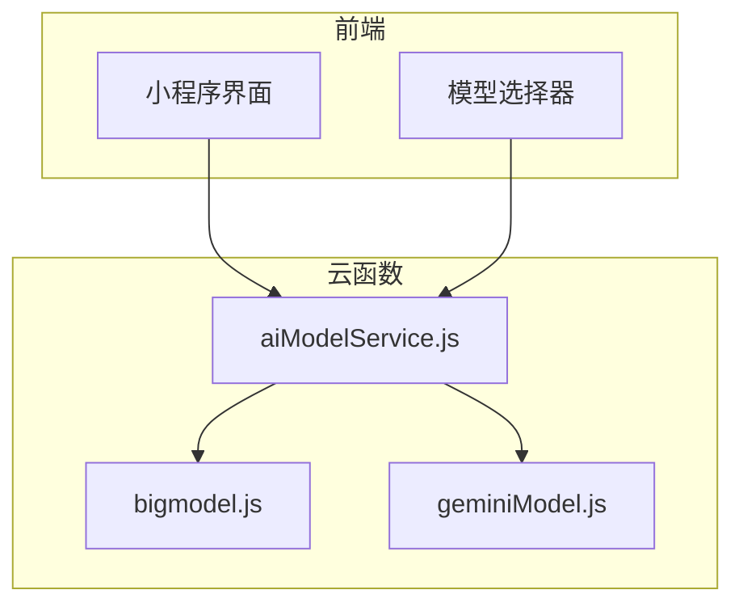
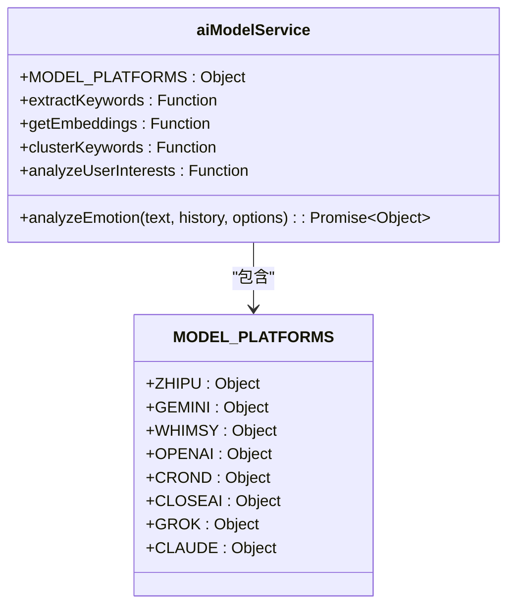
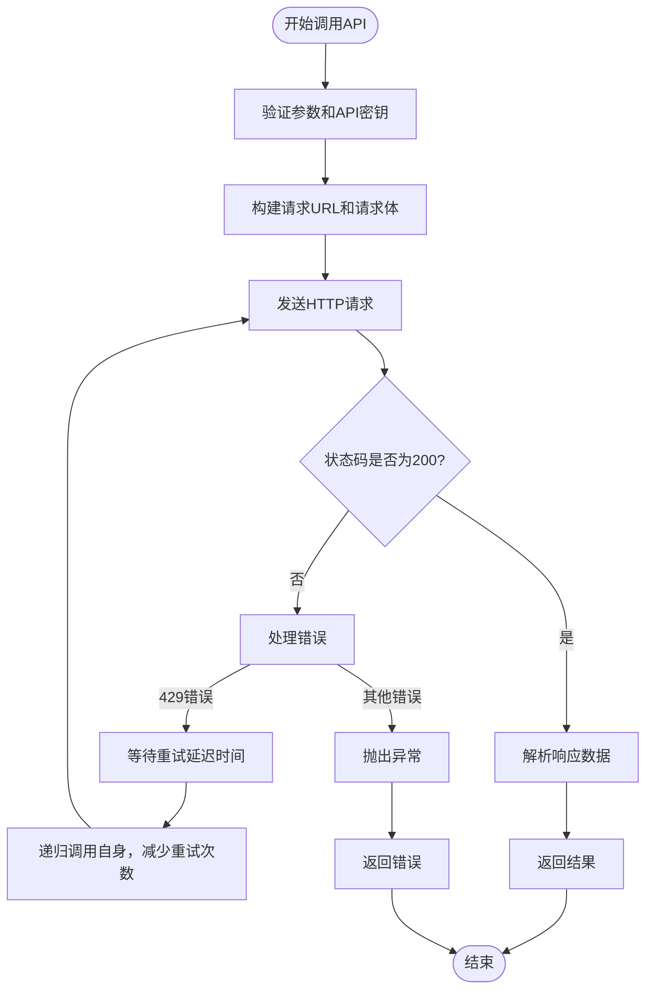
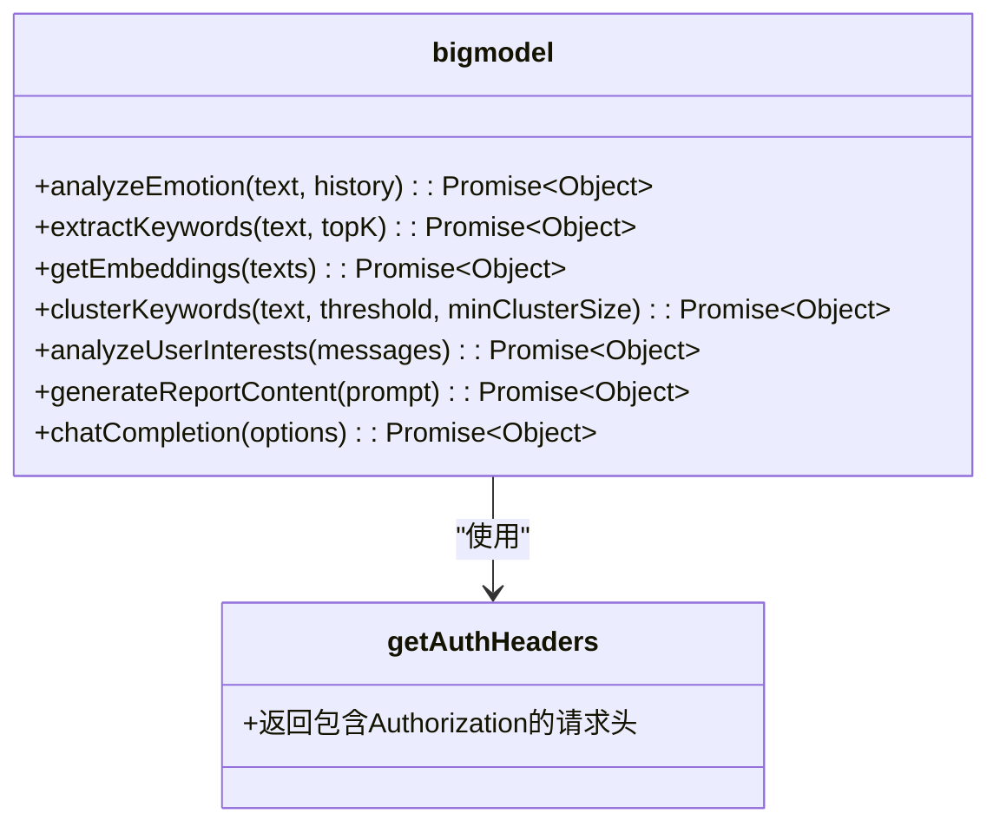
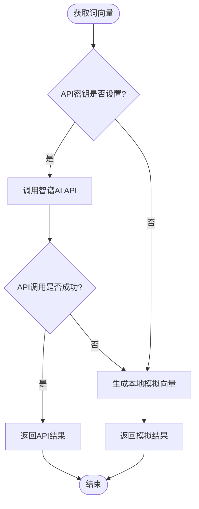
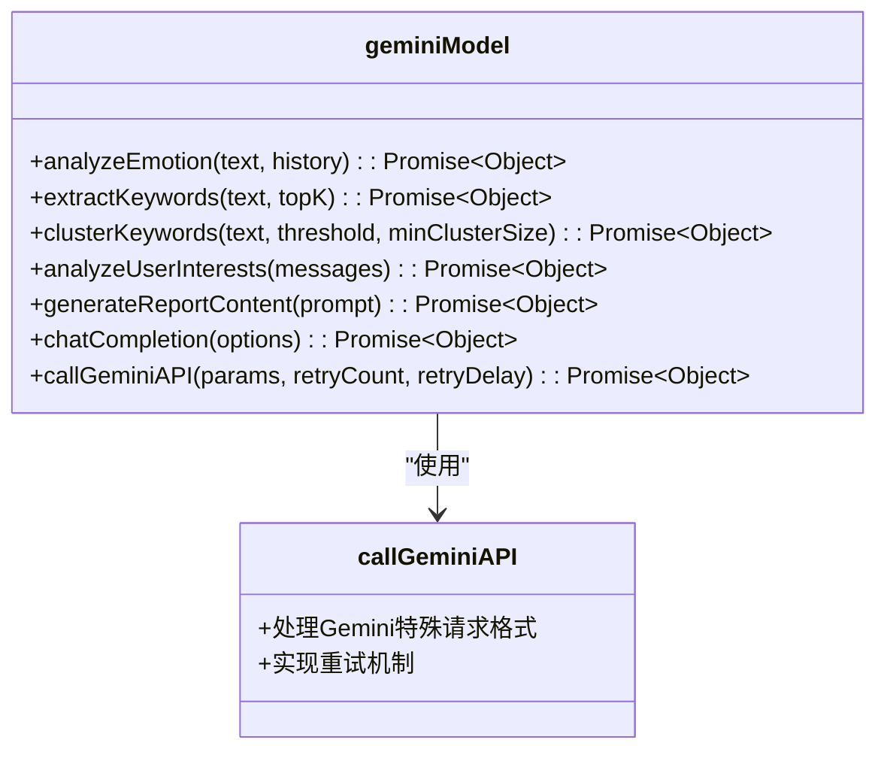
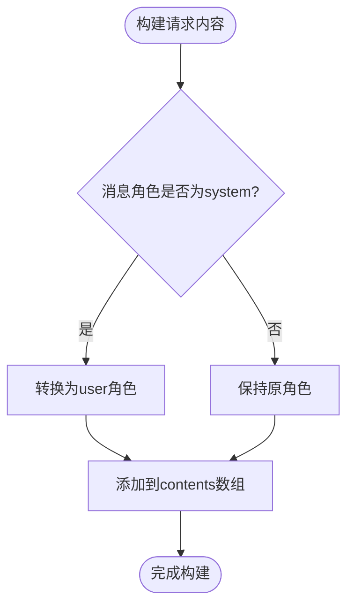
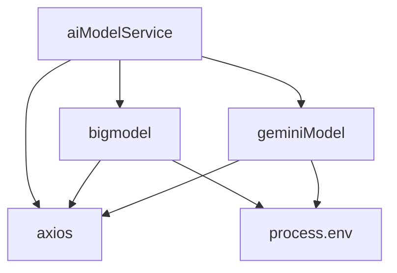

# AI模型集成与调用

<cite>
**本文档引用文件**  
- [aiModelService.js](file://cloudfunctions/analysis/aiModelService.js)
- [bigmodel.js](file://cloudfunctions/analysis/bigmodel.js)
- [geminiModel.js](file://cloudfunctions/analysis/geminiModel.js)
- [Gemini_API集成开发文档.md](file://doc/开发文档/Gemini_API集成开发文档.md)
- [统一AI模型服务设计文档.md](file://doc/开发文档/统一AI模型服务设计文档.md)
</cite>

## 目录
1. [简介](#简介)
2. [项目结构](#项目结构)
3. [核心组件](#核心组件)
4. [架构概述](#架构概述)
5. [详细组件分析](#详细组件分析)
6. [依赖分析](#依赖分析)
7. [性能考量](#性能考量)
8. [故障排除指南](#故障排除指南)
9. [结论](#结论)

## 简介
本文档详细说明了HeartChat项目中AI模型集成与调用的技术实现。重点介绍`aiModelService.js`如何作为统一服务层协调调用Gemini、智谱AI等多模型进行深度语义情绪分析，包括请求构造、超时处理、错误重试机制。同时描述`bigmodel.js`和`geminiModel.js`对不同AI提供商API的封装方式与适配逻辑，解释多模型结果融合策略以提升分析准确性。提供模型切换配置方法、API密钥管理方案，并给出调试模型响应异常或延迟过高的实用技巧。

## 项目结构
项目中的AI模型集成主要位于`cloudfunctions/analysis`目录下，包含核心服务文件和各AI提供商的适配器。`aiModelService.js`作为统一入口，协调`bigmodel.js`和`geminiModel.js`等具体实现。配置信息和文档位于`doc`目录下的开发文档和使用文档中。

**Section sources**
- [aiModelService.js](file://cloudfunctions/analysis/aiModelService.js#L1-L662)
- [bigmodel.js](file://cloudfunctions/analysis/bigmodel.js#L1-L704)
- [geminiModel.js](file://cloudfunctions/analysis/geminiModel.js#L1-L655)

## 核心组件
核心组件包括`aiModelService.js`、`bigmodel.js`和`geminiModel.js`。`aiModelService.js`提供统一的AI模型调用接口，支持智谱AI、Google Gemini等多种模型平台。`bigmodel.js`和`geminiModel.js`分别封装了智谱AI和Google Gemini的API调用逻辑，实现了情感分析、关键词提取等功能。

**Section sources**
- [aiModelService.js](file://cloudfunctions/analysis/aiModelService.js#L1-L662)
- [bigmodel.js](file://cloudfunctions/analysis/bigmodel.js#L1-L704)
- [geminiModel.js](file://cloudfunctions/analysis/geminiModel.js#L1-L655)

## 架构概述
系统采用分层架构，`aiModelService.js`作为统一服务层，向上提供标准化的API接口，向下协调调用不同的AI模型。`bigmodel.js`和`geminiModel.js`作为适配器层，封装了具体AI提供商的API调用细节。这种设计实现了调用逻辑与具体实现的解耦，便于扩展和维护。

**Diagram sources**
- [aiModelService.js](file://cloudfunctions/analysis/aiModelService.js#L1-L662)
- [bigmodel.js](file://cloudfunctions/analysis/bigmodel.js#L1-L704)
- [geminiModel.js](file://cloudfunctions/analysis/geminiModel.js#L1-L655)

## 详细组件分析

### aiModelService.js分析
`aiModelService.js`是统一AI模型服务的核心，实现了对多种AI模型平台的统一调用接口。

#### 统一调用接口

**Diagram sources**
- [aiModelService.js](file://cloudfunctions/analysis/aiModelService.js#L1-L662)

#### 请求构造与错误处理
`aiModelService.js`通过`callModelApi`函数处理请求构造和错误重试。对于429错误（请求过多），实现指数退避重试机制，初始延迟1000ms，每次重试延迟时间翻倍。

**Diagram sources**
- [aiModelService.js](file://cloudfunctions/analysis/aiModelService.js#L1-L662)

**Section sources**
- [aiModelService.js](file://cloudfunctions/analysis/aiModelService.js#L1-L662)

### bigmodel.js分析
`bigmodel.js`封装了智谱AI的API调用逻辑，实现了情感分析、关键词提取等功能。

#### API封装与适配

**Diagram sources**
- [bigmodel.js](file://cloudfunctions/analysis/bigmodel.js#L1-L704)

#### 本地模拟与备选方案
当API密钥未设置或API调用失败时，`bigmodel.js`提供本地模拟词向量功能，确保服务的可用性。

**Diagram sources**
- [bigmodel.js](file://cloudfunctions/analysis/bigmodel.js#L1-L704)

**Section sources**
- [bigmodel.js](file://cloudfunctions/analysis/bigmodel.js#L1-L704)

### geminiModel.js分析
`geminiModel.js`封装了Google Gemini的API调用逻辑，实现了与`bigmodel.js`相同的功能接口。

#### 特殊请求格式处理
Gemini API使用特殊的请求格式，`geminiModel.js`通过`callGeminiAPI`函数处理这些差异。

**Diagram sources**
- [geminiModel.js](file://cloudfunctions/analysis/geminiModel.js#L1-L655)

#### 消息格式转换
Gemini API不支持`system`角色，`geminiModel.js`将系统提示词转换为`user`角色的消息。

**Diagram sources**
- [geminiModel.js](file://cloudfunctions/analysis/geminiModel.js#L1-L655)

**Section sources**
- [geminiModel.js](file://cloudfunctions/analysis/geminiModel.js#L1-L655)

## 依赖分析
系统依赖于`axios`库进行HTTP请求，通过环境变量管理API密钥。`aiModelService.js`依赖`bigmodel.js`和`geminiModel.js`的具体实现，通过模块导入和函数注入的方式实现依赖注入。

**Diagram sources**
- [aiModelService.js](file://cloudfunctions/analysis/aiModelService.js#L1-L662)
- [bigmodel.js](file://cloudfunctions/analysis/bigmodel.js#L1-L704)
- [geminiModel.js](file://cloudfunctions/analysis/geminiModel.js#L1-L655)

**Section sources**
- [aiModelService.js](file://cloudfunctions/analysis/aiModelService.js#L1-L662)
- [bigmodel.js](file://cloudfunctions/analysis/bigmodel.js#L1-L704)
- [geminiModel.js](file://cloudfunctions/analysis/geminiModel.js#L1-L655)

## 性能考量
系统通过以下方式优化性能：
- 使用快速模型（如glm-4-flash）进行基础分析
- 限制历史消息数量（最多5条）以减少请求大小
- 实现本地模拟作为API调用失败的备选方案
- 使用指数退避重试机制避免频繁请求

## 故障排除指南
### API密钥管理
确保在环境变量中正确设置API密钥：
- 智谱AI: `ZHIPU_API_KEY`
- Google Gemini: `GEMINI_API_KEY`
- 其他模型: 参考`MODEL_PLATFORMS`配置中的`apiKeyEnv`字段

### 模型连接测试
使用`testConnection`函数测试模型连接状态，为Claude模型设置更长的超时时间（30秒）。

### 响应异常处理
当遇到429错误时，系统会自动重试，延迟时间逐次翻倍。对于其他错误，检查API密钥和网络连接。

**Section sources**
- [aiModelService.js](file://cloudfunctions/analysis/aiModelService.js#L1-L662)
- [bigmodel.js](file://cloudfunctions/analysis/bigmodel.js#L1-L704)
- [geminiModel.js](file://cloudfunctions/analysis/geminiModel.js#L1-L655)

## 结论
本文档详细介绍了HeartChat项目中AI模型集成与调用的技术实现。通过`aiModelService.js`作为统一服务层，实现了对多种AI模型平台的协调调用。`bigmodel.js`和`geminiModel.js`分别封装了智谱AI和Google Gemini的API调用逻辑，提供了统一的接口。系统通过合理的错误处理和备选方案，确保了服务的稳定性和可用性。