# 多AI模型适配实现

<cite>
**本文档引用文件**  
- [bigmodel.js](file://cloudfunctions/analysis/bigmodel.js)
- [geminiModel.js](file://cloudfunctions/analysis/geminiModel.js)
- [aiModelService.js](file://cloudfunctions/analysis/aiModelService.js)
- [aiModelService_part2.js](file://cloudfunctions/analysis/aiModelService_part2.js)
- [aiModelService_part3.js](file://cloudfunctions/analysis/aiModelService_part3.js)
- [test.js](file://cloudfunctions/analysis/test.js)
- [统一AI模型服务设计文档.md](file://doc/开发文档/统一AI模型服务设计文档.md)
- [Gemini_API集成开发文档.md](file://doc/开发文档/Gemini_API集成开发文档.md)
- [Gemini_API配置指南.md](file://doc/使用文档/Gemini_API配置指南.md)
- [智谱AI接口使用文档.md](file://doc/使用文档/智谱AI接口使用文档.md)
</cite>

## 目录
1. [项目结构](#项目结构)
2. [核心适配器实现](#核心适配器实现)
3. [认证协议与请求构造](#认证协议与请求构造)
4. [响应解析与兼容处理](#响应解析与兼容处理)
5. [配置管理与动态加载](#配置管理与动态加载)
6. [调试与测试策略](#调试与测试策略)
7. [模型差异与适配方案](#模型差异与适配方案)
8. [架构设计与扩展性](#架构设计与扩展性)

## 项目结构

HeartChat项目采用分层架构设计，将AI模型适配功能集中于`cloudfunctions/analysis`目录下。该目录包含多个核心模块：`bigmodel.js`负责智谱AI的集成，`geminiModel.js`实现Google Gemini API的调用，`aiModelService.js`及其分片文件提供统一的AI模型服务接口。项目通过`doc/开发文档`和`doc/使用文档`目录提供详细的集成和使用说明，确保开发者能够快速理解和使用多模型适配功能。

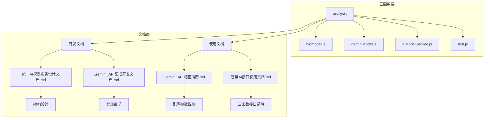

**图示来源**
- [bigmodel.js](file://cloudfunctions/analysis/bigmodel.js)
- [geminiModel.js](file://cloudfunctions/analysis/geminiModel.js)
- [统一AI模型服务设计文档.md](file://doc/开发文档/统一AI模型服务设计文档.md)

**本节来源**
- [bigmodel.js](file://cloudfunctions/analysis/bigmodel.js)
- [geminiModel.js](file://cloudfunctions/analysis/geminiModel.js)
- [统一AI模型服务设计文档.md](file://doc/开发文档/统一AI模型服务设计文档.md)

## 核心适配器实现

### 智谱AI适配器 (bigmodel.js)

`bigmodel.js`模块实现了对智谱AI API的全面封装，支持情感分析、关键词提取、词向量获取、聚类分析和用户兴趣分析等多种功能。该模块通过`analyzeEmotion`函数实现情感分析，`extractKeywords`函数提取关键词，`getEmbeddings`函数获取词向量，`clusterKeywords`函数进行聚类分析，`analyzeUserInterests`函数分析用户兴趣。所有功能均基于智谱AI的GLM-4-Flash和Embedding-3模型实现，确保了高性能和高准确性。

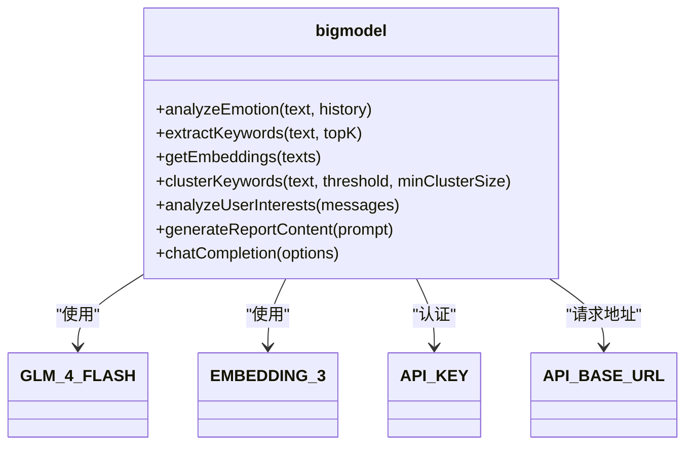

**图示来源**
- [bigmodel.js](file://cloudfunctions/analysis/bigmodel.js#L1-L705)

**本节来源**
- [bigmodel.js](file://cloudfunctions/analysis/bigmodel.js#L1-L705)

### Google Gemini适配器 (geminiModel.js)

`geminiModel.js`模块实现了对Google Gemini API的集成，支持情感分析、关键词提取、聚类分析、用户兴趣分析和报告生成等功能。该模块通过`analyzeEmotion`函数实现情感分析，`extractKeywords`函数提取关键词，`clusterKeywords`函数进行聚类分析，`analyzeUserInterests`函数分析用户兴趣，`generateReportContent`函数生成报告内容。所有功能均基于Gemini的`gemini-2.5-flash-preview-04-17`模型实现，确保了高质量的自然语言理解和生成能力。

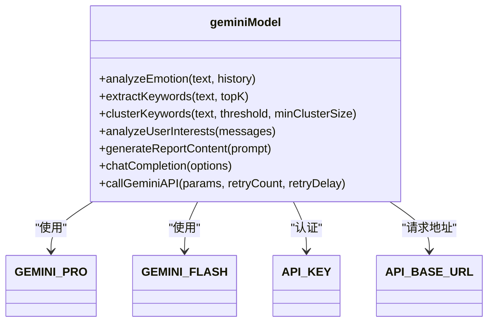

**图示来源**
- [geminiModel.js](file://cloudfunctions/analysis/geminiModel.js#L1-L656)

**本节来源**
- [geminiModel.js](file://cloudfunctions/analysis/geminiModel.js#L1-L656)

## 认证协议与请求构造

### 智谱AI认证与请求

智谱AI采用Bearer Token认证方式，API密钥通过环境变量`ZHIPU_API_KEY`获取。请求头中包含`Authorization`字段，格式为`Bearer ${API_KEY}`。请求体遵循Zhipu AI的JSON Schema规范，包含`model`、`messages`、`temperature`和`response_format`等字段。`messages`数组包含系统提示、历史消息和当前用户消息，确保模型能够理解上下文。

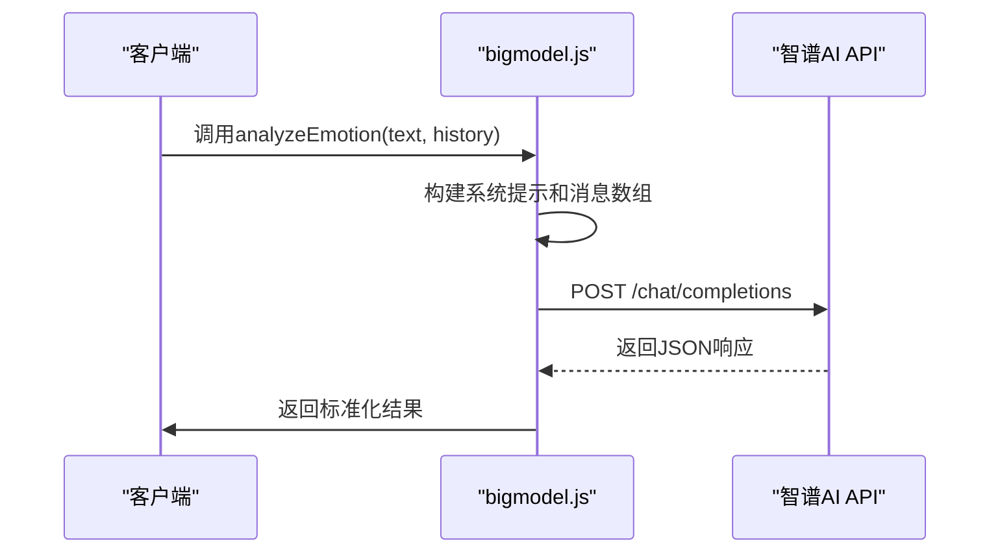

**图示来源**
- [bigmodel.js](file://cloudfunctions/analysis/bigmodel.js#L150-L250)

**本节来源**
- [bigmodel.js](file://cloudfunctions/analysis/bigmodel.js#L150-L250)

### Google Gemini认证与请求

Google Gemini同样采用Bearer Token认证方式，API密钥通过环境变量`GEMINI_API_KEY`获取。请求URL中包含API密钥作为查询参数，格式为`key=${API_KEY}`。请求体包含`contents`和`generationConfig`字段，`contents`数组中的每个元素包含`role`和`parts`，`parts`数组包含`text`字段。这种结构化的请求体确保了与Gemini API的兼容性。

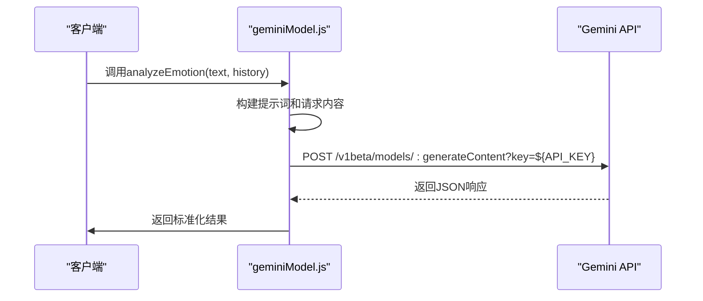

**图示来源**
- [geminiModel.js](file://cloudfunctions/analysis/geminiModel.js#L100-L200)

**本节来源**
- [geminiModel.js](file://cloudfunctions/analysis/geminiModel.js#L100-L200)

## 响应解析与兼容处理

### 智谱AI响应解析

智谱AI的响应解析逻辑在`bigmodel.js`中实现，通过`JSON.parse`方法解析API返回的JSON字符串。解析成功后，构建标准化的返回结果，包含`success`、`result`、`originalText`等字段。对于情感分析，结果包含`primary_emotion`、`secondary_emotions`、`intensity`、`valence`、`arousal`等详细信息。所有文本字段均使用中文返回，确保前端显示的一致性。

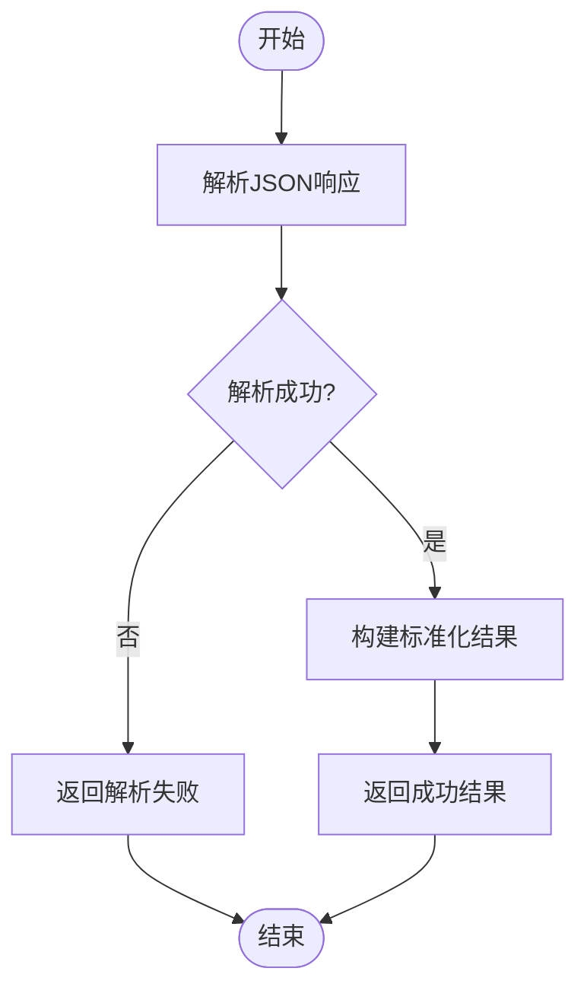

**图示来源**
- [bigmodel.js](file://cloudfunctions/analysis/bigmodel.js#L250-L350)

**本节来源**
- [bigmodel.js](file://cloudfunctions/analysis/bigmodel.js#L250-L350)

### Google Gemini响应解析

Google Gemini的响应解析逻辑在`geminiModel.js`中实现，首先通过正则表达式`/\{[\s\S]*\}/`提取JSON部分，然后使用`JSON.parse`方法解析。解析成功后，构建与智谱AI兼容的标准化结果，确保上层业务逻辑无需修改即可切换模型。对于流式响应，目前未实现，但代码中预留了扩展空间。

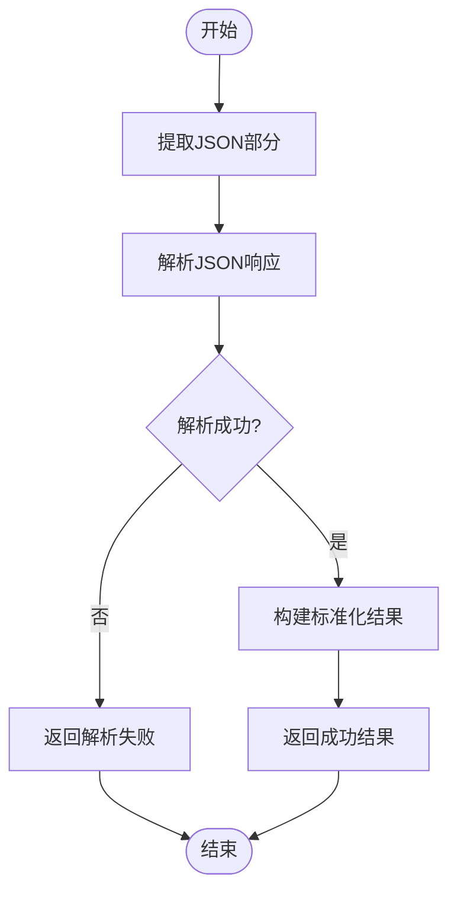

**图示来源**
- [geminiModel.js](file://cloudfunctions/analysis/geminiModel.js#L200-L300)

**本节来源**
- [geminiModel.js](file://cloudfunctions/analysis/geminiModel.js#L200-L300)

## 配置管理与动态加载

### 环境变量配置

项目通过环境变量安全存储API密钥，避免在代码中硬编码。智谱AI的密钥通过`process.env.ZHIPU_API_KEY`获取，Google Gemini的密钥通过`process.env.GEMINI_API_KEY`获取。在云开发控制台中配置这些环境变量，确保密钥的安全性。配置指南详细说明了如何在微信开发者工具中设置环境变量。

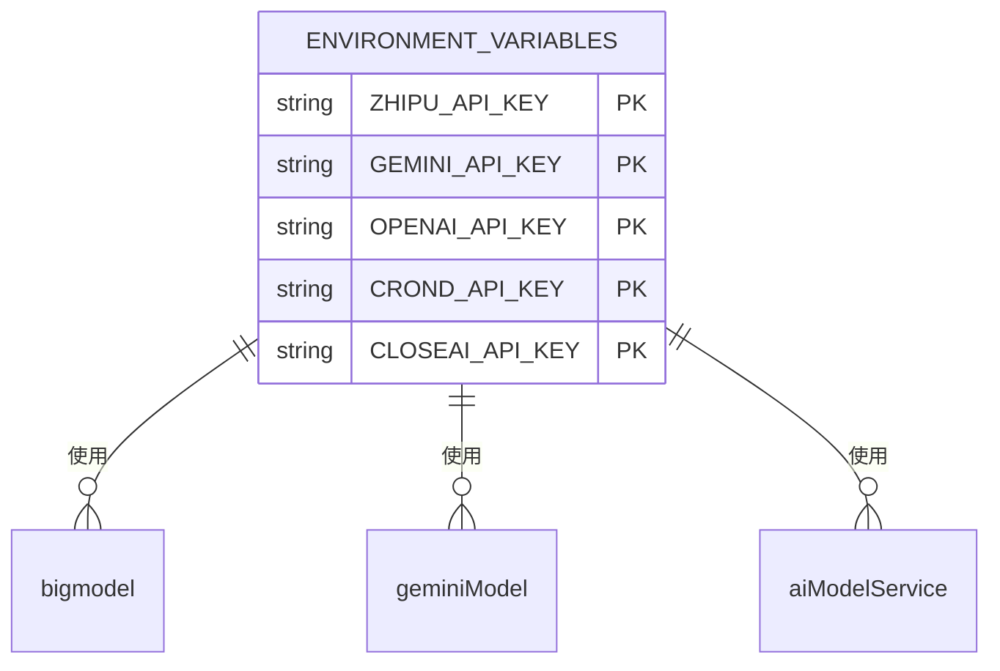

**图示来源**
- [bigmodel.js](file://cloudfunctions/analysis/bigmodel.js#L10-L20)
- [geminiModel.js](file://cloudfunctions/analysis/geminiModel.js#L10-L20)

**本节来源**
- [bigmodel.js](file://cloudfunctions/analysis/bigmodel.js#L10-L20)
- [geminiModel.js](file://cloudfunctions/analysis/geminiModel.js#L10-L20)
- [Gemini_API配置指南.md](file://doc/使用文档/Gemini_API配置指南.md)

### 动态加载适配器

`aiModelService.js`模块实现了统一的AI模型服务接口，支持动态加载不同适配器。通过`MODEL_PLATFORMS`配置对象管理各平台的基本信息，包括名称、基础URL、API密钥环境变量名、默认模型、支持的模型列表、认证类型和端点路径。`callModelApi`函数根据平台键名调用相应的API，实现动态适配。

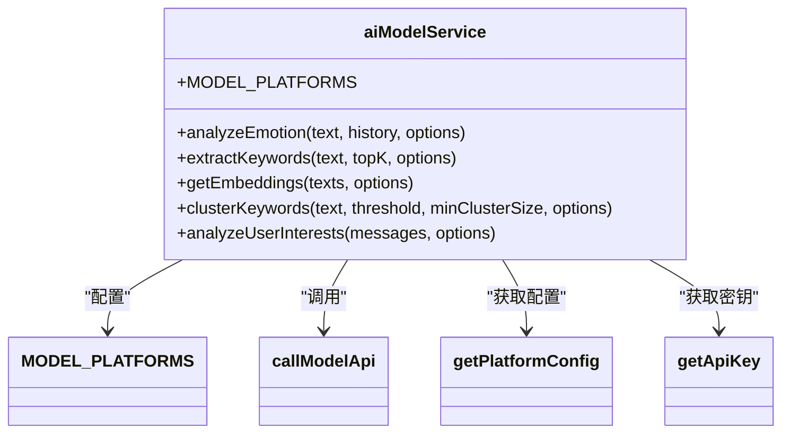

**图示来源**
- [aiModelService.js](file://cloudfunctions/analysis/aiModelService.js#L50-L150)

**本节来源**
- [aiModelService.js](file://cloudfunctions/analysis/aiModelService.js#L50-L150)

## 调试与测试策略

### 测试脚本使用

`test.js`模块提供了完整的测试功能，用于验证`bigmodel.js`模块的各个功能是否正常。测试事件包含情感分析、关键词提取、词向量获取和用户兴趣分析的输入数据。通过`main`函数依次调用各个功能，输出结果到日志，便于开发者检查和调试。

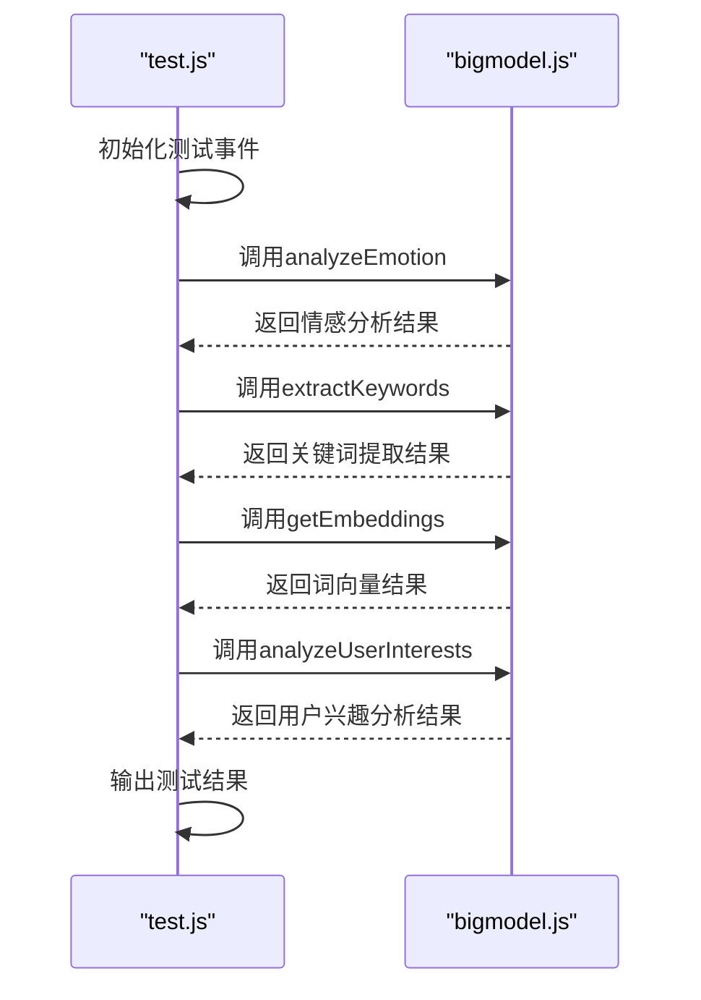

**图示来源**
- [test.js](file://cloudfunctions/analysis/test.js#L1-L110)

**本节来源**
- [test.js](file://cloudfunctions/analysis/test.js#L1-L110)

### 日志与问题定位

项目通过详细的日志记录帮助开发者定位问题。在开发环境中，`isDev`变量设置为`true`，开启详细日志输出。日志记录包括API调用的请求体、响应状态码、解析错误等信息。当模型返回空值时，日志会记录具体的错误信息，帮助开发者快速定位问题。

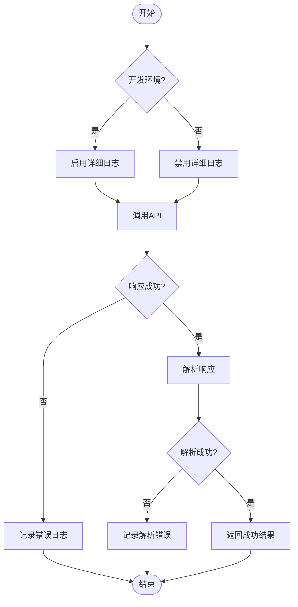

**图示来源**
- [bigmodel.js](file://cloudfunctions/analysis/bigmodel.js#L5-L10)
- [geminiModel.js](file://cloudfunctions/analysis/geminiModel.js#L5-L10)

**本节来源**
- [bigmodel.js](file://cloudfunctions/analysis/bigmodel.js#L5-L10)
- [geminiModel.js](file://cloudfunctions/analysis/geminiModel.js#L5-L10)

## 模型差异与适配方案

### 响应格式差异

智谱AI和Google Gemini在响应格式上存在差异。智谱AI的响应包含`choices`数组，每个元素包含`message`对象，`message`对象包含`content`字段。Google Gemini的响应包含`candidates`数组，每个元素包含`content`对象，`content`对象包含`parts`数组，`parts`数组包含`text`字段。适配层通过不同的解析逻辑处理这些差异，确保返回结果的统一性。

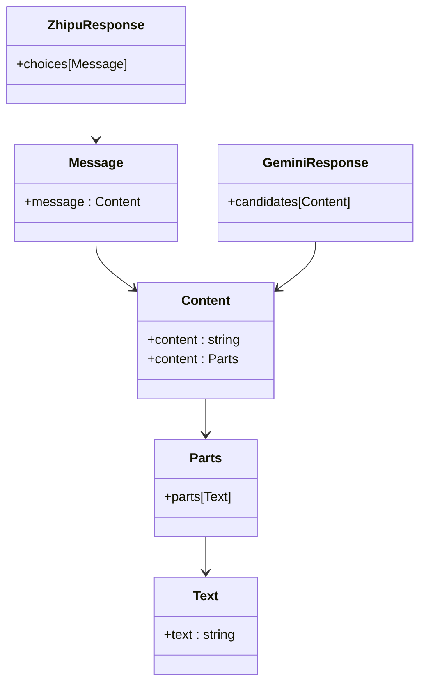

**图示来源**
- [bigmodel.js](file://cloudfunctions/analysis/bigmodel.js#L250-L350)
- [geminiModel.js](file://cloudfunctions/analysis/geminiModel.js#L200-L300)

**本节来源**
- [bigmodel.js](file://cloudfunctions/analysis/bigmodel.js#L250-L350)
- [geminiModel.js](file://cloudfunctions/analysis/geminiModel.js#L200-L300)

### 速率限制与计费

智谱AI和Google Gemini在速率限制和计费单位上有所不同。智谱AI按调用次数和token数量计费，Google Gemini按请求次数和token数量计费。适配层通过重试机制处理429错误（请求过多），实现指数退避重试，确保在高并发场景下的稳定性。计费单位的差异通过统一的`usage`字段报告，便于成本控制。

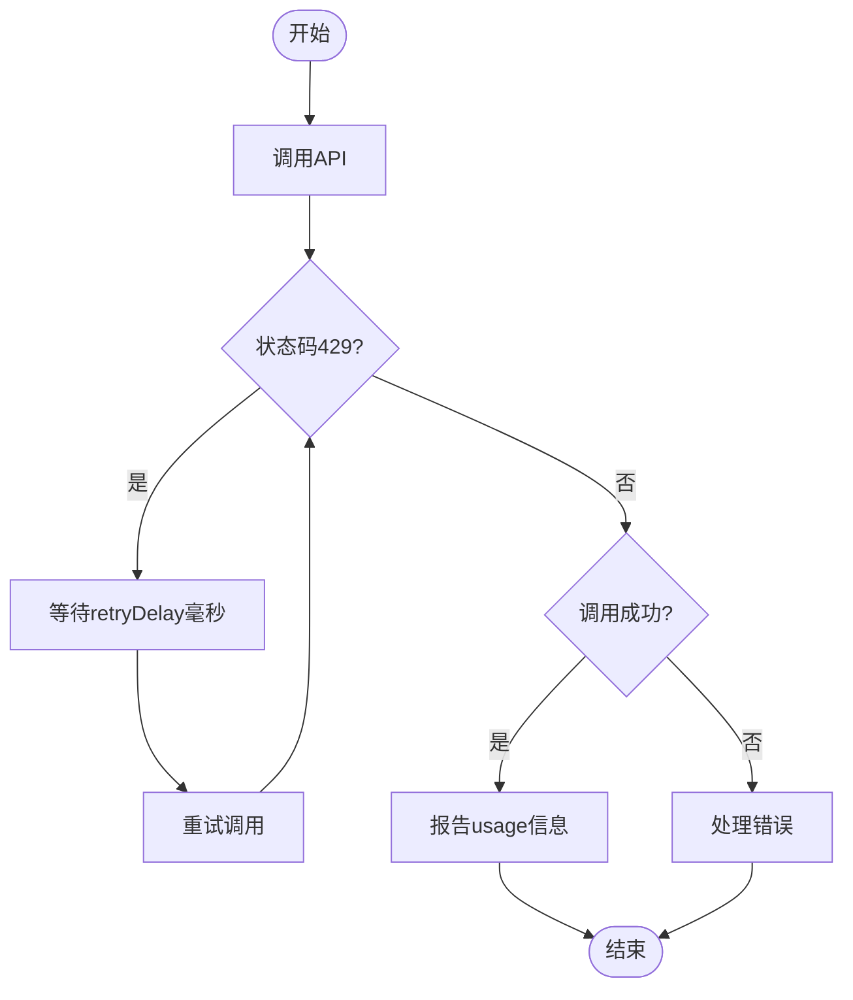

**图示来源**
- [aiModelService.js](file://cloudfunctions/analysis/aiModelService.js#L200-L300)
- [geminiModel.js](file://cloudfunctions/analysis/geminiModel.js#L150-L200)

**本节来源**
- [aiModelService.js](file://cloudfunctions/analysis/aiModelService.js#L200-L300)
- [geminiModel.js](file://cloudfunctions/analysis/geminiModel.js#L150-L200)

## 架构设计与扩展性

### 统一服务接口

`aiModelService.js`模块通过统一的接口设计，实现了对多种AI模型平台的集成。`MODEL_PLATFORMS`配置对象定义了各平台的基本信息，`callModelApi`函数处理请求发送和响应解析，`analyzeEmotion`、`extractKeywords`等函数提供统一的业务接口。这种设计使得添加新的模型平台变得简单，只需在`MODEL_PLATFORMS`中添加新的配置即可。

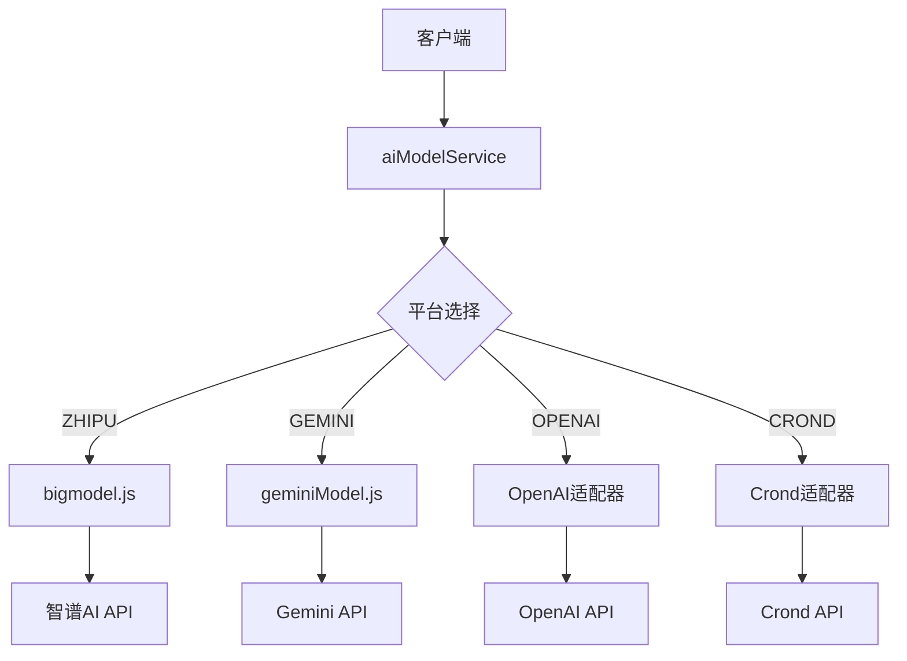

**图示来源**
- [aiModelService.js](file://cloudfunctions/analysis/aiModelService.js#L1-L150)

**本节来源**
- [aiModelService.js](file://cloudfunctions/analysis/aiModelService.js#L1-L150)
- [统一AI模型服务设计文档.md](file://doc/开发文档/统一AI模型服务设计文档.md)