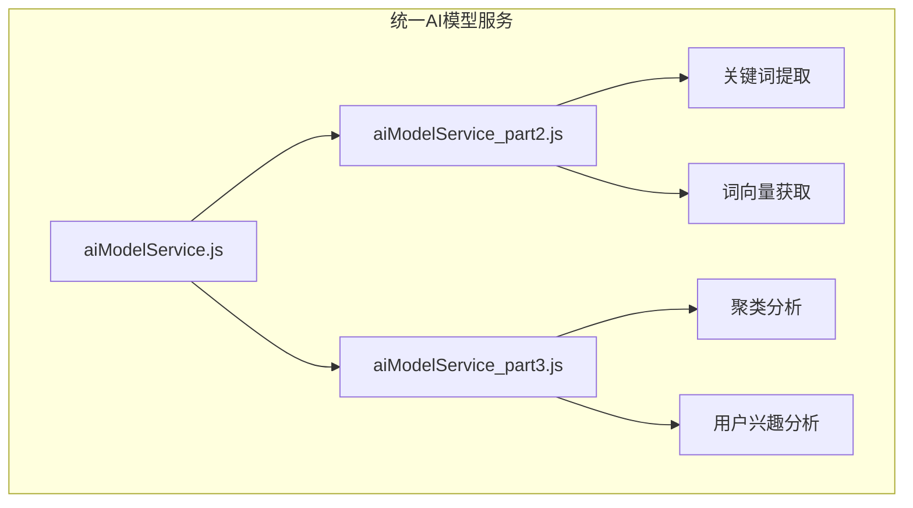
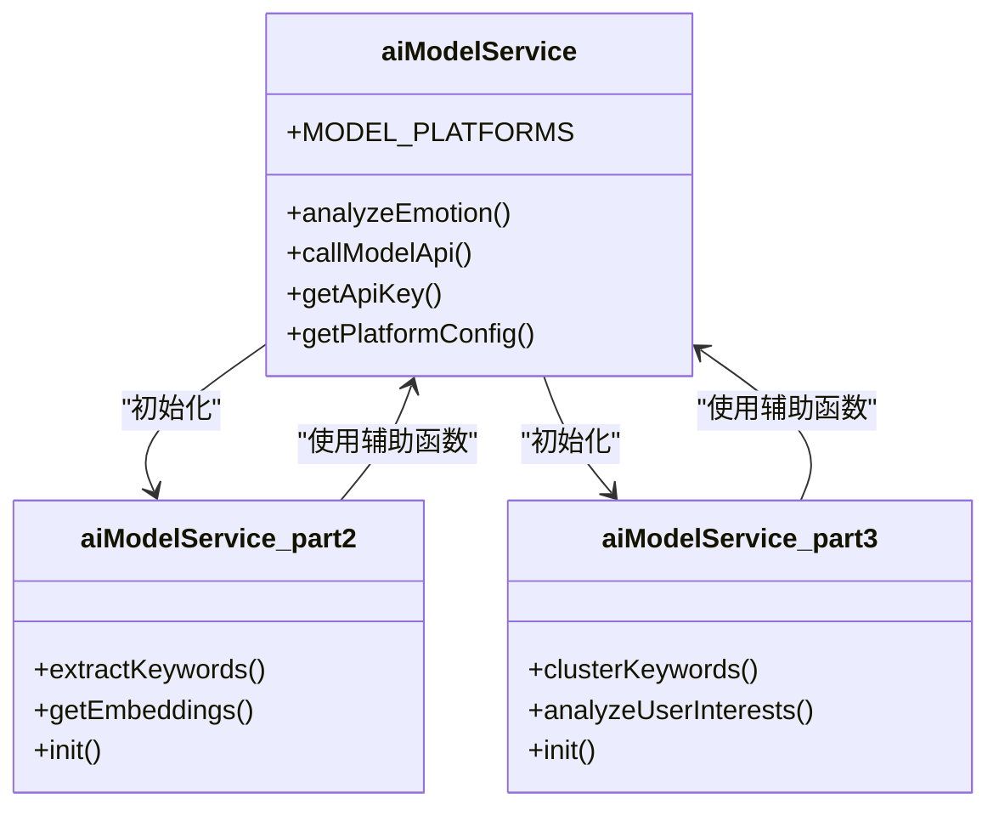
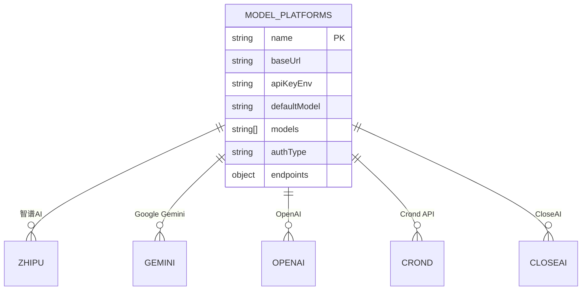
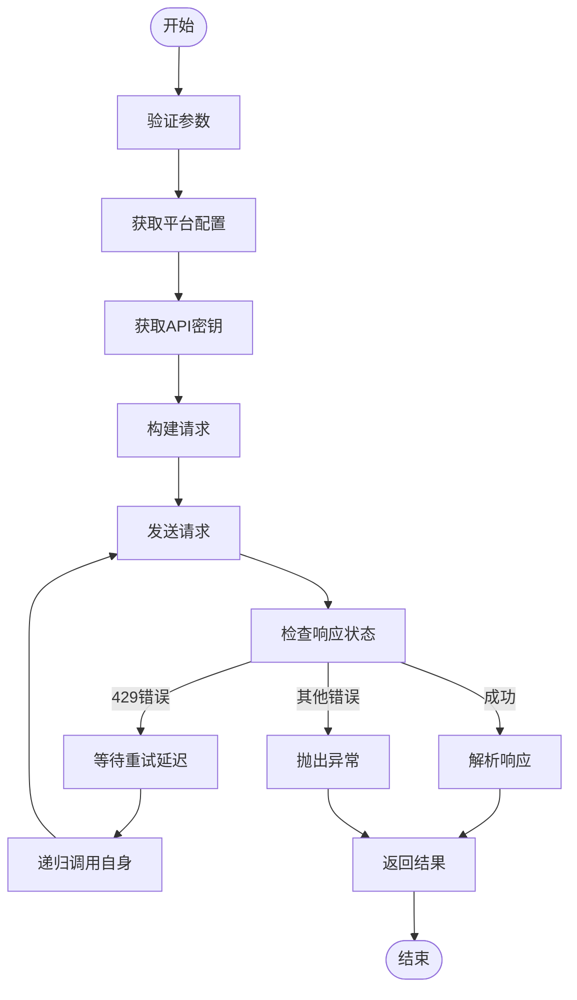
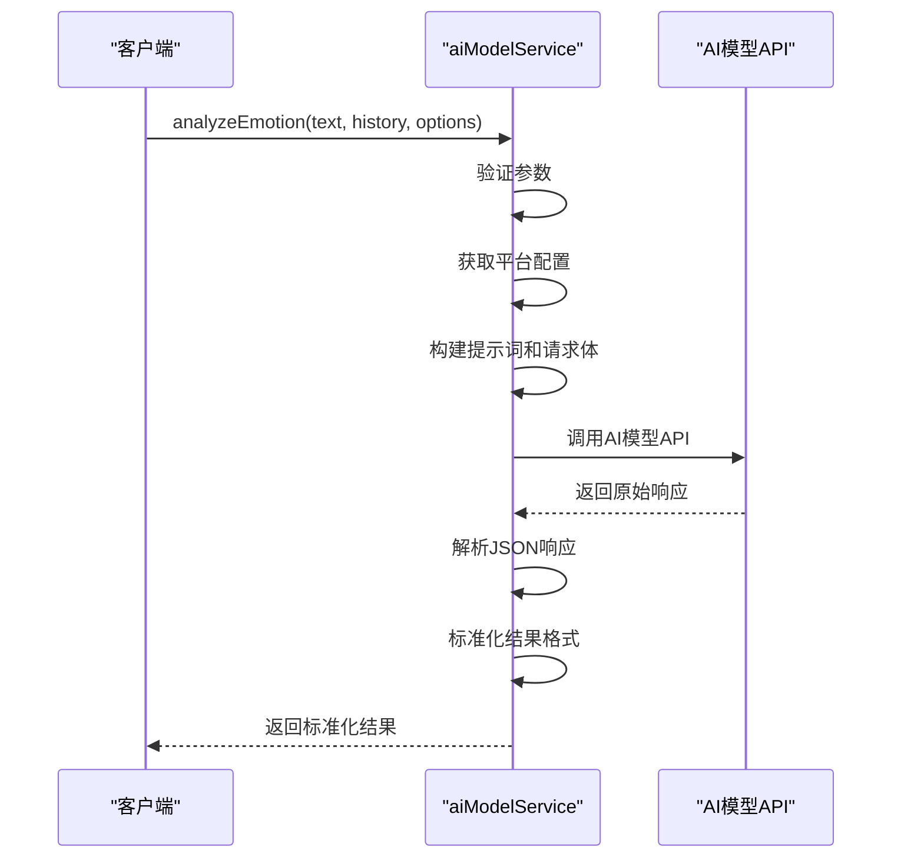
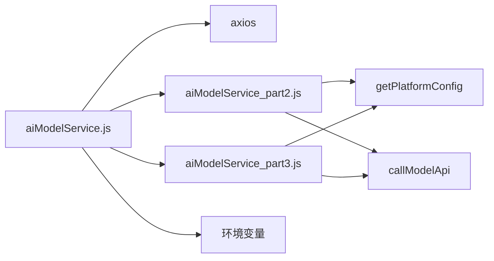

# 统一AI模型服务调度

<cite>
**本文档引用文件**  
- [aiModelService.js](file://cloudfunctions/analysis/aiModelService.js)
- [aiModelService_part2.js](file://cloudfunctions/analysis/aiModelService_part2.js)
- [aiModelService_part3.js](file://cloudfunctions/analysis/aiModelService_part3.js)
- [analysis云函数统一AI模型服务设计文档.md](file://doc/开发文档/analysis云函数统一AI模型服务设计文档.md)
</cite>

## 目录
1. [简介](#简介)
2. [项目结构](#项目结构)
3. [核心组件](#核心组件)
4. [架构概述](#架构概述)
5. [详细组件分析](#详细组件分析)
6. [依赖分析](#依赖分析)
7. [性能考虑](#性能考虑)
8. [故障排除指南](#故障排除指南)
9. [结论](#结论)

## 简介
统一AI模型服务是HeartChat项目中用于情感分析、关键词提取和用户兴趣分析的核心模块。该服务通过提供统一接口，支持智谱AI、Google Gemini、OpenAI、Crond API和CloseAI等多种AI模型平台，实现了多模型请求的统一入口与调度逻辑。服务具备请求参数标准化、模型路由策略、超时熔断机制和错误重试策略等关键功能，能够协调多个AI模型并行响应并选取最优结果。

## 项目结构
统一AI模型服务由三个主要JavaScript文件构成，分别负责不同功能模块的实现。主模块`aiModelService.js`定义了模型平台配置和核心调用逻辑，`aiModelService_part2.js`和`aiModelService_part3.js`则分别处理关键词提取、词向量获取、聚类分析和用户兴趣分析等扩展功能。

**图表来源**  
- [aiModelService.js](file://cloudfunctions/analysis/aiModelService.js#L1-L662)
- [aiModelService_part2.js](file://cloudfunctions/analysis/aiModelService_part2.js#L1-L316)
- [aiModelService_part3.js](file://cloudfunctions/analysis/aiModelService_part3.js#L1-L478)

**本节来源**  
- [aiModelService.js](file://cloudfunctions/analysis/aiModelService.js#L1-L662)
- [analysis云函数统一AI模型服务设计文档.md](file://doc/开发文档/analysis云函数统一AI模型服务设计文档.md#L1-L345)

## 核心组件
统一AI模型服务的核心组件包括模型平台配置、API调用函数和各类分析接口。`MODEL_PLATFORMS`常量定义了支持的AI模型平台及其配置，`callModelApi`函数实现了统一的API调用逻辑，而`analyzeEmotion`、`extractKeywords`等函数则提供了具体的功能接口。

**本节来源**  
- [aiModelService.js](file://cloudfunctions/analysis/aiModelService.js#L1-L662)

## 架构概述
统一AI模型服务采用模块化设计，通过主模块与扩展模块的协作实现功能分离。主模块负责平台配置管理和基础API调用，扩展模块则专注于特定分析任务。这种设计提高了代码的可维护性和扩展性，使得添加新的AI模型平台或分析功能变得更加容易。

**图表来源**  
- [aiModelService.js](file://cloudfunctions/analysis/aiModelService.js#L1-L662)
- [aiModelService_part2.js](file://cloudfunctions/analysis/aiModelService_part2.js#L1-L316)
- [aiModelService_part3.js](file://cloudfunctions/analysis/aiModelService_part3.js#L1-L478)

## 详细组件分析

### 模型平台配置分析
模型平台配置组件定义了所有支持的AI模型平台，包括智谱AI、Google Gemini、OpenAI等。每个平台配置包含名称、基础URL、API密钥环境变量名、默认模型、支持的模型列表、认证类型和接口路径等信息。

**图表来源**  
- [aiModelService.js](file://cloudfunctions/analysis/aiModelService.js#L1-L662)

**本节来源**  
- [aiModelService.js](file://cloudfunctions/analysis/aiModelService.js#L1-L662)

### API调用逻辑分析
API调用逻辑组件实现了统一的API调用函数`callModelApi`，该函数负责构建请求、发送请求、处理响应和错误重试。对于429错误（请求过多），服务实现了指数退避重试机制，最多重试3次。

**图表来源**  
- [aiModelService.js](file://cloudfunctions/analysis/aiModelService.js#L1-L662)

**本节来源**  
- [aiModelService.js](file://cloudfunctions/analysis/aiModelService.js#L1-L662)

### 情感分析流程分析
情感分析流程组件实现了`analyzeEmotion`函数，该函数根据指定的AI模型平台构建相应的提示词和请求体，调用API获取情感分析结果，并将结果标准化为统一格式。

**图表来源**  
- [aiModelService.js](file://cloudfunctions/analysis/aiModelService.js#L1-L662)

**本节来源**  
- [aiModelService.js](file://cloudfunctions/analysis/aiModelService.js#L1-L662)

## 依赖分析
统一AI模型服务依赖于axios库进行HTTP请求，通过环境变量管理各AI模型平台的API密钥。服务通过`require`语句导入两个扩展模块，并通过`init`函数将辅助函数注入到这些模块中，实现了模块间的协作。

**图表来源**  
- [aiModelService.js](file://cloudfunctions/analysis/aiModelService.js#L1-L662)
- [aiModelService_part2.js](file://cloudfunctions/analysis/aiModelService_part2.js#L1-L316)
- [aiModelService_part3.js](file://cloudfunctions/analysis/aiModelService_part3.js#L1-L478)

**本节来源**  
- [aiModelService.js](file://cloudfunctions/analysis/aiModelService.js#L1-L662)
- [aiModelService_part2.js](file://cloudfunctions/analysis/aiModelService_part2.js#L1-L316)
- [aiModelService_part3.js](file://cloudfunctions/analysis/aiModelService_part3.js#L1-L478)

## 性能考虑
统一AI模型服务在设计时考虑了多项性能优化措施。服务通过指数退避重试机制处理429错误，提高了API调用的成功率。对于不支持词向量功能的平台，服务提供了模拟词向量生成功能，避免了因功能缺失导致的性能瓶颈。此外，服务通过配置化设计，使得在不同AI模型平台间切换变得简单高效。

**本节来源**  
- [aiModelService.js](file://cloudfunctions/analysis/aiModelService.js#L1-L662)
- [aiModelService_part2.js](file://cloudfunctions/analysis/aiModelService_part2.js#L1-L316)
- [aiModelService_part3.js](file://cloudfunctions/analysis/aiModelService_part3.js#L1-L478)

## 故障排除指南
当统一AI模型服务出现问题时，可参考以下步骤进行排查：
1. 检查环境变量是否正确配置了各AI模型平台的API密钥
2. 查看日志输出，确认错误类型和发生位置
3. 对于429错误，检查是否达到了API调用频率限制
4. 验证请求参数是否符合API要求
5. 确认网络连接是否正常

**本节来源**  
- [aiModelService.js](file://cloudfunctions/analysis/aiModelService.js#L1-L662)
- [analysis云函数统一AI模型服务设计文档.md](file://doc/开发文档/analysis云函数统一AI模型服务设计文档.md#L1-L345)

## 结论
统一AI模型服务通过提供统一接口和配置化设计，成功实现了多模型请求的统一入口与调度逻辑。服务具备完善的错误处理和重试机制，能够有效应对网络异常和API调用失败等边界情况。通过模块化设计，服务具有良好的可扩展性，便于未来添加新的AI模型平台或分析功能。整体而言，该服务为HeartChat项目提供了稳定、高效且灵活的AI模型调用能力。