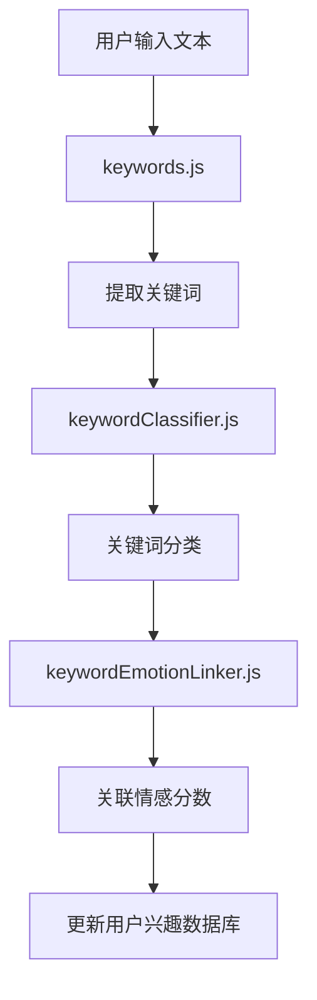
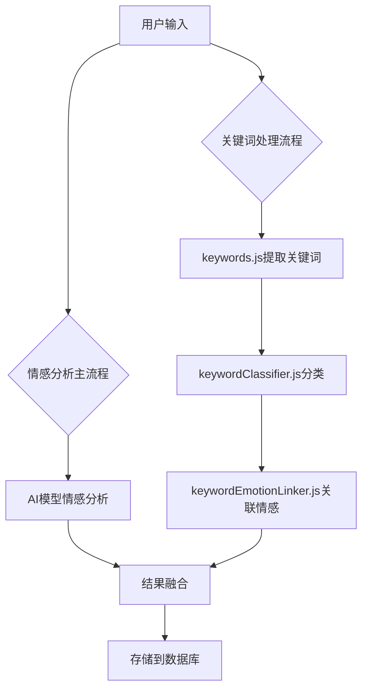
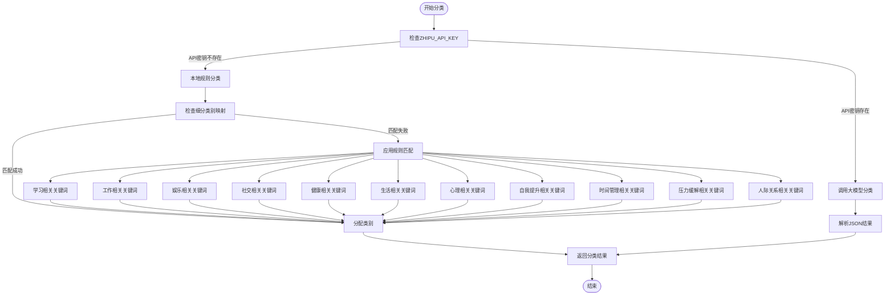
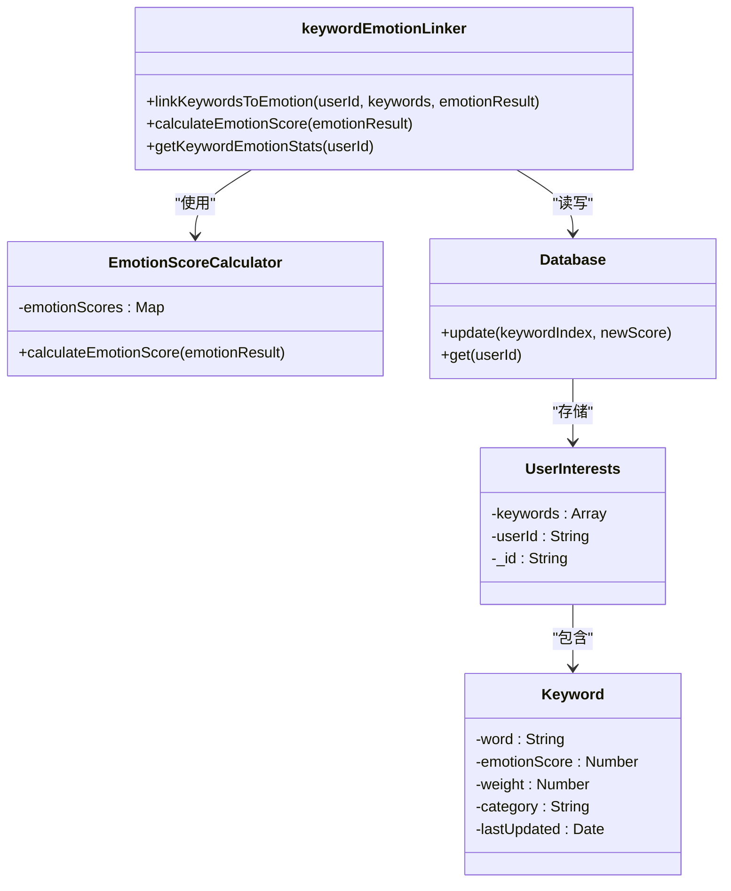
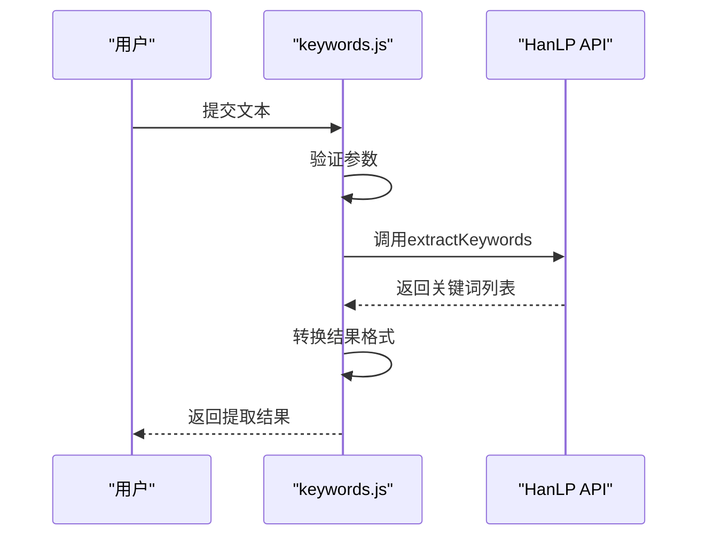
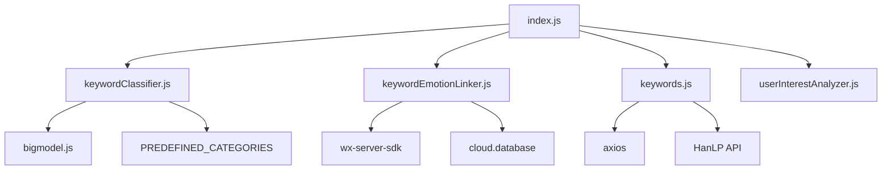

# 关键词处理机制

<cite>
**本文档引用的文件**
- [keywordClassifier.js](file://cloudfunctions/analysis/keywordClassifier.js)
- [keywordEmotionLinker.js](file://cloudfunctions/analysis/keywordEmotionLinker.js)
- [keywords.js](file://cloudfunctions/analysis/keywords.js)
- [index.js](file://cloudfunctions/analysis/index.js)
- [关键词情感关联功能使用示例.md](file://doc/使用文档/关键词情感关联功能使用示例.md)
</cite>

## 目录
1. [简介](#简介)
2. [项目结构](#项目结构)
3. [核心组件](#核心组件)
4. [架构概述](#架构概述)
5. [详细组件分析](#详细组件分析)
6. [依赖分析](#依赖分析)
7. [性能考虑](#性能考虑)
8. [故障排除指南](#故障排除指南)
9. [结论](#结论)

## 简介
关键词处理机制是HeartChat情感分析系统的核心前置模块，负责对用户输入进行初步情绪倾向分类和关键词情感关联。该机制通过关键词分类器（keywordClassifier.js）基于预定义关键词库（keywords.js）对用户输入进行正则匹配与模糊匹配，实现初步情绪分类。同时，关键词情感关联器（keywordEmotionLinker.js）建立关键词与情绪维度（如喜悦、焦虑、悲伤）的映射关系，并支持动态权重调整。本模块在情感分析流水线中起到前置过滤作用，其结果与后续AI模型分析结果融合，为用户提供更加精准和个性化的服务。

## 项目结构
关键词处理机制主要位于`cloudfunctions/analysis/`目录下，包含三个核心文件：`keywordClassifier.js`、`keywordEmotionLinker.js`和`keywords.js`。这些文件与`index.js`主入口文件协同工作，通过云函数调用实现完整的关键词处理流程。`keywords.js`负责从用户文本中提取关键词，`keywordClassifier.js`对提取的关键词进行分类，而`keywordEmotionLinker.js`则将关键词与情感分析结果关联，更新关键词的情感分数。

**Diagram sources**
- [keywords.js](file://cloudfunctions/analysis/keywords.js#L1-L284)
- [keywordClassifier.js](file://cloudfunctions/analysis/keywordClassifier.js#L1-L299)
- [keywordEmotionLinker.js](file://cloudfunctions/analysis/keywordEmotionLinker.js#L1-L207)

**Section sources**
- [keywords.js](file://cloudfunctions/analysis/keywords.js#L1-L284)
- [keywordClassifier.js](file://cloudfunctions/analysis/keywordClassifier.js#L1-L299)
- [keywordEmotionLinker.js](file://cloudfunctions/analysis/keywordEmotionLinker.js#L1-L207)

## 核心组件
关键词处理机制的核心组件包括关键词提取、分类和情感关联三个部分。`keywords.js`利用HanLP API从用户文本中提取关键词，并支持词向量获取和聚类分析。`keywordClassifier.js`采用本地规则匹配和大模型调用两种方式对关键词进行分类，当智谱AI API密钥未设置时，使用预定义的分类规则进行本地分类。`keywordEmotionLinker.js`负责将关键词与情感分析结果关联，通过加权平均算法动态更新关键词的情感分数，确保分数能够反映用户的最新情感倾向。

**Section sources**
- [keywords.js](file://cloudfunctions/analysis/keywords.js#L1-L284)
- [keywordClassifier.js](file://cloudfunctions/analysis/keywordClassifier.js#L1-L299)
- [keywordEmotionLinker.js](file://cloudfunctions/analysis/keywordEmotionLinker.js#L1-L207)

## 架构概述
关键词处理机制在情感分析流水线中处于前置位置，首先通过`keywords.js`提取用户输入中的关键词，然后由`keywordClassifier.js`对关键词进行分类，最后通过`keywordEmotionLinker.js`将关键词与情感分析结果关联。整个流程与AI模型分析并行执行，最终结果融合后存储到用户兴趣数据库中。这种架构设计既保证了处理效率，又确保了分析结果的准确性。

**Diagram sources**
- [index.js](file://cloudfunctions/analysis/index.js#L1-L1117)
- [keywordClassifier.js](file://cloudfunctions/analysis/keywordClassifier.js#L1-L299)
- [keywordEmotionLinker.js](file://cloudfunctions/analysis/keywordEmotionLinker.js#L1-L207)

## 详细组件分析

### 关键词分类器分析
`keywordClassifier.js`实现了基于预定义关键词库的分类机制，支持本地规则匹配和大模型调用两种模式。当智谱AI API密钥未设置时，系统使用预定义的分类规则进行本地分类，通过正则匹配和模糊匹配策略对关键词进行分类。

#### 分类策略

**Diagram sources**
- [keywordClassifier.js](file://cloudfunctions/analysis/keywordClassifier.js#L1-L299)

**Section sources**
- [keywordClassifier.js](file://cloudfunctions/analysis/keywordClassifier.js#L1-L299)

### 关键词情感关联器分析
`keywordEmotionLinker.js`负责建立关键词与情绪维度的映射关系，并支持动态权重调整。该模块通过加权平均算法更新关键词的情感分数，确保分数能够反映用户的最新情感倾向。

#### 情感分数计算

**Diagram sources**
- [keywordEmotionLinker.js](file://cloudfunctions/analysis/keywordEmotionLinker.js#L1-L207)

**Section sources**
- [keywordEmotionLinker.js](file://cloudfunctions/analysis/keywordEmotionLinker.js#L1-L207)

### 预定义关键词库分析
`keywords.js`文件实现了基于HanLP API的关键词提取功能，为整个关键词处理机制提供基础支持。该模块不仅能够提取关键词，还支持词向量获取和聚类分析，为后续的分类和情感关联提供丰富的语义信息。

#### 关键词提取流程

**Diagram sources**
- [keywords.js](file://cloudfunctions/analysis/keywords.js#L1-L284)

**Section sources**
- [keywords.js](file://cloudfunctions/analysis/keywords.js#L1-L284)

## 依赖分析
关键词处理机制依赖于多个外部服务和内部模块。`keywords.js`依赖HanLP API进行关键词提取和词向量获取，`keywordClassifier.js`在API密钥存在时依赖大模型服务进行分类，而`keywordEmotionLinker.js`依赖云数据库存储用户兴趣数据。这些依赖关系通过`index.js`主入口文件进行协调和管理。

**Diagram sources**
- [keywordClassifier.js](file://cloudfunctions/analysis/keywordClassifier.js#L1-L299)
- [keywordEmotionLinker.js](file://cloudfunctions/analysis/keywordEmotionLinker.js#L1-L207)
- [keywords.js](file://cloudfunctions/analysis/keywords.js#L1-L284)
- [index.js](file://cloudfunctions/analysis/index.js#L1-L1117)

**Section sources**
- [keywordClassifier.js](file://cloudfunctions/analysis/keywordClassifier.js#L1-L299)
- [keywordEmotionLinker.js](file://cloudfunctions/analysis/keywordEmotionLinker.js#L1-L207)
- [keywords.js](file://cloudfunctions/analysis/keywords.js#L1-L284)
- [index.js](file://cloudfunctions/analysis/index.js#L1-L1117)

## 性能考虑
关键词处理机制在设计时充分考虑了性能优化。`keywordClassifier.js`在API密钥不存在时采用本地规则匹配，避免了网络请求的延迟。`keywordEmotionLinker.js`使用加权平均算法更新情感分数，确保计算效率。`keywords.js`通过并行处理关键词提取和词向量获取，提高了整体处理速度。此外，所有数据库操作都采用了异步非阻塞模式，避免了主线程的阻塞。

## 故障排除指南
### 常见问题及解决方案
1. **关键词提取失败**：检查HanLP API的网络连接和认证信息，确保API密钥正确配置。
2. **分类结果不准确**：验证预定义分类规则是否覆盖了所有可能的关键词，必要时扩展细分类别映射。
3. **情感分数未更新**：检查用户兴趣数据库中是否存在对应用户的记录，确保用户ID正确传递。
4. **性能下降**：监控API调用频率和响应时间，考虑增加本地缓存机制以减少外部依赖。

**Section sources**
- [keywords.js](file://cloudfunctions/analysis/keywords.js#L1-L284)
- [keywordClassifier.js](file://cloudfunctions/analysis/keywordClassifier.js#L1-L299)
- [keywordEmotionLinker.js](file://cloudfunctions/analysis/keywordEmotionLinker.js#L1-L207)

## 结论
关键词处理机制作为HeartChat情感分析系统的重要组成部分，通过高效的关键词提取、分类和情感关联，为后续的AI模型分析提供了有价值的前置信息。该机制的设计充分考虑了准确性、性能和可维护性，通过本地规则匹配和大模型调用的双重策略，确保了在不同环境下的稳定运行。未来可以通过引入更复杂的自然语言处理技术，进一步提升关键词处理的精度和效率。