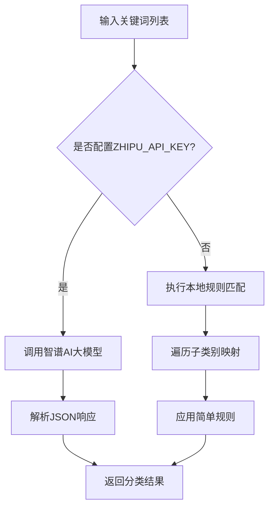
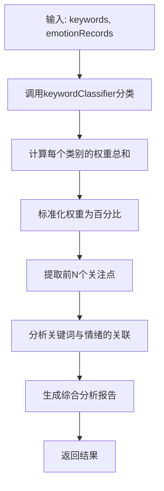
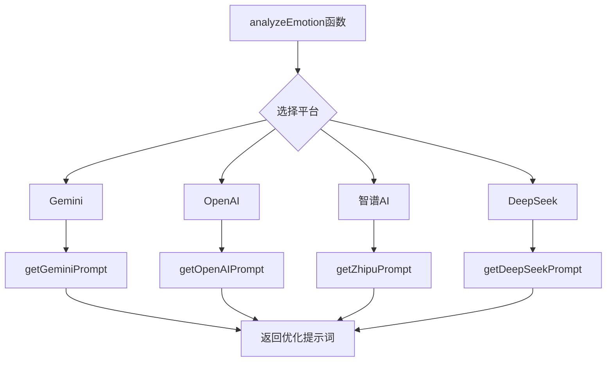

# 情感分析功能

<cite>
**本文档引用的文件**  
- [keywordClassifier.js](file://cloudfunctions/analysis/keywordClassifier.js)
- [keywordEmotionLinker.js](file://cloudfunctions/analysis/keywordEmotionLinker.js)
- [aiModelService.js](file://cloudfunctions/analysis/aiModelService.js)
- [aiModelService_part2.js](file://cloudfunctions/analysis/aiModelService_part2.js)
- [aiModelService_part3.js](file://cloudfunctions/analysis/aiModelService_part3.js)
- [userInterestAnalyzer.js](file://cloudfunctions/analysis/userInterestAnalyzer.js)
- [bigmodel.js](file://cloudfunctions/analysis/bigmodel.js)
- [geminiModel.js](file://cloudfunctions/analysis/geminiModel.js)
- [01-情感分析提示词.md](file://doc/开发文档/prompt/01-情感分析提示词.md)
- [02-情感分析提示词实现指南.md](file://doc/开发文档/prompt/02-情感分析提示词实现指南.md)
- [03-关键词分类提示词.md](file://doc/开发文档/prompt/03-关键词分类提示词.md)
</cite>

## 更新摘要
**变更内容**   
- 更新了“提示词工程”章节，以反映新建立的结构化提示词体系
- 新增了“提示词体系架构”章节，详细说明优化后的提示词设计
- 扩展了“调试技巧”章节，增加了关于新字段的处理建议
- 更新了所有受影响的文件来源，以包含新添加的提示词文档

## 目录
1. [简介](#简介)
2. [规则引擎：关键词驱动的初步情绪识别](#规则引擎关键词驱动的初步情绪识别)
3. [AI模型服务：多模型协同的深度语义分析](#ai模型服务多模型协同的深度语义分析)
4. [用户兴趣分析：从对话中提取兴趣标签](#用户兴趣分析从对话中提取兴趣标签)
5. [提示词工程：引导AI输出结构化结果](#提示词工程引导ai输出结构化结果)
6. [提示词体系架构](#提示词体系架构)
7. [调试技巧与常见问题解决方案](#调试技巧与常见问题解决方案)
8. [总结](#总结)

## 简介

本技术文档深入解析HeartChat应用中的情感分析功能。该功能采用“规则引擎+AI模型”的混合架构，实现多层次、高精度的情绪识别。系统首先利用规则引擎对文本进行关键词提取和初步分类，然后调用Gemini、智谱AI等多个大模型进行深度语义分析，最终结合用户历史数据生成全面的情感洞察报告。本文档将详细阐述`keywordClassifier.js`、`keywordEmotionLinker.js`、`aiModelService.js`和`userInterestAnalyzer.js`等核心模块的工作原理，并介绍提示词工程在其中的关键作用。

## 规则引擎：关键词驱动的初步情绪识别

### 关键词分类器 (keywordClassifier.js)

`keywordClassifier.js`模块是情感分析流程的起点，负责对从用户对话中提取的关键词进行自动分类。该模块定义了24个预设类别（如“学习”、“工作”、“社交”、“心理”等），并为每个类别配置了详细的子类别关键词库。

该模块的核心功能是`batchClassifyKeywords`函数，它支持两种分类模式：
1.  **AI大模型分类**：当配置了有效的`ZHIPU_API_KEY`环境变量时，模块会调用智谱AI的大模型服务，将关键词列表和分类说明作为提示词发送，要求模型以JSON格式返回分类结果。此方法利用了大模型强大的语义理解能力，分类结果更为精准。
2.  **本地规则分类**：当未配置API密钥时，模块会退化为本地规则匹配。它首先检查关键词是否包含在预定义的子类别映射中；若不匹配，则使用一系列基于关键词的简单规则（如包含“学”、“考”则归为“学习”类）进行分类。

这种双模式设计确保了系统的鲁棒性，即使在无法访问外部AI服务的情况下，也能提供基本的分类能力。



**图示来源**
- [keywordClassifier.js](file://cloudfunctions/analysis/keywordClassifier.js#L1-L299)

**本节来源**
- [keywordClassifier.js](file://cloudfunctions/analysis/keywordClassifier.js#L1-L299)

### 关键词与情绪关联 (keywordEmotionLinker.js)

`keywordEmotionLinker.js`模块负责将关键词与具体的情绪分析结果关联起来，实现情绪记忆的持久化。其核心功能是`linkKeywordsToEmotion`函数。

该函数接收用户ID、关键词列表和情感分析结果作为输入。它首先调用`calculateEmotionScore`函数，将复杂的情感分析结果（如“焦虑”、“喜悦”）转换为一个-1到1之间的数值分数（负值代表负面情绪，正值代表正面情绪）。然后，该函数查询数据库中该用户的兴趣数据记录，遍历每个关键词，计算其情感分数的加权平均值（新分数占30%，旧分数占70%），并更新数据库。这种加权平均机制使得系统能够平滑地跟踪用户对特定话题情绪的变化趋势。

```mermaid
flowchart TD
A[输入: userId, keywords, emotionResult] --> B[计算情感分数]
B --> C[查询用户兴趣数据]
C --> D{找到记录?}
D --> |否| E[返回失败]
D --> |是| F[遍历每个关键词]
F --> G[查找关键词索引]
G --> H{关键词存在?}
H --> |否| I[跳过]
H --> |是| J[计算新情感分数 (加权平均)]
J --> K[更新数据库]
K --> L[更新计数+1]
L --> F
F --> M[返回更新结果]
```

**图示来源**
- [keywordEmotionLinker.js](file://cloudfunctions/analysis/keywordEmotionLinker.js#L1-L207)

**本节来源**
- [keywordEmotionLinker.js](file://cloudfunctions/analysis/keywordEmotionLinker.js#L1-L207)

## AI模型服务：多模型协同的深度语义分析

### 统一AI模型调用接口 (aiModelService.js)

`aiModelService.js`是整个情感分析功能的“大脑”，它提供了一个统一的接口来协调调用多个AI大模型。该模块通过`MODEL_PLATFORMS`常量定义了对智谱AI、Google Gemini、OpenAI、Claude等8个不同平台的支持，每个平台都配置了其API地址、默认模型、认证方式等信息。

其核心功能`analyzeEmotion`函数负责执行深度情感分析。该函数会根据用户配置或默认设置选择一个AI平台（如Gemini），然后构建一个精心设计的提示词（Prompt），要求模型分析用户输入的文本，并以严格的JSON格式返回包含主要情绪、次要情绪、强度、愉悦度、唤醒水平、情绪趋势、注意力水平、雷达维度评分、主题关键词、情绪触发词和建议等在内的全面分析结果。

该模块还实现了智能的错误处理和重试机制。当遇到429错误（请求过多）时，它会自动等待一段时间后重试，并采用指数退避策略（等待时间逐次翻倍），有效应对API的限流问题。

```mermaid
graph TB
subgraph "AI模型服务"
A[analyzeEmotion] --> B[选择平台 (Gemini/智谱AI)]
B --> C[构建情感分析提示词]
C --> D[调用callModelApi]
D --> E{API调用成功?}
E --> |否| F{是否为429错误?}
F --> |是| G[延迟并重试]
G --> D
F --> |否| H[返回错误]
E --> |是| I[解析JSON响应]
I --> J[标准化结果]
J --> K[返回结果]
end
```

**图示来源**
- [aiModelService.js](file://cloudfunctions/analysis/aiModelService.js#L1-L663)

**本节来源**
- [aiModelService.js](file://cloudfunctions/analysis/aiModelService.js#L1-L663)

### 模型协调与功能扩展

`aiModelService.js`通过导入`aiModelService_part2.js`和`aiModelService_part3.js`两个子模块，扩展了其功能。`aiModelService_part2.js`提供了`extractKeywords`（提取关键词）和`getEmbeddings`（获取词向量）功能，而`aiModelService_part3.js`则提供了`clusterKeywords`（关键词聚类）和`analyzeUserInterests`（分析用户兴趣）功能。

这些子模块通过`init`函数接收父模块的`getPlatformConfig`和`callModelApi`辅助函数，从而能够复用主模块的平台配置和API调用逻辑。例如，`extractKeywords`函数会根据指定的平台，调用相应的大模型API来提取文本中的关键词，并返回带有权重的关键词列表。这种模块化设计使得代码结构清晰，易于维护和扩展。

## 用户兴趣分析：从对话中提取兴趣标签

### 用户兴趣分析器 (userInterestAnalyzer.js)

`userInterestAnalyzer.js`模块整合了规则引擎和AI模型的能力，专门用于分析用户的长期兴趣。其核心功能`analyzeUserInterests`函数接收关键词列表和情绪记录作为输入，执行一个四步分析流程：

1.  **关键词分类**：调用`keywordClassifier.js`的`batchClassifyKeywords`函数，为每个关键词打上类别标签。
2.  **计算类别权重**：将同一类别下所有关键词的权重相加，得到每个兴趣类别的总权重。
3.  **标准化权重**：将总权重转换为百分比形式，并按降序排列，从而确定用户的前几大兴趣领域。
4.  **提取关注点**：为每个主要兴趣类别，找出权重最高的几个关键词作为该领域的代表性关注点。

此外，该模块还通过`analyzeEmotionalAssociations`函数，分析特定关键词与积极或消极情绪的关联性。它会遍历用户的历史情绪记录，统计每个关键词出现在积极情绪和消极情绪上下文中的频率，从而识别出哪些话题会持续引发用户的积极或消极情绪。



**图示来源**
- [userInterestAnalyzer.js](file://cloudfunctions/analysis/userInterestAnalyzer.js#L1-L289)

**本节来源**
- [userInterestAnalyzer.js](file://cloudfunctions/analysis/userInterestAnalyzer.js#L1-L289)

## 提示词工程：引导AI输出结构化结果

提示词工程是确保AI模型输出稳定、可靠的关键。在HeartChat项目中，这一策略被系统化地应用于所有AI模型调用。

### 核心提示词设计

位于`doc/开发文档/prompt/01-情感分析提示词.md`的文档是整个情感分析功能的“灵魂”。它为Gemini、OpenAI、智谱AI等不同模型量身定制了详细的提示词模板。这些提示词具有以下共同特点：
-   **明确的任务定义**：开篇即声明AI的角色（“专业的情感分析助手”）和任务目标。
-   **结构化的输出要求**：强制要求模型以JSON格式返回结果，并详细定义了每个字段的名称、数据类型和取值范围（如`primary_emotion`必须使用中文，`intensity`范围为0.0-1.0）。
-   **丰富的上下文信息**：提供了8大类32子类的情感体系、强度评分标准、情感模式识别类型等，极大地提升了模型分析的准确性和一致性。
-   **文化适应性**：针对智谱AI和DeepSeek等中文模型，特别强调了对中国文化、含蓄表达和面子文化的理解。

### 在代码中的应用

在`aiModelService.js`、`bigmodel.js`和`geminiModel.js`等文件中，可以看到这些提示词被直接或间接地应用。例如，在`aiModelService.js`的`analyzeEmotion`函数中，构建的提示词内容与`01-情感分析提示词.md`中的“Gemini模型情感分析提示词（优化版）”高度一致，确保了无论通过哪个入口调用，AI都能接收到相同质量的指令。

这种将提示词文档化、标准化的做法，使得整个系统的AI行为更加可预测和可维护，是项目成功的关键因素之一。

**本节来源**
- [01-情感分析提示词.md](file://doc/开发文档/prompt/01-情感分析提示词.md#L1-L480)
- [aiModelService.js](file://cloudfunctions/analysis/aiModelService.js#L1-L663)
- [bigmodel.js](file://cloudfunctions/analysis/bigmodel.js#L1-L705)
- [geminiModel.js](file://cloudfunctions/analysis/geminiModel.js#L1-L656)

## 提示词体系架构

### 结构化提示词体系

根据`02-情感分析提示词实现指南.md`和`03-关键词分类提示词.md`文档，项目已建立了一套完整的结构化提示词体系。该体系的核心是为不同AI模型和不同任务设计专门优化的提示词模板。

**情感分析提示词体系**：
- **8大类32子类情感体系**：建立了全面的情感分类标准，包括积极、消极、认知、社交、压力、自我、平静和复杂情感。
- **新增分析维度**：引入了`emotion_pattern`（情感模式）、`change_rate`（变化速率）、`risk_level`（风险等级）等新字段，提供更深入的分析。
- **风险评估机制**：定义了0-5级的情感风险预警等级，用于识别潜在的情感危机。

**关键词分类提示词体系**：
- **25个预定义类别**：包括学习、工作、社交、健康、心理等，为关键词分类提供明确的框架。
- **混合分类策略**：优先使用大模型进行语义理解分类，本地规则匹配作为降级方案，确保系统的可用性。

### 代码集成方案

`02-情感分析提示词实现指南.md`文档详细说明了如何将新提示词集成到`aiModelService.js`中。核心是通过`getOptimizedPrompt`函数，根据不同的AI平台（Gemini、OpenAI、智谱AI等）动态选择最合适的提示词模板。这确保了每个模型都能在其最擅长的领域发挥最佳性能。



**图示来源**
- [02-情感分析提示词实现指南.md](file://doc/开发文档/prompt/02-情感分析提示词实现指南.md#L1-L328)
- [03-关键词分类提示词.md](file://doc/开发文档/prompt/03-关键词分类提示词.md#L1-L100)

**本节来源**
- [02-情感分析提示词实现指南.md](file://doc/开发文档/prompt/02-情感分析提示词实现指南.md#L1-L328)
- [03-关键词分类提示词.md](file://doc/开发文档/prompt/03-关键词分类提示词.md#L1-L100)

## 调试技巧与常见问题解决方案

### 模型响应不稳定

**问题现象**：AI模型返回的结果格式不正确，或情感分析结果波动过大。
**解决方案**：
1.  **检查提示词**：确保提示词中明确要求了JSON格式输出，并且字段定义清晰。参考`01-情感分析提示词.md`文档进行校对。
2.  **调整温度参数**：在`aiModelService.js`中，将`temperature`参数从默认的0.3降低到0.1或0.2。较低的温度会使模型的输出更加确定和稳定。
3.  **增加重试机制**：检查`callModelApi`函数中的重试逻辑，确保在遇到网络错误或429状态码时能正确重试。
4.  **切换模型平台**：如果某个平台（如Gemini）表现不佳，可以尝试切换到另一个平台（如智谱AI）进行对比测试。
5.  **验证新字段**：对于新增的`emotion_pattern`、`risk_level`等字段，检查其取值是否符合`02-情感分析提示词实现指南.md`中定义的标准。

### 关键词匹配不准

**问题现象**：`keywordClassifier.js`的本地规则分类结果不准确。
**解决方案**：
1.  **扩充子类别库**：检查`SUBCATEGORIES`常量，为“学习”、“工作”等类别添加更多相关的关键词。例如，为“学习”类别添加“考研”、“保研”、“竞赛”等。
2.  **优化规则逻辑**：审查`batchClassifyKeywords`函数中的`if-else`规则链，确保没有逻辑冲突。例如，避免“健康”和“心理”类别的关键词重叠。
3.  **启用AI分类**：最根本的解决方案是配置有效的`ZHIPU_API_KEY`，启用基于大模型的AI分类，其准确性远高于本地规则匹配。

### 本地开发环境调试

在本地开发时，由于无法访问微信云开发环境，可以采取以下措施：
1.  **模拟API响应**：在`bigmodel.js`的`getEmbeddings`函数中，已经实现了当API密钥为空时生成模拟词向量的逻辑。可以借鉴此方法，为其他API调用编写模拟函数。
2.  **启用详细日志**：将`isDev`常量设置为`true`，以便在控制台输出详细的请求和响应信息，便于追踪问题。
3.  **前端兼容性处理**：由于新增了多个字段，确保前端组件（如`emotion-panel`）能够正确处理新旧版本的分析结果，必要时使用`normalizeResult`等工具函数进行兼容处理。

**本节来源**
- [aiModelService.js](file://cloudfunctions/analysis/aiModelService.js#L1-L663)
- [keywordClassifier.js](file://cloudfunctions/analysis/keywordClassifier.js#L1-L299)
- [bigmodel.js](file://cloudfunctions/analysis/bigmodel.js#L1-L705)
- [02-情感分析提示词实现指南.md](file://doc/开发文档/prompt/02-情感分析提示词实现指南.md#L1-L328)

## 总结

HeartChat的情感分析功能通过巧妙结合规则引擎与AI大模型，构建了一个强大而稳健的多层次情绪识别系统。`keywordClassifier.js`和`keywordEmotionLinker.js`作为规则引擎，高效地处理关键词的初步分类和情绪关联；`aiModelService.js`作为核心协调者，统一调度Gemini、智谱AI等多个大模型，进行深度语义分析；`userInterestAnalyzer.js`则整合所有信息，生成用户兴趣画像。贯穿始终的、精心设计的提示词工程，是确保AI输出结构化、高质量结果的关键。这一混合架构充分发挥了规则的效率和AI的深度，为用户提供精准、富有同理心的情感陪伴体验。