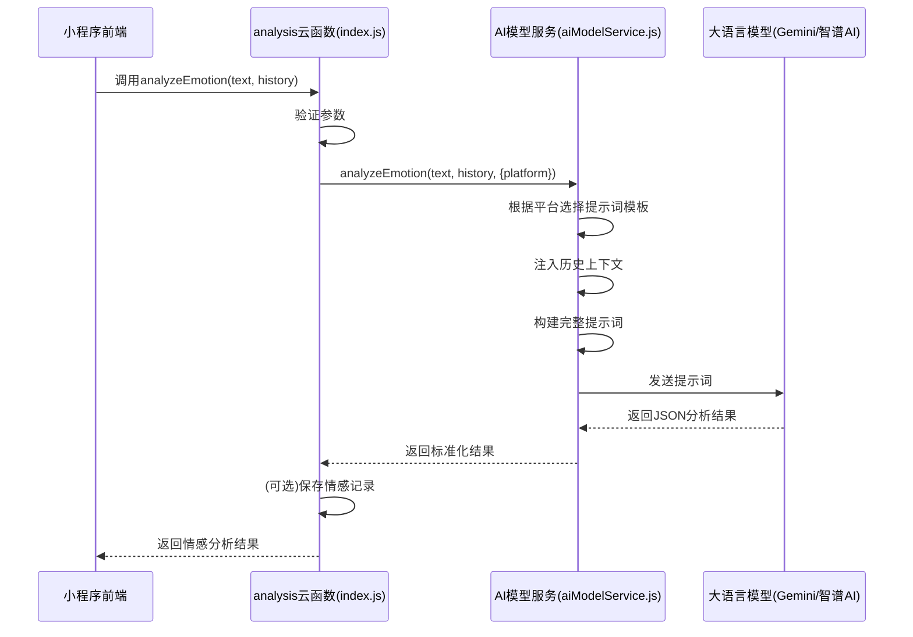

# 情感分析提示词设计

<cite>
**本文档引用文件**  
- [01-情感分析提示词.md](file://doc/开发文档/prompt/01-情感分析提示词.md)
- [02-情感分析提示词实现指南.md](file://doc/开发文档/prompt/02-情感分析提示词实现指南.md)
- [index.js](file://cloudfunctions/analysis/index.js)
- [aiModelService.js](file://cloudfunctions/analysis/aiModelService.js)
- [aiModelService_part2.js](file://cloudfunctions/analysis/aiModelService_part2.js)
- [aiModelService_part3.js](file://cloudfunctions/analysis/aiModelService_part3.js)
- [promptGenerator.js](file://cloudfunctions/roles/promptGenerator.js)
</cite>

## 目录
1. [引言](#引言)
2. [情感分析提示词体系](#情感分析提示词体系)
3. [输出格式约束与JSON Schema](#输出格式约束与json-schema)
4. [上下文注入与个性化分析](#上下文注入与个性化分析)
5. [提示词调用流程与注入时机](#提示词调用流程与注入时机)
6. [提示词优化方法论](#提示词优化方法论)
7. [安全与兼容性处理](#安全与兼容性处理)
8. [总结](#总结)

## 引言

HeartChat是一款基于微信小程序云开发的情感陪伴与情商提升应用，其核心功能依赖于大语言模型对用户情感状态的精准识别与反馈。本专项文档旨在深入解析用于引导大模型输出结构化情绪分析结果的提示词工程设计原理。文档详细阐述了情感维度的定义体系、输出格式的严格约束（JSON Schema）、上下文注入策略，以及如何结合用户历史对话与角色设定提升分析的个性化程度。同时，文档提供了提示词迭代优化的方法论，包括A/B测试评估与敏感词过滤机制，并结合`index.js`中的实际调用逻辑，展示提示词在完整分析流程中的注入时机与处理流程。

## 情感分析提示词体系

HeartChat的情感分析提示词体系经过精心设计，旨在为不同AI模型（如Gemini、OpenAI、智谱AI、DeepSeek）提供统一且优化的分析框架。该体系的核心是建立一个全面、细致的情感分类与评估标准。

### 情感维度与分类体系

系统采用“8大类32子类”的情感分类体系，确保情感识别的全面性与精确性。这八大类情感包括：
- **积极情感类**：如喜悦、满足、感激、希望。
- **消极情感类**：如悲伤、焦虑、愤怒、失望。
- **认知情感类**：如困惑、惊讶、好奇、反思。
- **社交情感类**：如孤独、思念、同情、愧疚。
- **压力情感类**：如压力、疲惫、烦躁、恐慌。
- **自我情感类**：如自信、自卑、尴尬、羞耻。
- **平静情感类**：如平静、释然、空虚、无聊。
- **复杂情感类**：如矛盾、复杂、期待、怀旧。

该分类体系为大模型提供了明确的分析框架，使其能够超越简单的“正面/负面”二元判断，识别出更深层次、更复杂的情感状态。

### 情感强度与变化评估

提示词体系对情感的量化评估有严格要求：
- **强度评分**：采用0.0至1.0的数值体系，将情感强度划分为“几乎无感知”、“轻度感知”、“中等强度”、“较强表现”和“极度强烈”五个等级。评估依据包括词汇强度、重复频率、标点符号使用、上下文关联和表达细节。
- **情感变化速度**：通过`change_rate`字段（0.0-1.0）评估情感变化的速率，分为“快速”、“中速”、“缓慢”和“稳定”。
- **情感模式识别**：定义了“爆发型”、“累积型”、“波动型”、“压抑型”等8种情感模式，帮助模型理解情感发展的内在规律。

**Section sources**
- [01-情感分析提示词.md](file://doc/开发文档/prompt/01-情感分析提示词.md#L1-L479)

## 输出格式约束与JSON Schema

为了确保情感分析结果的结构化和可程序化处理，提示词强制要求大模型以严格的JSON格式输出结果。这一约束是整个分析流程自动化和前端可视化的基础。

### JSON Schema定义

提示词中明确指定了JSON Schema，要求模型输出包含以下核心字段：
```json
{
  "primary_emotion": "主要情感类型",
  "secondary_emotions": ["次要情感1", "次要情感2"],
  "intensity": 0.0-1.0的数值,
  "valence": -1.0到1.0的数值,
  "arousal": 0.0到1.0的数值,
  "trend": "上升/下降/稳定",
  "attention_level": "高/中/低",
  "radar_dimensions": {
    "trust": 0.0-1.0,
    "openness": 0.0-1.0,
    "resistance": 0.0-1.0,
    "stress": 0.0-1.0,
    "control": 0.0-1.0
  },
  "topic_keywords": ["主题关键词1", "主题关键词2"],
  "emotion_triggers": ["触发词1", "触发词2"],
  "emotion_pattern": "情感模式类型",
  "change_rate": 0.0-1.0,
  "eq_suggestions": ["情商建议1", "情商建议2", "情商建议3"],
  "risk_level": 0-5的数值,
  "summary": "情感状态总结"
}
```

### 字段说明与作用

- **核心情感字段**：`primary_emotion`和`secondary_emotions`用于明确情感分类，`intensity`、`valence`（效价）和`arousal`（唤醒度）构成情感的三维坐标。
- **动态分析字段**：`trend`和`change_rate`描述情感的动态变化，`emotion_pattern`揭示情感的内在模式。
- **深度分析字段**：`topic_keywords`和`emotion_triggers`提供分析依据，`eq_suggestions`和`summary`提供直接的用户价值。
- **风险评估字段**：`risk_level`（0-5级）用于情感风险预警，支持及时干预。

**Section sources**
- [01-情感分析提示词.md](file://doc/开发文档/prompt/01-情感分析提示词.md#L1-L479)
- [02-情感分析提示词实现指南.md](file://doc/开发文档/prompt/02-情感分析提示词实现指南.md#L1-L327)

## 上下文注入与个性化分析

为了提升情感分析的准确性和个性化程度，提示词设计中融入了上下文注入策略，使模型能够结合用户的历史对话和角色设定进行更深入的分析。

### 历史对话上下文注入

在调用大模型进行情感分析时，系统会将最近的5轮对话历史作为上下文注入到提示词中。这一策略使模型能够：
- **理解情感发展脉络**：分析情感是突然爆发还是长期累积，识别情感转变的关键节点。
- **提高分析准确性**：避免孤立地分析单条消息，结合前后文理解用户的真实意图和情感背景。
- **预测情感趋势**：基于历史模式，预测用户情感的未来发展方向。

在`aiModelService.js`中，`analyzeEmotion`函数会检查`history`参数，并将其内容格式化后追加到提示词末尾。

### 角色设定与用户画像结合

虽然情感分析提示词本身不直接包含角色信息，但整个系统通过分层提示词工程实现个性化。`promptGenerator.js`模块负责生成角色扮演的提示词，该提示词包含了角色的性格、背景和与用户的关系。当情感分析结果返回后，前端或对话系统会结合角色设定，以符合角色身份的方式向用户反馈分析结果和情商建议，从而实现高度个性化的交互体验。

**Section sources**
- [aiModelService.js](file://cloudfunctions/analysis/aiModelService.js#L1-L662)
- [promptGenerator.js](file://cloudfunctions/roles/promptGenerator.js#L1-L324)

## 提示词调用流程与注入时机

情感分析提示词在`analysis`云函数中被调用，其注入时机和处理流程是整个功能的核心。`index.js`文件定义了对外的API接口，而`aiModelService.js`负责具体的提示词构建和模型调用。

### 云函数调用流程

1.  **API请求**：小程序前端调用`analysis`云函数的`analyzeEmotion`方法，传入待分析的`text`、`history`等参数。
2.  **参数验证**：`index.js`中的`analyzeEmotion`函数首先验证输入参数的有效性。
3.  **并行处理**：函数使用`Promise.all`并行调用`aiModelService.analyzeEmotion`进行情感分析和`aiModelService.extractKeywords`进行关键词提取。
4.  **提示词构建与注入**：`aiModelService.js`根据`options.platform`参数选择对应的模型配置，并构建包含情感分析任务、待分析文本、历史上下文和严格JSON格式要求的完整提示词。
5.  **模型调用**：构建好的提示词通过`callModelApi`函数发送给指定的大模型API（如Gemini或智谱AI）。
6.  **结果处理**：云函数接收模型返回的JSON响应，进行解析和标准化处理，然后将结果返回给前端。

### 注入时机图解



**Diagram sources**
- [index.js](file://cloudfunctions/analysis/index.js#L1-L799)
- [aiModelService.js](file://cloudfunctions/analysis/aiModelService.js#L1-L662)

**Section sources**
- [index.js](file://cloudfunctions/analysis/index.js#L1-L799)
- [aiModelService.js](file://cloudfunctions/analysis/aiModelService.js#L1-L662)

## 提示词优化方法论

为了持续提升情感分析的准确性和用户体验，需要一套科学的提示词优化方法论。

### A/B测试效果评估

通过A/B测试对比不同版本提示词的效果是优化的核心手段。可以设计以下测试方案：
- **测试组A**：使用旧版提示词。
- **测试组B**：使用新版提示词（如增加了情感模式识别或更详细的情商建议要求）。
- **评估指标**：对比两组的用户满意度评分、情感分析结果的合理性、建议的采纳率等。通过数据分析，量化新版提示词的改进效果。

### 敏感词与安全边界

提示词设计必须包含安全机制，以防止模型产生有害输出。
- **风险预警**：提示词要求模型评估`risk_level`，当检测到高风险情感状态（如自残倾向）时，系统可引导用户寻求专业帮助。
- **安全边界**：在提示词中明确要求模型“避免做出诊断性结论”、“不提供医疗或治疗建议”，确保其行为在安全和支持性的范围内。

**Section sources**
- [01-情感分析提示词.md](file://doc/开发文档/prompt/01-情感分析提示词.md#L1-L479)
- [02-情感分析提示词实现指南.md](file://doc/开发文档/prompt/02-情感分析提示词实现指南.md#L1-L327)

## 安全与兼容性处理

在实际部署中，必须考虑系统的健壮性和向后兼容性。

### 向后兼容性

由于前端可能依赖旧版的字段名，`aiModelService.js`在返回结果前会进行字段映射和兼容处理。例如，将`primary_emotion`映射到旧版的`type`字段，确保即使提示词升级，旧版前端也能正常工作。

### 错误处理与降级

系统实现了完善的错误处理机制。当大模型API调用失败或返回非JSON格式时，`aiModelService.js`会捕获异常，并返回带有`success: false`的错误对象，避免导致整个云函数崩溃。同时，对于不支持某些功能的模型（如Gemini不支持词向量），系统会提供模拟数据作为降级方案。

**Section sources**
- [aiModelService.js](file://cloudfunctions/analysis/aiModelService.js#L1-L662)
- [aiModelService_part2.js](file://cloudfunctions/analysis/aiModelService_part2.js#L1-L316)

## 总结

HeartChat的情感分析提示词工程是一个集成了情感科学、大模型技术和软件工程的综合性设计。通过建立精细的情感维度体系、强制的JSON Schema输出、上下文注入策略以及与角色设定的协同，系统能够为用户提供深度、个性化且结构化的情感分析服务。`index.js`和`aiModelService.js`的代码实现确保了提示词在正确时机被注入和执行。未来，通过持续的A/B测试和用户反馈收集，可以不断迭代优化提示词，提升情感分析的准确性和情商建议的实用性，最终实现更智能、更有温度的情感陪伴体验。