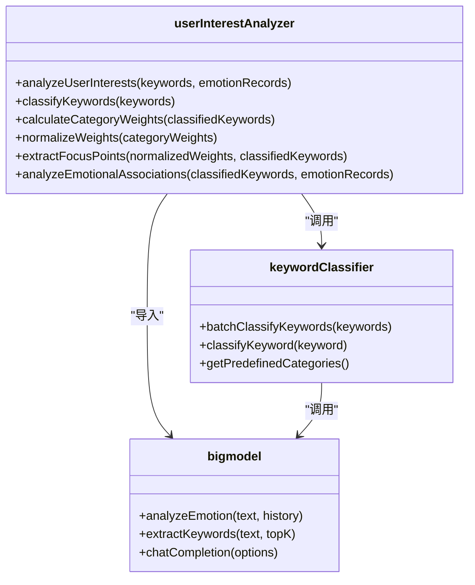
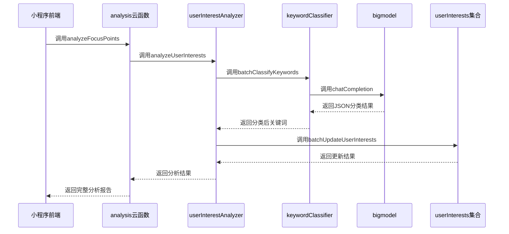
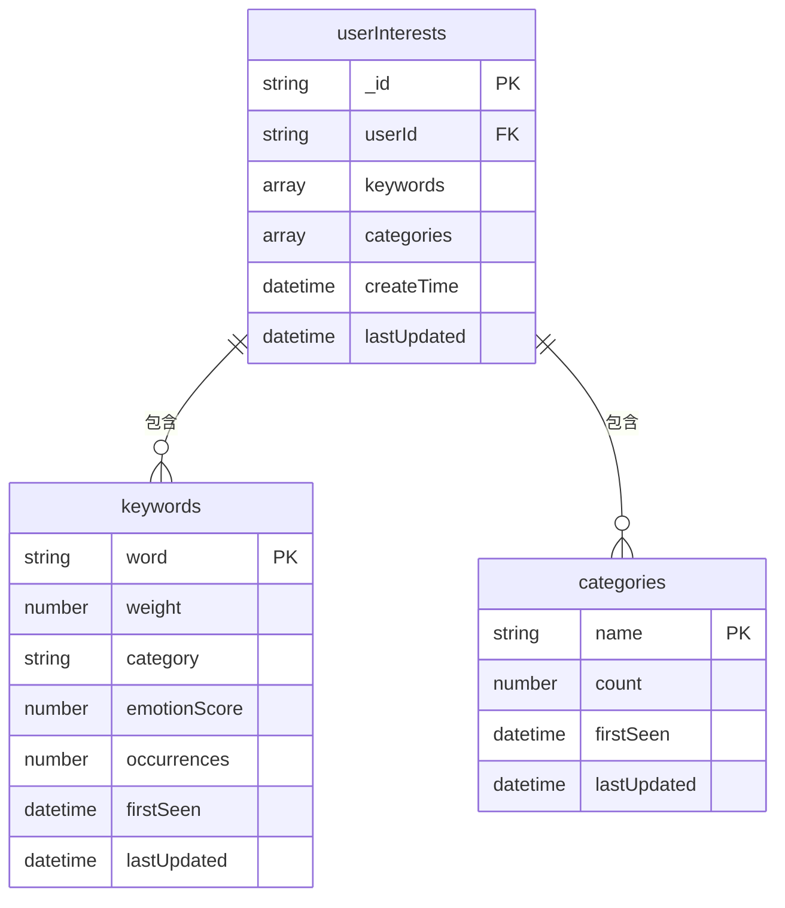

# 用户兴趣标签提取

<cite>
**本文档引用文件**  
- [userInterestAnalyzer.js](file://cloudfunctions/analysis/userInterestAnalyzer.js)
- [keywordClassifier.js](file://cloudfunctions/analysis/keywordClassifier.js)
- [userInterests.js](file://cloudfunctions/user/userInterests.js)
- [userInterests.md](file://doc/开发文档/database/userInterests.md)
- [用户兴趣分类功能说明.md](file://doc/使用文档/用户兴趣分类功能说明.md)
- [userInterestsService.js](file://miniprogram/services/userInterestsService.js)
- [interest-tag-cloud.js](file://miniprogram/components/interest-tag-cloud/interest-tag-cloud.js)
- [bigmodel.js](file://cloudfunctions/analysis/bigmodel.js)
- [index.js](file://cloudfunctions/analysis/index.js)
</cite>

## 目录
1. [引言](#引言)
2. [核心功能与工作流程](#核心功能与工作流程)
3. [核心组件分析](#核心组件分析)
4. [架构与协同关系](#架构与协同关系)
5. [数据存储与更新策略](#数据存储与更新策略)
6. [上下文理解与长期兴趣识别](#上下文理解与长期兴趣识别)
7. [性能与准确率优化建议](#性能与准确率优化建议)
8. [应用场景](#应用场景)
9. [结论](#结论)

## 引言

用户兴趣标签提取功能是HeartChat应用的核心模块之一，旨在通过分析用户的对话文本，自动识别并提取用户的兴趣关键词，进而构建动态的用户兴趣画像。该功能不仅能够捕捉用户当前的对话焦点，更能通过持续学习，区分用户的临时提及与长期兴趣，为个性化推荐和角色互动提供数据支持。本技术文档将深入解析`userInterestAnalyzer.js`的工作机制，阐述其与关键词处理模块的协同关系、兴趣标签的存储结构与更新策略，并提供优化建议和应用场景说明。

## 核心功能与工作流程

用户兴趣标签提取功能的核心目标是从非结构化的对话文本中提炼出结构化的用户兴趣数据。其工作流程是一个多阶段的自动化处理过程，始于关键词提取，终于兴趣画像的更新。

首先，系统通过`bigmodel.js`中的`extractKeywords`函数，利用智谱AI（GLM-4-Flash）模型从用户的对话文本中提取出一组带有权重的关键词。这些关键词是用户表达的核心概念，权重反映了其在当前语境中的重要性。

随后，提取出的关键词被送入`userInterestAnalyzer.js`进行深度分析。该模块的核心工作流程如下：
1.  **关键词分类**：调用`keywordClassifier.js`对关键词进行分类，将其归入预定义的兴趣类别（如“学习”、“工作”、“娱乐”等）。
2.  **权重聚合**：计算每个兴趣类别下所有关键词的权重总和，形成初步的类别权重。
3.  **权重标准化**：将类别权重总和归一化为百分比形式，便于直观比较。
4.  **关注点提取**：根据标准化后的权重，筛选出权重最高的前五个类别作为用户的“关注点”，并为每个关注点选取最具代表性的关键词。
5.  **情感关联分析**：结合用户的历史情绪记录，分析特定关键词与积极或消极情绪的关联强度，识别出能带来正向或负向情绪的“情感关联词”。

最终，分析结果被传递给`userInterests.js`模块，用于持久化存储和更新用户的兴趣画像。

**Section sources**
- [userInterestAnalyzer.js](file://cloudfunctions/analysis/userInterestAnalyzer.js#L25-L288)
- [bigmodel.js](file://cloudfunctions/analysis/bigmodel.js#L200-L250)
- [用户兴趣分类功能说明.md](file://doc/使用文档/用户兴趣分类功能说明.md#L20-L50)

## 核心组件分析

### userInterestAnalyzer.js 模块分析

`userInterestAnalyzer.js`是整个兴趣分析流程的“大脑”，它协调多个子模块，完成从原始关键词到结构化兴趣画像的转换。

**Diagram sources**
- [userInterestAnalyzer.js](file://cloudfunctions/analysis/userInterestAnalyzer.js#L1-L288)
- [keywordClassifier.js](file://cloudfunctions/analysis/keywordClassifier.js#L1-L299)

#### 关键词分类器 (keywordClassifier.js)

`keywordClassifier.js`模块负责将原始关键词映射到有意义的兴趣类别。它采用了一种混合策略来保证分类的鲁棒性。

其核心函数`batchClassifyKeywords`首先会检查环境变量`ZHIPU_API_KEY`。如果API密钥存在，它将构建一个包含预定义类别和说明的详细提示词（Prompt），并调用`bigmodel.js`的`chatCompletion`接口，利用大模型的强大语义理解能力进行精准分类。这种方式准确率高，但依赖外部API。

当API密钥不存在或调用失败时，模块会优雅降级，使用本地的规则引擎进行分类。该引擎基于一个细分类别映射表（`SUBCATEGORIES`）和一系列包含关键词的规则（如包含“学”、“考”等字的归为“学习”类）。这种本地分类虽然准确率不如大模型，但保证了服务的可用性，避免了因外部依赖故障而导致功能中断。

**Section sources**
- [keywordClassifier.js](file://cloudfunctions/analysis/keywordClassifier.js#L1-L299)
- [userInterestAnalyzer.js](file://cloudfunctions/analysis/userInterestAnalyzer.js#L50-L85)

#### 兴趣分析主流程

`analyzeUserInterests`函数是`userInterestAnalyzer.js`的入口。它接收关键词数组和情绪记录数组作为输入，通过一系列函数调用完成分析。

`classifyKeywords`函数负责与`keywordClassifier`交互，获取每个关键词的分类结果。`calculateCategoryWeights`函数则遍历所有分类后的关键词，累加每个类别的权重。`normalizeWeights`函数将累加的权重转换为百分比，并按降序排序，形成最终的类别权重分布。`extractFocusPoints`函数基于排序后的权重，提取出前五个主要关注点，并关联其代表性关键词。

**Section sources**
- [userInterestAnalyzer.js](file://cloudfunctions/analysis/userInterestAnalyzer.js#L25-L288)

## 架构与协同关系

用户兴趣标签提取功能并非孤立运行，而是与多个模块紧密协作，形成一个完整的数据处理闭环。

**Diagram sources**
- [index.js](file://cloudfunctions/analysis/index.js#L200-L400)
- [userInterestAnalyzer.js](file://cloudfunctions/analysis/userInterestAnalyzer.js#L25-L288)
- [userInterests.js](file://cloudfunctions/user/userInterests.js#L1-L847)

### 与关键词处理模块的协同

该功能与关键词处理模块的协同关系是分层递进的。`bigmodel.js`中的`extractKeywords`函数作为第一层，负责从文本中“挖掘”出原始的关键词矿石。`keywordClassifier.js`作为第二层，对这些矿石进行“冶炼”和“提纯”，将其分类到不同的“兴趣矿脉”中。最后，`userInterestAnalyzer.js`作为第三层，对不同矿脉的产出进行“统计”和“评估”，形成最终的“资源报告”（即用户兴趣画像）。这种分层架构使得每个模块职责单一，易于维护和扩展。

### 与大模型服务的交互

`userInterestAnalyzer.js`本身不直接调用大模型API，而是通过`keywordClassifier.js`作为中介。`keywordClassifier.js`在需要时，会调用`bigmodel.js`提供的`chatCompletion`接口。`bigmodel.js`封装了与智谱AI API的通信细节，包括构建HTTP请求、处理认证头、解析JSON响应等。这种设计实现了关注点分离，`userInterestAnalyzer.js`只需关心“分类”这一业务逻辑，而无需了解底层的API调用细节。

**Section sources**
- [userInterestAnalyzer.js](file://cloudfunctions/analysis/userInterestAnalyzer.js#L50-L85)
- [keywordClassifier.js](file://cloudfunctions/analysis/keywordClassifier.js#L150-L250)
- [bigmodel.js](file://cloudfunctions/analysis/bigmodel.js#L600-L705)

## 数据存储与更新策略

### 存储结构 (userInterests集合)

用户兴趣数据被持久化存储在名为`userInterests`的数据库集合中。该集合的结构设计旨在支持高效的查询和分析。

**Diagram sources**
- [userInterests.md](file://doc/开发文档/database/userInterests.md#L1-L122)
- [userInterests.js](file://cloudfunctions/user/userInterests.js#L1-L847)

根据`userInterests.md`文档，`userInterests`集合的核心字段包括：
- **userId**: 用户ID，与`user_base`表关联，确保每个用户只有一条兴趣记录。
- **keywords**: 关键词数组，是兴趣画像的核心。每个关键词对象包含`word`（关键词文本）、`weight`（权重值）、`category`（兴趣分类）、`emotionScore`（情感分数）和`occurrences`（出现次数）等字段。
- **categories**: 分类数组，用于快速统计每个兴趣类别的规模。每个分类对象包含`name`（分类名称）、`count`（该分类下的关键词数量）等字段。
- **lastUpdated**: 记录最后更新时间，用于缓存失效和数据同步。

### 更新策略

兴趣数据的更新策略是增量式的，旨在高效地反映用户的最新兴趣变化。

`userInterests.js`模块提供了`batchUpdateUserInterests`函数作为主要的更新接口。其工作流程如下：
1.  **查询现有记录**：根据`userId`查询数据库中已有的兴趣记录。
2.  **处理关键词**：
    - 对于已存在的关键词，更新其权重（`weight`）、出现次数（`occurrences`）和最后更新时间（`lastUpdated`）。
    - 对于新出现的关键词，将其作为新条目添加到`keywords`数组中，并赋予初始权重。
3.  **更新分类统计**：根据新关键词的分类，更新`categories`数组中对应分类的`count`计数。
4.  **持久化**：将更新后的`keywords`和`categories`数组写回数据库。

这种策略避免了全量覆盖，减少了数据库I/O，提高了性能。同时，通过`occurrences`和`lastUpdated`字段，系统可以实现更复杂的权重计算规则，例如引入时间衰减因子，使近期出现的关键词拥有更高的权重。

**Section sources**
- [userInterests.js](file://cloudfunctions/user/userInterests.js#L150-L600)
- [userInterests.md](file://doc/开发文档/database/userInterests.md#L1-L122)
- [用户兴趣分类功能说明.md](file://doc/使用文档/用户兴趣分类功能说明.md#L50-L100)

## 上下文理解与长期兴趣识别

区分临时提及与长期兴趣是构建高质量用户画像的关键。本系统通过两种机制来实现这一目标。

首先，**权重累积机制**是识别长期兴趣的基础。当一个关键词在多次对话中被反复提及，其`occurrences`（出现次数）和`weight`（权重）会持续增加。随着时间的推移，这些高频、高权重的关键词会自然地在`keywords`数组中占据主导地位，从而被识别为用户的长期兴趣。例如，一个用户多次提到“心理学”和“编程”，这些词的权重会不断累积，最终成为其兴趣画像的核心。

其次，**情感关联分析**提供了更深层次的洞察。`analyzeEmotionalAssociations`函数通过分析关键词与历史情绪记录的共现关系，识别出与积极情绪（如“高兴”、“满足”）或消极情绪（如“焦虑”、“悲伤”）强相关的关键词。一个与积极情绪频繁关联的关键词，即使出现次数不多，也可能代表了用户的深层兴趣或“心流”活动。反之，与消极情绪关联的关键词可能代表了用户的压力源或痛点。这种分析超越了简单的频率统计，触及了用户的情感层面。

**Section sources**
- [userInterestAnalyzer.js](file://cloudfunctions/analysis/userInterestAnalyzer.js#L200-L288)
- [userInterests.js](file://cloudfunctions/user/userInterests.js#L150-L600)

## 性能与准确率优化建议

为了进一步提升用户兴趣标签提取功能的性能和准确率，提出以下优化建议：

1.  **词库扩展**：当前的预定义兴趣类别（`INTEREST_CATEGORIES`）和细分类别映射（`SUBCATEGORIES`）是固定的。建议建立一个动态词库管理机制，允许管理员或通过用户反馈来添加新的类别和关键词映射。例如，可以增加“心理健康”、“可持续发展”等新兴类别，并为其配置相关的关键词，从而提高分类的覆盖率和准确性。

2.  **上下文窗口调整**：在进行情感关联分析时，当前逻辑默认使用最近一周的情绪记录。这个“上下文窗口”的大小是固定的。建议将其参数化，允许根据用户活跃度进行动态调整。对于活跃用户，可以使用较短的窗口（如3天）以捕捉近期兴趣变化；对于不活跃用户，可以使用较长的窗口（如1个月）以确保有足够的数据进行分析。

3.  **引入时间衰减算法**：目前的权重更新策略是简单的累加。建议引入时间衰减算法，例如指数衰减。公式可以设计为：`newWeight = oldWeight * decayFactor + delta`，其中`decayFactor`小于1。这样，旧的关键词权重会随时间自然衰减，而新出现的关键词能更快地获得较高的权重，从而使兴趣画像能更灵敏地反映用户的最新兴趣。

4.  **前端缓存优化**：`userInterestsService.js`在小程序端实现了本地缓存，但缓存策略较为简单（30分钟过期）。建议优化为更智能的缓存策略，例如在用户完成一次对话后，主动清除缓存，确保下一次获取的是最新数据。同时，可以增加缓存大小限制，防止缓存占用过多内存。

**Section sources**
- [userInterestAnalyzer.js](file://cloudfunctions/analysis/userInterestAnalyzer.js#L1-L288)
- [userInterestsService.js](file://miniprogram/services/userInterestsService.js#L1-L613)

## 应用场景

用户兴趣标签提取功能的应用场景广泛，是实现个性化服务的核心驱动力。

1.  **个性化推荐**：这是最直接的应用。系统可以根据用户的兴趣画像，推荐相关的内容、活动或服务。例如，对于“音乐”和“电影”兴趣权重高的用户，可以优先推荐新上映的电影或热门音乐榜单；对于“学习”和“自我提升”兴趣高的用户，可以推荐相关的在线课程或书籍。

2.  **角色互动**：在HeartChat的聊天场景中，虚拟角色可以根据用户的兴趣画像进行更有针对性的对话。当用户提到某个兴趣点时，角色可以深入探讨，分享相关知识或提出建议，从而增强对话的深度和亲密度，提升用户体验。

3.  **兴趣标签云展示**：`interest-tag-cloud`组件直接消费`userInterests`集合中的数据，以视觉化的方式向用户展示其兴趣分布。标签的大小代表权重，颜色代表类别，为用户提供了一个直观的自我认知工具。

4.  **生成每日心情报告**：`generateDailyReport`云函数在生成报告时，会调用`analyzeFocusPoints`来分析用户当天的关注点。报告中的“关注点分析”部分，正是基于`userInterestAnalyzer.js`的输出，为用户总结当天的核心话题和情绪焦点。

**Section sources**
- [interest-tag-cloud.js](file://miniprogram/components/interest-tag-cloud/interest-tag-cloud.js#L1-L256)
- [用户兴趣分类功能说明.md](file://doc/使用文档/用户兴趣分类功能说明.md#L150-L200)
- [index.js](file://cloudfunctions/analysis/index.js#L400-L799)

## 结论

用户兴趣标签提取功能通过`userInterestAnalyzer.js`、`keywordClassifier.js`和`userInterests.js`等模块的协同工作，构建了一套完整的从对话文本到动态兴趣画像的技术链路。该功能不仅实现了关键词的精准分类和权重计算，还通过情感关联分析和增量更新策略，有效地区分了用户的临时提及与长期兴趣。其产出的结构化数据，为个性化推荐、智能角色互动和用户自我认知等高级功能提供了坚实的数据基础。未来，通过词库扩展、上下文窗口优化和时间衰减算法的引入，该功能的准确性和智能化水平有望得到进一步提升。