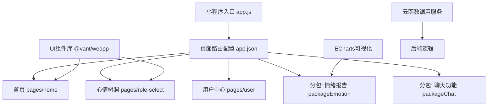
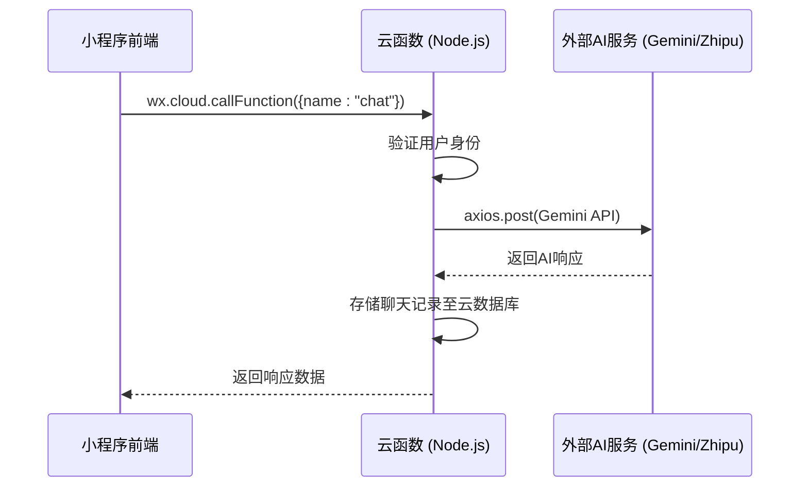

# 技术栈与依赖

<cite>
**本文档引用文件**  
- [project.config.json](file://project.config.json)
- [miniprogram/app.json](file://miniprogram/app.json)
- [package.json](file://package.json)
- [cloudfunctions/analysis/package.json](file://cloudfunctions/analysis/package.json)
- [cloudfunctions/chat/package.json](file://cloudfunctions/chat/package.json)
- [cloudfunctions/roles/package.json](file://cloudfunctions/roles/package.json)
- [cloudfunctions/user/package.json](file://cloudfunctions/user/package.json)
- [miniprogram/components/ec-canvas/ec-canvas.js](file://miniprogram/components/ec-canvas/ec-canvas.js)
- [miniprogram/components/ec-canvas/ec-canvas.json](file://miniprogram/components/ec-canvas/ec-canvas.json)
</cite>

## 目录
1. [项目架构概览](#项目架构概览)
2. [前端技术栈](#前端技术栈)
3. [后端云函数技术栈](#后端云函数技术栈)
4. [关键依赖库分析](#关键依赖库分析)
5. [配置文件解析](#配置文件解析)
6. [环境准备建议](#环境准备建议)
7. [云开发平台优势](#云开发平台优势)

## 项目架构概览

HeartChat项目采用微信小程序原生框架作为前端，结合微信云开发（Cloud Development）的后端云函数与云数据库，构建了一个轻量级、高可维护性的情绪陪伴与AI对话系统。整体架构分为三层：前端小程序界面、后端Node.js云函数、云数据库存储。通过云开发平台实现前后端无缝集成，降低部署复杂度。

**Section sources**
- [project.config.json](file://project.config.json#L1-L70)
- [miniprogram/app.json](file://miniprogram/app.json#L1-L86)

## 前端技术栈

前端基于微信小程序原生框架开发，采用WXML、WXSS、JavaScript/TypeScript技术栈，未引入第三方框架（如Taro、UniApp），确保与微信生态深度兼容。项目通过`miniprogram`目录组织页面与组件，采用分包加载策略优化启动性能。

核心UI组件库为`@vant/weapp`，提供现代化的移动端组件（如按钮、弹窗、标签等），提升用户体验。项目支持暗黑模式，通过`theme.json`和`darkmode: true`配置实现主题切换。

ECharts通过`ec-canvas`组件集成，用于情绪数据的可视化展示，如情绪波动曲线、情绪分布饼图等。该组件封装了ECharts在小程序Canvas环境中的适配逻辑，支持新旧两种Canvas渲染模式。

**Diagram sources**
- [miniprogram/app.json](file://miniprogram/app.json#L1-L86)
- [miniprogram/components/ec-canvas/ec-canvas.js](file://miniprogram/components/ec-canvas/ec-canvas.js#L1-L285)
- [miniprogram/components/ec-canvas/ec-canvas.json](file://miniprogram/components/ec-canvas/ec-canvas.json#L1-L4)

**Section sources**
- [miniprogram/app.json](file://miniprogram/app.json#L1-L86)
- [package.json](file://package.json#L1-L61)
- [miniprogram/components/ec-canvas/ec-canvas.js](file://miniprogram/components/ec-canvas/ec-canvas.js#L1-L285)

## 后端云函数技术栈

后端采用微信云开发的Node.js云函数，部署于腾讯云环境，无需自行维护服务器。每个功能模块对应一个独立的云函数目录（如`analysis`、`chat`、`user`），通过`cloudfunctions`根目录统一管理。

云函数使用`wx-server-sdk`作为核心依赖，提供云数据库、文件存储、用户鉴权等API。HTTP请求通过`axios`库实现，用于调用外部AI服务（如智谱AI、Gemini、OpenAI）。各云函数独立维护`package.json`，确保依赖隔离。

云函数入口为`index.js`，通过`main`字段定义。例如，`analysis`云函数负责情绪分析与关键词提取，`chat`云函数处理对话逻辑，`roles`云函数管理角色信息与记忆机制。

**Diagram sources**
- [cloudfunctions/chat/index.js](file://cloudfunctions/chat/index.js)
- [cloudfunctions/chat/package.json](file://cloudfunctions/chat/package.json#L1-L16)
- [cloudfunctions/analysis/aiModelService.js](file://cloudfunctions/analysis/aiModelService.js)

**Section sources**
- [cloudfunctions/chat/package.json](file://cloudfunctions/chat/package.json#L1-L16)
- [cloudfunctions/analysis/package.json](file://cloudfunctions/analysis/package.json#L1-L11)
- [cloudfunctions/roles/package.json](file://cloudfunctions/roles/package.json#L1-L15)
- [cloudfunctions/user/package.json](file://cloudfunctions/user/package.json#L1-L15)

## 关键依赖库分析

### 前端依赖
- **@vant/weapp**: 轻量级微信小程序UI组件库，提供按钮、弹窗、标签等基础组件，提升开发效率。
- **dayjs**: 轻量级日期处理库，用于格式化情绪记录时间、生成日报时间戳等。
- **echarts**: 强大的数据可视化库，通过`ec-canvas`组件在小程序中渲染情绪趋势图、情绪分布饼图等。

### 后端依赖
- **wx-server-sdk**: 微信云开发官方SDK，提供云数据库、云存储、用户鉴权等核心API。
- **axios**: HTTP客户端，用于云函数调用外部AI服务（如智谱AI、Gemini、OpenAI）的REST API。
- **typescript**: 用于前端代码的类型检查，提升代码可维护性（通过devDependencies引入）。

### AI能力集成
- **智谱AI (Zhipu AI)**: 提供中文大模型服务，用于生成符合中文语境的对话内容与情绪分析。
- **Gemini**: Google推出的多模态AI模型，用于增强AI对话的多样性与智能性。
- **OpenAI**: 可选集成，提供GPT系列模型支持，实现多模型AI能力融合。

**Section sources**
- [package.json](file://package.json#L1-L61)
- [cloudfunctions/analysis/package.json](file://cloudfunctions/analysis/package.json#L1-L11)
- [cloudfunctions/chat/package.json](file://cloudfunctions/chat/package.json#L1-L16)

## 配置文件解析

### project.config.json
此文件为项目级配置，定义了小程序的基本信息与编译设置：
- `miniprogramRoot`: 指定小程序源码目录为`miniprogram/`。
- `cloudfunctionRoot`: 指定云函数目录为`cloudfunctions/`。
- `cloud`: 启用云开发功能。
- `envId`: 指定云开发环境ID，用于连接特定云环境。
- `setting.packNpmManually`: 启用手动打包npm依赖，需通过工具构建。
- `setting.useCompilerPlugins`: 启用TypeScript编译插件，支持TS代码编译。

### app.json
此文件为小程序全局配置，定义了页面路由、窗口样式、tabBar等：
- `pages`: 定义主包页面路径，包括欢迎页、首页、角色选择页等。
- `subpackages`: 定义分包结构，`packageEmotion`负责情绪报告，`packageChat`负责聊天功能，实现按需加载。
- `tabBar`: 配置底部导航栏，包含首页、心情树洞、我的三个入口。
- `usingComponents`: 全局注册自定义组件，如`ec-canvas`、`emotion-card`等。
- `darkmode`: 启用暗黑模式支持。
- `requiredBackgroundModes`: 申请后台音频播放权限，支持语音功能。

**Section sources**
- [project.config.json](file://project.config.json#L1-L70)
- [miniprogram/app.json](file://miniprogram/app.json#L1-L86)

## 环境准备建议

### 开发工具
- **微信开发者工具**: 推荐使用最新稳定版，支持云开发、TypeScript编译、真机调试等功能。
- **Node.js版本**: 建议使用LTS版本（如16.x或18.x），确保与云函数运行环境兼容。
- **代码编辑器**: 推荐使用VS Code，安装ESLint、Prettier、TypeScript插件，保证代码风格统一。

### 依赖安装
运行`npm install`安装`package.json`中定义的依赖。前端npm包需通过微信开发者工具的"构建npm"功能打包至小程序目录。云函数依赖需在各自目录下单独执行`npm install`。

### 云环境配置
在微信云开发控制台创建环境，获取`envId`并填入`project.config.json`。确保已开通云函数、云数据库、云存储服务。

**Section sources**
- [project.config.json](file://project.config.json#L1-L70)
- [package.json](file://package.json#L1-L61)

## 云开发平台优势

HeartChat项目充分利用微信云开发平台的以下优势：
- **免运维**: 无需自行搭建服务器，云函数自动弹性伸缩，应对流量高峰。
- **一体化开发**: 前后端在同一IDE中开发，云数据库、云存储、云函数无缝集成。
- **快速部署**: 通过微信开发者工具一键上传代码与云函数，部署过程自动化。
- **安全可靠**: 基于微信用户体系的鉴权机制，保障用户数据安全；云数据库自动备份，防止数据丢失。
- **成本低廉**: 免费额度满足中小型项目需求，按量计费模式降低初期投入。

通过云开发平台，HeartChat实现了从开发到部署的全流程高效管理，使团队能专注于核心业务逻辑与用户体验优化。

**Section sources**
- [project.config.json](file://project.config.json#L1-L70)
- [cloudfunctions/analysis/package.json](file://cloudfunctions/analysis/package.json#L1-L11)
- [cloudfunctions/chat/package.json](file://cloudfunctions/chat/package.json#L1-L16)