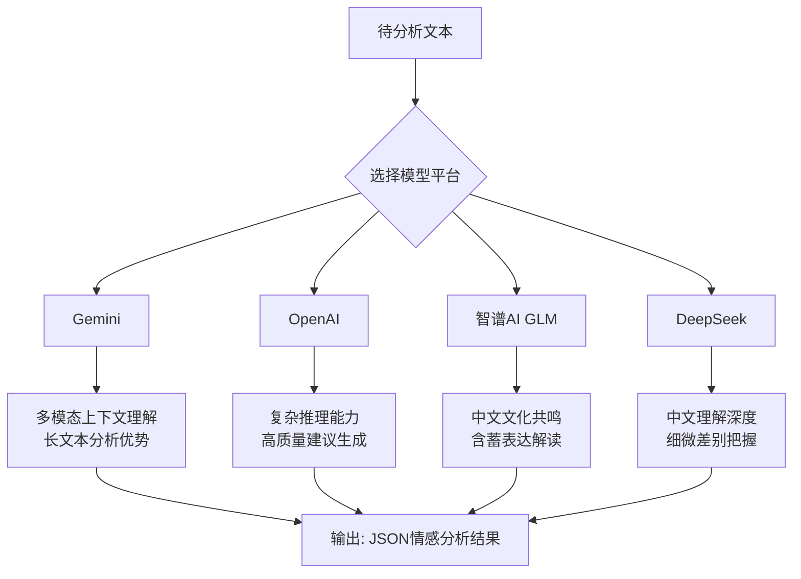

# 提示词工程体系

<cite>
**本文档引用文件**  
- [01-情感分析提示词.md](file://doc/开发文档/prompt/01-情感分析提示词.md)
- [02-情感分析提示词实现指南.md](file://doc/开发文档/prompt/02-情感分析提示词实现指南.md)
- [02-角色提示词.md](file://doc/开发文档/prompt/02-角色提示词.md)
- [03-关键词分类提示词.md](file://doc/开发文档/prompt/03-关键词分类提示词.md)
- [aiModelService.js](file://cloudfunctions/analysis/aiModelService.js)
- [keywordClassifier.js](file://cloudfunctions/analysis/keywordClassifier.js)
</cite>

## 目录
1. [引言](#引言)
2. [情感分析模块](#情感分析模块)
3. [角色系统模块](#角色系统模块)
4. [关键词分类模块](#关键词分类模块)
5. [四大AI模型优化策略](#四大ai模型优化策略)
6. [提示词版本管理](#提示词版本管理)
7. [系统集成与部署](#系统集成与部署)
8. [最佳实践与安全边界](#最佳实践与安全边界)

## 引言

HeartChat是一款基于微信小程序云开发的情感陪伴与情商提升应用，其核心功能依赖于精心设计的提示词工程体系。本提示词工程体系系统化整合了情感分析、角色系统、关键词分类三大核心模块，旨在通过精准的AI交互提升用户体验。该体系不仅定义了8大类32子类的精细化情感分类，还构建了多维度的AI模型优化策略，并实现了完整的提示词版本控制机制。本体系通过为不同AI平台（Gemini、OpenAI、智谱AI、DeepSeek）定制专属提示词，充分发挥各模型的技术优势，确保情感分析的准确性与建议的实用性。同时，体系内建了向后兼容机制和降级方案，保障了系统的稳定性和鲁棒性，为构建一个安全、可靠、智能的情感支持平台奠定了坚实基础。

## 情感分析模块

情感分析模块是HeartChat的核心功能，它通过一套标准化的提示词体系，对用户输入的文本进行深度情感解析。该模块基于8大类32子类的情感分类体系，能够识别喜悦、悲伤、焦虑、愤怒等基本情感，以及困惑、矛盾、释然等复杂情感。分析过程不仅关注情感类型，还评估其强度（0.0-1.0）、效价（valence）和唤醒度（arousal），并判断情感趋势（上升/下降/稳定）和注意力水平（高/中/低）。此外，模块还引入了情感模式识别（如爆发型、累积型、波动型）和风险等级评估（0-5级），为后续的情商建议和危机干预提供数据支持。所有分析结果均以标准化的JSON格式输出，包含主要情感、次要情感、触发词、主题关键词、情商建议和风险预警等丰富字段。

**模块来源**
- [01-情感分析提示词.md](file://doc/开发文档/prompt/01-情感分析提示词.md#L1-L480)
- [02-情感分析提示词实现指南.md](file://doc/开发文档/prompt/02-情感分析提示词实现指南.md#L1-L328)
- [aiModelService.js](file://cloudfunctions/analysis/aiModelService.js#L1-L663)

## 角色系统模块

角色系统模块为用户提供多样化的AI交互体验，通过预设和自定义角色来满足不同场景下的陪伴需求。当前系统已定义了心理咨询师、生活伴侣、职场导师、情感支持者等核心角色。每个角色都具备明确的角色描述、人格特征（如专业、耐心、友善、幽默）和专属的提示词。提示词严格遵循“角色定位-交流风格-行为准则-专业限制”的结构，确保AI在扮演角色时行为一致且安全。例如，心理咨询师的角色提示词强调“以温和、专业的语气回应，提供有建设性的建议，但不要做出医疗诊断”。该模块支持用户创建自定义角色，只需提供角色名称、描述、人格特征和欢迎语，系统即可生成相应的交互逻辑，极大地增强了应用的个性化和灵活性。

**模块来源**
- [02-角色提示词.md](file://doc/开发文档/prompt/02-角色提示词.md#L1-L79)

## 关键词分类模块

关键词分类模块负责对用户对话中提取的关键词进行自动归类，是构建用户兴趣画像和进行内容推荐的基础。该模块采用混合分类策略，优先调用大模型进行语义理解，当API不可用时则启用本地规则引擎作为降级方案。系统预定义了25个主要分类，包括学习、工作、娱乐、社交、健康、心理、自我提升等，每个分类下还设有细分类别的映射规则。分类过程通过向大模型发送结构化提示词完成，提示词中明确列出了所有类别及其详细说明，要求模型以严格的JSON格式返回分类结果。本地分类则依赖关键词匹配和规则引擎，通过检查关键词中是否包含特定字词（如“学”、“工作”、“游戏”）来确定其所属类别，确保了在无网络或API故障时系统功能的可用性。

**模块来源**
- [03-关键词分类提示词.md](file://doc/开发文档/prompt/03-关键词分类提示词.md#L1-L100)
- [keywordClassifier.js](file://cloudfunctions/analysis/keywordClassifier.js#L1-L299)

## 四大AI模型优化策略

为了最大化不同AI模型的性能优势，提示词工程体系为四大主流模型（Gemini、OpenAI、智谱AI、DeepSeek）设计了专门的优化策略。该策略的核心是“一模型一提示”，即根据各模型的技术特性和文化背景定制专属提示词。

**图示来源**  
- [01-情感分析提示词.md](file://doc/开发文档/prompt/01-情感分析提示词.md#L1-L480)
- [aiModelService.js](file://cloudfunctions/analysis/aiModelService.js#L1-L663)

**策略详情**：
- **Gemini模型策略**：充分利用其强大的多模态理解和长文本上下文分析能力，提示词强调分析情感的发展脉络和变化趋势，适用于需要深度上下文理解的连续对话场景。
- **OpenAI模型策略**：发挥其卓越的复杂推理和语言生成能力，提示词框架采用五层分析法（表面情感、深层需求、模式趋势、情商提升、风险支持），旨在生成高质量、具体可行的情商建议。
- **智谱AI GLM策略**：深度结合中国文化背景，提示词特别强调对含蓄表达、面子文化、中式委婉语的理解，提供符合中国用户思维习惯和文化共鸣的情感分析与建议。
- **DeepSeek模型策略**：聚焦于中文语言的细微差别和深层含义，提示词设计注重对修辞手法、语气语调和防御机制的分析，提供准确且实用的中文情感分析结果。

**模块来源**
- [01-情感分析提示词.md](file://doc/开发文档/prompt/01-情感分析提示词.md#L1-L480)
- [aiModelService.js](file://cloudfunctions/analysis/aiModelService.js#L1-L663)

## 提示词版本管理

提示词版本管理是确保系统稳定迭代和功能演进的关键机制。本体系通过文件命名和代码结构实现了清晰的版本控制。所有提示词文档均采用“序号-功能描述-版本说明”的命名规范，例如`01-情感分析提示词.md`和`02-情感分析提示词实现指南.md`，其中“01”和“02”代表了功能模块的顺序和版本迭代。在代码层面，`aiModelService.js`通过`getOptimizedPrompt`函数实现了提示词的动态加载和版本切换，该函数根据传入的平台参数（如'GEMINI'、'OPENAI'）返回对应版本的提示词模板。这种设计使得新版本提示词的上线无需修改核心调用逻辑，只需更新或新增提示词模板函数即可，实现了功能的热更新和灰度发布。同时，所有旧版字段均被保留并赋予默认值，确保了新旧版本间的完全向后兼容。

**模块来源**
- [01-情感分析提示词.md](file://doc/开发文档/prompt/01-情感分析提示词.md#L1-L480)
- [02-情感分析提示词实现指南.md](file://doc/开发文档/prompt/02-情感分析提示词实现指南.md#L1-L328)
- [aiModelService.js](file://cloudfunctions/analysis/aiModelService.js#L1-L663)

## 系统集成与部署

提示词工程体系的集成与部署遵循清晰的步骤，确保从开发到上线的平滑过渡。集成的核心在于`aiModelService.js`文件中的`analyzeEmotion`函数，该函数作为统一入口，根据`options.platform`参数选择并加载对应模型的优化提示词。前端组件（如`emotion-panel`）通过云函数调用此服务，并利用`emotionUtils.normalizeResult`工具函数处理返回结果，兼容新旧字段。部署流程分为四步：首先，更新云函数代码，将新的提示词模板函数集成到`aiModelService.js`中；其次，更新前端代码，确保组件能正确解析和展示新增字段（如`emotion_pattern`、`risk_level`）；然后，进行全面测试，验证不同模型下新功能的正确性和稳定性；最后，通过云开发平台上传并发布新版本。整个过程设计有降级方案，即使新提示词因故失效，系统也能回退到基础提示词继续运行。

**模块来源**
- [02-情感分析提示词实现指南.md](file://doc/开发文档/prompt/02-情感分析提示词实现指南.md#L1-L328)
- [aiModelService.js](file://cloudfunctions/analysis/aiModelService.js#L1-L663)

## 最佳实践与安全边界

在提示词工程实践中，必须遵循一系列最佳实践并严格遵守安全边界，以保障用户体验和系统安全。最佳实践包括：采用“一模型一提示”策略以发挥各模型优势；使用结构化JSON输出确保数据一致性；实施混合分类策略（AI+本地规则）保证系统高可用；以及通过向后兼容设计实现无缝升级。在安全边界方面，体系明确规定AI不得做出任何诊断性结论（如“你患有抑郁症”），不提供医疗或治疗建议，始终保持支持性和建设性的态度。当`risk_level`达到高风险（5级）时，系统应引导用户寻求专业帮助而非自行干预。此外，所有提示词均要求模型使用中文返回结果，避免中英文混杂，确保了前端显示的统一性和用户体验的流畅性。这些原则共同构建了一个既智能又安全的AI交互环境。

**模块来源**
- [01-情感分析提示词.md](file://doc/开发文档/prompt/01-情感分析提示词.md#L1-L480)
- [02-角色提示词.md](file://doc/开发文档/prompt/02-角色提示词.md#L1-L79)