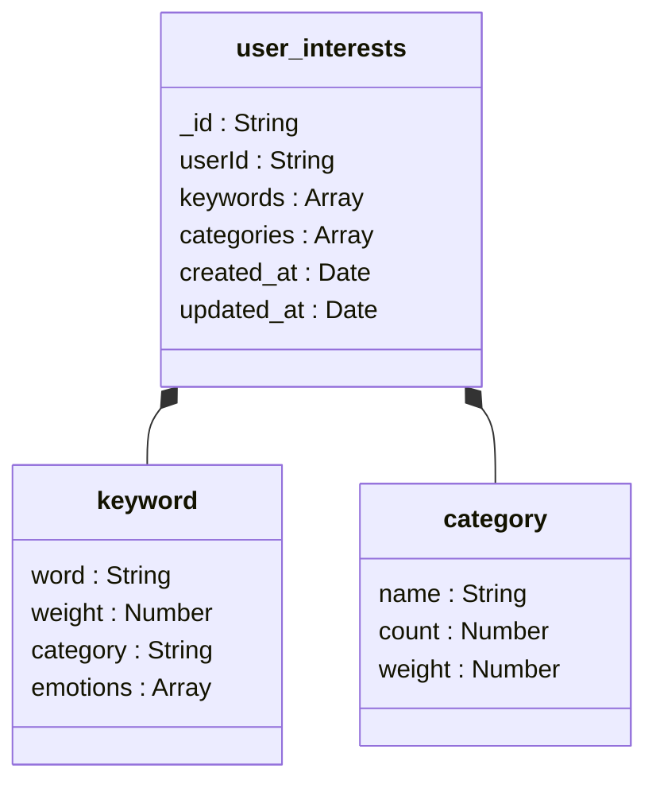
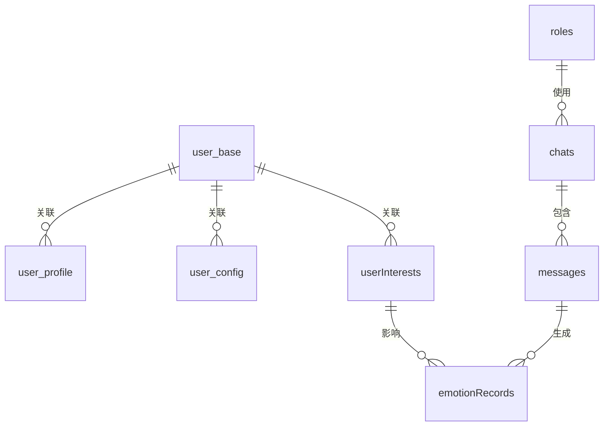

# 字段说明

<cite>
**本文档引用的文件**
- [user_base.md](file://doc/开发文档/database/user_base.md)
- [user_config.md](file://doc/开发文档/database/user_config.md)
- [emotionRecords.md](file://doc/开发文档/database/emotionRecords.md)
- [roles.md](file://doc/开发文档/database/roles.md)
- [userInterests.md](file://doc/开发文档/database/userInterests.md)
- [chats.md](file://doc/开发文档/database/chats.md)
- [database设计方案.md](file://doc/开发文档/数据库设计方案.md)
- [HeartChat数据库结构图.html](file://doc/设计文档/流程图/html/HeartChat数据库结构图.html)
- [HeartChat数据库结构图.md](file://doc/设计文档/流程图/HeartChat数据库结构图.md)
- [user.md](file://doc/开发文档/cloudfunctions/user.md)
- [roles.md](file://doc/开发文档/cloudfunctions/roles.md)
</cite>

## 目录
1. [用户基础信息字段](#用户基础信息字段)
2. [聊天会话字段](#聊天会话字段)
3. [情感记录字段](#情感记录字段)
4. [角色信息字段](#角色信息字段)
5. [用户配置与资料分离设计](#用户配置与资料分离设计)
6. [用户兴趣存储格式](#用户兴趣存储格式)
7. [字段与上层功能的关联](#字段与上层功能的关联)

## 用户基础信息字段

### _openid 字段
- **数据类型**：字符串 (String)
- **业务含义**：微信用户的唯一标识符，用于在微信生态中识别用户身份
- **取值范围**：由微信平台生成的唯一字符串，长度和格式由微信API定义
- **约束条件**：在 `users` 集合中为唯一索引，确保每个用户的openid唯一

### nickname 字段
- **数据类型**：字符串 (String)
- **业务含义**：用户的昵称，用于在应用内显示用户身份
- **取值范围**：可变长度字符串，通常为用户在微信或其他平台设置的昵称
- **约束条件**：存储在 `user_profile` 集合中，通过 `userId` 与 `user_base` 集合关联

### avatar 字段
- **数据类型**：字符串 (String)
- **业务含义**：用户头像的URL地址，用于显示用户形象
- **取值范围**：有效的HTTP/HTTPS URL，指向头像图片资源
- **约束条件**：在 `user_base` 集合中以 `avatar_url` 字段存储，确保URL格式正确

**Section sources**
- [user_base.md](file://doc/开发文档/database/user_base.md)
- [HeartChat数据库结构图.html](file://doc/设计文档/流程图/html/HeartChat数据库结构图.html)
- [HeartChat数据库结构图.md](file://doc/设计文档/流程图/HeartChat数据库结构图.md)

## 聊天会话字段

### userId 字段
- **数据类型**：字符串 (String)
- **业务含义**：关联用户的唯一标识，用于识别聊天会话的创建者
- **取值范围**：7位数字用户ID，与 `user_base` 集合中的 `user_id` 字段对应
- **约束条件**：在 `chats` 集合中为索引字段，支持基于用户ID的快速查询

### roleId 字段
- **数据类型**：字符串 (String)
- **业务含义**：关联AI角色的唯一标识，用于识别用户正在与哪个角色对话
- **取值范围**：系统生成的角色ID，与 `roles` 集合中的 `_id` 字段对应
- **约束条件**：在 `chats` 集合中为索引字段，支持基于角色ID的快速查询

### lastMessage 字段
- **数据类型**：字符串 (String)
- **业务含义**：存储会话中最后一条消息的内容，用于在会话列表中显示预览
- **取值范围**：可变长度文本，通常为消息内容的前50-100个字符
- **约束条件**：作为冗余字段存在，提高会话列表查询性能，避免频繁关联查询 `messages` 集合

**Section sources**
- [chats.md](file://doc/开发文档/database/chats.md)
- [database设计方案.md](file://doc/开发文档/数据库设计方案.md)
- [HeartChat数据库结构图.html](file://doc/设计文档/流程图/html/HeartChat数据库结构图.html)

## 情感记录字段

### emotionScore 字段
- **数据类型**：数字 (Number)
- **业务含义**：情感分析的综合评分，反映用户情绪的积极或消极程度
- **取值范围**：0-1之间的浮点数，1表示最积极的情绪，0表示最消极的情绪
- **约束条件**：在 `emotionRecords` 集合的 `analysis` 对象中计算得出，基于多种情感维度的加权平均

### keywords 字段
- **数据类型**：数组 (Array)
- **业务含义**：从用户文本中提取的关键情感触发词，用于理解情绪背后的主题
- **取值范围**：包含字符串的数组，每个字符串代表一个关键词
- **约束条件**：在 `emotionRecords` 集合中作为数组存储，支持情感趋势分析和主题追踪

### analysisResult 字段
- **数据类型**：对象 (Object)
- **业务含义**：情感分析的详细结果，包含情感类型、强度、趋势等多维度信息
- **取值范围**：结构化对象，包含 `type`、`intensity`、`valence`、`arousal` 等子字段
- **约束条件**：在 `emotionRecords` 集合的 `analysis` 对象中存储，支持复杂的情感状态描述

**Section sources**
- [emotionRecords.md](file://doc/开发文档/database/emotionRecords.md)
- [HeartChat数据库结构图.html](file://doc/设计文档/流程图/html/HeartChat数据库结构图.html)

## 角色信息字段

### roleName 字段
- **数据类型**：字符串 (String)
- **业务含义**：AI角色的显示名称，用于在用户界面中展示角色身份
- **取值范围**：可变长度字符串，通常为具有亲和力的名称如"心灵导师"、"知心朋友"
- **约束条件**：在 `roles` 集合中为索引字段，支持基于角色名称的搜索

### description 字段
- **数据类型**：字符串 (String)
- **业务含义**：角色的功能描述，用于向用户介绍角色的特性和能力
- **取值范围**：可变长度文本，通常为50-200字的描述性文字
- **约束条件**：在 `roles` 集合中存储，帮助用户理解角色的定位

### promptTemplate 字段
- **数据类型**：字符串 (String)
- **业务含义**：角色的AI提示词模板，定义了角色的对话风格和行为模式
- **取值范围**：包含变量占位符的文本模板，如"你是一位{relationship}，性格{personality}"
- **约束条件**：在 `roles` 集合中存储，与 `system_prompt` 字段保持同步，确保AI行为一致性

**Section sources**
- [roles.md](file://doc/开发文档/database/roles.md)
- [roles.md](file://doc/开发文档/cloudfunctions/roles.md)

## 用户配置与资料分离设计

### 设计意图
`user_profile` 与 `user_config` 的分离设计体现了关注点分离的设计原则：

- **user_profile** 集合存储用户的**静态资料信息**，包括昵称、简介、生日、职业、教育背景等个人属性。这些信息通常由用户主动填写，变化频率较低，主要用于构建用户画像和社交展示。

- **user_config** 集合存储用户的**动态配置信息**，包括主题设置、通知偏好、隐私控制、聊天参数等应用级配置。这些信息反映用户对应用的使用偏好，可能频繁变更，直接影响用户体验。

这种分离设计的优势包括：
1. **性能优化**：将频繁变更的配置信息与相对稳定的资料信息分离，减少更新操作对主资料表的影响
2. **扩展性**：配置项可以独立演进，新增配置不影响资料结构
3. **安全性**：敏感的隐私设置可以单独管理，实施更严格的访问控制
4. **维护性**：不同类型的用户数据有清晰的边界，便于维护和扩展

**Section sources**
- [user_config.md](file://doc/开发文档/database/user_config.md)
- [user.md](file://doc/开发文档/cloudfunctions/user.md)

## 用户兴趣存储格式

### 存储结构
`userInterests` 集合采用分层结构存储用户兴趣信息：

**Diagram sources**
- [HeartChat数据库结构图.md](file://doc/设计文档/流程图/HeartChat数据库结构图.md)

### 字段说明
- **keywords 数组**：存储具体的兴趣关键词，每个关键词包含：
  - `word`：关键词文本
  - `weight`：权重值，反映该关键词的重要性
  - `category`：所属兴趣分类
  - `emotions`：关联的情感数据

- **categories 数组**：存储兴趣分类信息，每个分类包含：
  - `name`：分类名称（如"学术"、"娱乐"）
  - `count`：该分类下关键词的数量
  - `weight`：分类权重，由包含的关键词权重聚合计算

### 权重计算规则
兴趣权重采用多因素动态计算：
1. **基础权重**：基于关键词在用户对话中出现的频率
2. **情感加权**：与积极情绪关联的关键词获得更高权重
3. **时间衰减**：最近出现的关键词权重更高，体现兴趣的时效性
4. **分类聚合**：同分类关键词的权重叠加，形成分类整体权重

**Section sources**
- [userInterests.md](file://doc/开发文档/database/userInterests.md)
- [HeartChat数据库结构图.md](file://doc/设计文档/流程图/HeartChat数据库结构图.md)

## 字段与上层功能的关联

### 用户画像功能
- **user_profile** 中的 `interests`、`personality` 字段直接构成用户画像的基础
- **userInterests** 中的关键词和分类数据通过AI分析，动态更新用户兴趣画像
- **roles** 集合中的 `user_perception` 字段存储AI对用户的综合感知，包括兴趣、偏好、沟通风格等

### 情感分析功能
- **emotionRecords** 中的 `emotionScore` 和 `analysisResult` 字段提供量化的情感数据
- **keywords** 字段与情感数据关联，支持情感触发因素分析
- **messages** 集合中的 `emotion_analyzed` 布尔字段标记消息是否已进行情感分析，优化处理流程

### 角色记忆功能
- **roles** 集合中的 `memories` 数组存储角色记忆，每条记忆包含内容、重要性评分和上下文
- **chats** 集合中的 `lastMessage` 字段提供对话上下文，支持记忆提取
- **userInterests** 中的兴趣数据作为记忆的重要组成部分，使角色能记住用户的兴趣偏好

**Diagram sources**
- [HeartChat数据库结构图.md](file://doc/设计文档/流程图/HeartChat数据库结构图.md)

**Section sources**
- [user.md](file://doc/开发文档/cloudfunctions/user.md)
- [roles.md](file://doc/开发文档/cloudfunctions/roles.md)
- [HeartChat数据库结构图.md](file://doc/设计文档/流程图/HeartChat数据库结构图.md)