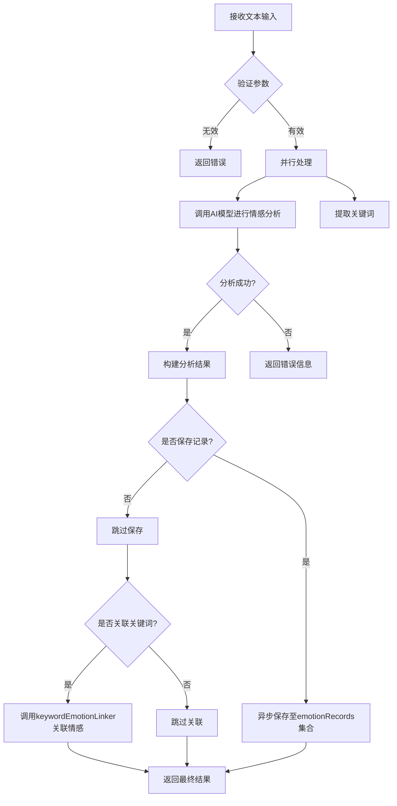
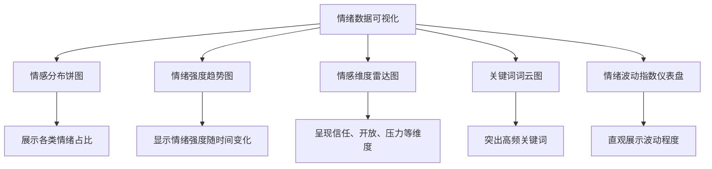

# 情绪记录字段

<cite>
**本文档引用文件**   
- [emotionRecords.md](file://doc/开发文档/database/emotionRecords.md)
- [index.js](file://cloudfunctions/analysis/index.js)
- [aiModelService.js](file://cloudfunctions/analysis/aiModelService.js)
- [keywordEmotionLinker.js](file://cloudfunctions/analysis/keywordEmotionLinker.js)
- [keywordClassifier.js](file://cloudfunctions/analysis/keywordClassifier.js)
</cite>

## 目录
1. [情绪记录集合字段定义](#情绪记录集合字段定义)
2. [情绪评分计算算法](#情绪评分计算算法)
3. [关键词提取实现逻辑](#关键词提取实现逻辑)
4. [情感分析云函数流程](#情感分析云函数流程)
5. [情绪波动指数计算方法](#情绪波动指数计算方法)
6. [可视化方案](#可视化方案)

## 情绪记录集合字段定义

`emotionRecords` 集合用于存储用户的情感分析记录，包含详细的情感类型、强度、维度分析以及相关的关键词和触发因素。核心字段结构如下：

```javascript
{
  _id: "记录ID",                    // string, 主键，自动生成
  userId: "用户ID",                  // string, 关联user_base表
  analysis: {                       // object, 情感分析结果
    // 基础情感信息
    type: "主要情感类型",            // string, 如：喜悦、悲伤、愤怒等
    intensity: 0.8,                  // number, 情感强度 0-1
    valence: 0.5,                    // number, 情感效价 -1到1
    arousal: 0.6,                    // number, 情感唤醒度 0-1
    trend: "上升",                   // string, 情感趋势：上升/下降/稳定
    
    // 详细情感分析
    primary_emotion: "主要情感",      // string, 主要情感类型
    secondary_emotions: ["次要情感1", "次要情感2"], // array, 次要情感列表
    attention_level: "高",           // string, 注意力水平：高/中/低
    
    // 雷达图维度
    radar_dimensions: {              // object, 情感维度雷达图
      trust: 0.7,                   // number, 信任度 0-1
      openness: 0.6,                // number, 开放度 0-1
      resistance: 0.3,              // number, 抵抗度 0-1
      stress: 0.4,                  // number, 压力度 0-1
      control: 0.8                  // number, 控制度 0-1
    },
    
    // 关键词和触发因素
    topic_keywords: ["关键词1", "关键词2"],       // array, 话题关键词
    emotion_triggers: ["触发词1", "触发词2"],   // array, 情感触发词
    suggestions: ["建议1", "建议2"],              // array, 改善建议
    summary: "情感总结"                            // string, 情感状态总结
  },
  originalText: "原始文本",          // string, 原始分析文本
  createTime: "创建时间",            // date, 记录创建时间
  roleId: "角色ID",                  // string, 关联角色（可选）
  chatId: "聊天ID"                   // string, 关联聊天会话（可选）
}
```

**积极情感**：喜悦、满足、平静、期待、惊讶  
**消极情感**：担忧、疲惫、焦虑、悲伤、压力、愤怒、恐惧  
**中性情感**：平静、未知

**维度说明**：
- **trust**：信任度 - 对他人的信任程度
- **openness**：开放度 - 接受新事物的程度
- **resistance**：抵抗度 - 对变化的抵抗程度
- **stress**：压力度 - 感受到的压力程度
- **control**：控制度 - 对局面的控制感

**索引建议**：
- **复合索引**：userId + createTime（降序）
- **单字段索引**：analysis.type
- **复合索引**：roleId + createTime
- **复合索引**：chatId + createTime

**关联关系**：
- **多对一**：emotionRecords.userId → user_base.user_id
- **多对一**：emotionRecords.roleId → roles._id
- **多对一**：emotionRecords.chatId → chats._id

**使用场景**：
1. 情感历史追踪
2. 情感统计分析
3. 个性化报告生成
4. 心理健康监控

**注意事项**：
- 情感分析由analysis云函数自动生成
- 建议定期归档历史记录以提高查询性能
- 情感数据涉及用户隐私，需要严格保护

**Section sources**
- [emotionRecords.md](file://doc/开发文档/database/emotionRecords.md)

## 情绪评分计算算法

情绪评分（emotionScore）的计算主要通过 `keywordEmotionLinker.js` 模块中的 `calculateEmotionScore` 函数实现。该函数将情感分析结果转换为-1到1之间的标准化分数，负值表示负面情绪，正值表示正面情绪。

计算逻辑如下：
1. 若情感分析结果中已包含直接的 `score` 字段，则将其限制在[-1, 1]范围内返回
2. 否则，根据情感类型（type 或 primary_emotion）和强度（intensity）进行加权计算
3. 系统预定义了情感类型到基础分数的映射表，例如：
   - 喜悦类：0.8~0.9
   - 中性类：0
   - 悲伤/愤怒类：-0.7~-0.8
4. 最终分数 = 基础分数 × 强度系数

该分数用于后续的关键词情感关联分析，帮助建立用户兴趣关键词的情感倾向模型。

**Section sources**
- [keywordEmotionLinker.js](file://cloudfunctions/analysis/keywordEmotionLinker.js#L100-L150)

## 关键词提取实现逻辑

关键词提取功能由 `aiModelService.js` 模块统一管理，通过调用外部AI模型（如智谱AI、Google Gemini）实现。核心流程如下：

1. **请求构建**：根据配置的AI平台（ZHIPU、GEMINI等），构建符合API规范的请求体
2. **模型调用**：使用 `callModelApi` 函数发送请求至指定AI服务
3. **响应解析**：从AI返回的JSON格式响应中提取 `topic_keywords` 字段
4. **结果标准化**：将提取的关键词数组进行去重和排序处理

系统支持多种AI平台，包括：
- 智谱AI（ZHIPU）
- Google Gemini（GEMINI）
- OpenAI（OPENAI）
- Crond API（CROND）
- DeepSeek（CLOSEAI）

每种平台均有独立的配置参数，包括基础URL、API密钥环境变量、默认模型等。

**Section sources**
- [aiModelService.js](file://cloudfunctions/analysis/aiModelService.js#L500-L600)

## 情感分析云函数流程

情感分析云函数（analysis）的执行流程如下：



**Diagram sources**
- [index.js](file://cloudfunctions/analysis/index.js#L50-L200)

**Section sources**
- [index.js](file://cloudfunctions/analysis/index.js#L50-L200)

## 情绪波动指数计算方法

情绪波动指数（Emotional Volatility Index）在 `generateDailyReport` 函数中计算，具体步骤如下：

1. 获取用户当日所有情感记录的情绪强度值（intensity）
2. 计算强度值的平均值（avgIntensity）
3. 计算方差（intensityVariance）
4. 取方差的平方根作为标准差
5. 将标准差乘以100并取整，得到0-100范围内的波动指数

公式：  
`情绪波动指数 = min(round(√(Σ(xi - x̄)² / n) × 100), 100)`

该指数用于衡量用户情绪的稳定性，数值越高表示情绪波动越大。

**Section sources**
- [index.js](file://cloudfunctions/analysis/index.js#L500-L550)

## 可视化方案

系统采用ECharts组件进行情绪数据可视化，主要包含以下图表类型：



**Diagram sources**
- [emotion-pie.js](file://miniprogram/components/emotion-pie/emotion-pie.js)
- [emotion-dashboard.js](file://miniprogram/components/emotion-dashboard/emotion-dashboard.js)

**Section sources**
- [emotion-pie.js](file://miniprogram/components/emotion-pie/emotion-pie.js)
- [emotion-dashboard.js](file://miniprogram/components/emotion-dashboard/emotion-dashboard.js)