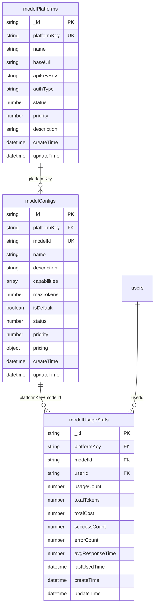
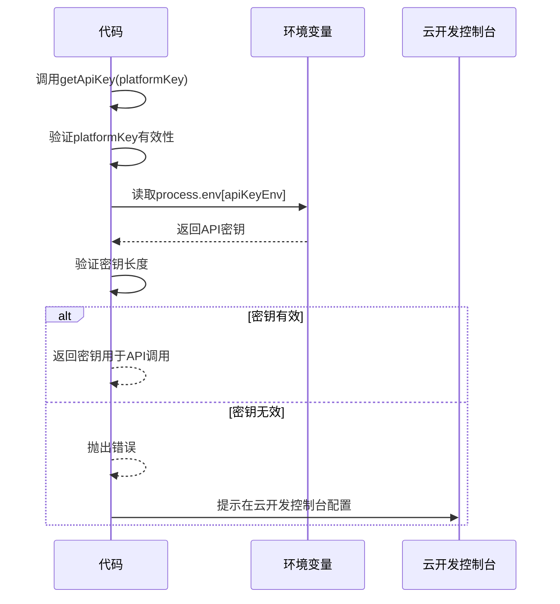
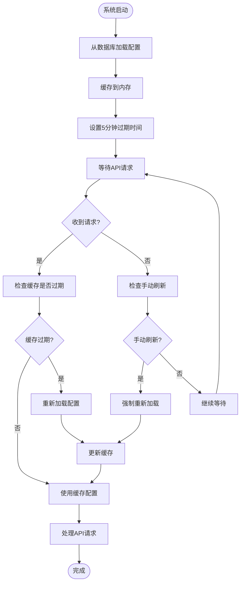
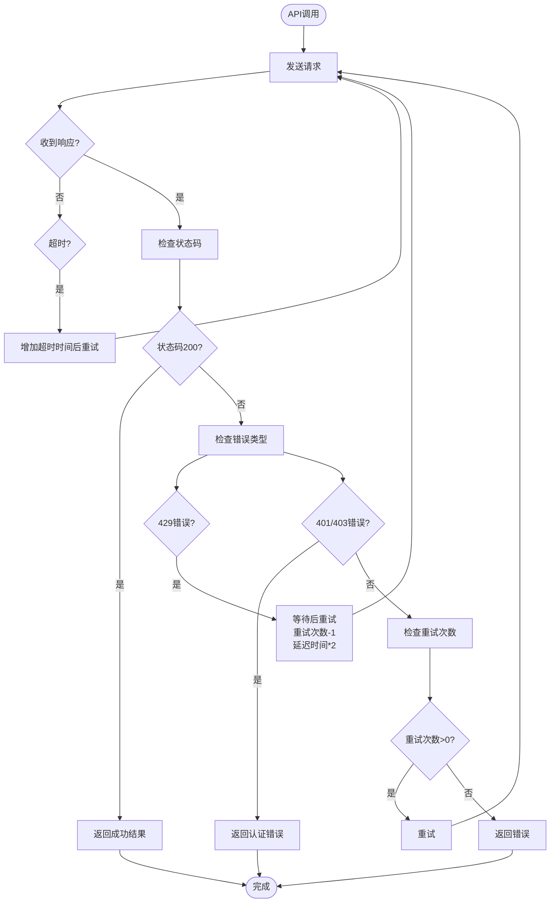
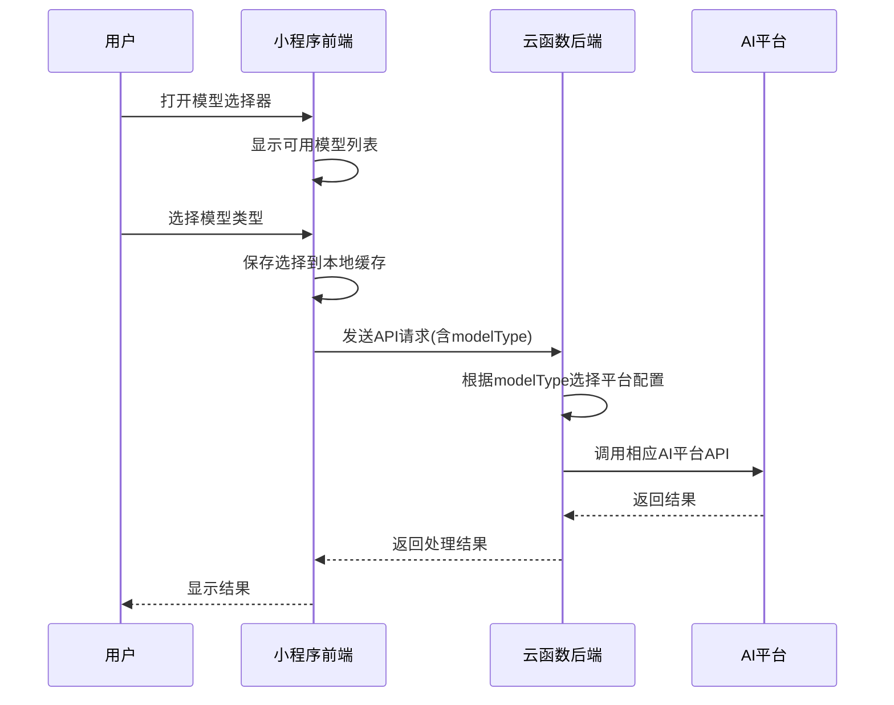

# 模型配置字段

<cite>
**本文档引用的文件**   
- [aiModelService.js](file://cloudfunctions/analysis/aiModelService.js)
- [aiModelService.js](file://cloudfunctions/chat/aiModelService.js)
- [model-config.md](file://doc/开发文档/database/model-config.md)
- [Gemini_API集成开发文档.md](file://doc/开发文档/Gemini_API集成开发文档.md)
- [统一AI模型服务设计文档.md](file://doc/开发文档/统一AI模型服务设计文档.md)
- [modelService.js](file://miniprogram/services/modelService.js)
- [model-selector.js](file://miniprogram/components/model-selector/model-selector.js)
</cite>

## 目录
1. [模型配置字段详解](#模型配置字段详解)
2. [AI模型参数调优策略](#ai模型参数调优策略)
3. [API密钥安全存储方案](#api密钥安全存储方案)
4. [模型配置动态加载机制](#模型配置动态加载机制)
5. [故障转移策略](#故障转移策略)
6. [多模型切换实现细节](#多模型切换实现细节)

## 模型配置字段详解

模型配置集合（modelConfigs）存储了具体的AI模型配置信息，包括模型能力、定价、限制等详细信息。该集合与modelPlatforms集合通过platformKey字段关联，形成一对多的关系。



**图表来源**
- [model-config.md](file://doc/开发文档/database/model-config.md#L0-L195)

**本节来源**
- [model-config.md](file://doc/开发文档/database/model-config.md#L0-L195)

## AI模型参数调优策略

AI模型的性能和输出质量受到多个参数的影响，主要包括temperature、maxTokens、top_p、presence_penalty和frequency_penalty等。这些参数在不同场景下需要进行针对性的调优。

### 温度参数（temperature）
温度参数控制生成文本的随机性和创造性。较低的温度值（如0.3）会使输出更加确定性和保守，适合需要准确性和一致性的场景，如情感分析和关键词提取。较高的温度值（如0.7-1.0）会增加输出的多样性和创造性，适合创意内容生成和开放性对话。

### 最大Token数（maxTokens）
maxTokens参数限制了模型生成响应的最大长度。根据应用场景的不同，需要合理设置该参数。对于简短的回复，可以设置较小的值（如512-1024）以提高响应速度和降低成本；对于需要详细分析和长篇回复的场景，可以设置较大的值（如2048-4096）。

### 其他参数
- **top_p**：控制生成时考虑的词汇范围，值为1.0表示考虑所有可能的词汇。
- **presence_penalty**：惩罚已出现的词汇，鼓励模型生成新的内容。
- **frequency_penalty**：惩罚高频出现的词汇，减少重复。

```mermaid
flowchart TD
Start([开始]) --> SetParams["设置模型参数"]
SetParams --> Temperature{"温度参数"}
Temperature --> |低 (0.3)| Deterministic["确定性输出<br/>适合: 情感分析, 关键词提取"]
Temperature --> |高 (0.7-1.0)| Creative["创造性输出<br/>适合: 创意生成, 开放对话"]
SetParams --> MaxTokens{"最大Token数"}
MaxTokens --> |小 (512-1024)| ShortResponse["短回复<br/>优点: 快速, 低成本"]
MaxTokens --> |大 (2048-4096)| LongResponse["长回复<br/>优点: 详细, 全面"]
SetParams --> OtherParams["其他参数调优"]
OtherParams --> TopP["top_p=1.0<br/>考虑所有词汇"]
OtherParams --> PresencePenalty["presence_penalty=0<br/>允许重复主题"]
OtherParams --> FrequencyPenalty["frequency_penalty=0<br/>允许高频词汇"]
Deterministic --> End([完成])
Creative --> End
ShortResponse --> End
LongResponse --> End
TopP --> End
PresencePenalty --> End
FrequencyPenalty --> End
```

**图表来源**
- [aiModelService.js](file://cloudfunctions/chat/aiModelService.js#L0-L586)
- [aiModelService.js](file://cloudfunctions/analysis/aiModelService.js#L0-L662)

**本节来源**
- [aiModelService.js](file://cloudfunctions/chat/aiModelService.js#L0-L586)
- [aiModelService.js](file://cloudfunctions/analysis/aiModelService.js#L0-L662)

## API密钥安全存储方案

API密钥的安全存储是系统安全的重要组成部分。本项目采用环境变量存储的方式，确保API密钥不会暴露在代码中。

### 环境变量存储
所有AI模型平台的API密钥都存储在环境变量中，通过`process.env`访问。每个平台都有对应的环境变量名，如ZHIPU_API_KEY、GEMINI_API_KEY等。这种方式确保了密钥不会被提交到版本控制系统中。

### 密钥访问控制
在代码中访问API密钥时，会进行严格的验证：
1. 检查平台配置是否存在
2. 检查环境变量是否存在
3. 验证API密钥长度是否合理



**图表来源**
- [aiModelService.js](file://cloudfunctions/chat/aiModelService.js#L0-L586)
- [aiModelService.js](file://cloudfunctions/analysis/aiModelService.js#L0-L662)

**本节来源**
- [aiModelService.js](file://cloudfunctions/chat/aiModelService.js#L0-L586)
- [aiModelService.js](file://cloudfunctions/analysis/aiModelService.js#L0-L662)

## 模型配置动态加载机制

系统实现了模型配置的动态加载机制，支持运行时添加、修改模型配置，无需重启云函数即可生效。

### 配置加载流程
1. 系统启动时，从数据库加载modelPlatforms和modelConfigs集合
2. 将配置信息缓存到内存中
3. 设置缓存过期时间（5分钟）
4. 支持手动刷新缓存

### 配置更新
当数据库中的模型配置发生变化时，系统会在缓存过期后自动加载最新配置，或者通过手动刷新立即生效。这种机制支持A/B测试不同模型和动态调整模型参数。



**图表来源**
- [model-config.md](file://doc/开发文档/database/model-config.md#L0-L195)
- [aiModelService.js](file://cloudfunctions/chat/aiModelService.js#L0-L586)

**本节来源**
- [model-config.md](file://doc/开发文档/database/model-config.md#L0-L195)
- [aiModelService.js](file://cloudfunctions/chat/aiModelService.js#L0-L586)

## 故障转移策略

系统实现了完善的故障转移策略，确保在某个AI模型服务不可用时，能够自动切换到备用模型，保证服务的连续性。

### 重试机制
当API调用失败时，系统会根据错误类型采取不同的处理策略：
- **429错误（请求过多）**：等待一段时间后重试，重试间隔随次数增加而延长
- **超时错误**：增加超时时间后重试
- **认证错误**：立即返回错误，不进行重试

### 降级处理
当主要模型服务持续不可用时，系统会自动降级到备用模型。降级策略基于模型平台的优先级设置，优先级数字越小，优先级越高。



**图表来源**
- [aiModelService.js](file://cloudfunctions/chat/aiModelService.js#L0-L586)
- [aiModelService.js](file://cloudfunctions/analysis/aiModelService.js#L0-L662)

**本节来源**
- [aiModelService.js](file://cloudfunctions/chat/aiModelService.js#L0-L586)
- [aiModelService.js](file://cloudfunctions/analysis/aiModelService.js#L0-L662)

## 多模型切换实现细节

系统支持多模型切换功能，用户可以根据需要在不同AI模型之间切换，以获得最佳的使用体验。

### 切换机制
多模型切换通过modelService模块实现，该模块提供了统一的接口来管理模型选择和配置。

### 前端实现
在小程序端，通过model-selector组件提供用户友好的模型选择界面。用户可以选择不同的模型类型（如智谱AI、Gemini、OpenAI等），系统会保存用户的选择到本地缓存。

### 后端实现
在云函数端，aiModelService模块根据前端传递的modelType参数选择相应的模型平台进行API调用。系统支持在运行时动态切换模型，无需重启服务。



**图表来源**
- [modelService.js](file://miniprogram/services/modelService.js#L0-L334)
- [model-selector.js](file://miniprogram/components/model-selector/model-selector.js#L0-L217)
- [aiModelService.js](file://cloudfunctions/chat/aiModelService.js#L0-L586)

**本节来源**
- [modelService.js](file://miniprogram/services/modelService.js#L0-L334)
- [model-selector.js](file://miniprogram/components/model-selector/model-selector.js#L0-L217)
- [aiModelService.js](file://cloudfunctions/chat/aiModelService.js#L0-L586)