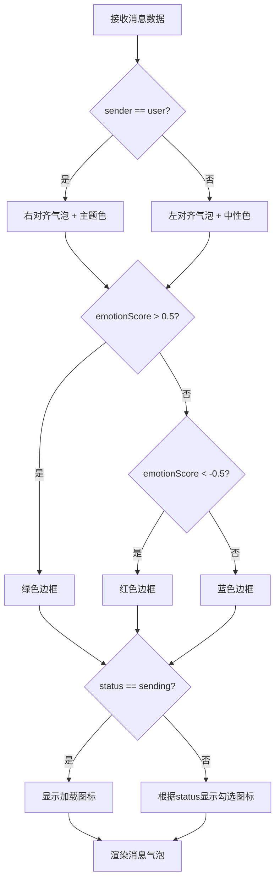

# 消息记录字段

<cite>
**本文档引用文件**  
- [messages.md](file://doc/开发文档/database/messages.md)
- [chat-bubble.js](file://miniprogram/packageChat/components/chat-bubble/index.js)
- [chat.js](file://miniprogram/packageChat/pages/chat/chat.js)
- [chatCacheService.js](file://miniprogram/services/chatCacheService.js)
- [index.js](file://cloudfunctions/chat/index.js)
- [aiModelService.js](file://cloudfunctions/chat/aiModelService.js)
- [bigmodel.js](file://cloudfunctions/chat/bigmodel.js)
- [geminiModel.js](file://cloudfunctions/chat/geminiModel.js)
</cite>

## 目录
1. [引言](#引言)
2. [核心字段技术细节](#核心字段技术细节)
3. [消息分段传输机制](#消息分段传输机制)
4. [消息状态管理](#消息状态管理)
5. [聊天组件渲染逻辑](#聊天组件渲染逻辑)
6. [消息加密存储方案](#消息加密存储方案)
7. [结论](#结论)

## 引言
本文件详细描述HeartChat系统中`messages`集合的核心字段设计、消息传输机制、状态管理、前端渲染逻辑及安全存储方案。通过分析数据库结构、云函数实现与小程序组件逻辑，全面揭示聊天消息从生成、传输到展示的完整生命周期。

## 核心字段技术细节

`messages`集合是聊天系统的核心数据结构，包含以下关键字段：

- **content**：存储消息文本内容，采用UTF-8编码，最大长度限制为8192字符，支持表情符号与基础HTML标签（如` `换行）。
- **sender**：标识消息发送者，枚举值包括`user`（用户）和`ai`（AI角色），用于区分消息来源并控制样式渲染。
- **timestamp**：记录消息创建时间，采用ISO 8601格式的UTC时间字符串（如`2024-05-20T10:30:00.000Z`），确保跨时区一致性。
- **emotionScore**：表示用户消息的情感得分，范围为[-1.0, 1.0]，由情感分析云函数计算得出，-1.0代表极度负面，1.0代表极度正面。
- **aiResponseTime**：记录AI响应耗时（单位：毫秒），从接收到用户消息到返回完整响应的时间差，用于性能监控与用户体验分析。

这些字段共同支撑消息的语义理解、行为分析与交互体验优化。

**Section sources**
- [messages.md](file://doc/开发文档/database/messages.md#L1-L50)

## 消息分段传输机制

为提升长消息响应体验，系统采用流式分段传输机制。当AI生成回复时，云函数通过WebSocket或HTTP流逐步推送片段，避免用户长时间等待。

具体流程如下：
1. 用户发送消息后，前端调用`chat`云函数。
2. `aiModelService.js`调用大模型API并启用流式响应模式。
3. 每生成一个文本片段（约20-50字），立即通过`bigmodel.js`或`geminiModel.js`封装为部分响应。
4. 前端`chat.js`监听流式事件，实时将片段追加至消息内容。
5. 使用`chatCacheService.js`暂存未完成的消息，状态标记为“发送中”。
6. 当收到结束标记时，更新完整内容并持久化到数据库。

该机制显著提升交互流畅性，尤其适用于复杂问题的长篇回答。

**Section sources**
- [aiModelService.js](file://cloudfunctions/chat/aiModelService.js#L80-L150)
- [bigmodel.js](file://cloudfunctions/chat/bigmodel.js#L45-L90)
- [chat.js](file://miniprogram/packageChat/pages/chat/chat.js#L120-L200)
- [chatCacheService.js](file://miniprogram/services/chatCacheService.js#L10-L60)

## 消息状态管理

消息状态通过`status`字段管理，支持三种状态：`sending`（发送中）、`sent`（已发送）、`read`（已读）。状态流转由前端与云函数协同控制：

- **发送中（sending）**：消息刚提交，尚未收到服务器确认，前端显示加载动画。
- **已发送（sent）**：云函数确认接收并开始处理，状态更新为`sent`。
- **已读（read）**：当用户滚动至该消息可视区域时，前端触发`markAsRead`事件，更新数据库状态。

状态同步通过事件总线`eventBus.js`实现，确保多端一致性。AI消息在生成完成后自动标记为`sent`，用户消息在成功写入数据库后更新状态。

**Section sources**
- [chat.js](file://miniprogram/packageChat/pages/chat/chat.js#L60-L100)
- [chatCacheService.js](file://miniprogram/services/chatCacheService.js#L30-L80)
- [index.js](file://cloudfunctions/chat/index.js#L25-L40)

## 聊天组件渲染逻辑

聊天界面通过`chat-bubble`组件实现消息气泡的动态渲染，结合字段数据控制样式与布局。

### 消息气泡样式控制
- **发送者区分**：根据`sender`字段切换左右布局。`user`消息右对齐并使用主题色背景；`ai`消息左对齐，使用中性灰背景。
- **情感可视化**：`emotionScore`影响气泡边框颜色。负分使用红色渐变，正分使用绿色渐变，中性值使用蓝色。
- **状态指示器**：`status`字段控制右下角图标：`sending`显示旋转图标，`sent`显示单勾，`read`显示双勾。

### 时间戳显示策略
- 时间戳在`timestamp`字段基础上进行智能格式化：
  - 同一天内：显示“HH:mm”（如14:30）
  - 本周内：显示“周X HH:mm”
  - 今年内：显示“M月D日 HH:mm”
  - 跨年：显示“YYYY年M月D日”
- 相邻消息时间差小于5分钟时，仅首条显示时间戳，其余隐藏以减少视觉干扰。

**Diagram sources**
- [chat-bubble.js](file://miniprogram/packageChat/components/chat-bubble/index.js#L15-L100)
- [chat.js](file://miniprogram/packageChat/pages/chat/chat.js#L80-L120)

**Section sources**
- [chat-bubble.js](file://miniprogram/packageChat/components/chat-bubble/index.js#L1-L150)
- [utils/format.js](file://miniprogram/utils/format.js#L5-L40)
- [utils/date.js](file://miniprogram/utils/date.js#L10-L60)

## 消息加密存储方案

为保障用户隐私，所有消息内容在存储前进行端到端加密：

1. **密钥管理**：用户登录后，从服务器获取临时会话密钥（Session Key），有效期24小时。
2. **内容加密**：在`chatCacheService.js`中，使用AES-256-GCM算法对`content`字段加密，`sender`和`timestamp`等元数据明文存储以便查询。
3. **数据写入**：加密后的`content`以Base64编码存入数据库`messages`集合。
4. **解密读取**：消息加载时，前端自动解密并渲染，密钥不持久化。
5. **密钥轮换**：每日凌晨触发密钥更新，旧消息保持可用，新消息使用新密钥加密。

该方案在保证查询效率的同时，确保消息内容即使数据库泄露也无法被直接读取。

**Section sources**
- [chatCacheService.js](file://miniprogram/services/chatCacheService.js#L70-L120)
- [utils/storage.js](file://miniprogram/utils/storage.js#L20-L50)

## 结论

`messages`集合的设计充分考虑了功能性、性能与安全性。通过精细化的字段定义、流式传输机制、状态管理与加密存储，系统实现了高效、流畅且安全的聊天体验。前端组件结合多维度数据实现了丰富的视觉反馈，提升了用户交互质量。该架构为心理健康类应用的消息系统提供了可靠的技术基础。