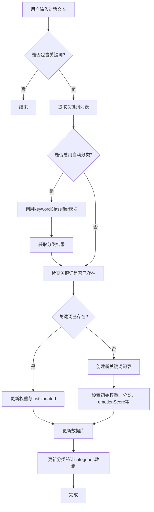
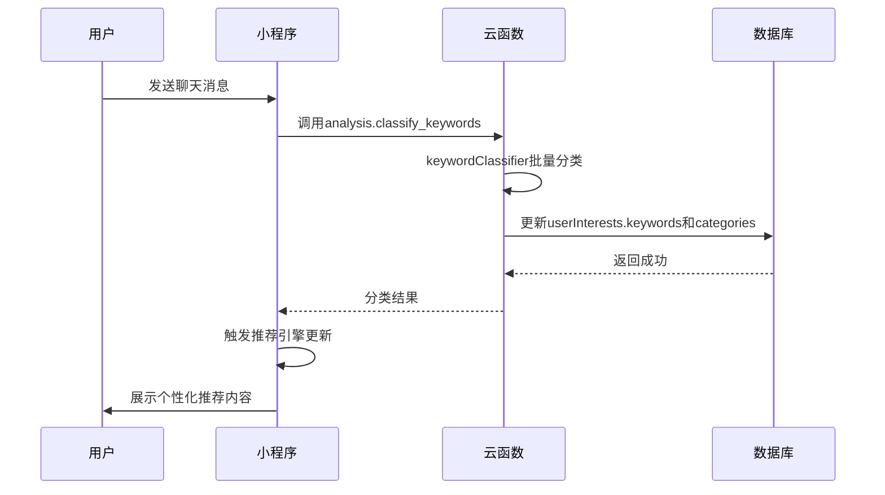

# 用户兴趣字段

<cite>
**本文档引用文件**  
- [userInterests.js](file://cloudfunctions/user/userInterests.js)
- [keywordClassifier.js](file://cloudfunctions/analysis/keywordClassifier.js)
- [userInterests.md](file://doc/开发文档/database/userInterests.md)
- [userInterestsService.js](file://miniprogram/services/userInterestsService.js)
</cite>

## 目录
1. [用户兴趣字段结构与更新策略](#用户兴趣字段结构与更新策略)  
2. [兴趣标签分类体系](#兴趣标签分类体系)  
3. [权重计算算法](#权重计算算法)  
4. [兴趣数据生成流程与去重机制](#兴趣数据生成流程与去重机制)  
5. [推荐系统中的应用示例](#推荐系统中的应用示例)

## 用户兴趣字段结构与更新策略

`userInterests` 集合用于存储用户的兴趣关键词及其相关元数据，核心字段包括 `interestTags`（即 `keywords` 数组）、`weight`、`lastUpdated` 等。

- **keywords 字段结构**：  
  每个关键词对象包含以下字段：
  - `word`: 关键词内容（字符串）
  - `weight`: 权重值（数值，范围 0.1–2.0）
  - `category`: 兴趣分类（字符串）
  - `source`: 来源（如 "chat"）
  - `emotionScore`: 情感关联度（0–1）
  - `firstSeen`: 首次出现时间（日期）
  - `lastUpdated`: 最后更新时间（日期）
  - `occurrences`: 出现次数（整数）

- **lastUpdated 更新策略**：  
  每当关键词被访问、权重更新或分类调整时，其 `lastUpdated` 字段都会被设置为当前时间戳。该字段用于实现时间衰减机制，确保近期活跃的关键词具有更高权重。

- **更新操作流程**：  
  当调用 `updateUserInterest` 或 `batchUpdateUserInterests` 时，系统会检查关键词是否已存在。若存在，则更新其权重和 `lastUpdated`；若不存在，则插入新记录并初始化字段。

**Section sources**  
- [userInterests.js](file://cloudfunctions/user/userInterests.js#L150-L847)
- [userInterests.md](file://doc/开发文档/database/userInterests.md#L1-L122)

## 兴趣标签分类体系

系统采用预定义的分类体系对兴趣标签进行归类，分类结果直接影响推荐内容的组织方式。

- **预定义主分类**：  
  包括“学习”、“工作”、“娱乐”、“社交”、“健康”、“生活”、“科技”、“艺术”、“体育”、“旅游”、“美食”、“时尚”、“金融”、“宠物”、“家庭”、“音乐”、“电影”、“阅读”、“游戏”、“心理”、“自我提升”、“时间管理”、“压力缓解”、“人际关系”、“休闲活动”、“其他”等。

- **细分类别映射**：  
  每个主分类下定义了若干关键词作为判断依据。例如，“学习”类包含“考试”、“课程”、“学位”、“研究”等子关键词。

- **分类逻辑**：  
  分类优先通过大模型（如智谱AI）进行语义理解，若API不可用，则回退至本地规则匹配。规则基于关键词是否包含特定子词来判断归属类别。

**Section sources**  
- [keywordClassifier.js](file://cloudfunctions/analysis/keywordClassifier.js#L15-L299)
- [userInterests.md](file://doc/开发文档/database/userInterests.md#L75-L85)

## 权重计算算法

兴趣标签的权重反映用户对该主题的关注程度，其计算结合频率、情感、时间等多维度因素。

- **基础权重更新规则**：
  - 新关键词初始权重为 `max(1.0 + weightDelta, 0.1)`
  - 已存在关键词权重更新公式：  
    `newWeight = clamp(currentWeight + (weightDelta), 0.1, 2.0)`  
    其中 `weightDelta` 默认为 0.1，表示每次提及增加关注度。

- **批量更新中的权重调整**：  
  在 `batchUpdateUserInterests` 中，权重增量根据输入权重与基准值（1.0）的差值按比例缩放：  
  `newWeight = clamp(currentWeight + (inputWeight - 1.0) * 0.2, 0.1, 2.0)`

- **时间衰减机制**：  
  虽未在代码中显式实现，但 `lastUpdated` 字段可用于后续计算中引入时间衰减因子，使旧关键词权重随时间自然下降。

- **情感加权**：  
  `emotionScore` 通过加权平均更新：  
  `newScore = currentScore * 0.7 + newEmotionScore * 0.3`

**Section sources**  
- [userInterests.js](file://cloudfunctions/user/userInterests.js#L150-L847)
- [userInterests.md](file://doc/开发文档/database/userInterests.md#L105-L110)

## 兴趣数据生成流程与去重机制

兴趣数据的生成依赖于 `keywordClassifier` 模块与用户交互内容的分析，流程如下：



**Diagram sources**  
- [userInterests.js](file://cloudfunctions/user/userInterests.js#L150-L847)
- [keywordClassifier.js](file://cloudfunctions/analysis/keywordClassifier.js#L1-L299)
- [userInterestsService.js](file://miniprogram/services/userInterestsService.js#L350-L400)

### 去重机制

系统通过以下方式避免重复关键词：

- **关键词查重**：在 `keywords` 数组中使用 `word` 字段作为唯一标识，通过 `findIndex(k => k.word === keyword)` 判断是否存在。
- **批量处理去重**：在调用 `batchClassifyKeywords` 前，使用 `Set` 对关键词数组进行去重。
- **分类统计合并**：更新 `categories` 数组时，若分类已存在，则累加计数而非新增条目。

**Section sources**  
- [userInterests.js](file://cloudfunctions/user/userInterests.js#L300-L847)
- [keywordClassifier.js](file://cloudfunctions/analysis/keywordClassifier.js#L100-L150)
- [userInterestsService.js](file://miniprogram/services/userInterestsService.js#L200-L300)

## 推荐系统中的应用示例

兴趣标签在推荐系统中主要用于个性化内容匹配和角色推荐。

### 应用场景一：兴趣标签云展示

前端组件 `interest-tag-cloud` 调用 `getInterestTagCloudData()` 获取数据，按权重或分类数量渲染可视化标签云。

```javascript
// 示例调用
const tagData = await userInterestsService.getInterestTagCloudData(userId, false, true);
// 返回格式: [{ name: '学习', value: 5, category: '学习', isCategory: true }]
```

### 应用场景二：角色推荐匹配

根据用户兴趣分类权重，匹配预设角色。例如：
- 若“心理”类权重高 → 推荐心理咨询师角色
- 若“游戏”类关键词多 → 推荐游戏伙伴角色

### 应用场景三：动态内容推荐

结合 `emotionScore` 与 `weight`，优先推荐与用户当前情绪和兴趣匹配的内容。例如：
- 高“压力缓解”权重 + 低情绪分 → 推送冥想音频
- 高“阅读”兴趣 + “文学”分类 → 推送书单



**Diagram sources**  
- [userInterestsService.js](file://miniprogram/services/userInterestsService.js#L350-L400)
- [userInterests.js](file://cloudfunctions/user/userInterests.js#L300-L847)
- [keywordClassifier.js](file://cloudfunctions/analysis/keywordClassifier.js#L1-L299)

**Section sources**  
- [userInterestsService.js](file://miniprogram/services/userInterestsService.js#L1-L613)
- [userInterests.md](file://doc/开发文档/database/userInterests.md#L55-L85)