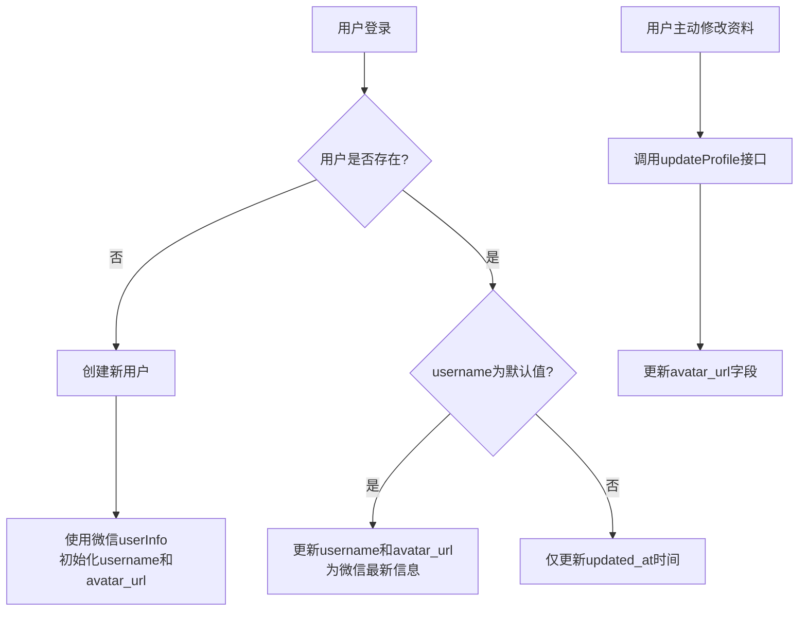
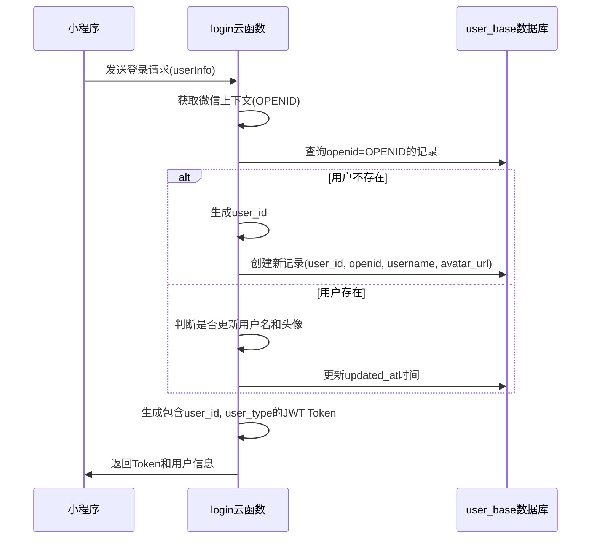

# 用户基础信息字段

<cite>
**本文档引用文件**  
- [user_base.md](file://doc/开发文档/database/user_base.md)
- [index.js](file://cloudfunctions/login/index.js)
- [user/index.js](file://cloudfunctions/user/index.js)
- [userService.js](file://miniprogram/services/userService.js)
</cite>

## 目录
1. [引言](#引言)
2. [字段结构详解](#字段结构详解)
3. [主键设计考量](#主键设计考量)
4. [头像存储与更新机制](#头像存储与更新机制)
5. [登录认证流程中的字段应用](#登录认证流程中的字段应用)
6. [查询示例](#查询示例)
7. [总结](#总结)

## 引言
`user_base` 集合是系统中用于存储用户基础账户信息的核心数据表。它承载了用户的身份标识、基本信息、账户状态等关键数据，支撑着整个系统的用户识别、权限控制和个性化服务功能。本文档将详细说明该集合中各字段的数据类型、业务含义、约束条件及其在系统中的实际应用。

**Section sources**
- [user_base.md](file://doc/开发文档/database/user_base.md)

## 字段结构详解
`user_base` 集合包含以下核心字段：

| 字段名 | 数据类型 | 业务含义 | 约束条件 |
| :--- | :--- | :--- | :--- |
| `_id` | 字符串 (string) | 记录的唯一标识符，由数据库自动生成 | 主键，系统自动生成 |
| `user_id` | 字符串 (string) | 用户的7位数字ID，作为系统内用户的唯一标识 | 唯一索引，长度为7位数字，范围1000000-9999999 |
| `openid` | 字符串 (string) | 微信平台为用户分配的唯一标识符，用于身份认证 | 唯一索引，与微信生态绑定 |
| `username` | 字符串 (string) | 用户的显示名称，用于界面展示 | 可更新，初始值来自微信用户信息 |
| `avatar_url` | 字符串 (string) | 用户头像图片的URL地址 | 可更新，初始值来自微信用户信息 |
| `user_type` | 数字 (number) | 用户类型，区分不同权限等级 | 1-普通用户，2-VIP用户，3-管理员 |
| `status` | 数字 (number) | 账户当前状态 | 1-启用，0-禁用 |
| `created_at` | 日期 (date) | 账户创建的时间戳 | 不可变，记录创建时间 |
| `updated_at` | 日期 (date) | 账户信息最后更新的时间戳 | 每次信息变更时自动更新 |

**Section sources**
- [user_base.md](file://doc/开发文档/database/user_base.md)

## 主键设计考量
`user_base` 集合的设计中，`_id` 是数据库层面的主键，而 `openid` 和 `user_id` 是业务层面的唯一标识。

- **`openid` 作为核心身份标识**：`openid` 是微信官方提供的用户唯一标识，具有极高的稳定性和权威性。它直接关联用户的微信身份，是登录认证流程中最可靠的凭证。系统通过 `openid` 确保用户身份的真实性和唯一性，避免了伪造和冒用的风险。
- **`user_id` 作为系统内用户标识**：`user_id` 是系统内部生成的7位数字ID，为用户提供了一个简洁、易记的系统内标识。它与 `openid` 一一对应，但解耦了对微信平台的直接依赖，为未来可能的多平台登录（如手机号、邮箱）提供了扩展性。
- **双重唯一性保障**：`user_id` 和 `openid` 均建立了唯一索引，确保了数据的完整性和一致性。这种设计既利用了微信 `openid` 的权威性，又通过 `user_id` 提供了更灵活的系统内引用方式。

**Section sources**
- [user_base.md](file://doc/开发文档/database/user_base.md)
- [index.js](file://cloudfunctions/login/index.js#L1-L267)

## 头像存储与更新机制
### 头像URL存储规范
头像信息通过 `avatar_url` 字段以字符串形式存储，其值为一个完整的HTTP/HTTPS链接，指向存储在云存储或CDN上的图片资源。该URL在用户首次登录时从微信服务器获取，并在用户资料更新时可能被修改。

### 头像更新机制
头像的更新遵循以下逻辑：
1.  **首次登录**：当新用户首次登录时，系统会创建 `user_base` 记录，并将微信 `userInfo` 中的 `avatarUrl` 直接写入 `avatar_url` 字段。
2.  **后续登录**：对于已存在的用户，系统会检查其 `username` 是否为默认值（如“微信用户”）。只有当用户名为默认值时，系统才会更新 `username` 和 `avatar_url`，以同步微信端的最新信息。如果用户已自定义过用户名，则头像信息不会被自动覆盖，以保护用户的个性化设置。
3.  **主动更新**：用户可以在个人资料页面主动修改头像。前端通过 `saveUserProfile` 服务调用 `user` 云函数的 `updateProfile` 接口，将新的头像URL作为参数传递，从而更新数据库中的 `avatar_url` 字段。



**Diagram sources**
- [index.js](file://cloudfunctions/login/index.js#L1-L267)
- [user/index.js](file://cloudfunctions/user/index.js#L1-L799)
- [userService.js](file://miniprogram/services/userService.js#L1-L368)

**Section sources**
- [index.js](file://cloudfunctions/login/index.js#L1-L267)
- [user/index.js](file://cloudfunctions/user/index.js#L1-L799)
- [userService.js](file://miniprogram/services/userService.js#L1-L368)

## 登录认证流程中的字段应用
`user_base` 集合的字段在登录认证流程中扮演着至关重要的角色：

1.  **身份识别**：登录流程开始时，云函数通过 `cloud.getWXContext()` 获取用户的 `OPENID`。系统使用此 `openid` 在 `user_base` 集合中进行查询，以识别用户身份。
2.  **用户创建与信息同步**：若 `openid` 不存在，则判定为新用户，系统会生成唯一的 `user_id`，并使用微信传入的 `userInfo` 中的 `nickName` 和 `avatarUrl` 初始化 `username` 和 `avatar_url` 字段，完成用户注册。
3.  **个性化展示**：登录成功后，系统将 `user_base` 中的 `username` 和 `avatar_url` 与 `user_profile` 中的 `gender`、`bio` 等信息合并，构建完整的用户资料，用于前端界面的个性化展示。
4.  **权限与状态控制**：`user_type` 和 `status` 字段决定了用户的功能权限和账户可用性。例如，只有 `status` 为1的用户才能成功登录，而 `user_type` 决定了用户能否访问VIP功能。
5.  **Token生成**：系统在生成JWT Token时，会将 `user_id`、`user_type` 和 `status` 等关键信息编码进Token的Payload中，使得后续的API请求无需频繁查询数据库即可验证用户权限和状态。



**Diagram sources**
- [index.js](file://cloudfunctions/login/index.js#L1-L267)
- [user/index.js](file://cloudfunctions/user/index.js#L1-L799)

**Section sources**
- [index.js](file://cloudfunctions/login/index.js#L1-L267)

## 查询示例
以下是一个通过 `openid` 快速检索用户信息的代码示例：

```javascript
// 在云函数中执行
const db = cloud.database();
const usersCollection = db.collection('user_base');

// 通过openid查询用户
const userResult = await usersCollection
  .where({ openid: 'oxxxxxxxxxxxxxxxx' }) // 替换为实际的openid
  .get();

if (userResult.data.length > 0) {
  const user = userResult.data[0];
  console.log('用户ID:', user.user_id);
  console.log('用户名:', user.username);
  console.log('头像:', user.avatar_url);
} else {
  console.log('用户不存在');
}
```

此查询利用了 `openid` 字段的唯一索引，能够实现毫秒级的快速检索，是系统中最常用的用户信息获取方式。

**Section sources**
- [index.js](file://cloudfunctions/login/index.js#L1-L267)

## 总结
`user_base` 集合是整个用户体系的基石。通过对 `openid`、`user_id`、`username`、`avatar_url` 等字段的精心设计和管理，系统实现了安全、可靠的身份认证，支持了个性化的用户体验，并为权限控制和数据统计提供了坚实的基础。其设计充分考虑了与微信生态的集成、数据一致性以及未来的可扩展性。