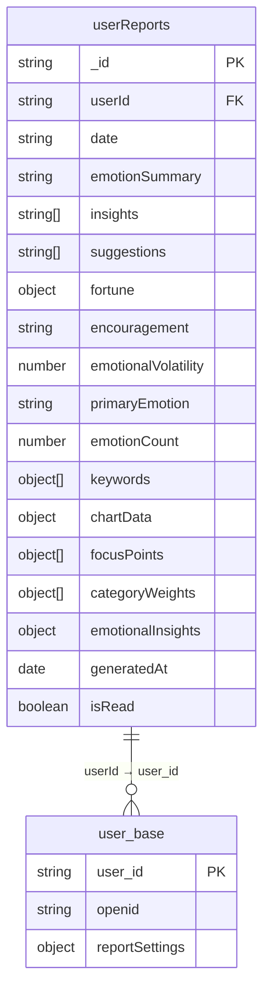
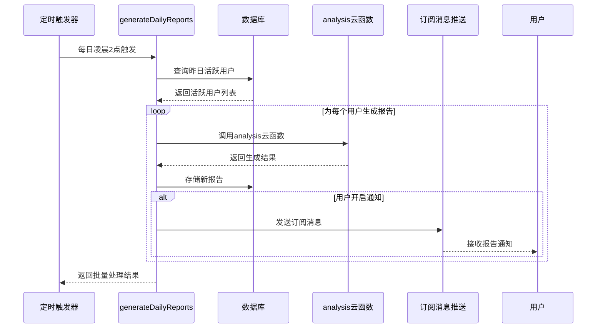

# 用户报告字段

<cite>
**本文档中引用的文件**
- [userReports.md](file://doc/开发文档/database/userReports.md)
- [index.js](file://cloudfunctions/generateDailyReports/index.js)
- [每日心情报告系统使用文档.md](file://doc/使用文档/每日心情报告系统使用文档.md)
- [HeartChat每日心情报告设计方案.md](file://doc/设计文档/功能设计/HeartChat每日心情报告设计方案.md)
</cite>

## 目录
1. [引言](#引言)
2. [用户报告集合结构](#用户报告集合结构)
3. [核心字段详解](#核心字段详解)
4. [每日心情报告生成算法](#每日心情报告生成算法)
5. [个性化建议策略](#个性化建议策略)
6. [定时生成与推送机制](#定时生成与推送机制)
7. [报告数据导出方案](#报告数据导出方案)
8. [结论](#结论)

## 引言
本报告深入分析 HeartChat 应用中 `userReports` 集合的字段定义与实现机制。重点解析每日心情报告的核心字段（如 dailySummary、emotionTrend、suggestions、generationTime 等）的结构与含义，阐述报告的生成算法与个性化建议策略，并结合 `generateDailyReports` 云函数说明其定时生成与推送逻辑。最后，提供报告数据的导出方案，为系统维护与数据分析提供支持。

## 用户报告集合结构
`userReports` 集合是 HeartChat 系统中存储用户每日心情分析报告的核心数据表。它整合了用户的情感统计、洞察分析、建议指导和可视化图表数据，形成一份完整的个性化报告。

**Diagram sources**
- [userReports.md](file://doc/开发文档/database/userReports.md)

**Section sources**
- [userReports.md](file://doc/开发文档/database/userReports.md)

## 核心字段详解
`userReports` 集合包含多个关键字段，共同构成一份详尽的用户心情报告。

### 情感总结与洞察
- **emotionSummary**: 字符串类型，提供对用户当日整体情感状态的简洁总结。
- **insights**: 字符串数组，包含 3-5 条由 AI 生成的情感洞察分析，揭示用户情绪模式的深层原因。
- **primaryEmotion**: 字符串类型，标识当日最主要的主导情绪（如“平静”、“焦虑”）。
- **emotionalVolatility**: 数值类型（0-100），表示情绪波动指数，数值越高代表情绪越不稳定。

### 建议与鼓励
- **suggestions**: 字符串数组，包含 3 条针对用户当前情绪状态的改善建议，旨在提供实用的情绪管理方法。
- **encouragement**: 字符串类型，一条温暖、鼓舞人心的话语，为用户提供积极的情感支持。

### 关键词与关注点
- **keywords**: 对象数组，存储从用户对话中提取的重要关键词及其权重。每个对象包含 `word`（关键词内容）和 `weight`（权重值）。
- **focusPoints**: 对象数组，表示用户的主要关注点，包含 `category`（分类）、`percentage`（百分比）和 `keywords`（相关关键词列表）。

### 图表与生成信息
- **chartData**: 对象类型，封装了用于数据可视化的图表数据，包括 `emotionDistribution`（情感分布）、`intensityTrend`（情感强度趋势）和 `focusDistribution`（关注点分布）。
- **generatedAt**: 日期类型，记录报告的精确生成时间。
- **isRead**: 布尔类型，标记用户是否已阅读该报告。

**Section sources**
- [userReports.md](file://doc/开发文档/database/userReports.md)
- [HeartChat每日心情报告设计方案.md](file://doc/设计文档/功能设计/HeartChat每日心情报告设计方案.md)

## 每日心情报告生成算法
每日心情报告的生成是一个多步骤的自动化过程，结合了数据聚合、算法分析和 AI 生成技术。

### 数据聚合与预处理
算法首先从 `emotionRecords` 集合中聚合用户前一天的所有情感记录。通过聚合查询，系统识别出所有在前一天有情感记录的活跃用户。

### 情感与关键词分析
对于每个活跃用户，系统会：
1.  **统计情感数据**：计算各类情绪的出现次数、占比，并确定主要情绪。
2.  **提取关键词**：利用 NLP 技术（如 HanLP）从用户的聊天记录中提取关键词。
3.  **计算权重**：根据关键词的出现频率、上下文重要性、情感关联强度和时间衰减等因素，计算其综合权重。

### AI 内容生成
系统调用 `analysis` 云函数，将聚合后的数据（情感统计、关键词、兴趣领域等）作为输入，通过结构化的提示词（Prompt）引导大语言模型（LLM）生成以下内容：
- **情感总结**：一段温暖、专业的文字总结。
- **洞察分析**：揭示用户情绪模式的深层原因。
- **个性化建议**：具体、可行的改善建议。
- **鼓励语**：积极的鼓励话语。

**Section sources**
- [HeartChat每日心情报告设计方案.md](file://doc/设计文档/功能设计/HeartChat每日心情报告设计方案.md)
- [userReports.md](file://doc/开发文档/database/userReports.md)

## 个性化建议策略
系统的个性化建议策略基于对用户多维度数据的深度分析。

### 基于情感状态的建议
建议内容与用户的主要情绪和次要情绪紧密相关。例如，当检测到用户处于“焦虑”状态时，系统会生成如“尝试工作间隙进行深呼吸练习”或“制定合理的工作计划”等建议。

### 基于关注点的建议
系统分析用户的关键词和兴趣领域，确保建议与用户的实际生活和关注点相关。例如，如果“工作”是主要关注点，建议会围绕时间管理、压力缓解等主题展开。

### 基于历史趋势的建议
通过对比用户当前情绪与历史数据（如昨日报告），系统能识别出情绪变化趋势（上升/下降/稳定），并据此提供更具前瞻性的建议。

**Section sources**
- [HeartChat每日心情报告设计方案.md](file://doc/设计文档/功能设计/HeartChat每日心情报告设计方案.md)
- [每日心情报告系统使用文档.md](file://doc/使用文档/每日心情报告系统使用文档.md)

## 定时生成与推送机制
每日心情报告的生成和推送由 `generateDailyReports` 云函数驱动，通过定时触发器实现自动化。

### 定时生成流程

**Diagram sources**
- [index.js](file://cloudfunctions/generateDailyReports/index.js)

**Section sources**
- [index.js](file://cloudfunctions/generateDailyReports/index.js)
- [每日心情报告系统使用文档.md](file://doc/使用文档/每日心情报告系统使用文档.md)

### 推送逻辑
1.  **触发条件**：云函数在成功为用户生成新报告后，会检查该用户的 `reportSettings.notificationEnabled` 设置。
2.  **获取信息**：若用户开启了通知，系统会查询其 `openid` 和预设的订阅消息模板 ID。
3.  **发送通知**：调用微信 `subscribeMessage.send` API，向用户推送一条包含报告日期、摘要和主要情绪的订阅消息，引导用户点击查看。

## 报告数据导出方案
为满足数据分析和用户数据迁移的需求，系统可提供以下报告数据导出方案。

### 方案一：API 接口导出
开发一个专用的云函数 `exportUserReports`，接收 `userId` 和日期范围作为参数。该函数查询 `userReports` 集合，将结果以 JSON 或 CSV 格式返回，前端可触发下载。

### 方案二：后台管理导出
在管理后台提供数据导出功能，管理员可按用户、日期范围筛选报告数据，并一键导出为 Excel 文件，便于进行批量分析。

### 方案三：用户自助导出
在用户个人中心增加“数据导出”功能，允许用户选择导出自己全部或特定时间段的心情报告，增强用户对个人数据的控制权。

**Section sources**
- [index.js](file://cloudfunctions/generateDailyReports/index.js)
- [userReports.md](file://doc/开发文档/database/userReports.md)

## 结论
`userReports` 集合是 HeartChat 应用实现情感关怀与用户粘性提升的核心。通过对 `dailySummary`、`emotionTrend`、`suggestions` 等字段的精心设计，结合基于 `generateDailyReports` 云函数的自动化生成与推送机制，系统能够为用户提供高度个性化、及时且富有价值的心情报告。未来可通过完善数据导出方案，进一步释放报告数据的分析潜力。