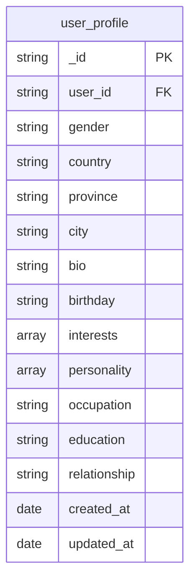
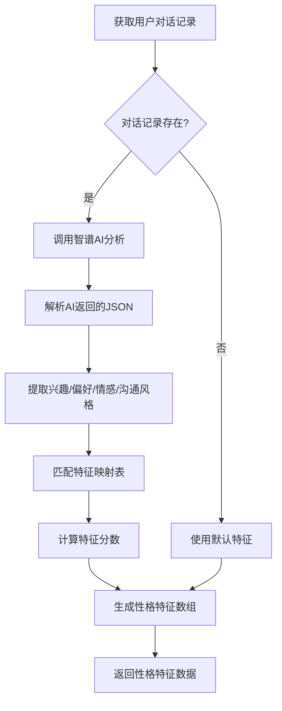
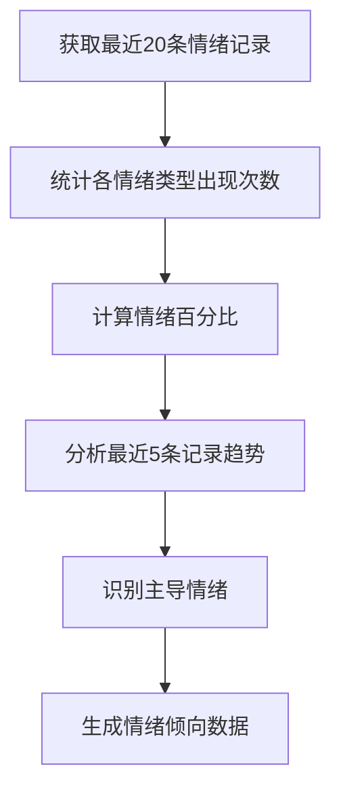
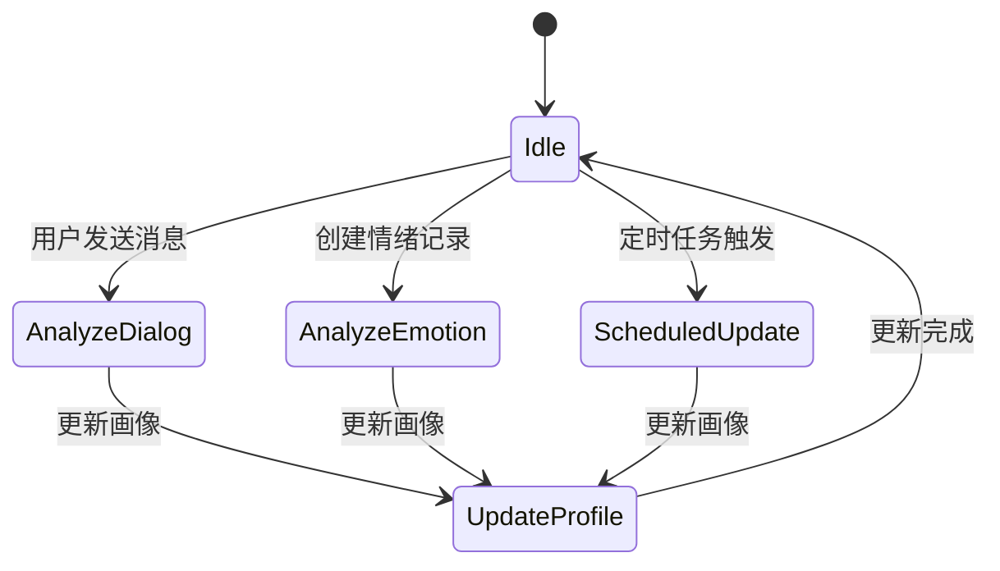
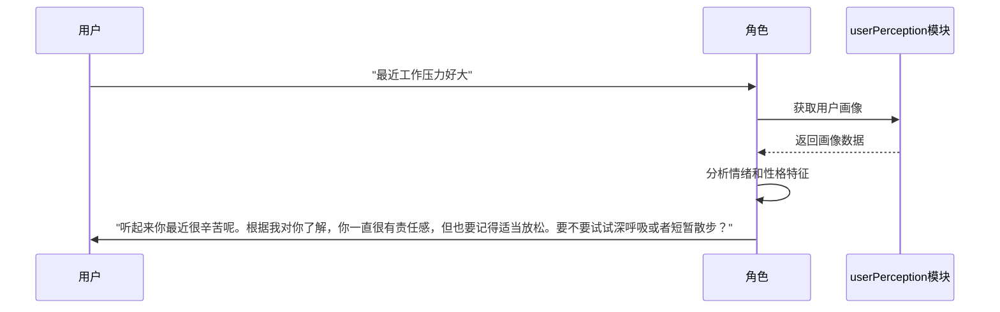

# 用户画像字段

<cite>
**本文档引用的文件**
- [user_profile.md](file://doc/开发文档/database/user_profile.md)
- [userPerception.js](file://cloudfunctions/roles/userPerception.js)
- [userPerception_new.js](file://cloudfunctions/user/userPerception_new.js)
- [aiModelService.js](file://cloudfunctions/analysis/aiModelService.js)
- [keywordEmotionLinker.js](file://cloudfunctions/analysis/keywordEmotionLinker.js)
</cite>

## 目录
1. [引言](#引言)
2. [用户画像字段结构](#用户画像字段结构)
3. [性格特征分析逻辑](#性格特征分析逻辑)
4. [情绪倾向计算机制](#情绪倾向计算机制)
5. [沟通风格识别方法](#沟通风格识别方法)
6. [userPerception模块与画像更新](#userperception模块与画像更新)
7. [画像数据在角色互动中的应用](#画像数据在角色互动中的应用)
8. [总结](#总结)

## 引言
本项目通过多维度数据分析构建用户画像，旨在实现个性化服务和情感智能交互。用户画像不仅包含用户自述的基本信息，更通过AI分析对话内容、情绪记录和行为模式，动态生成性格特征、情绪倾向和沟通风格等深层特征。这些特征被用于优化角色互动、提供个性化建议和改善用户体验。

## 用户画像字段结构
用户画像数据主要存储在`user_profile`集合中，该集合记录了用户的扩展信息和个性化特征。

**图表来源**
- [user_profile.md](file://doc/开发文档/database/user_profile.md)

**本节来源**
- [user_profile.md](file://doc/开发文档/database/user_profile.md)

## 性格特征分析逻辑
性格特征（personalityTraits）是通过AI模型对用户对话内容进行深度分析得出的量化数据。

### 数据结构
性格特征以数组形式存储，每个元素包含`trait`（特征名称）和`score`（分数，0-1之间）两个属性。

### 生成逻辑
1. **数据采集**：系统收集用户最近50条对话消息作为分析样本。
2. **AI分析**：调用智谱AI的`glm-4-flash`模型，通过`analyzeUserDialogues`函数分析对话内容。
3. **特征映射**：将AI返回的兴趣、偏好、情感模式和沟通风格等信息，通过`convertToPersonalityTraits`函数映射到预定义的性格特征维度。
4. **分数计算**：根据关键词匹配程度和上下文重要性计算特征分数，完全匹配得高分，部分匹配分数略低。
5. **备选方案**：若AI分析失败，则基于用户兴趣标签和主导情绪模式，通过规则引擎生成性格特征。

**图表来源**
- [userPerception_new.js](file://cloudfunctions/user/userPerception_new.js#L200-L300)
- [aiModelService.js](file://cloudfunctions/analysis/aiModelService.js#L500-L600)

**本节来源**
- [userPerception_new.js](file://cloudfunctions/user/userPerception_new.js#L200-L300)
- [aiModelService.js](file://cloudfunctions/analysis/aiModelService.js#L500-L600)

## 情绪倾向计算机制
情绪倾向（emotionalTendency）通过分析用户的历史情绪记录来计算，反映用户的情绪变化规律和主导情绪。

### 数据结构
情绪倾向包含三个主要部分：
- `emotionPercentages`：各情绪类型的出现频率百分比
- `emotionTrends`：情绪变化趋势（积极上升、消极下降、情绪波动）
- `dominantEmotions`：主导情绪列表（占比超过10%的情绪）

### 计算周期
系统采用滑动窗口机制，每次分析时取用户最近20条情绪记录进行计算。

### 计算流程
1. **数据统计**：遍历情绪记录，统计各情绪类型（包括主情绪和次情绪）的出现次数。
2. **百分比转换**：将出现次数转换为百分比形式。
3. **趋势分析**：分析最近5条记录的情绪变化，判断整体趋势。
4. **主导情绪识别**：筛选出占比超过10%的情绪作为主导情绪。

**图表来源**
- [userPerception_new.js](file://cloudfunctions/user/userPerception_new.js#L350-L450)

**本节来源**
- [userPerception_new.js](file://cloudfunctions/user/userPerception_new.js#L350-L450)

## 沟通风格识别方法
沟通风格（communicationStyle）是通过分析用户语言特点和表达方式得出的描述性特征。

### 识别逻辑
1. **文本分析**：系统分析用户对话中的语言模式，包括用词、句式、标点使用等。
2. **AI提取**：调用智谱AI模型，从对话内容中直接提取沟通风格描述。
3. **关键词匹配**：将AI返回的描述与预定义的沟通风格关键词（如"直接"、"委婉"、"详细"、"简洁"等）进行匹配。
4. **特征生成**：匹配成功的关键词被转换为具体的沟通风格特征。

### 特征维度
- **表达方式**：直接/委婉、详细/简洁、正式/非正式
- **语言特点**：礼貌性、幽默感、专业性
- **互动模式**：提问型、陈述型、共情型

**本节来源**
- [userPerception_new.js](file://cloudfunctions/user/userPerception_new.js#L200-L300)
- [aiModelService.js](file://cloudfunctions/analysis/aiModelService.js#L500-L600)

## userPerception模块与画像更新
userPerception模块负责用户画像的生成、更新和管理，确保画像数据的时效性和准确性。

### 更新频率
用户画像在以下情况下被更新：
- 用户完成一次对话后
- 用户情绪记录被创建后
- 每24小时定时更新（确保数据新鲜度）

### 触发条件
1. **对话触发**：当用户发送消息并收到回复后，系统自动分析本次对话内容，更新画像。
2. **情绪触发**：当系统记录新的情绪分析结果后，触发画像更新。
3. **定时触发**：通过云函数定时任务，定期重新分析用户数据。

### 更新策略
- **增量更新**：新旧画像通过AI进行智能合并，优先保留新信息。
- **冲突解决**：当新旧信息有冲突时，优先保留较新的分析结果。
- **数据融合**：将AI分析结果与传统统计方法的结果进行融合，提高准确性。

**图表来源**
- [userPerception.js](file://cloudfunctions/roles/userPerception.js#L150-L250)
- [userPerception_new.js](file://cloudfunctions/user/userPerception_new.js#L100-L200)

**本节来源**
- [userPerception.js](file://cloudfunctions/roles/userPerception.js#L150-L250)
- [userPerception_new.js](file://cloudfunctions/user/userPerception_new.js#L100-L200)

## 画像数据在角色互动中的应用
用户画像数据被广泛应用于角色互动中，实现个性化和智能化的对话体验。

### 应用场景
1. **个性化问候**：根据用户当前情绪状态和性格特征，生成个性化的欢迎语。
2. **话题推荐**：基于用户兴趣和主导情绪，推荐相关话题或活动。
3. **沟通策略调整**：根据用户沟通风格，调整角色的表达方式（如对直接型用户采用简洁表达）。
4. **情感支持**：当检测到用户情绪低落时，主动提供安慰和建议。

### 示例

**图表来源**
- [userPerception.js](file://cloudfunctions/roles/userPerception.js#L250-L300)
- [userPerception_new.js](file://cloudfunctions/user/userPerception_new.js#L300-L350)

**本节来源**
- [userPerception.js](file://cloudfunctions/roles/userPerception.js#L250-L300)
- [userPerception_new.js](file://cloudfunctions/user/userPerception_new.js#L300-L350)

## 总结
用户画像系统通过整合AI分析和传统统计方法，构建了全面、动态的用户特征模型。性格特征、情绪倾向和沟通风格等字段不仅反映了用户的静态属性，更捕捉了用户的动态心理状态。通过userPerception模块的智能更新机制，系统能够持续优化画像数据，为角色互动提供精准的个性化支持。未来可进一步优化AI模型的分析精度，增加更多维度的用户特征，提升用户体验。