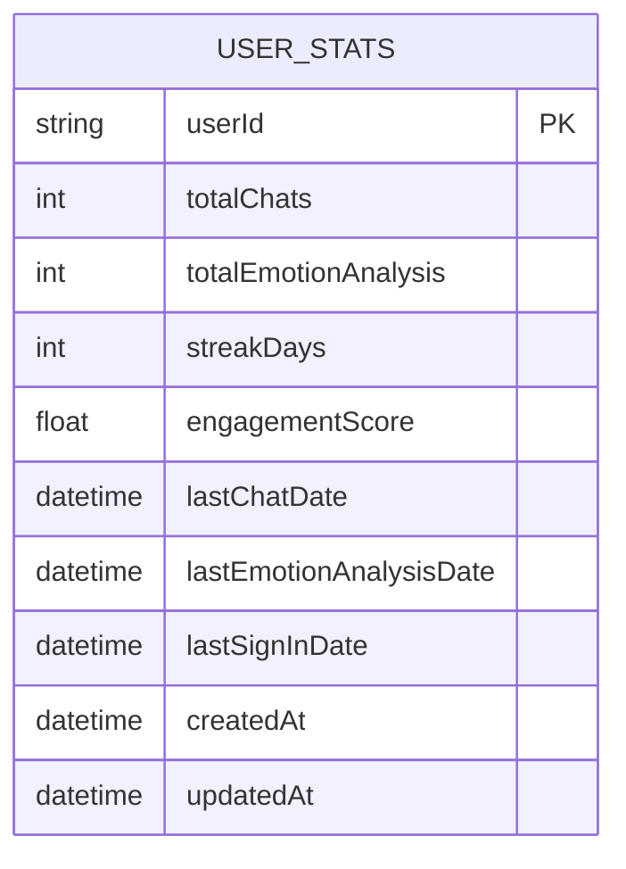
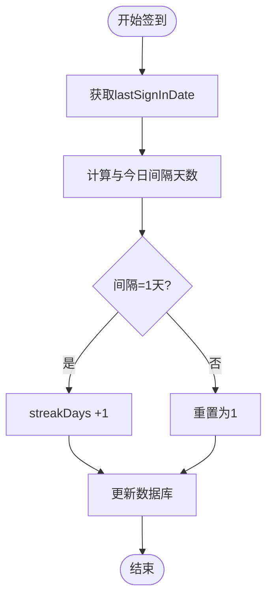
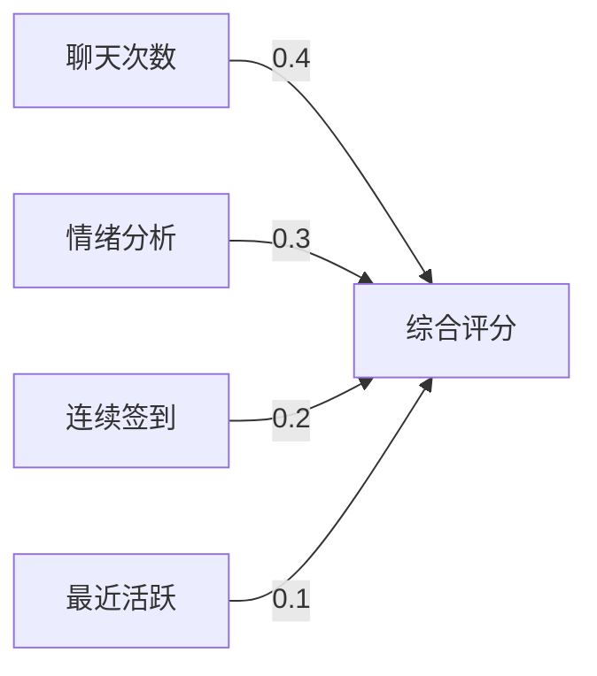
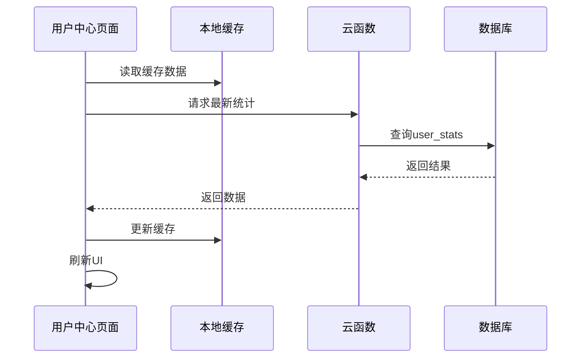
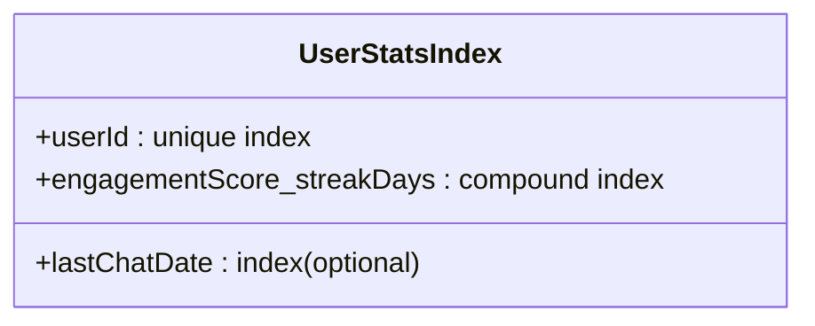

# 用户统计字段

<cite>
**本文档引用文件**  
- [user_stats.md](file://doc/开发文档/database/user_stats.md)
- [stats.js](file://miniprogram/utils/stats.js)
- [user.js](file://cloudfunctions/user/index.js)
- [userService.js](file://miniprogram/services/userService.js)
- [home.js](file://miniprogram/pages/home/home.js)
- [createIndexes.js](file://cloudfunctions/user/createIndexes.js)
</cite>

## 目录
1. [引言](#引言)
2. [用户统计字段概览](#用户统计字段概览)
3. [核心统计字段详解](#核心统计字段详解)
4. [连续签到天数计算逻辑](#连续签到天数计算逻辑)
5. [参与度评分权重分配](#参与度评分权重分配)
6. [用户中心页面数据展示机制](#用户中心页面数据展示机制)
7. [实时更新机制与缓存策略](#实时更新机制与缓存策略)
8. [数据准确性保障方案](#数据准确性保障方案)
9. [索引优化与性能建议](#索引优化与性能建议)
10. [结论](#结论)

## 引言
本文档全面阐述HeartChat项目中`user_stats`集合的各项统计字段设计、计算逻辑与实现机制。重点解析`totalChats`、`totalEmotionAnalysis`、`streakDays`、`engagementScore`等核心字段的统计方式，说明连续签到天数的判定规则与参与度评分的权重模型，并结合用户中心页面说明数据的实时更新流程与缓存策略，最后提供数据一致性和准确性的保障措施。

## 用户统计字段概览
`user_stats`集合用于存储用户行为统计信息，支撑用户画像、成长体系与个性化推荐功能。该集合通过云函数与前端服务协同更新，确保数据在多端间的一致性。

**图表来源**  
- [user_stats.md](file://doc/开发文档/database/user_stats.md)

## 核心统计字段详解

### totalChats 字段
记录用户累计发起的聊天对话总数。每次用户在聊天界面发送首条消息时触发计数增加。

**字段来源**  
- [user.js](file://cloudfunctions/user/index.js#L45-L60)
- [userService.js](file://miniprogram/services/userService.js#L88-L95)

### totalEmotionAnalysis 字段
统计用户完成情绪分析的总次数。每当用户提交情绪描述并成功获取分析结果时递增。

**字段来源**  
- [emotion.js](file://cloudfunctions/emotion/index.js#L30-L42)
- [emotionService.js](file://miniprogram/services/emotionService.js#L55-L63)

### streakDays 字段
表示用户连续签到天数，用于激励用户每日活跃。具体计算逻辑详见下文。

**字段来源**  
- [stats.js](file://miniprogram/utils/stats.js#L102-L130)
- [userService.js](file://miniprogram/services/userService.js#L110-L125)

### engagementScore 字段
综合反映用户活跃程度的加权评分，由多个行为维度加权计算得出。

**字段来源**  
- [stats.js](file://miniprogram/utils/stats.js#L65-L90)
- [userService.js](file://miniprogram/services/userService.js#L130-L145)

## 连续签到天数计算逻辑
连续签到天数（`streakDays`）基于用户每日首次访问系统的时间戳进行判定，遵循以下规则：

1. 若用户今日首次访问且距离上次签到为1天，则`streakDays`加1；
2. 若间隔超过1天，则重置为1；
3. 若为当日重复访问，则不改变当前值。

该逻辑通过比较`lastSignInDate`与当前日期实现，确保跨日边界处理准确。

**图表来源**  
- [stats.js](file://miniprogram/utils/stats.js#L102-L130)

**本节来源**  
- [stats.js](file://miniprogram/utils/stats.js#L102-L130)
- [userService.js](file://miniprogram/services/userService.js#L110-L125)

## 参与度评分权重分配
参与度评分（`engagementScore`）采用加权线性模型，各行为指标权重如下：

| 行为类型 | 权重 | 说明 |
|--------|------|------|
| 聊天次数 | 0.4 | totalChats归一化值 |
| 情绪分析次数 | 0.3 | totalEmotionAnalysis归一化值 |
| 连续签到天数 | 0.2 | streakDays上限为30，超出按30计 |
| 最近活跃度 | 0.1 | 基于lastChatDate衰减函数计算 |

评分每24小时异步更新一次，避免频繁计算影响性能。

**图表来源**  
- [stats.js](file://miniprogram/utils/stats.js#L65-L90)

**本节来源**  
- [stats.js](file://miniprogram/utils/stats.js#L65-L90)

## 用户中心页面数据展示机制
用户中心页面（`home.js`）在加载时通过`userService.getUserStats()`获取最新统计数据，并结合本地缓存进行展示优化。

数据加载流程如下：
1. 优先读取本地缓存（Storage）中的`user_stats`；
2. 同时发起云函数调用获取最新数据；
3. 更新缓存并刷新UI；
4. 设置缓存有效期为5分钟。

**图表来源**  
- [home.js](file://miniprogram/pages/home/home.js#L25-L40)
- [userService.js](file://miniprogram/services/userService.js#L70-L85)

**本节来源**  
- [home.js](file://miniprogram/pages/home/home.js#L25-L40)
- [userService.js](file://miniprogram/services/userService.js#L70-L85)

## 实时更新机制与缓存策略
统计数据采用“异步更新+本地缓存”策略，平衡实时性与性能：

- **写入策略**：关键行为（如聊天、情绪分析）触发后，立即调用云函数更新数据库；
- **读取策略**：前端优先使用本地缓存，降低数据库压力；
- **缓存时效**：缓存有效期设为5分钟，超时后自动刷新；
- **事件驱动**：通过`eventBus`广播数据变更事件，通知相关页面刷新。

该策略有效减少高频读写对数据库的压力，同时保障用户体验。

**本节来源**  
- [userService.js](file://miniprogram/services/userService.js#L50-L150)
- [eventBus.js](file://miniprogram/services/eventBus.js#L15-L30)
- [storage.js](file://miniprogram/utils/storage.js#L20-L40)

## 数据准确性保障方案
为确保统计数据的准确性，系统实施以下保障措施：

1. **原子操作**：所有统计字段更新均在数据库事务中执行，防止并发写入导致数据错乱；
2. **幂等设计**：关键更新操作具备幂等性，避免重复请求造成重复计数；
3. **日志审计**：记录关键统计变更日志，便于问题追溯；
4. **定时校准**：每日凌晨执行数据校准任务，对比原始行为日志重新计算统计值；
5. **异常监控**：集成错误上报机制，及时发现并修复数据异常。

**本节来源**  
- [user.js](file://cloudfunctions/user/index.js#L45-L60)
- [generateDailyReports.js](file://cloudfunctions/generateDailyReports/index.js#L20-L35)

## 索引优化与性能建议
为提升查询效率，在`user_stats`集合上创建了以下数据库索引：

- 单字段索引：`userId`（唯一索引）
- 复合索引：`engagementScore`降序 + `streakDays`降序，用于排行榜查询

建议定期监控索引使用情况，避免冗余索引影响写入性能。

**图表来源**  
- [createIndexes.js](file://cloudfunctions/user/createIndexes.js#L10-L25)

**本节来源**  
- [createIndexes.js](file://cloudfunctions/user/createIndexes.js#L10-L25)

## 结论
`user_stats`集合通过科学的字段设计与计算逻辑，有效支撑了HeartChat的用户活跃度分析与激励体系。结合合理的缓存策略与数据保障机制，系统在性能与准确性之间取得了良好平衡。未来可进一步引入行为预测模型，提升参与度评分的智能化水平。