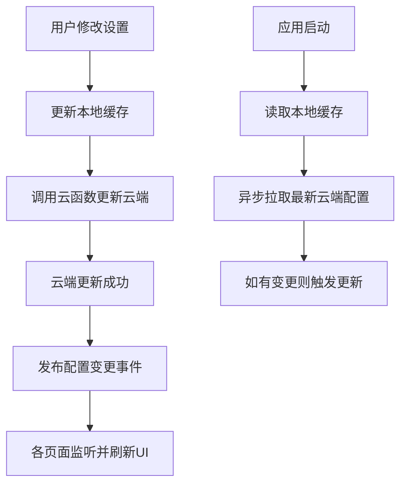
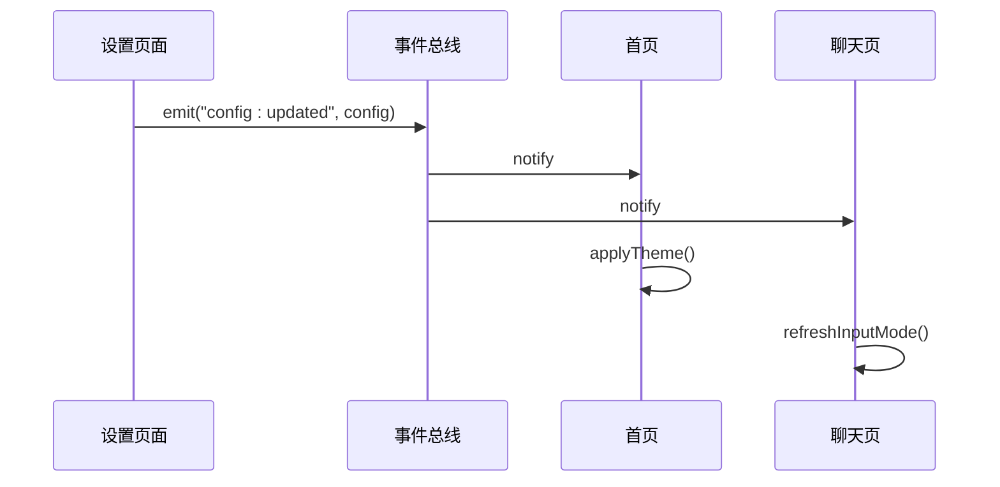

# 用户配置字段

<cite>
**本文档引用文件**  
- [user_config.md](file://doc/开发文档/database/user_config.md)
- [theme.json](file://miniprogram/theme.json)
- [userService.js](file://miniprogram/services/userService.js)
- [voiceService.js](file://miniprogram/services/voiceService.js)
- [app.js](file://miniprogram/app.js)
- [profile.js](file://miniprogram/pages/user/profile.js)
- [user.js](file://miniprogram/pages/user/user.js)
</cite>

## 目录
1. [简介](#简介)
2. [用户配置字段说明](#用户配置字段说明)
3. [暗黑模式切换机制](#暗黑模式切换机制)
4. [语音输入功能启用条件](#语音输入功能启用条件)
5. [配置数据同步与本地缓存策略](#配置数据同步与本地缓存策略)
6. [配置变更事件监听示例](#配置变更事件监听示例)
7. [总结](#总结)

## 简介
本文档详细说明 HeartChat 应用中 `user_config` 集合的配置项含义与取值范围，重点解析 `theme`、`notification`、`voiceInput` 和 `aiModelPreference` 字段的定义与使用。结合前端 `theme.json` 文件与用户设置页面，阐述配置数据的同步机制与本地缓存方案，并提供配置变更事件的监听实现示例。

## 用户配置字段说明

`user_config` 集合用于存储用户的个性化设置，主要字段包括：

### theme（主题设置）
- **含义**：用户界面主题偏好
- **取值范围**：
  - `"light"`：浅色模式
  - `"dark"`：深色模式（暗黑模式）
  - `"auto"`：根据系统设置自动切换
- **默认值**：`"auto"`
- **关联文件**：`theme.json` 定义了主题变量，前端根据此值动态加载对应样式

### notification（通知设置）
- **含义**：用户通知权限与偏好
- **取值范围**：
  - `true`：启用通知
  - `false`：关闭通知
- **默认值**：`true`
- **功能影响**：控制消息提醒、每日报告推送等行为

### voiceInput（语音输入设置）
- **含义**：是否启用语音输入功能
- **取值范围**：
  - `true`：启用语音输入
  - `false`：禁用语音输入
- **默认值**：`true`
- **启用条件**：需用户授权麦克风权限，且后端服务支持语音识别（讯飞语音 API）

### aiModelPreference（AI 模型偏好）
- **含义**：用户偏好的 AI 模型类型
- **取值范围**：
  - `"gemini"`：Google Gemini 模型
  - `"zhipu"`：智谱 AI 模型
  - `"openai"`：OpenAI 模型
  - `"auto"`：系统自动选择最优模型
- **默认值**：`"auto"`
- **影响范围**：聊天、情绪分析、角色交互等 AI 功能均基于此设置调用对应模型服务

**Section sources**
- [user_config.md](file://doc/开发文档/database/user_config.md)

## 暗黑模式切换机制

暗黑模式的实现采用多层联动机制：

1. **配置层**：用户在设置页面更改 `theme` 值，通过 `userService.updateUserConfig()` 同步至云端
2. **前端响应**：`app.js` 监听配置变更，动态加载 `theme.json` 中对应的主题变量
3. **样式应用**：小程序框架通过 `style` 属性注入主题变量，实现全局 UI 变更
4. **系统联动**：当 `theme` 为 `"auto"` 时，读取系统外观设置（通过 `wx.getSystemInfoSync().theme`）自动切换

该机制确保主题切换无刷新生效，且支持持久化记忆。

**Section sources**
- [theme.json](file://miniprogram/theme.json)
- [app.js](file://miniprogram/app.js)
- [userService.js](file://miniprogram/services/userService.js)

## 语音输入功能启用条件

语音输入功能的启用需满足以下全部条件：

1. **用户配置开启**：`user_config.voiceInput === true`
2. **权限授权**：用户已授予麦克风使用权限（通过 `wx.authorize({scope: 'scope.record'})`）
3. **服务可用**：后端 `getIflytekSttUrl` 云函数正常返回语音识别服务地址
4. **设备支持**：当前设备具备录音能力

前端通过 `voiceService.isVoiceInputEnabled()` 方法综合判断是否显示语音输入按钮。

**Section sources**
- [voiceService.js](file://miniprogram/services/voiceService.js)
- [user_config.md](file://doc/开发文档/database/user_config.md)

## 配置数据同步与本地缓存策略

配置数据采用“云端优先、本地缓存、事件驱动”的同步策略：

**Diagram sources**
- [userService.js](file://miniprogram/services/userService.js)
- [storage.js](file://miniprogram/utils/storage.js)
- [eventBus.js](file://miniprogram/services/eventBus.js)

### 本地缓存方案
- 使用 `wx.setStorageSync('user_config')` 持久化存储
- 缓存内容：完整的用户配置对象
- 过期策略：无固定过期时间，以云端更新为准
- 故障降级：云端获取失败时使用本地缓存值

### 同步机制
- 写操作：立即更新云端，成功后更新本地
- 读操作：优先使用本地缓存，后台异步校准云端
- 冲突处理：以最后一次成功写入为准（最终一致性）

**Section sources**
- [userService.js](file://miniprogram/services/userService.js)
- [storage.js](file://miniprogram/utils/storage.js)
- [eventBus.js](file://miniprogram/services/eventBus.js)

## 配置变更事件监听示例

通过事件总线机制实现跨页面配置同步：

**Diagram sources**
- [eventBus.js](file://miniprogram/services/eventBus.js)
- [profile.js](file://miniprogram/pages/user/profile.js)

### 代码实现路径
- **事件发布**：[userService.js#L45-L60](file://miniprogram/services/userService.js#L45-L60)
- **事件监听**：[app.js#L20-L35](file://miniprogram/app.js#L20-L35)
- **页面响应**：[profile.js#L15-L40](file://miniprogram/pages/user/profile.js#L15-L40)

## 总结
`user_config` 集合是 HeartChat 用户个性化体验的核心配置中心。通过合理的字段设计、清晰的取值范围定义、可靠的同步机制与事件驱动架构，实现了主题、通知、语音输入和 AI 模型偏好等关键功能的灵活配置。暗黑模式与语音输入功能的实现充分考虑了用户体验与系统兼容性，配置数据的本地缓存与事件监听机制确保了跨页面一致性与响应实时性。